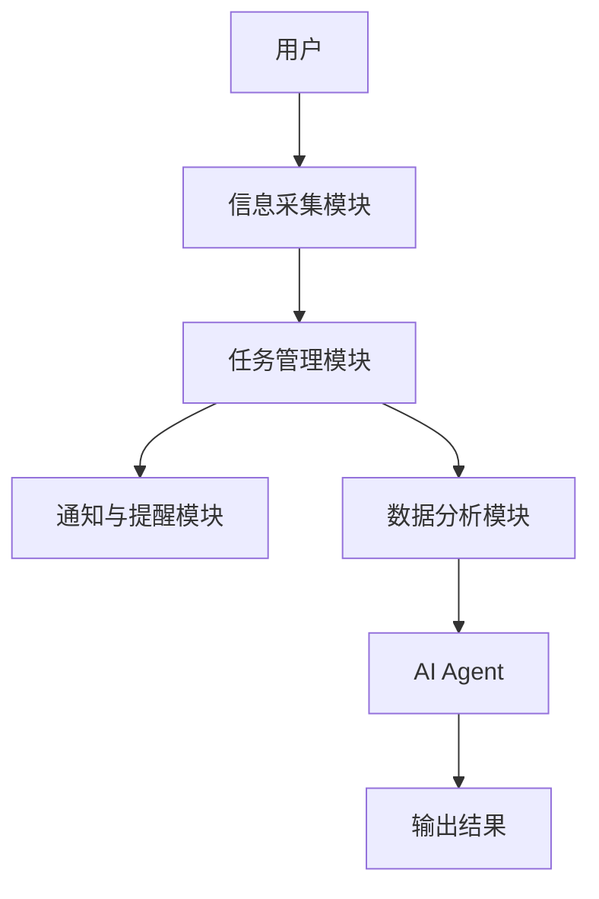

                 


# AI Agent在远程办公支持中的应用与最佳实践

> 关键词：AI Agent, 远程办公, 人工智能, 自然语言处理, 强化学习, 知识图谱

> 摘要：随着远程办公的普及，传统的办公方式面临诸多挑战。本文详细探讨了AI Agent在远程办公中的应用，分析了其核心概念、算法原理、系统架构设计，并通过实战案例展示了如何有效实施AI Agent。文章还提供了最佳实践建议，帮助企业在远程办公中提升效率与协作能力。

---

## 第1章: 远程办公的背景与挑战

### 1.1 远程办公的现状与发展趋势

#### 1.1.1 远程办公的定义与特点
远程办公是一种灵活的工作模式，允许员工在任何地点通过数字工具完成工作任务。其特点包括灵活性、高效性、节省成本和提高生产力。近年来，随着互联网技术的发展和全球疫情的影响，远程办公已成为企业不可或缺的办公方式。

#### 1.1.2 远程办公的兴起背景
远程办公的兴起主要源于以下几点：
1. **技术进步**：高速互联网和云技术的发展使得远程协作成为可能。
2. **企业需求**：企业希望通过灵活的办公方式吸引和留住人才。
3. **全球疫情**：2020年全球疫情迫使企业转向远程办公模式。
4. **员工需求**：越来越多的员工希望实现工作与生活的平衡，追求更灵活的工作方式。

#### 1.1.3 远程办公带来的机遇与挑战
**机遇**：
- 降低企业运营成本。
- 提高员工工作效率和满意度。
- 企业可以吸引全球人才。

**挑战**：
- **沟通不畅**：远程办公可能导致信息传递不及时，团队协作效率下降。
- **管理困难**：难以监控员工的工作状态，影响管理效率。
- **安全风险**：数据泄露和网络安全问题增加。

### 1.2 远程办公中的主要问题

#### 1.2.1 信息传递的不及时性
远程办公依赖于数字工具进行信息传递，但由于网络延迟、工具使用不当等原因，信息传递可能不及时，导致工作效率下降。

#### 1.2.2 团队协作的效率下降
远程办公中，团队成员之间的沟通和协作受到空间限制，可能导致协作效率下降，团队凝聚力减弱。

#### 1.2.3 员工工作状态的难以监控
管理者难以实时了解员工的工作状态，难以评估员工的工作表现，导致管理效率低下。

#### 1.2.4 安全与合规性问题
远程办公中，数据可能通过不安全的渠道传输，设备可能缺乏足够的安全保护，导致企业面临数据泄露和合规性问题。

---

## 第2章: AI Agent的核心概念与原理

### 2.1 AI Agent的基本概念

#### 2.1.1 什么是AI Agent
AI Agent（人工智能代理）是一种能够感知环境、执行任务并做出决策的智能体。它通过与用户或系统的交互，帮助用户完成特定任务或提供信息服务。

#### 2.1.2 AI Agent的分类
AI Agent可以分为以下几类：
1. **基于规则的AI Agent**：通过预定义的规则进行决策。
2. **基于机器学习的AI Agent**：通过机器学习算法进行学习和决策。
3. **混合型AI Agent**：结合规则和机器学习的混合型代理。

#### 2.1.3 AI Agent的主要特点
- **自主性**：能够自主决策和行动。
- **反应性**：能够实时感知环境并做出反应。
- **学习能力**：能够通过学习提高自身的决策能力。
- **协作性**：能够与其他系统或人员协作完成任务。

### 2.2 AI Agent与远程办公的结合

#### 2.2.1 AI Agent在远程办公中的应用场景
1. **智能助手**：帮助员工处理日程安排、提醒任务等。
2. **团队协作**：协助团队成员进行任务分配、信息共享等。
3. **实时沟通**：通过自然语言处理技术实现高效的沟通与交流。
4. **数据分析**：分析远程办公数据，提供决策支持。

#### 2.2.2 AI Agent如何提升远程办公效率
- **自动化任务处理**：AI Agent可以自动完成一些重复性任务，如邮件分发、日程安排等。
- **实时信息共享**：通过AI Agent实现信息的实时同步，确保团队成员之间的信息对齐。
- **智能决策支持**：AI Agent可以通过数据分析提供决策支持，帮助管理者做出更明智的决策。

#### 2.2.3 AI Agent在团队协作中的作用
- **促进沟通**：AI Agent可以通过自然语言处理技术实现高效的团队沟通。
- **协调任务**：AI Agent可以帮助团队成员协调任务，确保任务按时完成。
- **提升效率**：通过自动化工具和智能决策支持，提升团队协作效率。

---

## 第3章: AI Agent的算法原理与实现

### 3.1 AI Agent的核心算法

#### 3.1.1 基于自然语言处理的对话系统
自然语言处理（NLP）是AI Agent实现对话系统的核心技术。通过NLP技术，AI Agent能够理解和生成人类语言，实现与用户的自然对话。

##### 3.1.1.1 分词
分词是将连续的文本分割成有意义的词语或短语的过程。常用的分词算法包括基于规则的分词和统计模型分词。

##### 3.1.1.2 词性标注
词性标注是对每个词语进行词性分类的过程，如名词、动词、形容词等。

##### 3.1.1.3 句法分析
句法分析是分析句子的语法结构，确定词语之间的关系，如主语、谓语、宾语等。

##### 3.1.1.4 意图识别
意图识别是通过分析用户的输入，确定用户的意图或需求。常用的意图识别方法包括基于规则的分类和机器学习分类。

##### 3.1.1.5 响应生成
响应生成是根据用户的输入和意图，生成合适的回应。常用的响应生成方法包括基于模板的生成和基于生成模型的生成。

#### 3.1.2 基于强化学习的决策系统
强化学习是一种通过试错机制来优化决策策略的技术。在AI Agent中，强化学习可以用于任务分配、资源优化等场景。

##### 3.1.2.1 状态表示
状态表示是将当前环境的状态表示为某种形式，如向量或符号。

##### 3.1.2.2 动作选择
动作选择是根据当前状态和策略，选择下一步的动作。

##### 3.1.2.3 奖励函数
奖励函数是用来衡量动作的好坏，指导学习过程的函数。

##### 3.1.2.4 策略优化
策略优化是通过不断调整策略，以最大化累积奖励的过程。

#### 3.1.3 基于知识图谱的推理系统
知识图谱是一种结构化的知识表示方式，通过节点和边表示实体及其关系。在AI Agent中，知识图谱可以用于推理和决策。

##### 3.1.3.1 知识图谱构建
知识图谱构建是将领域知识表示为结构化的图数据，包括实体识别、关系抽取等步骤。

##### 3.1.3.2 查询优化
查询优化是根据用户需求，优化查询策略，以提高查询效率和准确性。

##### 3.1.3.3 推理与验证
推理是根据知识图谱进行逻辑推理，验证假设或得出结论。

---

### 3.2 AI Agent的实现流程

#### 3.2.1 数据采集与预处理
数据采集是通过多种渠道获取数据，如用户输入、传感器数据等。数据预处理包括数据清洗、特征提取等。

#### 3.2.2 模型训练与优化
模型训练是通过大量数据训练模型，优化模型参数，以提高模型的性能。

#### 3.2.3 系统集成与部署
系统集成是将各个模块整合成一个完整的系统，确保各个模块协同工作。系统部署是将系统部署到实际环境中，供用户使用。

---

## 第4章: AI Agent在远程办公中的系统架构设计

### 4.1 系统功能设计

#### 4.1.1 信息采集模块
信息采集模块负责采集用户输入、传感器数据等信息，并进行预处理。

#### 4.1.2 任务管理模块
任务管理模块负责任务的分配、跟踪和管理。

#### 4.1.3 通知与提醒模块
通知与提醒模块负责向用户发送通知和提醒，确保用户及时了解重要信息。

#### 4.1.4 数据分析模块
数据分析模块负责对系统数据进行分析，提供决策支持。

### 4.2 系统架构图



### 4.3 系统接口设计

#### 4.3.1 用户接口
用户接口是用户与系统交互的界面，支持多种输入方式，如文本输入、语音输入等。

#### 4.3.2 数据接口
数据接口是系统与其他系统或数据库交互的接口，支持数据的输入和输出。

#### 4.3.3 第三方服务接口
第三方服务接口是系统与第三方服务（如云存储、邮件服务等）交互的接口，支持调用第三方服务。

---

## 第5章: AI Agent的项目实战

### 5.1 环境安装与配置

#### 5.1.1 安装Python环境
安装Python 3.8或更高版本，确保环境支持pip包管理。

#### 5.1.2 安装必要的库
安装必要的库，如TensorFlow、Keras、Numpy等。

### 5.2 核心代码实现

#### 5.2.1 对话系统实现
```python
def chatbot_response(user_input):
    # 分词
    words = tokenizer(user_input)
    # 词性标注
    tagged_words = pos_tagger(words)
    # 句法分析
    parse_tree = syntax_analyzer(tagged_words)
    # 意图识别
    intent = intent_classifier(parse_tree)
    # 响应生成
    response = response_generator(intent)
    return response
```

#### 5.2.2 任务管理系统实现
```python
class TaskManager:
    def __init__(self):
        self.tasks = []

    def add_task(self, task):
        self.tasks.append(task)
        print(f"任务'{task}'已添加。")

    def remove_task(self, task):
        self.tasks.remove(task)
        print(f"任务'{task}'已移除。")

    def list_tasks(self):
        print("待办任务:")
        for task in self.tasks:
            print(f"- {task}")
```

### 5.3 案例分析与解读

#### 5.3.1 案例分析
假设我们开发了一个基于AI Agent的远程办公助手，名为"Remote Assistant"。该助手可以实现以下功能：
1. **日程管理**：提醒用户重要的会议和任务。
2. **任务分配**：根据团队成员的技能和工作负载，自动分配任务。
3. **信息共享**：实时同步团队成员的工作进展和项目状态。
4. **决策支持**：通过数据分析，提供项目进展报告和优化建议。

#### 5.3.2 实战小结
通过上述案例分析，我们可以看到AI Agent在远程办公中的巨大潜力。它不仅可以提高团队协作效率，还能为企业提供数据驱动的决策支持。然而，实际应用中仍需注意数据安全和用户隐私保护。

---

## 第6章: 最佳实践与总结

### 6.1 最佳实践

#### 6.1.1 数据安全与隐私保护
在远程办公中，数据安全和隐私保护尤为重要。企业应采取加密传输、访问控制等措施，确保数据的安全性。

#### 6.1.2 选择合适的AI Agent工具
选择合适的AI Agent工具是成功应用的关键。企业应根据自身需求和预算，选择适合的工具和解决方案。

#### 6.1.3 培训与支持
员工对新技术的适应需要时间，企业应提供充分的培训和支持，确保员工能够熟练使用AI Agent工具。

### 6.2 小结

通过本文的探讨，我们可以看到AI Agent在远程办公中的广泛应用和巨大潜力。AI Agent不仅可以提高团队协作效率，还能为企业提供数据驱动的决策支持。然而，实际应用中仍需注意数据安全和用户隐私保护。

### 6.3 注意事项

- **数据安全**：确保数据在传输和存储过程中的安全性。
- **用户隐私**：尊重用户的隐私权，避免数据滥用。
- **系统稳定性**：确保系统的稳定性和可靠性，避免因系统故障影响工作。

### 6.4 拓展阅读

- 《人工智能: 一种现代方法》
- 《自然语言处理实战》
- 《强化学习: 理论与应用》

---

通过本文的探讨，我们可以看到AI Agent在远程办公中的广泛应用和巨大潜力。希望本文能为读者在远程办公支持中应用AI Agent提供有价值的参考和指导。

