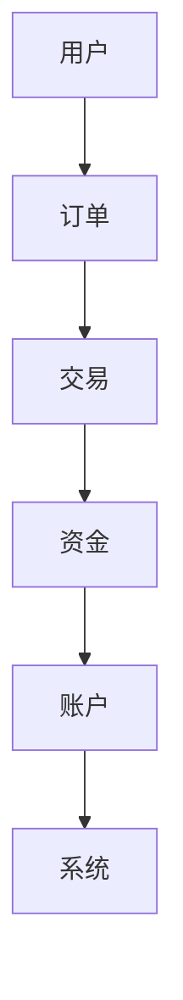
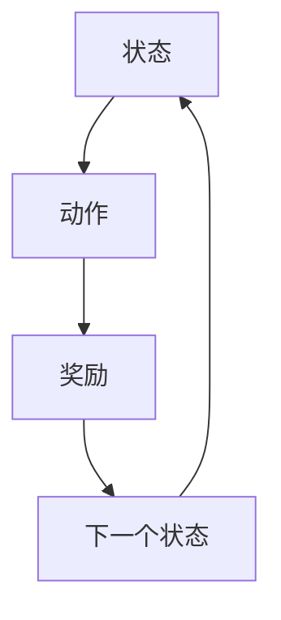
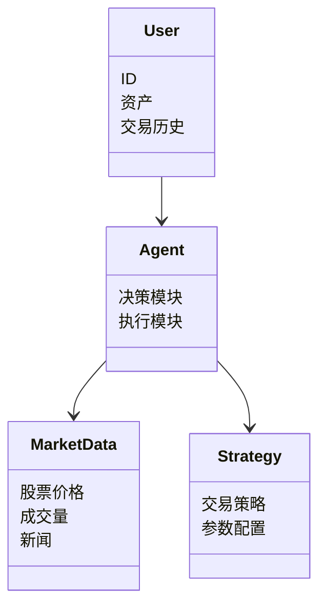
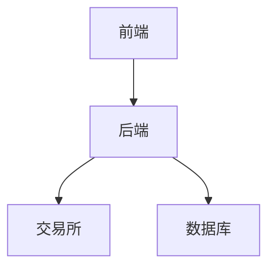

                 


# AI Agent在金融行业的创新应用

## 关键词：AI Agent, 人工智能, 金融科技, 金融创新, 智能投顾, 风险管理

## 摘要：  
AI Agent（人工智能代理）作为一种智能化的金融工具，正在改变传统金融行业的运作方式。通过结合强化学习和监督学习等算法，AI Agent能够实现智能化的金融决策、风险管理和资产配置。本文从AI Agent的基本概念、核心原理、系统架构到实际应用案例，全面分析其在金融行业的创新应用，并探讨其未来的发展趋势。

---

# 第1章: AI Agent的基本概念与背景

## 1.1 AI Agent的定义与特点  
AI Agent是一种能够感知环境、自主决策并执行任务的智能实体。与传统金融系统相比，AI Agent具有以下特点：  
- **自主性**：能够在没有人工干预的情况下独立完成任务。  
- **反应性**：能够实时感知环境变化并做出反应。  
- **学习能力**：通过数据和经验不断优化决策策略。  
- **可扩展性**：能够处理大规模复杂金融场景。  

---

## 1.2 金融行业中的AI Agent应用现状  
AI Agent在金融行业的应用主要集中在以下几个领域：  
- **智能投顾**：通过分析用户需求和市场数据，提供个性化的投资建议。  
- **风险管理**：实时监控市场波动，识别潜在风险并制定应对策略。  
- **智能交易**：基于市场数据和模型，自动执行交易指令。  

---

## 1.3 本章小结  
本章介绍了AI Agent的基本概念和特点，并分析了其在金融行业中的应用现状。AI Agent的智能化和自主性使其成为金融行业的重要工具，但其应用仍面临技术与监管的双重挑战。

---

# 第2章: AI Agent的核心概念与原理

## 2.1 AI Agent的感知机制  
AI Agent的感知机制包括数据采集、信息分析和模型构建三个步骤：  
- **数据采集**：通过API获取金融市场数据（如股票价格、新闻等）。  
- **信息分析**：利用自然语言处理（NLP）和时间序列分析技术，提取有用信息。  
- **模型构建**：基于分析结果，构建金融市场动态模型。  

### 2.1.1 感知模型的对比表  
| 感知方式 | 数据来源 | 数据类型 | 处理方法 |  
|----------|----------|----------|----------|  
| 数据采集 | 金融市场API | 结构化数据 | 数据清洗 |  
| 信息分析 | 文本数据 | 非结构化数据 | NLP处理 |  

---

## 2.2 AI Agent的决策机制  
AI Agent的决策机制基于多目标优化和强化学习：  
- **多目标优化**：在风险与收益之间找到最优平衡点。  
- **强化学习**：通过试错不断优化决策策略。  

### 2.2.1 决策模型的数学公式  
强化学习的目标函数可以表示为：  
$$ V(s) = \max_{a} [ r(s,a) + \gamma V(s') ] $$  
其中，$s$ 是当前状态，$a$ 是动作，$r$ 是奖励函数，$\gamma$ 是折扣因子，$s'$ 是下一个状态。  

---

## 2.3 AI Agent的执行机制  
AI Agent的执行机制包括策略设计、反馈机制和监控优化：  
- **策略设计**：根据决策结果制定具体执行方案。  
- **反馈机制**：实时收集执行结果并调整策略。  
- **监控优化**：持续优化执行过程以提高效率。  

---

## 2.4 AI Agent的ER实体关系图  


---

## 2.5 本章小结  
本章详细讲解了AI Agent的感知、决策和执行机制，并通过对比表和ER图展示了其在金融系统中的核心概念和关系。

---

# 第3章: AI Agent的算法原理与数学模型

## 3.1 基于强化学习的AI Agent算法  
强化学习是AI Agent的核心算法之一，其流程如下：  
1. **状态感知**：获取当前市场状态（如价格、成交量）。  
2. **动作选择**：基于当前状态选择一个动作（如买入或卖出）。  
3. **奖励计算**：根据动作的结果计算奖励值。  
4. **状态更新**：根据奖励值更新策略。  

### 3.1.1 Q-learning算法的实现  
Q-learning的数学公式为：  
$$ Q(s, a) = Q(s, a) + \alpha (r + \gamma \max Q(s', a') - Q(s, a)) $$  
其中，$\alpha$ 是学习率，$\gamma$ 是折扣因子。  

### 3.1.2 算法流程图  


---

## 3.2 基于监督学习的AI Agent算法  
监督学习适用于已知数据的回归和分类任务：  
- **回归任务**：预测股票价格。  
- **分类任务**：预测市场趋势（上涨、下跌或持平）。  

### 3.2.1 回归与分类  
- **线性回归**：  
$$ y = \beta x + \epsilon $$  
- **逻辑回归**：  
$$ P(y=1|x) = \frac{1}{1 + e^{-\beta x}} $$  

---

## 3.3 本章小结  
本章通过强化学习和监督学习两种算法，详细讲解了AI Agent的数学模型和实现方法，并通过流程图和公式展示了其核心原理。

---

# 第4章: AI Agent的系统分析与架构设计

## 4.1 系统功能设计  
AI Agent系统的功能模块包括：  
- **数据采集模块**：实时获取市场数据。  
- **决策模块**：基于数据生成交易策略。  
- **执行模块**：根据策略执行交易指令。  
- **监控模块**：实时监控交易结果并优化策略。  

### 4.1.1 领域模型的Mermaid图  


---

## 4.2 系统架构设计  
AI Agent系统的架构包括：  
- **前端**：用户交互界面。  
- **后端**：AI Agent核心算法和数据处理。  
- **接口**：与交易所系统对接。  

### 4.2.1 系统架构图  


---

## 4.3 本章小结  
本章通过系统功能设计和架构图，展示了AI Agent在金融系统中的应用场景和实现方式。

---

# 第5章: AI Agent的项目实战

## 5.1 智能投顾系统案例  
### 5.1.1 环境配置  
- Python 3.8及以上版本  
- 必要的库：Pandas、NumPy、Scikit-learn、TensorFlow  

### 5.1.2 核心代码实现  
```python
import numpy as np
import pandas as pd
from sklearn.linear_model import LinearRegression

# 数据加载
data = pd.read_csv('market_data.csv')
X = data[['开盘价', '收盘价', '成交量']]
y = data['收盘价']

# 模型训练
model = LinearRegression()
model.fit(X, y)

# 预测
new_data = np.array([[30, 32, 1000]])
prediction = model.predict(new_data)
print("预测收盘价:", prediction[0])
```

### 5.1.3 系统设计与优化  
- 数据预处理：清洗和特征工程。  
- 模型优化：使用交叉验证选择最优参数。  
- 系统测试：通过回测验证模型的稳定性。  

---

## 5.2 本章小结  
本章通过智能投顾系统的案例，详细讲解了AI Agent的项目实现过程，包括环境配置、代码实现和系统优化。

---

# 第6章: 最佳实践与小结

## 6.1 最佳实践 tips  
- **数据质量**：确保数据的完整性和准确性。  
- **模型选择**：根据具体场景选择合适的算法。  
- **风险管理**：建立完善的风控机制。  

## 6.2 本章小结  
AI Agent在金融行业的创新应用为行业带来了新的可能性，但也需要克服技术与监管的双重挑战。未来，随着AI技术的不断发展，AI Agent将在金融领域发挥更重要的作用。

---

# 总结  
本文从AI Agent的基本概念、核心原理、系统架构到实际应用案例，全面分析了其在金融行业的创新应用。通过本文的讲解，读者可以深入了解AI Agent的技术细节和应用场景，并为未来的研究和实践提供参考。

