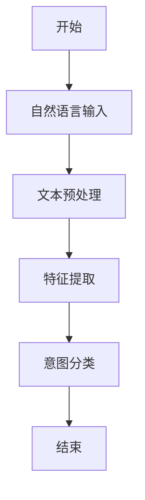
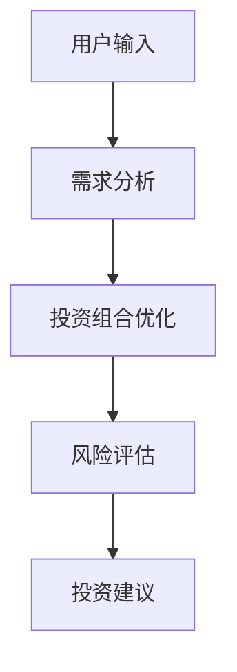
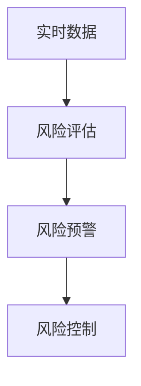
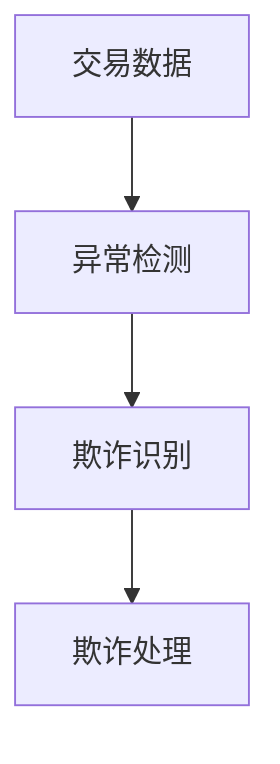

                 

# AI Agent在金融行业的应用与挑战

## 关键词：AI Agent，金融行业，智能投顾，风险控制，欺诈检测，系统架构

## 摘要：  
随着人工智能技术的快速发展，AI Agent（人工智能代理）在金融行业的应用日益广泛。本文系统地探讨了AI Agent在金融行业的核心概念、应用场景、算法原理、系统架构以及实际案例。通过分析智能投顾、风险控制和欺诈检测等领域的应用，揭示了AI Agent在提升金融服务效率、优化投资决策和防范金融风险方面的巨大潜力。同时，本文也深入探讨了AI Agent在金融行业应用中面临的挑战，并提出了相应的解决方案和未来发展方向。

---

# 第一章：AI Agent的基本概念与背景

## 1.1 AI Agent的定义与核心原理

### 1.1.1 AI Agent的基本定义  
AI Agent是一种能够感知环境、自主决策并执行任务的智能实体。它通过传感器获取信息，利用算法进行分析和推理，并通过执行器完成目标。AI Agent的核心在于其自主性和智能性，能够适应复杂多变的环境。

### 1.1.2 AI Agent的核心原理  
AI Agent的工作原理可以分为以下几个步骤：
1. **感知环境**：通过传感器或数据接口获取外部信息。
2. **信息处理**：利用算法对信息进行分析、理解和建模。
3. **决策制定**：基于分析结果，选择最优的行动方案。
4. **执行行动**：通过执行器将决策转化为实际操作。

### 1.1.3 AI Agent与传统算法的区别  
AI Agent与传统算法的主要区别在于其自主性和适应性。传统算法通常是静态的，依赖于固定的规则和数据，而AI Agent能够动态调整策略，适应环境的变化。

## 1.2 金融行业中的AI Agent应用背景

### 1.2.1 金融行业的数字化转型  
随着信息技术的发展，金融行业正经历从传统模式向数字化转型的过程。AI Agent作为人工智能技术的重要组成部分，为金融行业的智能化转型提供了新的可能性。

### 1.2.2 AI技术在金融行业的应用现状  
当前，AI技术在金融行业的应用已经涵盖智能投顾、风险评估、欺诈检测等多个领域。AI Agent作为这些应用的核心技术之一，正在逐步改变金融服务的方式。

### 1.2.3 AI Agent在金融行业中的潜力  
AI Agent在金融行业中的潜力巨大。通过智能化的代理系统，金融机构可以实现更高效的客户服务、更精准的投资决策以及更有效的风险管理。

---

# 第二章：AI Agent的核心算法与数学模型

## 2.1 任务规划算法

### 2.1.1 A*算法原理  
A*算法是一种基于启发式搜索的任务规划算法，通过评估当前节点到目标节点的代价，选择最优路径。其数学表达式如下：

$$f(n) = g(n) + h(n)$$  
其中，$g(n)$表示从起点到当前节点$n$的路径代价，$h(n)$表示从$n$到目标节点的估计代价。

### 2.1.2 Dijkstra算法的应用  
Dijkstra算法是一种用于单源最短路径的算法，适用于任务规划中的路径优化问题。其核心思想是通过优先队列选择距离起点最近的节点，逐步扩展到目标节点。

### 2.1.3 状态空间搜索的数学模型  
状态空间搜索是任务规划算法的基础。通过构建状态空间模型，AI Agent可以找到从初始状态到目标状态的最优路径。状态空间模型可以用图论中的有向图表示。

## 2.2 自然语言处理与理解

### 2.2.1 Transformer模型的数学公式  
Transformer模型通过自注意力机制实现自然语言处理。其核心公式如下：

$$\text{Transformer}(x) = \text{FFN}(x)$$  
其中，FFN表示前馈神经网络。

### 2.2.2 BERT模型的训练流程  
BERT模型通过预训练任务（如Masked LM和Next Sentence Prediction）学习语言的上下文信息，从而实现自然语言理解。

### 2.2.3 意图识别的算法流程图  
意图识别的流程图如下：

## 2.3 推理与决策算法

### 2.3.1 Markov决策过程  
Markov决策过程（MDP）是一种用于决策问题的数学模型，适用于AI Agent的推理与决策。其核心公式如下：

$$V(s) = \max_{a} \mathbb{E}[R_{t+1} + \gamma V(s')]$$  
其中，$s$是当前状态，$a$是动作，$s'$是下一个状态，$\gamma$是折扣因子。

### 2.3.2 Q-Learning算法  
Q-Learning是一种基于值函数的强化学习算法，通过更新Q值表实现最优决策。其更新公式如下：

$$Q(s, a) = Q(s, a) + \alpha (r + \gamma \max Q(s', a') - Q(s, a))$$  
其中，$\alpha$是学习率，$\gamma$是折扣因子。

### 2.3.3 贝叶斯网络的应用  
贝叶斯网络是一种基于概率论的推理工具，适用于AI Agent的不确定性推理。其核心思想是通过概率分布建模变量之间的关系。

## 2.4 本章小结  
本章介绍了AI Agent的核心算法与数学模型，包括任务规划算法、自然语言处理算法和推理与决策算法。这些算法为AI Agent在金融行业中的应用提供了理论基础。

---

# 第三章：AI Agent在金融行业中的应用场景

## 3.1 智能投顾

### 3.1.1 智能投顾的定义与需求  
智能投顾是一种基于AI技术的财富管理服务，旨在为用户提供个性化的投资建议。其核心需求包括用户画像构建、投资组合优化和风险评估。

### 3.1.2 AI Agent在智能投顾中的实现  
AI Agent通过自然语言处理和强化学习算法，实现用户需求分析、投资组合优化和风险评估。其系统架构如下：

### 3.1.3 实际案例分析  
以某智能投顾平台为例，AI Agent通过分析用户的财务状况和风险偏好，为其推荐最优的投资组合。案例分析表明，AI Agent在智能投顾中的应用显著提高了投资效率和用户体验。

## 3.2 风险控制

### 3.2.1 风险控制的定义与需求  
风险控制是金融行业中的重要环节，旨在通过识别、评估和管理风险，降低潜在损失。

### 3.2.2 AI Agent在风险控制中的实现  
AI Agent通过实时数据分析和决策树算法，实现风险评估和风险预警。其系统架构如下：

### 3.2.3 实际案例分析  
以某银行的风险控制系统为例，AI Agent通过分析客户的信用记录和交易行为，识别潜在风险并发出预警。案例分析表明，AI Agent在风险控制中的应用显著提高了风险管理的效率和准确性。

## 3.3 欺诈检测

### 3.3.1 欺诈检测的定义与需求  
欺诈检测是金融行业中的重要任务，旨在通过识别异常交易行为，防止欺诈行为的发生。

### 3.3.2 AI Agent在欺诈检测中的实现  
AI Agent通过异常检测算法和图神经网络，实现交易行为分析和欺诈行为识别。其系统架构如下：

### 3.3.3 实际案例分析  
以某支付平台的欺诈检测系统为例，AI Agent通过分析交易数据，识别潜在的欺诈行为并进行实时拦截。案例分析表明，AI Agent在欺诈检测中的应用显著提高了交易安全性和用户体验。

---

# 第四章：AI Agent金融系统架构设计

## 4.1 系统功能模块划分

### 4.1.1 用户交互模块  
用户交互模块负责与用户进行信息交换，包括用户输入、结果显示和反馈处理。

### 4.1.2 数据处理模块  
数据处理模块负责数据的采集、清洗和转换，为AI Agent提供高质量的数据支持。

### 4.1.3 AI Agent核心算法模块  
AI Agent核心算法模块包括任务规划算法、自然语言处理算法和推理与决策算法，实现AI Agent的核心功能。

## 4.2 系统架构设计

### 4.2.1 分层架构设计  
分层架构设计将系统划分为数据层、业务逻辑层和用户界面层，实现系统的模块化管理。

### 4.2.2 微服务架构设计  
微服务架构设计通过将系统功能分解为多个独立的服务，实现系统的高扩展性和灵活性。

### 4.2.3 数据流设计  
数据流设计描述了数据在系统中的流动过程，包括数据采集、数据处理和数据输出。

## 4.3 系统接口设计

### 4.3.1 API接口定义  
API接口定义了系统与其他系统之间的交互接口，包括输入接口和输出接口。

### 4.3.2 接口调用流程  
接口调用流程描述了API接口的调用顺序和调用方式，确保系统的高效运行。

### 4.3.3 接口安全设计  
接口安全设计通过加密、认证和授权等技术，确保系统接口的安全性。

## 4.4 本章小结  
本章介绍了AI Agent金融系统的架构设计，包括系统功能模块划分、系统架构设计和系统接口设计。这些设计为AI Agent在金融行业中的应用提供了技术支持。

---

# 第五章：AI Agent在金融行业的挑战与未来展望

## 5.1 挑战

### 5.1.1 数据隐私与安全  
数据隐私与安全是AI Agent在金融行业中的主要挑战之一。如何在保护用户隐私的前提下，实现数据的高效利用，是一个亟待解决的问题。

### 5.1.2 模型解释性  
模型解释性是AI Agent在金融行业中的另一个挑战。如何提高AI Agent决策的透明性和可解释性，是提升用户信任度的关键。

### 5.1.3 算法的可扩展性  
算法的可扩展性是AI Agent在金融行业中的另一个挑战。随着金融市场的复杂化，如何设计高效的算法，满足大规模数据处理的需求，是一个重要的问题。

## 5.2 未来展望

### 5.2.1 技术创新  
技术创新是推动AI Agent在金融行业发展的核心动力。未来，随着人工智能技术的不断发展，AI Agent在金融行业中的应用将更加广泛。

### 5.2.2 应用场景扩展  
应用场景扩展是AI Agent在金融行业中的重要方向。未来，AI Agent将在智能投顾、风险控制和欺诈检测等领域发挥更大的作用。

### 5.2.3 行业协作  
行业协作是推动AI Agent在金融行业发展的关键因素。未来，金融机构、技术供应商和监管机构将加强合作，共同推动AI Agent技术的发展。

---

# 第六章：总结与建议

## 6.1 总结  
本文系统地探讨了AI Agent在金融行业中的应用与挑战，包括核心概念、应用场景、算法原理、系统架构和实际案例。通过分析智能投顾、风险控制和欺诈检测等领域的应用，揭示了AI Agent在提升金融服务效率、优化投资决策和防范金融风险方面的巨大潜力。

## 6.2 建议  
针对AI Agent在金融行业中的应用，本文提出以下建议：
1. **加强技术研发**：金融机构应加大AI Agent技术的研发投入，推动技术的创新与进步。
2. **注重数据安全**：金融机构应加强数据安全保护，确保用户数据的安全与隐私。
3. **提升模型解释性**：金融机构应注重模型的解释性，提高用户对AI Agent决策的信任度。
4. **推动行业协作**：金融机构应加强与技术供应商和监管机构的合作，共同推动AI Agent技术的发展。

---

# 结语  
AI Agent作为人工智能技术的重要组成部分，正在逐步改变金融行业的服务模式和业务流程。随着技术的不断进步和应用的不断扩展，AI Agent将在金融行业中的发挥越来越重要的作用。未来，随着技术的创新和行业的协作，AI Agent将为金融行业带来更多的机遇和挑战。

--- 

# 参考文献  
（此处可以列出相关的参考文献，例如书籍、论文、技术文档等。）

---

# 致谢  
（此处可以感谢参与本书编写和支持的人。）

