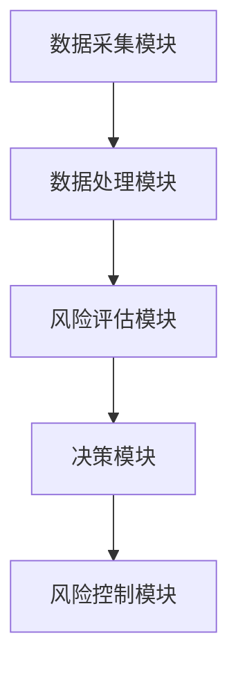
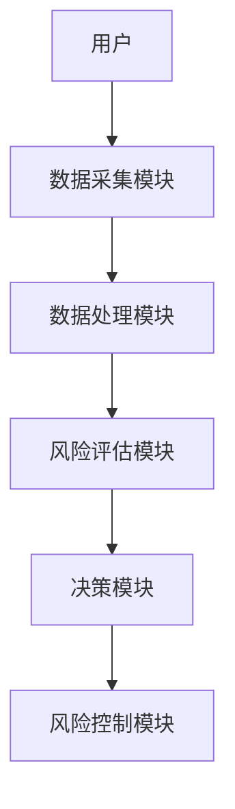
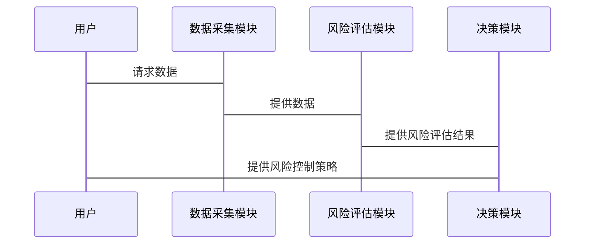

                 


# AI Agent在金融风险评估中的应用

## 关键词
AI Agent, 金融风险评估, 强化学习, 多智能体协同, 图神经网络, 金融建模, 风险管理

## 摘要
本文深入探讨了AI Agent在金融风险评估中的应用，系统介绍了AI Agent的基本概念、核心算法、金融风险评估的方法、系统架构设计以及实际项目案例。通过分析强化学习、多智能体协同和图神经网络等算法的原理和应用场景，结合具体的金融风险评估案例，展示了AI Agent在提升风险评估准确性和效率方面的巨大潜力。文章还详细讲解了AI Agent驱动的金融风险评估系统的架构设计，包括系统功能模块划分、数据流设计、算法实现和系统优化等关键环节，并通过实际项目案例分析，总结了AI Agent在金融风险评估中的最佳实践和未来发展方向。

---

# 第1章 AI Agent与金融风险评估概述

## 1.1 AI Agent的基本概念
### 1.1.1 AI Agent的定义与分类
- 定义：AI Agent（智能体）是指能够感知环境并采取行动以实现目标的实体。
- 分类：包括基于规则的智能体、基于模型的智能体、强化学习智能体和人机协作智能体。

### 1.1.2 AI Agent的核心特征
- 感知能力：通过传感器或数据源获取环境信息。
- 决策能力：基于感知信息做出决策。
- 学习能力：通过经验优化自身行为。
- 协作能力：与其他智能体或人类进行协作。

### 1.1.3 AI Agent在金融领域的应用潜力
- 金融交易自动化：高频交易、算法交易。
- 风险管理：实时监控和风险预警。
- 投资决策：智能投资顾问、资产配置优化。

## 1.2 金融风险评估的基本概念
### 1.2.1 金融风险的定义与类型
- 市场风险：资产价格波动导致的损失。
- 信用风险：债务人违约的风险。
- 流动性风险：资产难以变现的风险。
- 操作风险：内部流程或人为错误导致的风险。

### 1.2.2 传统金融风险评估方法
- 风险因子分析法：通过统计模型分析风险因子。
- VaR模型：计算在一定置信水平下的潜在损失。
- CVaR模型：计算超过VaR的潜在损失。

### 1.2.3 金融风险评估的挑战与需求
- 数据量大：金融市场的数据复杂且动态变化。
- 风险关联性高：不同风险因素相互关联，难以独立评估。
- 需要及时性：金融市场的风险需要实时评估和应对。

## 1.3 AI Agent在金融风险评估中的应用价值
### 1.3.1 提高风险评估的准确性
- 通过强化学习和多智能体协同，捕捉复杂的风险关系。
- 利用图神经网络分析非线性关系。

### 1.3.2 提升风险评估的效率
- AI Agent可以实时处理大量数据，快速生成风险评估结果。
- 通过自动化流程减少人工干预，提高效率。

### 1.3.3 个性化风险评估的可能性
- 根据不同客户或资产的特点，定制个性化风险评估模型。
- 通过动态调整模型参数，适应不同场景的需求。

## 1.4 本章小结
### 1.4.1 核心概念总结
- AI Agent的核心特征包括感知、决策、学习和协作能力。
- 金融风险评估的传统方法包括VaR、CVaR等模型。

### 1.4.2 下文展开方向
- 强化学习算法在风险评估中的应用。
- 多智能体协同在金融系统中的优化作用。

---

# 第2章 AI Agent的核心算法与原理

## 2.1 强化学习算法
### 2.1.1 强化学习的基本原理
- 状态（State）、动作（Action）、奖励（Reward）的定义。
- 策略（Policy）和价值函数（Value Function）的关系。

### 2.1.2 算法实现
- Q-learning算法：
  $$ Q(s,a) = Q(s,a) + \alpha (r + \gamma \max Q(s',a') - Q(s,a)) $$
- Deep Q-Networks（DQN）：利用神经网络近似Q值函数。

### 2.1.3 应用场景
- 金融交易中的策略优化。
- 风险管理中的动态决策。

## 2.2 多智能体协同算法
### 2.2.1 多智能体系统的基本结构
- 单智能体 vs. 多智能体：多智能体系统通过协作实现全局优化。

### 2.2.2 协作与竞争关系的建模
- 协作：共享信息，共同完成任务。
- 竞争：通过竞争机制优化决策。

### 2.2.3 联合策略优化方法
- 联合Q-learning：多个智能体共同优化策略。
- Value Decomposition Networks（VDN）：分解任务，协同决策。

## 2.3 图神经网络算法
### 2.3.1 图神经网络的基本原理
- 图结构数据的表示方法：节点特征、边特征、图特征。
- 图注意力机制：通过注意力权重捕捉重要节点。

### 2.3.2 图神经网络的实现
- Graph Convolutional Network（GCN）：
  $$ Z = A X X^T $$
  其中，A是邻接矩阵，X是节点特征矩阵。

### 2.3.3 应用场景
- 金融网络中的关系建模。
- 风险传播路径分析。

## 2.4 算法原理总结
### 2.4.1 算法优缺点对比
| 算法类型 | 优点 | 缺点 |
|----------|------|------|
| 强化学习 | 灵活性高 | 需要大量数据和计算资源 |
| 多智能体 | 高效协作 | 易出现竞合关系复杂 |
| 图神经网络 | 非线性关系捕捉能力强 | 计算复杂度高 |

### 2.4.2 算法选择的依据
- 任务需求：单智能体 vs. 多智能体。
- 数据类型：结构化数据 vs. 图结构数据。

### 2.4.3 算法实现的关键点
- 状态和动作空间的设计。
- 奖励函数的定义。
- 神经网络的架构选择。

---

# 第3章 金融风险评估的核心方法

## 3.1 传统金融风险评估方法
### 3.1.1 风险因子分析法
- 通过统计分析确定影响风险的主要因素。

### 3.1.2 VaR模型
- 定义：在给定置信水平下，可能的最大损失。
- 计算方法：历史模拟法、蒙特卡洛模拟法。

### 3.1.3 CVaR模型
- 定义：超过VaR的平均损失。
- 应用：更严格的风险度量标准。

## 3.2 基于机器学习的风险评估方法
### 3.2.1 监督学习方法
- 回归模型：预测风险值。
- 分类模型：分类风险等级。

### 3.2.2 非监督学习方法
- 聚类分析：识别风险集群。
- 异常检测：发现异常风险事件。

### 3.2.3 深度学习方法
- LSTM网络：捕捉时间序列中的风险信号。
- Transformer网络：分析多维数据中的风险关系。

## 3.3 基于AI Agent的风险评估方法
### 3.3.1 单智能体风险评估模型
- 基于强化学习的动态风险评估。
- 示例：使用DQN算法实时调整风险敞口。

### 3.3.2 多智能体协同风险评估模型
- 多个智能体分别负责不同风险维度的评估。
- 通过协同机制综合各维度的风险结果。

### 3.3.3 动态风险评估模型
- 实时更新市场数据，动态调整风险评估结果。
- 使用强化学习优化动态决策。

## 3.4 方法对比与选择
### 3.4.1 各种方法的优缺点
| 方法类型 | 优点 | 缺点 |
|----------|------|------|
| 传统方法 | 稳定性高 | 灵活性低 |
| 机器学习 | 精度高 | 解释性差 |
| AI Agent | 实时性高 | 实施复杂 |

### 3.4.2 方法选择的考虑因素
- 数据类型：结构化数据 vs. 图结构数据。
- 任务需求：实时性 vs. 稳定性。

### 3.4.3 方法优化的建议
- 结合多种方法：传统方法与AI方法结合。
- 持续优化：动态调整模型参数。

---

# 第4章 AI Agent驱动的金融风险评估系统架构

## 4.1 系统总体架构设计
### 4.1.1 系统功能模块划分
- 数据采集模块：获取市场数据、交易数据等。
- 风险评估模块：基于AI Agent进行风险评估。
- 决策模块：生成风险控制策略。

### 4.1.2 系统数据流设计
- 数据输入：市场数据、历史数据、实时数据。
- 数据处理：清洗、特征提取、数据增强。
- 数据输出：风险评估结果、风险控制策略。

### 4.1.3 系统架构图


## 4.2 系统功能设计
### 4.2.1 风险评估模块
- 输入：市场数据、历史数据。
- 输出：风险评分、风险等级。

### 4.2.2 决策模块
- 输入：风险评估结果。
- 输出：风险控制策略。

## 4.3 系统架构设计
### 4.3.1 系统架构图


### 4.3.2 关键技术实现
- 数据采集：使用API获取实时数据。
- 数据处理：使用Python进行数据清洗和特征提取。
- 风险评估：基于强化学习和图神经网络算法。

## 4.4 系统接口设计
### 4.4.1 接口描述
- 数据接口：提供数据输入和输出的接口。
- 控制接口：提供风险控制策略的接口。

### 4.4.2 交互序列图


---

# 第5章 项目实战：基于AI Agent的金融风险评估系统

## 5.1 项目背景与目标
### 5.1.1 项目背景
- 金融市场的复杂性和不确定性。
- 传统风险评估方法的局限性。

### 5.1.2 项目目标
- 实现基于AI Agent的金融风险评估系统。
- 提高风险评估的准确性和效率。

## 5.2 环境安装与配置
### 5.2.1 环境要求
- Python 3.8+
- TensorFlow或PyTorch
- Pandas、NumPy等数据处理库。

### 5.2.2 安装步骤
```bash
pip install numpy pandas tensorflow matplotlib
```

## 5.3 系统核心实现
### 5.3.1 数据采集模块
- 使用API获取市场数据。
- 示例代码：
  ```python
  import pandas as pd
  def get_data(api_key):
      data = api.get_data(api_key)
      return pd.DataFrame(data)
  ```

### 5.3.2 风险评估模块
- 基于强化学习的动态风险评估。
- 示例代码：
  ```python
  import tensorflow as tf
  model = tf.keras.Sequential([
      tf.keras.layers.Dense(64, activation='relu'),
      tf.keras.layers.Dense(1, activation='linear')
  ])
  model.compile(optimizer='adam', loss='mean_squared_error')
  ```

### 5.3.3 决策模块
- 生成风险控制策略。
- 示例代码：
  ```python
  def generate_strategy(risk_score):
      if risk_score > 0.8:
          return '减少风险敞口'
      else:
          return '保持当前策略'
  ```

## 5.4 项目案例分析
### 5.4.1 案例背景
- 某金融机构需要评估投资组合的风险。

### 5.4.2 数据处理
- 获取市场数据。
- 清洗和特征提取。

### 5.4.3 算法实现
- 使用强化学习优化风险评估模型。
- 验证模型的准确性和效率。

## 5.5 项目小结
### 5.5.1 核心实现总结
- 数据采集模块：获取实时市场数据。
- 风险评估模块：基于强化学习的动态评估。
- 决策模块：生成风险控制策略。

### 5.5.2 项目优化建议
- 持续优化模型参数。
- 增加多智能体协同功能。

---

# 第6章 总结与展望

## 6.1 本章总结
### 6.1.1 核心内容回顾
- AI Agent的核心算法：强化学习、多智能体协同、图神经网络。
- 金融风险评估的传统方法与AI方法对比。

### 6.1.2 系统架构设计的关键点
- 数据流设计、模块划分、接口设计。
- 算法选择与优化。

## 6.2 未来展望
### 6.2.1 技术发展
- 更高效的强化学习算法。
- 更强大的多智能体协同机制。

### 6.2.2 应用场景扩展
- 更多金融领域的应用，如投资决策、欺诈检测。

### 6.2.3 挑战与机遇
- 挑战：数据隐私、计算资源。
- 机遇：技术进步、市场需求。

---

# 参考文献
（此处列出相关文献和资料）

---

# 致谢
感谢读者的支持与关注。

