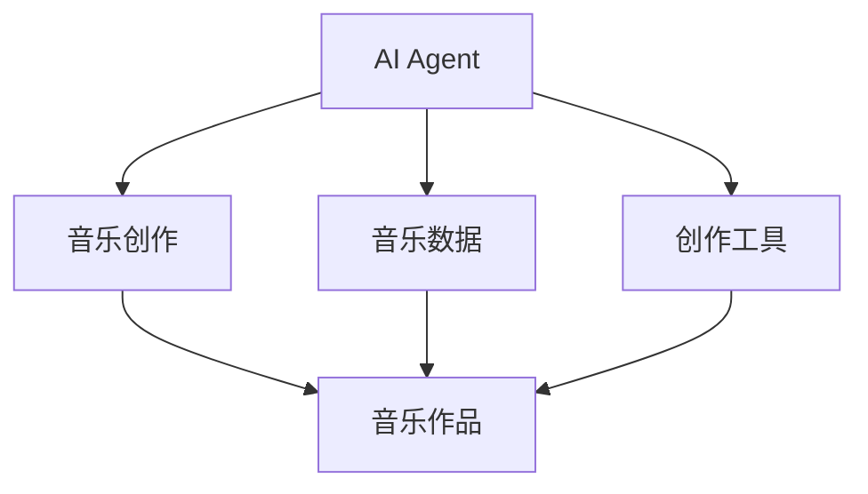
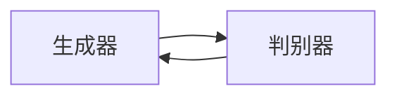
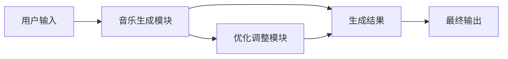
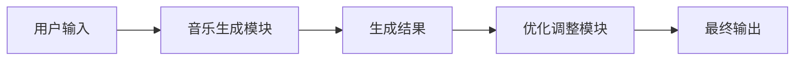

                 


# AI Agent在音乐创作中的辅助角色

## 关键词
AI Agent, 音乐创作, 人工智能, 音乐生成, 生成对抗网络

## 摘要
随着人工智能技术的快速发展，AI Agent在音乐创作中的应用越来越广泛。本文从背景介绍、核心概念、算法原理、系统设计、项目实战等多个角度，详细探讨了AI Agent在音乐创作中的辅助角色。通过分析AI Agent的基本原理、音乐创作的核心流程、以及AI Agent如何与音乐创作结合，本文为读者提供了全面的视角来理解AI Agent在音乐创作中的潜力和实际应用。

---

## 第一部分: 背景介绍

### 第1章: 背景介绍

#### 1.1 问题背景
音乐创作是一个复杂的过程，涉及到旋律、和声、节奏、编曲等多个方面。传统音乐创作主要依赖创作者的个人经验和灵感，这种方式虽然独特，但也存在效率低、资源消耗大、创作周期长等问题。尤其是在现代音乐产业中，创作需求日益多样化，创作者需要快速生成不同风格和类型的音乐作品，这给传统创作方式带来了巨大的挑战。

AI Agent的出现为音乐创作带来了新的可能性。AI Agent是一种能够感知环境、执行任务、并具有自主决策能力的智能体。通过结合机器学习、自然语言处理和音乐生成技术，AI Agent可以在音乐创作的各个环节中提供辅助，从而提高创作效率、丰富创作内容，并降低创作成本。

#### 1.2 问题描述
音乐创作的核心流程包括灵感捕捉、旋律创作、和声设计、节奏编排、编曲与混音等多个环节。每个环节都需要创作者具备特定的技能和经验，而这些技能的门槛较高，限制了创作的效率和多样性。此外，音乐创作往往需要大量的试错和调整，这进一步增加了创作的时间成本。

AI Agent的目标是通过智能化的工具和技术，帮助创作者更高效地完成音乐创作任务。具体来说，AI Agent需要能够理解音乐的结构、风格和情感，并能够根据创作者的需求生成相应的音乐片段或提供创作建议。然而，目前AI Agent在音乐创作中的应用还处于起步阶段，存在技术瓶颈和实际应用中的诸多挑战。

#### 1.3 问题解决
AI Agent在音乐创作中的核心价值在于其智能化的辅助能力。通过结合深度学习、生成对抗网络（GAN）和变分自编码器（VAE）等技术，AI Agent可以生成高质量的音乐片段、提供创作建议、优化音乐结构，并实现音乐风格的多样化。例如，AI Agent可以通过分析用户提供的音乐片段，生成相似风格的旋律或和声；或者根据用户指定的音乐风格，自动生成完整的音乐作品。

#### 1.4 边界与外延
AI Agent在音乐创作中的应用并非万能的，其作用范围和能力受到技术限制和创作需求的影响。例如，AI Agent无法完全替代创作者的创造力和情感表达，但它可以显著提高创作效率、丰富创作内容，并为创作者提供新的灵感和工具。

此外，AI Agent在音乐创作中的应用还涉及到与其他技术的结合，例如音乐分析工具、创作软件和音乐数据库等。这些技术的协同工作能够进一步提升AI Agent的辅助能力，为音乐创作提供更加全面的支持。

#### 1.5 概念结构与核心要素组成
AI Agent在音乐创作中的应用可以看作是一个复杂的系统，其核心要素包括：
1. **AI Agent**：具有感知和决策能力的智能体，负责执行具体的音乐创作任务。
2. **音乐创作流程**：包括灵感捕捉、旋律创作、和声设计、节奏编排等环节。
3. **音乐数据**：用于训练和优化AI Agent的音乐数据库，包括 MIDI 文件、音频文件和音乐理论知识。
4. **创作工具**：包括 MIDI 编辑器、DAW（数字音频工作站）等软件工具，用于辅助音乐创作。
5. **音乐作品**：最终生成的音乐作品，可以是旋律、和声、编曲或完整的音乐曲目。

通过这些核心要素的协同工作，AI Agent能够有效地辅助音乐创作，实现高效、多样化的音乐生成。

---

## 第二部分: AI Agent的核心概念与联系

### 第2章: 核心概念与原理

#### 2.1 AI Agent的基本原理
AI Agent是一种能够感知环境、执行任务、并具有自主决策能力的智能体。在音乐创作中，AI Agent的核心功能包括：
1. **音乐生成**：通过生成对抗网络（GAN）或变分自编码器（VAE）等技术，生成高质量的音乐片段。
2. **音乐分析**：对现有的音乐作品进行分析，提取旋律、和声、节奏等特征。
3. **创作建议**：根据创作者的需求，提供音乐创作的建议和灵感。
4. **优化调整**：对生成的音乐片段进行优化，使其更符合创作目标。

AI Agent的工作流程通常包括以下几个步骤：
1. **输入需求**：创作者提供音乐创作的需求，例如音乐风格、情绪或特定的音乐元素。
2. **数据处理**：AI Agent对输入需求进行解析，并将其转换为可处理的数据格式。
3. **模型生成**：基于深度学习模型生成音乐片段。
4. **结果输出**：将生成的音乐片段输出，并根据创作者的反馈进行调整。

#### 2.2 AI Agent与音乐创作的关系
AI Agent在音乐创作中的角色可以是创作助手、灵感来源或技术工具。具体来说：
1. **创作助手**：AI Agent可以帮助创作者快速生成音乐片段，缩短创作周期。
2. **灵感来源**：AI Agent可以通过生成不同的音乐风格和结构，激发创作者的灵感。
3. **技术工具**：AI Agent可以作为技术工具，帮助创作者实现复杂的音乐效果。

#### 2.3 核心概念对比分析
以下表格对比了AI Agent与其他音乐技术的核心区别：

| 对比项 | AI Agent | 传统音乐创作工具 | 音乐生成模型 |
|--------|-----------|------------------|--------------|
| 核心功能 | 辅助创作、生成音乐片段 | 提供创作工具和环境 | 生成音乐片段 |
| 技术基础 | 深度学习、自然语言处理 | 基于软件工具 | 基于GAN或VAE |
| 优势 | 高度智能化、个性化 | 灵活性高、操作简单 | 生成能力强 |
| 局限性 | 学习曲线陡峭、技术门槛高 | 创作效率低 | 生成质量不稳定 |

#### 2.4 实体关系图
以下是一个简单的实体关系图，展示了AI Agent在音乐创作中的核心关系：



---

## 第三部分: AI Agent的算法原理讲解

### 第3章: 算法原理

#### 3.1 算法原理概述
AI Agent的核心算法包括生成对抗网络（GAN）和变分自编码器（VAE）。以下是这两种算法的原理和应用：

##### 3.1.1 生成对抗网络（GAN）
生成对抗网络是一种深度学习模型，由生成器和判别器两个部分组成。生成器的目标是生成与真实数据相似的假数据，而判别器的目标是区分真实数据和生成数据。通过交替训练生成器和判别器，GAN可以生成高质量的音乐片段。

以下是一个简单的GAN结构图：



GAN的损失函数如下：

$$\text{Loss}(G, D) = \mathbb{E}[\log(D(x))] + \mathbb{E}[\log(1 - D(G(z)))]$$

其中，$x$ 是真实数据，$z$ 是随机噪声，$G$ 是生成器，$D$ 是判别器。

##### 3.1.2 变分自编码器（VAE）
变分自编码器是一种基于概率建模的生成模型。VAE通过学习数据的潜在表示，生成新的数据。其核心公式如下：

$$p(x) = \int q(z|x) \cdot p(z|x) \, dz$$

其中，$q(z|x)$ 是后验分布，$p(z|x)$ 是生成分布。

##### 3.1.3 算法实现
以下是一个简单的GAN和VAE的Python代码示例：

```python
import tensorflow as tf
from tensorflow.keras import layers

# 定义生成器
def generator():
    model = tf.keras.Sequential([
        layers.Dense(256, activation='relu'),
        layers.Dense(128, activation='relu'),
        layers.Dense(88, activation='sigmoid')
    ])
    return model

# 定义判别器
def discriminator():
    model = tf.keras.Sequential([
        layers.Dense(128, activation='relu'),
        layers.Dense(64, activation='relu'),
        layers.Dense(1, activation='sigmoid')
    ])
    return model

# 定义VAE
class VAE(tf.keras.Model):
    def __init__(self, input_dim, latent_dim):
        super(VAE, self).__init__()
        self.latent_dim = latent_dim
        self.encoder = tf.keras.Sequential([
            layers.Dense(256, activation='relu'),
            layers.Dense(latent_dim * 2)
        ])
        self.decoder = tf.keras.Sequential([
            layers.Dense(256, activation='relu'),
            layers.Dense(input_dim)
        ])

    def call(self, x):
        mu, log_var = tf.split(self.encoder(x), 2, axis=-1)
        z = mu + tf.exp(0.5 * log_var) * tf.random.normal(tf.shape(mu))
        return self.decoder(z)

# 初始化模型
generator_model = generator()
discriminator_model = discriminator()
vae_model = VAE(input_dim=88, latent_dim=64)

# 编译模型
generator_model.compile(optimizer='adam', loss='binary_crossentropy')
discriminator_model.compile(optimizer='adam', loss='binary_crossentropy')
vae_model.compile(optimizer='adam', loss=lambda x, x_decoded: tf.keras.losses.binary_crossentropy(x, x_decoded))
```

---

## 第四部分: 系统分析与架构设计

### 第4章: 系统分析与架构设计

#### 4.1 项目场景介绍
本项目旨在开发一个基于AI Agent的音乐创作辅助系统，帮助音乐人快速生成音乐片段、优化创作流程，并实现音乐风格的多样化。系统的核心功能包括音乐生成、创作建议和优化调整。

#### 4.2 系统功能设计
以下是系统的核心功能模块：

- **音乐生成模块**：基于用户输入的需求，生成音乐片段。
- **创作建议模块**：提供创作建议和灵感。
- **优化调整模块**：对生成的音乐片段进行优化。

#### 4.3 系统架构设计
以下是系统的架构图：



#### 4.4 系统接口设计
系统接口包括：
1. 用户输入接口：接收用户的音乐创作需求。
2. 数据处理接口：处理输入数据并生成音乐片段。
3. 输出接口：输出生成的音乐片段。

#### 4.5 系统交互流程
以下是系统的交互流程图：



---

## 第五部分: 项目实战

### 第5章: 项目实战

#### 5.1 环境安装
以下是一些常用的Python库和工具：

- **Python 3.8 或更高版本**
- **TensorFlow 或 Keras**
- **MIDI 编辑器（如FL Studio、Logic Pro X）**

#### 5.2 系统核心实现
以下是AI Agent音乐创作辅助系统的Python代码示例：

```python
import numpy as np
import tensorflow as tf
from tensorflow.keras import layers
import librosa

# 定义生成器
def generator():
    model = tf.keras.Sequential([
        layers.Dense(256, activation='relu'),
        layers.Dense(128, activation='relu'),
        layers.Dense(88, activation='sigmoid')
    ])
    return model

# 定义判别器
def discriminator():
    model = tf.keras.Sequential([
        layers.Dense(128, activation='relu'),
        layers.Dense(64, activation='relu'),
        layers.Dense(1, activation='sigmoid')
    ])
    return model

# 初始化模型
generator_model = generator()
discriminator_model = discriminator()

# 编译模型
generator_model.compile(optimizer='adam', loss='binary_crossentropy')
discriminator_model.compile(optimizer='adam', loss='binary_crossentropy')

# 训练模型
# 假设我们有一个训练数据集X_train
# X_train是一个numpy数组，形状为（样本数，88）
# 生成假数据
noise = tf.random.normal(shape=(batch_size, 100))
generated_midi = generator_model(noise)
# 判别器的训练
discriminator.trainable = True
discriminator.train_on_batch(generated_midi, np.zeros((batch_size, 1)))
discriminator.trainable = False
generator.trainable = True
generator.train_on_batch(noise, np.ones((batch_size, 1)))

# 生成最终结果
noise_final = tf.random.normal(shape=(1, 100))
generated_midi_final = generator_model(noise_final)
```

#### 5.3 代码应用解读与分析
上述代码实现了基于GAN的音乐生成模型。生成器通过生成对抗网络生成音乐片段，判别器用于区分真实数据和生成数据。通过交替训练生成器和判别器，模型可以生成高质量的音乐片段。

#### 5.4 案例分析与详细讲解
以下是一个具体的案例分析：
1. **需求分析**：用户希望生成一段爵士乐风格的旋律。
2. **数据准备**：收集并整理爵士乐风格的 MIDI 数据。
3. **模型训练**：使用GAN模型训练生成器和判别器。
4. **生成结果**：生成一段符合爵士乐风格的旋律。
5. **优化调整**：根据用户反馈，对生成的旋律进行调整和优化。

#### 5.5 项目小结
通过上述步骤，我们可以看到AI Agent在音乐创作中的巨大潜力。通过结合深度学习技术，AI Agent可以显著提高创作效率，丰富创作内容，并为音乐人提供新的创作工具。

---

## 第六部分: 最佳实践

### 第6章: 最佳实践

#### 6.1 小结
本文从背景介绍、核心概念、算法原理、系统设计、项目实战等多个角度，详细探讨了AI Agent在音乐创作中的辅助角色。通过分析AI Agent的基本原理、音乐创作的核心流程、以及AI Agent如何与音乐创作结合，本文为读者提供了全面的视角来理解AI Agent在音乐创作中的潜力和实际应用。

#### 6.2 注意事项
1. **数据质量**：AI Agent的性能高度依赖于训练数据的质量和多样性。
2. **模型优化**：需要不断优化生成模型，提高生成音乐的质量和多样性。
3. **用户体验**：确保系统界面友好，操作简单，能够满足音乐人的需求。

#### 6.3 拓展阅读
1. **《生成对抗网络：算法与实现》**：深入探讨GAN的原理和实现。
2. **《深度学习在音乐生成中的应用》**：介绍深度学习在音乐生成中的最新研究。
3. **《音乐信息检索与推荐系统》**：探讨音乐信息检索和推荐系统的技术与应用。

---

## 结语
AI Agent在音乐创作中的辅助角色是人工智能技术在音乐领域的重要应用之一。通过结合深度学习、自然语言处理和音乐生成技术，AI Agent能够显著提高音乐创作的效率和质量。然而，AI Agent的应用也面临着诸多挑战，例如模型的优化、数据的质量以及用户体验的提升。未来，随着技术的不断发展，AI Agent在音乐创作中的作用将更加重要，为音乐人提供更加智能化、多样化的创作工具。

---

