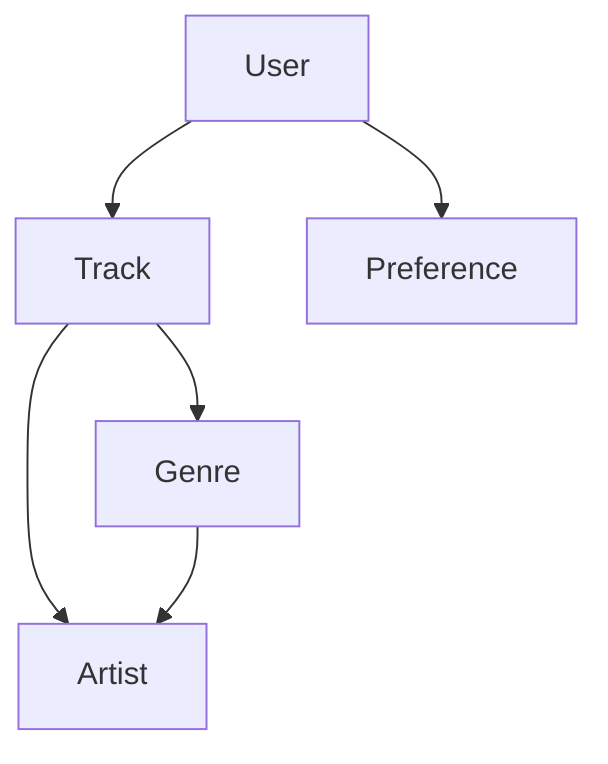
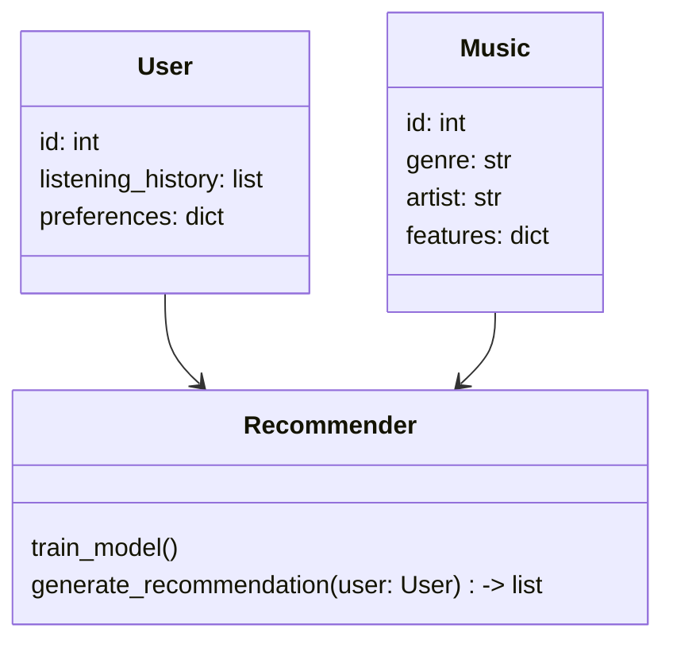
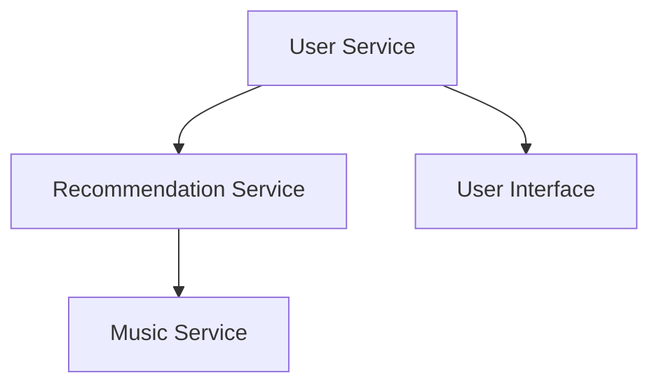
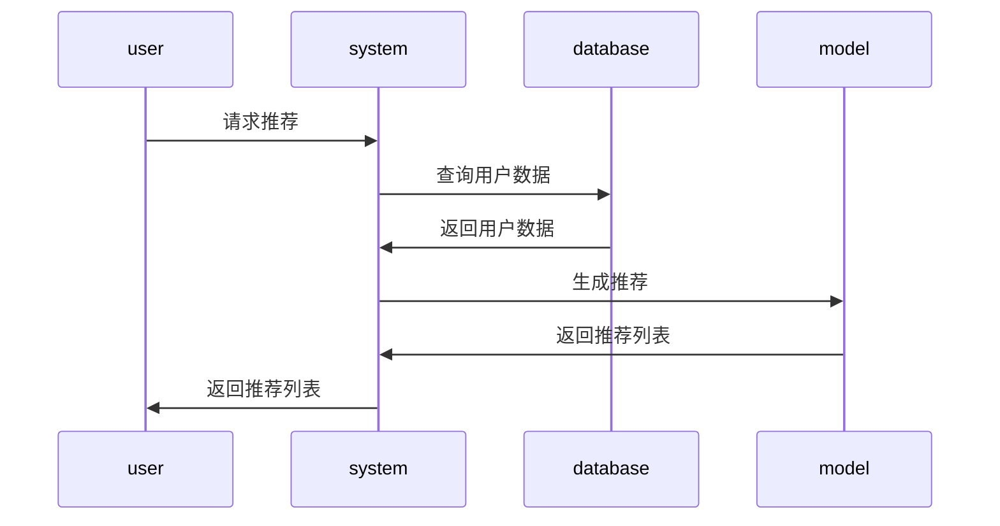

                 


# AI Agent在音乐推荐中的个性化算法

## 关键词：AI Agent，音乐推荐，个性化算法，协同过滤，深度学习，强化学习

## 摘要：本文深入探讨AI Agent在音乐推荐系统中的应用，分析个性化推荐的核心算法及其优化策略。从协同过滤、深度学习到强化学习，结合系统设计与实际案例，全面解析AI Agent在音乐推荐中的技术原理与实践应用。

---

# 第一部分: AI Agent在音乐推荐中的背景与基础

## 第1章: 音乐推荐系统概述

### 1.1 音乐推荐系统的背景与问题背景

#### 1.1.1 音乐推荐系统的背景
音乐推荐系统是人工智能与大数据技术结合的重要应用之一，旨在通过分析用户的行为和偏好，为用户提供个性化的音乐推荐。随着数字音乐平台的普及，音乐推荐系统已经成为提升用户体验的核心技术。

#### 1.1.2 音乐推荐系统的核心问题
音乐推荐系统的核心问题在于如何高效地分析用户行为、音乐特征以及两者之间的关系，从而生成符合用户喜好的推荐列表。传统推荐算法面临数据稀疏性、冷启动问题和实时性挑战。

#### 1.1.3 音乐推荐系统的边界与外延
音乐推荐系统的边界包括用户数据、音乐数据、推荐结果和用户反馈。外延则涉及音乐分类、情感分析和社交网络推荐。

### 1.2 音乐推荐系统的定义与特点

#### 1.2.1 音乐推荐的定义
音乐推荐系统是一种基于用户行为和音乐特征，利用算法生成个性化音乐列表的技术。

#### 1.2.2 音乐推荐的核心特点
- 个性化：根据用户的听歌历史、偏好生成推荐。
- 实时性：快速响应用户需求。
- 可扩展性：支持大规模数据处理。

#### 1.2.3 音乐推荐与个性化的关系
音乐推荐的核心目标是实现个性化推荐，通过分析用户行为和音乐特征，生成符合用户口味的音乐列表。

### 1.3 AI Agent在音乐推荐中的应用

#### 1.3.1 AI Agent的定义与特点
AI Agent是一种智能代理，能够感知环境、执行任务并优化决策。在音乐推荐中，AI Agent负责分析用户行为、音乐特征并生成推荐。

#### 1.3.2 AI Agent在音乐推荐中的作用
- 数据收集：实时获取用户行为和反馈。
- 特征提取：分析音乐和用户的属性。
- 推荐生成：基于模型生成个性化推荐。

#### 1.3.3 音乐推荐中的AI Agent与传统推荐算法的区别
AI Agent通过动态学习和自适应优化，能够更好地处理实时反馈和复杂场景，而传统算法则相对静态。

### 1.4 音乐推荐系统的分类

#### 1.4.1 基于协同过滤的推荐
基于用户行为的协同过滤算法，通过相似用户或相似物品生成推荐。

#### 1.4.2 基于内容的推荐
基于音乐特征（如音调、节奏）生成推荐。

#### 1.4.3 基于深度学习的推荐
利用神经网络模型学习用户和音乐的深层特征。

---

## 第2章: AI Agent与个性化推荐的核心概念

### 2.1 AI Agent的核心原理

#### 2.1.1 AI Agent的基本原理
AI Agent通过感知环境、分析数据、决策并执行推荐任务。

#### 2.1.2 AI Agent的决策机制
基于用户反馈和音乐特征，动态调整推荐策略。

#### 2.1.3 AI Agent的学习与优化
通过机器学习算法不断优化推荐模型。

### 2.2 个性化推荐的核心原理

#### 2.2.1 个性化推荐的基本原理
通过分析用户行为和音乐特征，生成个性化推荐列表。

#### 2.2.2 个性化推荐的特征提取
提取音乐和用户的深层特征，用于推荐生成。

#### 2.2.3 个性化推荐的模型训练
通过训练模型学习用户和音乐的关联性。

### 2.3 AI Agent与个性化推荐的关系

#### 2.3.1 AI Agent在个性化推荐中的角色
AI Agent作为推荐系统的核心模块，负责数据处理和模型优化。

#### 2.3.2 个性化推荐对AI Agent的依赖
个性化推荐依赖AI Agent的动态学习和优化能力。

#### 2.3.3 AI Agent与个性化推荐的协同作用
AI Agent通过协同过滤、深度学习等方法，实现个性化的音乐推荐。

### 2.4 核心概念对比分析

#### 2.4.1 AI Agent与传统推荐算法的对比
| 特性          | AI Agent推荐       | 传统推荐算法       |
|---------------|--------------------|--------------------|
| 学习能力       | 强               | 弱或无             |
| 实时性         | 高               | 中或低            |
| 个性化程度     | 高               | 中或低            |

#### 2.4.2 ER实体关系图


---

## 第3章: 音乐推荐算法的实现原理

### 3.1 协同过滤算法

#### 3.1.1 协同过滤的定义与原理
协同过滤基于用户行为相似性，找到相似用户或物品，生成推荐。

#### 3.1.2 协同过滤的实现步骤
1. 收集用户行为数据。
2. 计算用户或物品的相似度。
3. 基于相似度生成推荐。

#### 3.1.3 协同过滤的优缺点
- 优点：简单易实现。
- 缺点：数据稀疏性问题。

#### 3.1.4 协同过滤的数学公式
用户相似度计算公式：
$$similarity(u, v) = \frac{\sum_{i} (u_i - \bar{u})(v_i - \bar{v})}{\sqrt{\sum_{i} (u_i - \bar{u})^2} \sqrt{\sum_{i} (v_i - \bar{v})^2}}$$

### 3.2 基于深度学习的推荐算法

#### 3.2.1 深度学习在音乐推荐中的应用
深度学习模型（如神经网络）用于提取音乐和用户的深层特征。

#### 3.2.2 深度学习推荐的实现步骤
1. 数据预处理。
2. 模型训练。
3. 推荐生成。

#### 3.2.3 深度学习推荐的数学模型
神经网络模型：
$$P(x) = \sigma(Wx + b)$$

### 3.3 基于强化学习的推荐算法

#### 3.3.1 强化学习在音乐推荐中的作用
强化学习通过试错优化推荐策略。

#### 3.3.2 强化学习推荐的实现步骤
1. 状态空间定义。
2. 动作选择。
3. 奖励函数设计。

#### 3.3.3 强化学习推荐的数学公式
策略函数：
$$\pi(a|s) = \text{softmax}(Q(s, a))$$

---

## 第4章: 音乐推荐系统的设计与实现

### 4.1 系统分析与设计

#### 4.1.1 系统功能设计
- 用户行为收集
- 音乐特征提取
- 推荐生成

#### 4.1.2 领域模型设计


### 4.2 系统架构设计

#### 4.2.1 分层架构
- 数据层：用户和音乐数据。
- 业务逻辑层：推荐算法。
- 表现层：用户界面。

#### 4.2.2 微服务架构
- 用户服务：处理用户数据。
- 音乐服务：管理音乐数据。
- 推荐服务：生成推荐。

#### 4.2.3 系统架构图


### 4.3 系统接口设计

#### 4.3.1 接口定义
- `/api/v1/recommendations`：获取推荐列表。
- `/api/v1/users`：管理用户数据。

#### 4.3.2 接口交互流程
1. 用户请求推荐。
2. 推荐服务处理请求。
3. 返回推荐列表。

### 4.4 系统交互设计

#### 4.4.1 用户与系统的交互流程
1. 用户登录。
2. 系统收集用户行为。
3. 生成推荐列表。

#### 4.4.2 交互序列图


---

## 第5章: 项目实战与优化

### 5.1 环境安装与配置

#### 5.1.1 Python环境安装
安装Python和必要的库：
```bash
pip install numpy scikit-learn tensorflow
```

#### 5.1.2 数据集准备
获取音乐数据集（如Spotify API数据）。

### 5.2 核心代码实现

#### 5.2.1 协同过滤实现
```python
import numpy as np
from sklearn.metrics.pairwise import cosine_similarity

# 示例用户数据
users = {'user1': [5, 3, 0, 2], 'user2': [4, 0, 4, 1]}
user_ids = ['user1', 'user2']
item_ids = [1, 2, 3, 4]

# 计算相似度矩阵
user_matrix = np.array([users[user] for user in user_ids], dtype=float)
similarity_matrix = cosine_similarity(user_matrix)

# 基于用户相似度生成推荐
def generate_recommendation(user, similarity_matrix):
    user_index = user_ids.index(user)
    similar_users = np.argsort(-similarity_matrix[user_index])[1:]
    recommendations = {}
    for i in similar_users:
        for item_index, rating in enumerate(user_matrix[i]):
            if rating > 0:
                item = item_ids[item_index]
                recommendations[item] = recommendations.get(item, 0) + 1
    return recommendations
```

#### 5.2.2 深度学习实现
```python
import tensorflow as tf
from tensorflow.keras import layers

# 示例神经网络模型
model = tf.keras.Sequential([
    layers.Dense(64, activation='relu'),
    layers.Dense(1, activation='sigmoid')
])
model.compile(optimizer='adam', loss='binary_crossentropy', metrics=['accuracy'])
```

### 5.3 案例分析与优化

#### 5.3.1 案例分析
分析推荐算法在实际场景中的表现，优化模型参数。

#### 5.3.2 优化策略
- 数据增强。
- 模型调参。
- 实时反馈优化。

### 5.4 项目小结

---

## 第6章: 总结与展望

### 6.1 本章总结
总结AI Agent在音乐推荐中的应用，分析各类算法的优缺点。

### 6.2 未来展望
探讨深度学习和强化学习在音乐推荐中的未来发展方向。

### 6.3 最佳实践 tips
- 结合实时反馈优化推荐。
- 使用混合推荐策略提升推荐效果。
- 加强模型解释性。

### 6.4 小结
AI Agent在音乐推荐中的应用前景广阔，未来将更加注重实时性和个性化。

---

# 结束语

本文系统地探讨了AI Agent在音乐推荐中的应用，从算法原理到系统设计，再到项目实现，全面解析了个性化推荐的核心技术。希望本文能为音乐推荐系统的开发和优化提供有价值的参考。

