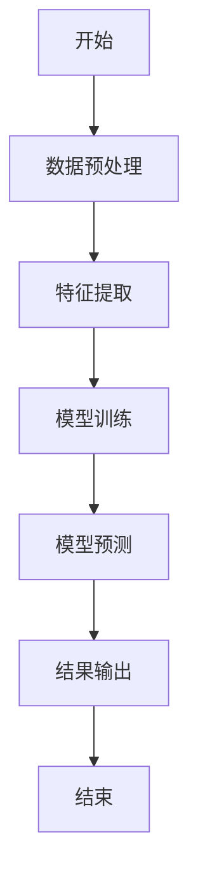
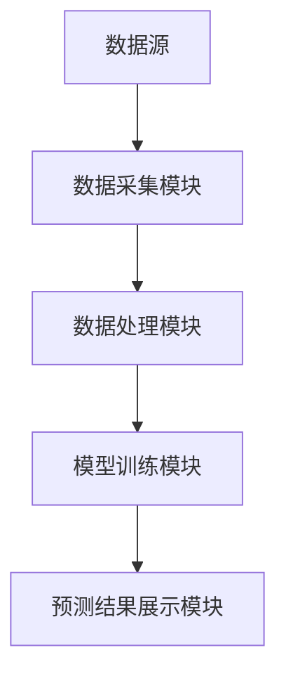
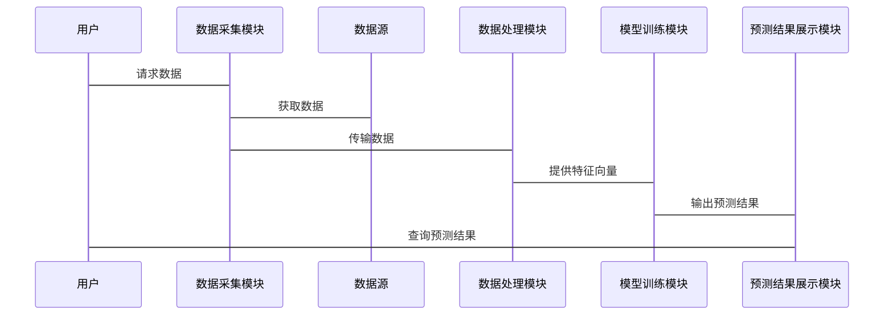

                 


# AI Agent在预测分析中的应用

> 关键词：AI Agent，预测分析，机器学习，时间序列分析，数学模型，系统架构

> 摘要：本文深入探讨AI Agent在预测分析中的应用，从AI Agent的基本概念到预测分析的核心算法，再到基于AI Agent的预测分析系统架构设计，系统性地分析了AI Agent如何提升预测分析的能力。本文结合实际案例，详细讲解了AI Agent在预测分析中的优势、原理与实现，为读者提供了一套完整的理论与实践相结合的解决方案。

---

# 第1章: AI Agent与预测分析概述

## 1.1 AI Agent的基本概念

### 1.1.1 AI Agent的定义与特点
AI Agent（人工智能代理）是指能够感知环境、自主决策并执行任务的智能实体。与传统算法不同，AI Agent具有以下特点：
- **自主性**：能够在没有外部干预的情况下独立运行。
- **反应性**：能够实时感知环境并做出反应。
- **目标导向**：通过目标驱动来优化决策过程。
- **学习能力**：能够通过数据和经验不断优化自身性能。

### 1.1.2 AI Agent的核心功能模块
AI Agent的核心功能模块包括：
1. **感知模块**：负责采集和处理环境中的数据。
2. **决策模块**：基于感知数据进行特征提取和模型训练，生成决策方案。
3. **执行模块**：将决策结果输出并执行。

### 1.1.3 AI Agent与传统算法的区别
AI Agent与传统算法的主要区别在于其自主性和目标导向性。传统算法通常需要人工干预和参数调整，而AI Agent能够自主运行并根据目标优化决策过程。

## 1.2 预测分析的基本概念

### 1.2.1 预测分析的定义与应用场景
预测分析是通过历史数据和数学模型，预测未来趋势和结果的一种分析方法。其主要应用场景包括：
- 股票价格预测
- 销售预测
- 病毒传播预测
- 设备故障预测

### 1.2.2 预测分析的主要方法
预测分析的主要方法包括：
1. **回归分析**：用于预测连续型变量。
2. **时间序列分析**：用于预测具有时间依赖性的数据。
3. **机器学习算法**：如随机森林、支持向量机等。

### 1.2.3 预测分析的挑战与局限性
预测分析的挑战主要在于数据的质量、模型的复杂性和不确定性。其局限性包括：
- 数据噪声和缺失值会影响预测准确性。
- 模型的复杂性可能导致解释性差。
- 预测结果受外部不可预测因素的影响。

## 1.3 AI Agent在预测分析中的作用

### 1.3.1 AI Agent如何提升预测分析能力
AI Agent能够通过自主感知和学习，实时优化预测模型，从而提升预测分析能力。

### 1.3.2 AI Agent在预测分析中的优势
1. **自主性**：AI Agent能够自主运行，无需人工干预。
2. **实时性**：能够实时感知数据并快速做出反应。
3. **自适应性**：能够根据环境变化自适应调整预测模型。

### 1.3.3 AI Agent预测分析的未来发展趋势
随着AI技术的不断发展，AI Agent在预测分析中的应用将更加广泛，预测模型的复杂性和准确性也将不断提升。

## 1.4 本章小结
本章从AI Agent的基本概念和预测分析的基本原理入手，分析了AI Agent在预测分析中的作用和优势，为后续章节的深入分析奠定了基础。

---

# 第2章: AI Agent的核心原理与架构

## 2.1 AI Agent的核心原理

### 2.1.1 感知模块：数据采集与处理
感知模块负责采集环境中的数据，并进行预处理。数据预处理包括数据清洗和特征提取。

### 2.1.2 决策模块：特征提取与模型训练
决策模块通过特征提取和模型训练生成预测结果。特征提取是将原始数据转换为对预测目标有影响力的特征向量。模型训练是通过机器学习算法对特征向量进行训练，生成预测模型。

### 2.1.3 执行模块：预测结果输出与反馈
执行模块将预测结果输出，并根据反馈不断优化模型。

## 2.2 AI Agent的架构设计

### 2.2.1 基于模块化的AI Agent架构
基于模块化的AI Agent架构将AI Agent划分为多个功能模块，每个模块负责特定的功能。

### 2.2.2 基于事件驱动的AI Agent架构
基于事件驱动的AI Agent架构通过事件触发模块的运行，适用于实时响应的应用场景。

### 2.2.3 基于分布式计算的AI Agent架构
基于分布式计算的AI Agent架构通过分布式计算提升预测分析的效率，适用于数据量大的应用场景。

## 2.3 AI Agent的通信机制

### 2.3.1 Agent之间的通信协议
AI Agent之间的通信需要遵循特定的协议，如MQTT和HTTP。

### 2.3.2 基于消息队列的通信方式
基于消息队列的通信方式通过消息队列实现异步通信，适用于实时性要求高的应用场景。

### 2.3.3 基于REST API的通信方式
基于REST API的通信方式通过HTTP协议实现API调用，适用于简单的通信场景。

## 2.4 本章小结
本章详细分析了AI Agent的核心原理和架构设计，为后续章节的系统设计奠定了基础。

---

# 第3章: 预测分析的核心算法与数学模型

## 3.1 预测分析的主要算法

### 3.1.1 线性回归算法
线性回归算法通过最小二乘法拟合最佳回归线，公式为：
$$ y = \beta_0 + \beta_1x + \epsilon $$

### 3.1.2 支持向量机（SVM）
支持向量机通过构建超平面实现分类或回归，适用于非线性数据。

### 3.1.3 随机森林与梯度提升树
随机森林和梯度提升树是基于树的集成学习算法，适用于复杂数据的预测。

### 3.1.4 时间序列分析算法
时间序列分析算法通过分析数据的时间依赖性进行预测，常用ARIMA模型。

## 3.2 预测分析的数学模型

### 3.2.1 线性回归模型
线性回归模型的公式为：
$$ y = \beta_0 + \beta_1x + \epsilon $$

### 3.2.2 时间序列模型
时间序列模型的公式为：
$$ ARIMA(p, d, q) $$

### 3.2.3 随机森林算法
随机森林算法通过集成学习生成多个决策树，并通过投票或加权的方式生成最终预测结果。

## 3.3 算法原理的mermaid流程图


## 3.4 本章小结
本章详细分析了预测分析的核心算法和数学模型，为后续章节的系统设计奠定了基础。

---

# 第4章: 基于AI Agent的预测分析系统架构设计

## 4.1 系统功能设计

### 4.1.1 数据采集模块
数据采集模块负责从数据源中采集数据，并进行预处理。

### 4.1.2 数据处理模块
数据处理模块对采集到的数据进行清洗和特征提取。

### 4.1.3 模型训练模块
模型训练模块通过机器学习算法对特征向量进行训练，生成预测模型。

### 4.1.4 预测结果展示模块
预测结果展示模块将预测结果以可视化的方式展示给用户。

## 4.2 系统架构设计

### 4.2.1 系统架构图


### 4.2.2 系统接口设计
系统接口设计包括数据接口和预测接口，数据接口负责数据的输入和输出，预测接口负责预测结果的查询和展示。

## 4.3 系统交互序列图

### 4.3.1 预测流程


## 4.4 本章小结
本章详细分析了基于AI Agent的预测分析系统的架构设计和接口设计，为实际应用提供了参考。

---

# 附录: 项目实战——基于AI Agent的股票价格预测系统

## 1. 项目简介
本项目旨在通过AI Agent实现股票价格的预测，帮助投资者做出更明智的投资决策。

## 2. 环境安装
需要安装Python、TensorFlow、Pandas和Matplotlib等库。

## 3. 核心代码实现

### 3.1 数据采集模块
```python
import pandas as pd
import requests

def get_stock_data(ticker):
    url = f"https://api.example.com/stock/{ticker}"
    response = requests.get(url)
    data = response.json()
    df = pd.DataFrame(data)
    return df
```

### 3.2 数据处理模块
```python
def preprocess_data(df):
    df = df[['date', 'open', 'high', 'low', 'close']]
    df['date'] = pd.to_datetime(df['date'])
    df.set_index('date', inplace=True)
    return df
```

### 3.3 模型训练模块
```python
from sklearn.ensemble import RandomForestRegressor
import numpy as np

def train_model(df, target_col='close'):
    features = ['open', 'high', 'low']
    target = df[target_col]
    X = df[features]
    y = target.values
    model = RandomForestRegressor(n_estimators=100, random_state=42)
    model.fit(X, y)
    return model
```

### 3.4 预测结果展示模块
```python
import matplotlib.pyplot as plt

def plot_prediction(actual, predicted, title):
    plt.figure(figsize=(10, 6))
    plt.plot(actual, label='Actual Price')
    plt.plot(predicted, label='Predicted Price')
    plt.title(title)
    plt.xlabel('Date')
    plt.ylabel('Price')
    plt.legend()
    plt.show()
```

## 4. 项目小结
本项目通过AI Agent实现了股票价格的预测，验证了AI Agent在预测分析中的有效性。

---

# 总结

本文详细分析了AI Agent在预测分析中的应用，从基本概念到核心算法，再到系统架构设计，为读者提供了一套完整的理论与实践相结合的解决方案。通过实际项目的实现，进一步验证了AI Agent在预测分析中的优势和潜力。未来，随着AI技术的不断发展，AI Agent在预测分析中的应用将更加广泛和深入。

