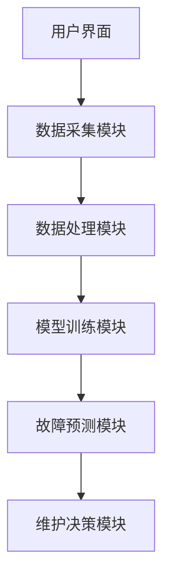
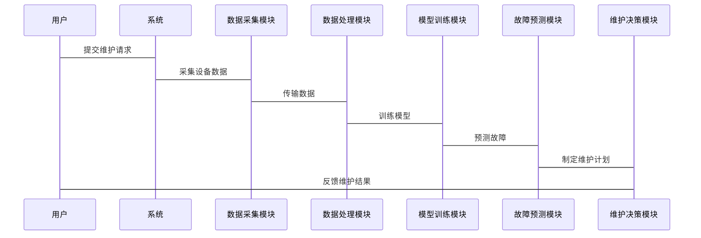

                 


# AI Agent在预测性维护中的实践

## 关键词：预测性维护，AI Agent，工业物联网，机器学习，故障预测，智能决策，设备维护

## 摘要：  
随着工业智能化的快速发展，预测性维护已成为提升设备可靠性、降低运营成本的重要手段。AI Agent（人工智能代理）作为智能化决策的核心技术，能够通过机器学习、物联网和大数据分析，实现对设备故障的提前预测和智能决策。本文将详细探讨AI Agent在预测性维护中的应用场景、算法原理、系统架构及实际案例，为读者提供全面的技术解读和实践指导。

---

# 第一部分：AI Agent与预测性维护的背景介绍

## 第1章：预测性维护的基本概念

### 1.1 预测性维护的定义与特点  
预测性维护是一种基于设备运行状态和历史数据，利用先进算法预测设备未来状态的维护策略。其核心目标是通过提前发现潜在故障，避免设备停机和生产损失。  

#### 1.1.1 预测性维护的定义  
预测性维护是一种预防性维护策略，通过实时监测设备运行数据，结合历史数据和机器学习模型，预测设备的健康状态和潜在故障。  

#### 1.1.2 预测性维护的核心特点  
- **数据驱动**：依赖实时数据和历史数据进行分析。  
- **智能化**：通过机器学习算法实现故障预测。  
- **预防性**：提前发现潜在问题，减少设备停机时间。  

#### 1.1.3 预测性维护与传统维护的区别  
传统维护通常基于固定周期或故障后维修，而预测性维护通过实时监测和数据分析，能够主动发现潜在问题，从而减少停机时间并降低成本。  

### 1.2 AI Agent的定义与特点  
AI Agent是一种能够感知环境、自主决策并执行任务的智能代理。在预测性维护中，AI Agent负责数据采集、分析和决策。  

#### 1.2.1 AI Agent的定义  
AI Agent是具备感知、推理、规划和执行能力的智能系统，能够根据环境信息自主决策并完成任务。  

#### 1.2.2 AI Agent的核心特点  
- **自主性**：能够自主决策和执行任务。  
- **反应性**：能够实时感知环境变化并做出反应。  
- **学习能力**：能够通过数据优化自身模型。  

### 1.3 预测性维护在工业中的应用  
预测性维护广泛应用于制造业、能源、交通等领域，通过AI Agent实现设备状态监测和故障预测。  

#### 1.3.1 预测性维护的应用领域  
- 制造业：设备故障预测和维护优化。  
- 能源行业：发电设备状态监测。  
- 交通领域：车辆和机械故障预测。  

#### 1.3.2 AI Agent在预测性维护中的作用  
AI Agent能够实时监测设备运行数据，通过机器学习模型预测设备故障，并制定最优维护策略。  

#### 1.3.3 预测性维护的挑战与机遇  
- **挑战**：数据采集成本高、模型精度要求高。  
- **机遇**：能够显著降低设备停机时间和维护成本。  

## 1.4 本章小结  
本章介绍了预测性维护的基本概念、AI Agent的特点及其在工业中的应用。通过AI Agent实现预测性维护，能够显著提升设备运行效率和企业竞争力。

---

# 第二部分：AI Agent在预测性维护中的核心概念

## 第2章：AI Agent与预测性维护的关系

### 2.1 AI Agent的核心概念  
AI Agent在预测性维护中的作用是实时监测设备运行状态，并通过机器学习模型预测故障。  

#### 2.1.1 AI Agent的基本原理  
AI Agent通过感知环境、分析数据、推理和规划，制定最优决策并执行任务。  

#### 2.1.2 AI Agent的分类  
- **简单反射型代理**：基于规则做出反应。  
- **基于模型的反射型代理**：基于内部模型进行推理。  
- **目标驱动型代理**：根据目标制定计划。  

#### 2.1.3 AI Agent的性能指标  
- 响应时间：代理的决策速度。  
- 精确度：预测的准确性。  
- 可扩展性：适应不同规模任务的能力。  

### 2.2 预测性维护的核心概念  
预测性维护依赖于实时数据和机器学习模型，通过分析设备状态预测故障。  

#### 2.2.1 预测性维护的流程  
1. 数据采集：通过传感器获取设备运行数据。  
2. 数据分析：利用机器学习模型分析数据。  
3. 故障预测：预测设备未来状态。  
4. 维护决策：制定最优维护策略。  

#### 2.2.2 预测性维护的关键技术  
- 数据采集技术：如物联网传感器。  
- 机器学习算法：如时间序列分析和深度学习。  
- 数据可视化技术：如图表和仪表盘。  

#### 2.2.3 预测性维护的数学模型  
预测性维护通常基于时间序列模型，如ARIMA和LSTM。  

### 2.3 AI Agent与预测性维护的结合  
AI Agent通过实时监测和分析设备数据，利用机器学习模型预测故障，并制定维护策略。  

#### 2.3.1 AI Agent在预测性维护中的作用  
- 数据采集：通过传感器获取设备运行数据。  
- 数据分析：利用机器学习模型分析数据。  
- 故障预测：预测设备未来状态。  
- 维护决策：制定最优维护策略。  

#### 2.3.2 AI Agent与预测性维护的协同工作  
AI Agent通过实时监测设备状态，结合历史数据和机器学习模型，预测设备故障并优化维护策略。  

#### 2.3.3 AI Agent在预测性维护中的优势  
- **高效性**：能够快速分析数据并制定决策。  
- **准确性**：通过机器学习模型提高预测精度。  
- **智能化**：能够自主优化维护策略。  

## 2.4 本章小结  
本章详细探讨了AI Agent与预测性维护的关系，分析了AI Agent的核心概念及其在预测性维护中的作用和优势。

---

# 第三部分：AI Agent在预测性维护中的算法原理

## 第3章：时间序列分析在预测性维护中的应用

### 3.1 时间序列分析的基本概念  
时间序列分析是一种通过分析时间数据预测未来趋势的方法。  

#### 3.1.1 时间序列的定义  
时间序列是指按时间顺序排列的数据，通常用于分析趋势和周期性。  

#### 3.1.2 时间序列的分类  
- **平稳时间序列**：均值和方差恒定。  
- **非平稳时间序列**：均值或方差随时间变化。  

#### 3.1.3 时间序列分析的常见方法  
- 移动平均法：计算过去若干项的平均值。  
- 指数平滑法：基于加权平均预测未来值。  
- 自回归积分滑动平均模型（ARIMA）：预测未来值。  

### 3.2 常见的时间序列分析算法  

#### 3.2.1 ARIMA模型  
ARIMA模型是一种广泛应用于时间序列预测的统计模型，适用于非平稳数据。  

##### 3.2.1.1 ARIMA模型的结构  
ARIMA模型由自回归（AR）、差分（I）和移动平均（MA）三个部分组成，公式如下：  
$$ ARIMA(p, d, q) = y_t - \phi_1 y_{t-1} - \dots - \phi_p y_{t-p} + \theta_1 \epsilon_{t-1} + \dots + \theta_q \epsilon_{t-q} $$  

##### 3.2.1.2 ARIMA模型的实现步骤  
1. 数据检查：确认数据是否平稳。  
2. 参数估计：确定AR和MA的阶数。  
3. 模型验证：检验模型是否符合数据分布。  
4. 预测：利用模型预测未来值。  

##### 3.2.1.3 ARIMA模型的优缺点  
- **优点**：适用于非平稳数据，模型简单。  
- **缺点**：对异常值敏感，需要手动调整参数。  

#### 3.2.2 LSTM网络  
长短期记忆网络（LSTM）是一种基于循环神经网络的时间序列预测模型，能够捕捉长期依赖关系。  

##### 3.2.2.1 LSTM网络的结构  
LSTM网络由输入门、遗忘门和输出门组成，公式如下：  
$$ i_t = \sigma(W_i x_t + U_i h_{t-1} + b_i) $$  
$$ f_t = \sigma(W_f x_t + U_f h_{t-1} + b_f) $$  
$$ o_t = \sigma(W_o x_t + U_o h_{t-1} + b_o) $$  
$$ h_t = i_t \cdot \tanh(W_c x_t + U_c h_{t-1} + b_c) $$  

##### 3.2.2.2 LSTM网络的实现步骤  
1. 数据预处理：归一化数据并分割训练集和测试集。  
2. 模型构建：定义LSTM层和输出层。  
3. 模型训练：使用梯度下降优化器训练模型。  
4. 模型预测：利用训练好的模型预测未来值。  

##### 3.2.2.3 LSTM网络的优缺点  
- **优点**：能够捕捉长期依赖关系，适用于复杂时间序列。  
- **缺点**：训练时间较长，需要大量计算资源。  

#### 3.2.3 其他时间序列算法  
- **Prophet模型**：Facebook开源的时间序列预测模型，适合业务数据预测。  
- **GARCH模型**：用于金融时间序列中的波动率预测。  

### 3.3 时间序列分析在预测性维护中的应用  
时间序列分析广泛应用于设备运行状态监测和故障预测。  

#### 3.3.1 预测性维护中的时间序列数据  
- 设备运行参数：如温度、压力、振动等。  
- 历史故障数据：用于模型训练。  

#### 3.3.2 时间序列分析的应用场景  
- 设备健康状态监测：通过分析设备运行参数预测设备状态。  
- 故障预测：通过分析历史故障数据预测未来故障。  

#### 3.3.3 时间序列分析的挑战  
- 数据质量：传感器数据可能存在噪声。  
- 模型选择：需要根据数据特点选择合适的时间序列模型。  
- 模型解释性：复杂模型可能难以解释预测结果。  

### 3.4 本章小结  
本章介绍了时间序列分析的基本概念和常见算法，重点讲解了ARIMA模型和LSTM网络在预测性维护中的应用。

---

## 第4章：机器学习算法在预测性维护中的应用  

### 4.1 机器学习算法的基本概念  
机器学习算法是一种通过数据训练模型并进行预测的技术。  

#### 4.1.1 机器学习的定义  
机器学习是一种通过数据训练模型，使其能够从数据中学习并做出预测的技术。  

#### 4.1.2 机器学习的分类  
- 监督学习：基于标记数据进行训练。  
- 无监督学习：基于未标记数据进行训练。  
- 强化学习：通过与环境交互学习策略。  

### 4.2 机器学习算法在预测性维护中的应用  

#### 4.2.1 监督学习算法  
- **随机森林**：适用于分类和回归任务。  
- **支持向量机（SVM）**：适用于分类任务。  

#### 4.2.2 无监督学习算法  
- **K-means聚类**：适用于异常检测。  
- **主成分分析（PCA）**：适用于数据降维。  

#### 4.2.3 深度学习算法  
- **卷积神经网络（CNN）**：适用于图像数据处理。  
- **循环神经网络（RNN）**：适用于时间序列数据处理。  

### 4.3 机器学习算法的优缺点  
- **优点**：能够处理复杂数据，模型精度高。  
- **缺点**：训练时间长，需要大量计算资源。  

### 4.4 本章小结  
本章介绍了机器学习算法的基本概念和常见算法在预测性维护中的应用，重点讲解了监督学习、无监督学习和深度学习算法的特点及其应用场景。

---

# 第四部分：AI Agent在预测性维护中的系统架构设计

## 第5章：系统功能设计与架构分析  

### 5.1 系统功能设计  
预测性维护系统通常包括数据采集、数据处理、模型训练、故障预测和维护决策等功能模块。  

#### 5.1.1 数据采集模块  
数据采集模块负责从设备传感器获取实时数据。  

##### 5.1.1.1 数据采集方式  
- **物联网传感器**：通过传感器采集设备运行数据。  
- **数据库查询**：从历史数据库中获取数据。  

##### 5.1.1.2 数据采集的挑战  
- 数据量大：需要高效的数据采集方式。  
- 数据质量：需要处理噪声数据。  

#### 5.1.2 数据处理模块  
数据处理模块负责对采集到的数据进行清洗、转换和存储。  

##### 5.1.2.1 数据清洗  
- 去除噪声数据：如异常值和重复值。  
- 数据归一化：将数据标准化处理。  

##### 5.1.2.2 数据存储  
- 数据库存储：如MySQL和MongoDB。  
- 数据湖存储：如Hadoop和云存储。  

#### 5.1.3 模型训练模块  
模型训练模块负责利用数据训练机器学习模型。  

##### 5.1.3.1 模型训练流程  
1. 数据预处理：清洗和归一化数据。  
2. 模型选择：选择合适的学习算法。  
3. 模型训练：利用训练数据训练模型。  
4. 模型评估：验证模型的准确性和稳定性。  

#### 5.1.4 故障预测模块  
故障预测模块负责利用训练好的模型预测设备故障。  

##### 5.1.4.1 故障预测流程  
1. 实时数据采集：获取设备当前状态数据。  
2. 数据输入模型：将数据输入预测模型。  
3. 预测结果输出：输出预测结果，如故障概率和预计故障时间。  

#### 5.1.5 维护决策模块  
维护决策模块负责根据预测结果制定维护策略。  

##### 5.1.5.1 维护决策流程  
1. 预测结果分析：根据故障概率制定维护计划。  
2. 维护计划执行：安排维护人员进行维修。  
3. 维护结果反馈：将维护结果反馈到系统中。  

### 5.2 系统架构设计  

#### 5.2.1 系统架构图  
以下是预测性维护系统的架构图：  



#### 5.2.2 系统功能模块  
- 用户界面：供用户查看设备状态和维护计划。  
- 数据采集模块：负责采集设备运行数据。  
- 数据处理模块：负责数据清洗和存储。  
- 模型训练模块：负责训练机器学习模型。  
- 故障预测模块：负责预测设备故障。  
- 维护决策模块：负责制定维护策略。  

#### 5.2.3 系统接口设计  
- 数据采集接口：与传感器和数据库对接。  
- 模型训练接口：与机器学习框架对接。  
- 维护决策接口：与维护管理系统对接。  

### 5.3 系统交互流程  

#### 5.3.1 系统交互流程图  
以下是预测性维护系统的交互流程图：  



### 5.4 本章小结  
本章详细介绍了预测性维护系统的功能设计和架构设计，重点讲解了各功能模块的作用和系统交互流程。

---

## 第6章：系统实现与案例分析  

### 6.1 项目实战：预测性维护系统实现  

#### 6.1.1 环境安装与配置  
1. 安装Python和必要的库：如NumPy、Pandas、Scikit-learn、Keras和TensorFlow。  
2. 安装数据库和数据可视化工具：如MySQL、MongoDB和Matplotlib。  

#### 6.1.2 系统核心实现  

##### 6.1.2.1 数据采集模块  
```python
import serial

# 通过串口采集设备数据
ser = serial.Serial('COM3', 9600)
data = ser.readline().decode().strip()
ser.close()
```

##### 6.1.2.2 数据处理模块  
```python
import pandas as pd
from sklearn.preprocessing import StandardScaler

# 数据归一化处理
data = pd.read_csv('data.csv')
scaler = StandardScaler()
data_scaled = scaler.fit_transform(data)
```

##### 6.1.2.3 模型训练模块  
```python
from sklearn.ensemble import RandomForestClassifier
from sklearn.metrics import accuracy_score

# 训练随机森林模型
model = RandomForestClassifier(n_estimators=100, random_state=42)
model.fit(X_train, y_train)
```

##### 6.1.2.4 故障预测模块  
```python
import numpy as np

# 预测设备故障概率
X_new = np.array([[new_data]])
y_pred = model.predict_proba(X_new)
```

##### 6.1.2.5 维护决策模块  
```python
# 根据预测结果制定维护策略
if y_pred[0][1] > 0.8:
    print("设备将在未来24小时内发生故障，建议安排维护。")
```

#### 6.1.3 代码实现与应用解读  
以下是完整的预测性维护系统代码示例：  

```python
import serial
import pandas as pd
from sklearn.preprocessing import StandardScaler
from sklearn.ensemble import RandomForestClassifier
import numpy as np

# 数据采集模块
ser = serial.Serial('COM3', 9600)
data = ser.readline().decode().strip()
ser.close()

# 数据处理模块
data = pd.read_csv('data.csv')
scaler = StandardScaler()
data_scaled = scaler.fit_transform(data)

# 模型训练模块
model = RandomForestClassifier(n_estimators=100, random_state=42)
model.fit(X_train, y_train)

# 故障预测模块
X_new = np.array([[new_data]])
y_pred = model.predict_proba(X_new)

# 维护决策模块
if y_pred[0][1] > 0.8:
    print("设备将在未来24小时内发生故障，建议安排维护。")
```

### 6.2 实际案例分析  

#### 6.2.1 案例背景  
某制造企业希望利用AI Agent实现设备预测性维护，降低设备故障率和维护成本。  

#### 6.2.2 数据采集与处理  
1. 通过传感器采集设备运行数据，如温度、压力和振动。  
2. 对数据进行清洗和归一化处理，确保数据质量。  

#### 6.2.3 模型训练与预测  
1. 使用随机森林模型训练设备故障分类器。  
2. 通过模型预测设备故障概率，制定维护计划。  

#### 6.2.4 维护决策与实施  
1. 根据预测结果安排维护计划，减少设备停机时间。  
2. 收集维护数据，优化模型性能。  

### 6.3 案例分析与小结  
通过案例分析，我们可以看到AI Agent在预测性维护中的实际应用价值。通过实时监测和智能决策，企业能够显著降低设备故障率和维护成本。

---

## 第7章：系统优化与扩展  

### 7.1 系统优化策略  

#### 7.1.1 数据优化  
- 数据清洗：去除噪声数据和异常值。  
- 数据增强：通过数据增强技术提高模型鲁棒性。  

#### 7.1.2 模型优化  
- 参数调优：通过网格搜索优化模型参数。  
- 模型集成：通过集成学习提高模型性能。  

#### 7.1.3 系统性能优化  
- 优化数据处理流程：减少数据处理时间。  
- 优化模型训练流程：提高训练效率。  

### 7.2 系统扩展与未来展望  

#### 7.2.1 系统扩展方向  
- **多设备支持**：支持多种设备类型和传感器数据。  
- **多模型融合**：结合多种机器学习模型提高预测精度。  
- **实时性优化**：提高系统的实时响应能力。  

#### 7.2.2 未来展望  
随着AI技术的不断发展，预测性维护系统将更加智能化和自动化。未来的预测性维护系统将具备更强的自适应能力和更高的预测精度。  

### 7.3 本章小结  
本章介绍了预测性维护系统的优化策略和未来扩展方向，重点讲解了数据优化、模型优化和系统性能优化的方法。

---

## 第8章：总结与注意事项  

### 8.1 总结与回顾  
通过本文的介绍，我们可以看到AI Agent在预测性维护中的巨大潜力。通过实时监测和智能决策，AI Agent能够显著提高设备运行效率和降低维护成本。  

### 8.2 注意事项与最佳实践  

#### 8.2.1 数据质量管理  
- 确保数据的完整性和准确性。  
- 定期检查数据采集设备和传感器。  

#### 8.2.2 模型选择与优化  
- 根据数据特点选择合适的学习算法。  
- 定期更新模型，避免模型过时。  

#### 8.2.3 系统维护与监控  
- 定期检查系统运行状态，确保系统稳定运行。  
- 及时处理系统故障，避免影响预测结果。  

### 8.3 拓展阅读与学习资源  

#### 8.3.1 推荐书籍  
1. 《机器学习实战》  
2. 《深度学习入门：基于Python的CNN、RNN、GAN等技术实践》  
3. 《时间序列分析：理论与应用》  

#### 8.3.2 推荐博客与技术文档  
1. TensorFlow官方文档  
2. Keras官方文档  
3. Prophet模型官方文档  

### 8.4 本章小结  
本章总结了AI Agent在预测性维护中的应用价值，并给出了数据质量管理、模型选择与优化和系统维护与监控的最佳实践建议。

---

## 结语  
通过本文的详细讲解，我们可以看到AI Agent在预测性维护中的重要性和巨大潜力。随着技术的不断发展，AI Agent将越来越广泛地应用于工业领域，帮助企业和组织实现智能化维护和高效运营。希望本文能够为读者提供有价值的参考和启发，进一步推动AI Agent在预测性维护中的实践与应用。

