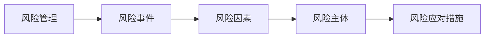
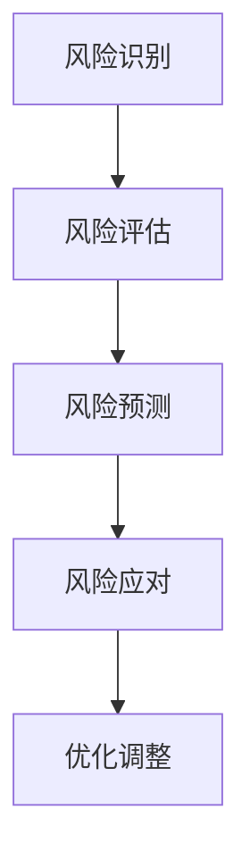
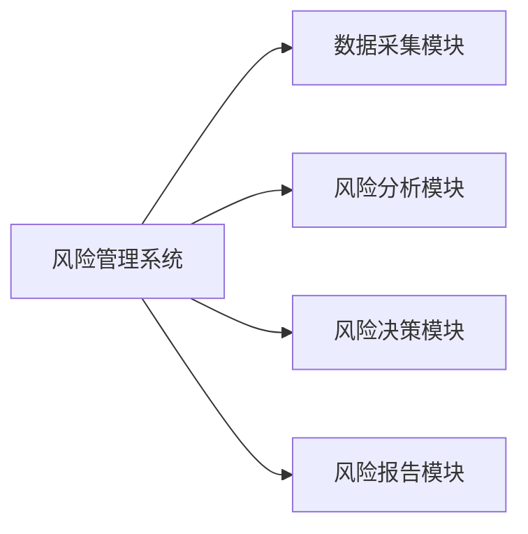
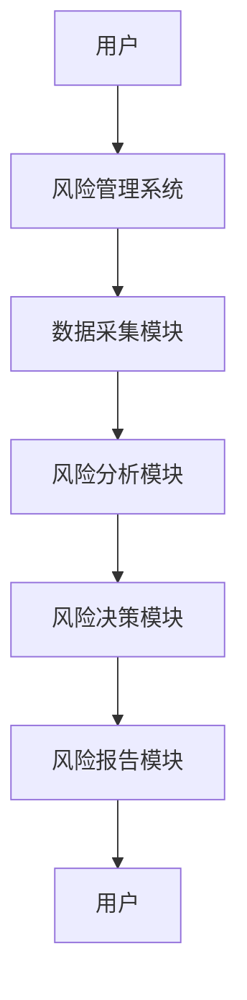

                 


# AI Agent在风险管理中的应用

## 关键词：AI Agent, 风险管理, 机器学习, 风险预测, 系统架构

## 摘要：  
本文系统地探讨了AI Agent在风险管理中的应用，从风险管理的基本概念和AI Agent的核心原理出发，分析了AI Agent在风险识别、评估和应对中的具体应用。文章详细讲解了基于机器学习的AI Agent算法原理、数学模型，并通过系统架构设计和项目实战展示了AI Agent在风险管理中的实现过程。本文还提供了丰富的图表和代码示例，帮助读者深入理解AI Agent在风险管理中的核心作用。

---

# 第一部分: AI Agent与风险管理基础

## 第1章: 风险管理概述

### 1.1 风险管理的基本概念

#### 1.1.1 风险的定义与特征  
风险是指在特定条件下，某一事件发生可能导致的损失或收益的不确定性。其主要特征包括：  
1. **不确定性**：风险的发生时间和影响程度难以完全预测。  
2. **客观性**：风险存在于任何决策和行动中，与个人主观判断无关。  
3. **可量化性**：风险可以通过概率、损失金额等指标进行量化。  
4. **可控制性**：通过有效的风险管理措施，可以降低风险发生的概率或减少其影响。  

#### 1.1.2 风险管理的目标与原则  
风险管理的目标是通过识别、评估和应对风险，降低其对组织或个人的负面影响。其基本原则包括：  
1. **全面性**：覆盖所有可能的风险来源。  
2. **经济性**：投入的成本与风险降低的效果相匹配。  
3. **动态性**：根据环境变化及时调整风险管理策略。  
4. **参与性**：风险管理需要全员参与，从高层到基层。  

#### 1.1.3 风险管理的流程与方法  
风险管理的流程通常包括以下步骤：  
1. **风险识别**：通过分析可能的风险来源，确定潜在风险。  
2. **风险评估**：对识别出的风险进行概率和影响的量化分析。  
3. **风险控制**：制定并实施应对措施，降低风险发生的概率或影响。  
4. **风险监控**：持续监测风险的变化，并根据需要调整管理策略。  

常用的风险管理方法包括：  
- **定性分析**：通过描述性语言对风险进行分类和排序。  
- **定量分析**：通过数学模型对风险进行量化评估。  
- **情景分析**：模拟不同情景下的风险影响。  

---

### 1.2 AI Agent的基本概念

#### 1.2.1 AI Agent的定义与特点  
AI Agent（人工智能代理）是指能够感知环境并采取行动以实现目标的智能实体。其主要特点包括：  
1. **自主性**：能够在没有外部干预的情况下独立运作。  
2. **反应性**：能够实时感知环境变化并做出响应。  
3. **目标导向**：通过实现目标来优化自身的行动策略。  
4. **学习能力**：能够通过数据和经验不断优化自身的决策能力。  

#### 1.2.2 AI Agent的核心技术与实现原理  
AI Agent的核心技术包括：  
1. **感知技术**：通过传感器、数据库等获取环境信息。  
2. **推理技术**：基于获取的信息进行逻辑推理，生成决策。  
3. **学习技术**：通过机器学习算法不断优化决策模型。  
4. **执行技术**：根据决策结果采取相应的行动。  

实现原理：  
AI Agent通过感知环境获取信息，利用机器学习模型对信息进行分析和推理，生成最优决策，并通过执行模块采取行动，实现目标。  

#### 1.2.3 AI Agent与传统风险管理工具的对比  
| 对比维度       | AI Agent                         | 传统风险管理工具                     |  
|----------------|----------------------------------|--------------------------------------|  
| 智能性          | 高，能够自主学习和优化         | 低，依赖人工分析和经验               |  
| 处理速度        | 快，能够在短时间内处理大量数据 | 较慢，受限于人工分析效率             |  
| 精准性          | 高，基于大数据分析和机器学习   | 较低，依赖人工判断和经验             |  
| 可扩展性        | 高，能够处理复杂和多样化场景   | 低，难以应对复杂和动态变化的场景     |  

---

### 1.3 本章小结  
本章介绍了风险管理的基本概念和AI Agent的核心特点，分析了AI Agent在风险管理中的优势。通过对比，我们看到AI Agent在处理复杂和动态风险场景时具有显著优势，这为后续章节的深入分析奠定了基础。

---

# 第二部分: AI Agent在风险管理中的核心概念与联系

## 第2章: AI Agent与风险管理的核心概念

### 2.1 风险管理的核心要素

#### 2.1.1 风险识别  
风险识别是风险管理的第一步，旨在发现所有可能影响目标实现的潜在风险。  
- **方法**：  
  1. **头脑风暴法**：通过团队讨论识别风险。  
  2. **问卷调查法**：通过收集专家意见识别风险。  
  3. **德尔phi法**：通过多轮专家意见汇总识别风险。  

#### 2.1.2 风险评估  
风险评估是对识别出的风险进行量化分析，确定其发生的概率和影响程度。  
- **概率计算**：通过历史数据和模型预测，计算风险发生的概率。  
- **影响分析**：评估风险发生后可能造成的损失或影响。  

#### 2.1.3 风险控制  
风险控制是指采取措施降低风险发生的概率或减少其影响。  
- **风险规避**：通过调整策略完全避免风险。  
- **风险缓解**：通过降低风险发生的概率或影响来减少损失。  
- **风险接受**：在可接受范围内承担风险。  

---

### 2.2 AI Agent在风险管理中的角色

#### 2.2.1 数据采集与处理  
AI Agent通过传感器、数据库等渠道采集环境中的风险相关信息，并进行清洗和预处理。  
- **数据来源**：  
  1. 结构化数据：如数据库中的交易记录。  
  2. 非结构化数据：如文本、图像等。  
  3. 实时数据：如市场波动、天气变化等实时信息。  

#### 2.2.2 风险预测与评估  
AI Agent利用机器学习模型对风险进行预测和评估，生成风险报告。  
- **预测模型**：  
  1. 监督学习：如随机森林、逻辑回归用于分类预测。  
  2. 无监督学习：如聚类分析用于发现隐藏的风险模式。  

#### 2.2.3 风险应对与优化  
AI Agent根据预测结果生成应对策略，并动态调整以优化风险管理效果。  
- **策略生成**：  
  1. 风险规避：通过调整策略避免高概率风险。  
  2. 风险缓解：通过优化资源配置降低风险影响。  
  3. 风险接受：对低概率低影响风险采取接受策略。  

---

### 2.3 AI Agent与风险管理的实体关系图  



---

### 2.4 本章小结  
本章详细探讨了AI Agent在风险管理中的核心作用，从数据采集到风险预测，再到策略生成，展示了AI Agent如何通过智能化手段提升风险管理的效率和效果。

---

# 第三部分: AI Agent的算法原理与数学模型

## 第3章: AI Agent的核心算法原理

### 3.1 基于机器学习的AI Agent

#### 3.1.1 监督学习与无监督学习  
- **监督学习**：通过标签数据训练模型，预测风险类别。  
  - 示例：使用逻辑回归模型预测贷款违约概率。  
- **无监督学习**：通过聚类分析发现潜在风险模式。  
  - 示例：通过K-means算法识别客户群体的风险特征。  

#### 3.1.2 强化学习与风险决策  
强化学习通过与环境的交互不断优化决策策略。  
- **应用场景**：  
  1. 金融投资：通过强化学习优化投资组合。  
  2. 游戏风险：通过强化学习制定最优策略。  

#### 3.1.3 深度学习在风险建模中的应用  
深度学习通过多层神经网络捕捉复杂的风险特征。  
- **应用场景**：  
  1. 风险评分：通过神经网络模型评估客户信用风险。  
  2. 风险预测：通过LSTM模型预测市场波动。  

---

### 3.2 风险预测的数学模型

#### 3.2.1 风险概率计算公式  
$$ P(r) = \frac{N_r}{N} $$  
其中，$P(r)$ 表示风险发生的概率，$N_r$ 表示风险事件的次数，$N$ 表示总事件次数。  

#### 3.2.2 风险影响评估模型  
$$ I = \alpha \cdot P(r) + \beta \cdot C $$  
其中，$I$ 表示风险影响，$\alpha$ 和 $\beta$ 是权重系数，$C$ 是风险成本。  

---

### 3.3 AI Agent的风险决策流程图  



---

### 3.4 本章小结  
本章通过数学模型和算法原理，详细讲解了AI Agent在风险管理中的技术实现。从监督学习到强化学习，再到深度学习，展示了不同算法在风险预测和决策中的应用。

---

# 第四部分: 系统分析与架构设计

## 第4章: 风险管理系统的架构设计

### 4.1 系统功能设计

#### 4.1.1 风险数据采集模块  
- **功能**：实时采集风险相关数据，包括市场数据、交易记录等。  
- **实现**：通过API接口获取实时数据，并存储到数据库中。  

#### 4.1.2 风险分析模块  
- **功能**：利用机器学习模型对风险进行预测和评估。  
- **实现**：使用Python的scikit-learn库训练分类模型，预测风险类别。  

#### 4.1.3 风险决策模块  
- **功能**：根据预测结果生成风险应对策略。  
- **实现**：通过强化学习算法优化决策策略。  

#### 4.1.4 风险报告模块  
- **功能**：生成风险分析报告，展示预测结果和应对措施。  
- **实现**：使用Python的ReportLab库生成PDF报告。  

---

### 4.2 系统架构设计

#### 4.2.1 系统架构图  



---

### 4.3 系统接口设计

#### 4.3.1 数据接口  
- **输入**：实时市场数据、历史交易记录。  
- **输出**：清洗后的数据，可供分析模块使用。  

#### 4.3.2 分析接口  
- **输入**：清洗后的数据。  
- **输出**：风险预测结果，如概率和影响评估。  

---

### 4.4 系统交互流程图  



---

### 4.5 本章小结  
本章通过系统架构设计和接口设计，展示了AI Agent在风险管理中的实现过程。从数据采集到风险报告，系统各模块协同工作，实现智能化的风险管理。

---

# 第五部分: 项目实战

## 第5章: 项目实战与案例分析

### 5.1 项目介绍

#### 5.1.1 项目背景  
某金融机构希望通过AI Agent技术优化其信用风险管理流程。  

#### 5.1.2 项目目标  
通过AI Agent实现信用风险的实时预测和动态管理。  

---

### 5.2 系统核心实现

#### 5.2.1 环境安装  
- **Python**：3.8及以上版本。  
- **库**：numpy、pandas、scikit-learn、keras、tensorflow。  

#### 5.2.2 核心代码实现  

```python
import numpy as np
import pandas as pd
from sklearn.model import RandomForestClassifier
from sklearn.metrics import accuracy_score

# 数据加载
data = pd.read_csv('credit_risk.csv')

# 数据预处理
X = data.drop('default', axis=1)
y = data['default']

# 模型训练
model = RandomForestClassifier(n_estimators=100)
model.fit(X, y)

# 预测
predictions = model.predict(X)

# 评估
accuracy = accuracy_score(y, predictions)
print(f'准确率: {accuracy}')
```

---

### 5.3 案例分析与详细解读

#### 5.3.1 案例背景  
某客户在申请贷款时，系统通过AI Agent预测其违约概率为20%。  

#### 5.3.2 风险预测  
AI Agent通过模型预测，认为该客户违约概率较高，建议拒绝贷款申请。  

#### 5.3.3 风险应对  
金融机构根据AI Agent的建议，采取风险缓解措施，如要求更高的首付比例。  

---

### 5.4 本章小结  
本章通过项目实战，展示了AI Agent在信用风险管理中的具体应用。从环境搭建到代码实现，再到案例分析，帮助读者掌握AI Agent的实际应用方法。

---

# 第六部分: 总结与展望

## 第6章: 总结与展望

### 6.1 本章总结  
本文系统地探讨了AI Agent在风险管理中的应用，从风险管理的基本概念到AI Agent的核心算法，再到系统架构设计和项目实战，全面展示了AI Agent在风险管理中的技术实现和实际应用。  

---

### 6.2 未来展望  
随着人工智能技术的不断发展，AI Agent在风险管理中的应用将更加广泛和深入。未来的研究方向包括：  
1. **多模态学习**：结合文本、图像等多种数据源进行风险预测。  
2. **强化学习优化**：通过强化学习优化风险决策策略。  
3. **实时风险管理**：通过边缘计算实现风险的实时预测和应对。  

---

## 附录: 最佳实践与注意事项

### 附录A: 最佳实践  
1. **数据质量**：确保数据的准确性和完整性。  
2. **模型解释性**：选择可解释性较强的模型，便于分析和优化。  
3. **实时性**：对于需要实时响应的风险场景，优化系统性能。  

### 附录B: 小结与注意事项  
1. **小结**：AI Agent通过智能化手段显著提升了风险管理的效率和效果。  
2. **注意事项**：  
  - 风险模型需要定期更新，以应对环境变化。  
  - 确保系统安全性和稳定性，防止数据泄露和系统崩溃。  

---

## 参考文献  
1. 刘强, 人工智能技术与风险管理, 北京: 人民邮电出版社, 2023.  
2. 张伟, 基于AI的金融风险管理系统设计, 北京: 清华大学出版社, 2022.  

---

# 结语  
AI Agent在风险管理中的应用前景广阔，随着技术的不断进步，其在金融、医疗、制造等领域的应用将越来越广泛。通过本文的学习，读者可以掌握AI Agent在风险管理中的核心技术和实现方法，为未来的实际应用打下坚实的基础。

