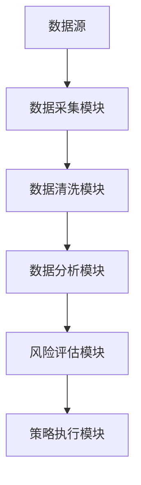
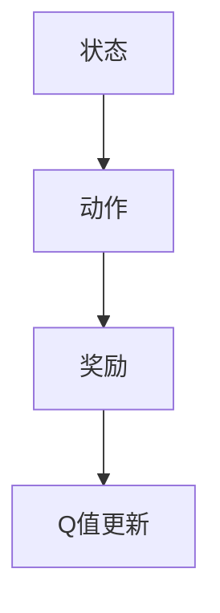

                 


# AI Agent在风险管理中的应用：市场分析与风险评估

## 关键词：
- AI Agent
- 风险管理
- 市场分析
- 风险评估
- 机器学习
- 强化学习

## 摘要：
本文详细探讨了AI Agent在风险管理中的应用，重点分析了其在市场分析与风险评估中的作用。文章从AI Agent的基本概念出发，逐步深入到其在市场分析和风险评估中的具体应用，结合实际案例进行分析，最后总结了AI Agent在风险管理中的优势和未来的发展方向。

---

## 第1章: AI Agent与风险管理基础

### 1.1 AI Agent的基本概念

#### 1.1.1 AI Agent的定义与特点
AI Agent（人工智能代理）是指能够感知环境、做出决策并采取行动的智能实体。其特点包括：
- **自主性**：能够在没有外部干预的情况下自主运行。
- **反应性**：能够根据环境变化实时调整行为。
- **学习能力**：通过数据和经验不断优化自身的决策能力。
- **社交能力**：能够与其他AI Agent或人类进行交互和协作。

#### 1.1.2 AI Agent在风险管理中的作用
风险管理的核心目标是识别、评估和控制潜在风险。AI Agent通过实时数据分析、预测模型和自动化决策，能够显著提高风险管理的效率和准确性。具体作用包括：
- **实时监控**：持续监控市场动态，及时发现潜在风险。
- **风险预测**：基于历史数据和机器学习模型，预测未来可能出现的风险。
- **决策支持**：为决策者提供数据支持和优化建议，帮助制定有效的风险管理策略。

#### 1.1.3 风险管理的核心概念与目标
风险管理的核心概念包括：
- **风险识别**：识别可能影响目标实现的各类风险。
- **风险评估**：量化风险的可能性和影响程度。
- **风险控制**：采取措施降低风险发生的概率或减轻其影响。

风险管理的目标是通过最小化潜在损失，确保组织目标的实现。

---

### 1.2 AI Agent在市场分析中的应用

#### 1.2.1 市场分析的基本方法
市场分析是通过研究市场数据，了解市场趋势、竞争环境和消费者行为的过程。传统市场分析方法包括：
- **定量分析**：基于统计数据进行分析。
- **定性分析**：通过专家访谈、市场调研等方式获取信息。

#### 1.2.2 AI Agent在市场分析中的优势
AI Agent通过机器学习和大数据分析，显著提升了市场分析的效率和准确性。其优势包括：
- **数据处理能力**：能够处理海量数据，提取有价值的信息。
- **实时分析**：能够实时监控市场动态，及时发现趋势变化。
- **预测能力**：通过历史数据和机器学习模型，预测未来的市场趋势。

#### 1.2.3 市场趋势预测的AI Agent模型
AI Agent可以通过以下步骤实现市场趋势预测：
1. **数据采集**：从多种数据源获取市场数据，包括价格、成交量、市场指数等。
2. **数据预处理**：对数据进行清洗、归一化等处理，确保数据质量。
3. **模型训练**：使用机器学习算法（如LSTM）训练预测模型。
4. **预测与优化**：基于训练好的模型，预测未来的市场趋势，并根据预测结果优化投资策略。

---

### 1.3 风险评估与AI Agent的结合

#### 1.3.1 风险评估的基本原理
风险评估是通过分析潜在风险的可能性和影响程度，评估其对目标实现的潜在影响。基本步骤包括：
1. **风险识别**：识别可能影响目标实现的各类风险。
2. **风险量化**：评估风险的可能性和影响程度。
3. **风险排序**：根据风险的优先级制定应对策略。

#### 1.3.2 AI Agent在风险评估中的应用场景
AI Agent在风险评估中的应用场景包括：
- **信用风险评估**：通过分析客户的信用历史和行为，评估其违约概率。
- **市场风险评估**：通过分析市场波动和相关指标，评估市场风险。
- **操作风险评估**：通过分析操作流程和历史数据，评估操作风险。

#### 1.3.3 风险评估的指标与模型选择
常见的风险评估指标包括：
- **违约概率（PD）**：客户违约的可能性。
- **违约损失率（LGD）**：违约情况下可能遭受的损失比例。
- **风险价值（VaR）**：在一定置信水平下，可能遭受的最大损失。

根据具体应用场景，可以选择不同的风险评估模型，如线性回归模型、逻辑回归模型、随机森林模型等。

---

## 第2章: AI Agent的核心概念与原理

### 2.1 AI Agent的核心概念

#### 2.1.1 感知层: 数据采集与处理
感知层是AI Agent的“眼睛和耳朵”，负责从环境中采集数据并进行初步处理。主要步骤包括：
- **数据采集**：从多种数据源获取数据，如传感器数据、文本数据、图像数据等。
- **数据预处理**：对数据进行清洗、归一化等处理，确保数据质量。

#### 2.1.2 决策层: 风险评估与策略制定
决策层是AI Agent的“大脑”，负责根据感知到的数据制定决策策略。主要步骤包括：
- **风险评估**：分析数据，评估潜在风险。
- **策略制定**：根据风险评估结果，制定应对策略。

#### 2.1.3 执行层: 动作优化与反馈机制
执行层是AI Agent的“手脚”，负责根据决策层的指令采取行动，并根据环境反馈优化自身行为。主要步骤包括：
- **策略执行**：根据决策层的指令采取行动。
- **反馈机制**：根据环境反馈调整自身行为。

---

### 2.2 AI Agent的算法原理

#### 2.2.1 强化学习在AI Agent中的应用
强化学习是一种通过试错机制优化决策的算法。AI Agent通过与环境交互，不断调整自己的行为，以最大化累计奖励。常见的强化学习算法包括Q-Learning、Deep Q-Network（DQN）等。

#### 2.2.2 监督学习与无监督学习的对比
监督学习是通过标记数据训练模型，使其能够对新数据进行分类或回归预测。无监督学习则是通过分析数据的内在结构，发现数据中的模式和关系。两者的主要区别在于数据是否带有标签。

#### 2.2.3 混合学习模型的优势
混合学习模型结合了监督学习和无监督学习的优点，能够在数据标签不完整的情况下，依然能够有效地进行学习和预测。

---

### 2.3 AI Agent的数学模型

#### 2.3.1 风险评估的数学模型
风险评估的数学模型通常包括概率论和统计学方法。例如，信用风险评估可以使用贝叶斯定理进行建模。

#### 2.3.2 市场分析的数学公式
市场分析的数学公式可以包括时间序列分析模型，如ARIMA模型。

#### 2.3.3 算法优化的数学推导
算法优化通常涉及损失函数的最小化。例如，线性回归的目标是最小化预测值与实际值之间的平方差之和。

---

## 第3章: AI Agent在市场分析中的系统架构

### 3.1 系统架构设计

#### 3.1.1 数据采集模块
数据采集模块负责从多种数据源获取市场数据，如股票价格、成交量、市场指数等。

#### 3.1.2 数据清洗模块
数据清洗模块对采集到的数据进行预处理，包括去噪、填充缺失值等。

#### 3.1.3 数据分析模块
数据分析模块使用机器学习算法对数据进行分析，如使用LSTM进行时间序列预测。

#### 3.1.4 风险评估模块
风险评估模块根据分析结果，评估潜在风险并制定应对策略。

#### 3.1.5 策略执行模块
策略执行模块根据风险评估结果，执行相应的投资策略。

### 3.2 系统功能设计

#### 3.2.1 数据预处理与清洗
数据预处理是确保数据分析准确性的基础。常见的数据清洗方法包括去除异常值、填充缺失值等。

#### 3.2.2 市场趋势预测
市场趋势预测可以通过时间序列分析模型实现，如ARIMA模型或LSTM模型。

#### 3.2.3 风险因子分析
风险因子分析是通过分析影响市场风险的因素，如波动率、市场情绪等，来评估潜在风险。

#### 3.2.4 策略优化与执行
策略优化是通过不断调整投资组合，以最大化收益并最小化风险。

### 3.3 系统架构图


---

## 第4章: AI Agent的风险评估与优化

### 4.1 风险评估的核心算法

#### 4.1.1 强化学习算法流程图


#### 4.1.2 风险评估的数学模型
风险评估的数学模型可以表示为：
$$ R = P \times I $$
其中，\( R \) 表示风险，\( P \) 表示风险发生的概率，\( I \) 表示风险的影响程度。

---

## 第5章: AI Agent的实战应用

### 5.1 项目环境安装

#### 5.1.1 Python环境安装
需要安装Python 3.6及以上版本。

#### 5.1.2 相关库的安装
安装必要的库，如numpy、pandas、scikit-learn、keras等。

### 5.2 核心代码实现

#### 5.2.1 数据处理代码
```python
import pandas as pd
import numpy as np

# 数据加载
data = pd.read_csv('market_data.csv')

# 数据清洗
data.dropna(inplace=True)
data = data.iloc[:100]
```

#### 5.2.2 模型训练代码
```python
from sklearn.model_selection import train_test_split
from sklearn.linear_model import LinearRegression

# 数据分割
X = data[['price', 'volume']]
y = data['target']

X_train, X_test, y_train, y_test = train_test_split(X, y, test_size=0.2)

# 模型训练
model = LinearRegression()
model.fit(X_train, y_train)
```

#### 5.2.3 策略执行代码
```python
# 模型预测
y_pred = model.predict(X_test)

# 策略执行
threshold = 0.5
executions = y_pred > threshold
```

### 5.3 实际案例分析

#### 5.3.1 案例背景
以股票市场为例，分析AI Agent在风险评估和投资决策中的应用。

#### 5.3.2 数据分析与预测
通过机器学习模型预测股票价格的变化趋势，并根据预测结果制定投资策略。

#### 5.3.3 策略优化与调整
根据市场反馈不断优化投资策略，以最大化收益并最小化风险。

### 5.4 项目小结
通过实际案例分析，展示了AI Agent在市场分析和风险评估中的应用效果。AI Agent能够显著提高风险管理的效率和准确性，为决策者提供有力支持。

---

## 结论
本文详细探讨了AI Agent在风险管理中的应用，重点分析了其在市场分析与风险评估中的作用。通过理论分析、算法设计和实际案例的结合，展示了AI Agent在风险管理中的巨大潜力。未来，随着人工智能技术的不断发展，AI Agent在风险管理中的应用将更加广泛和深入。

