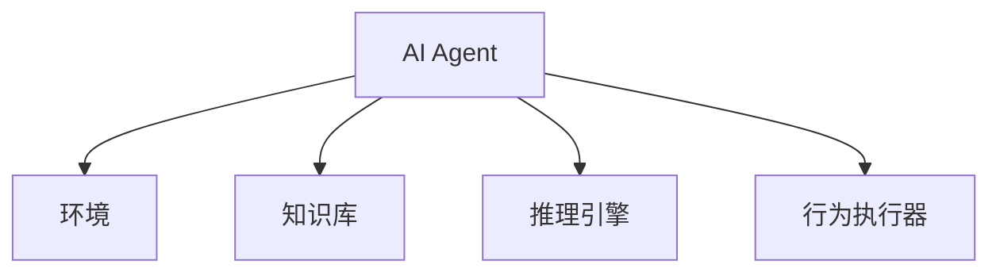
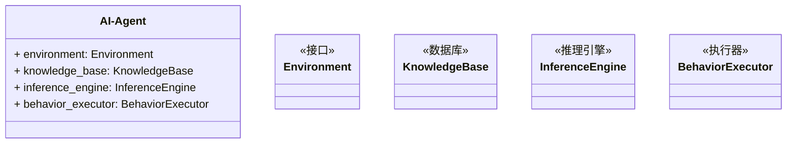
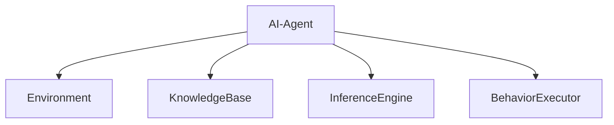
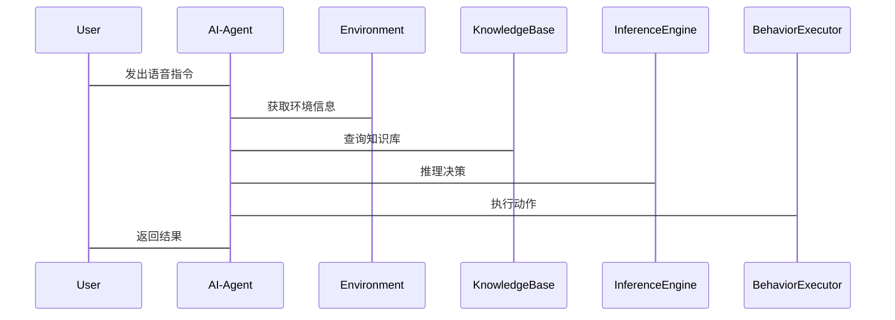

                 


# AI Agent基础概念介绍

## 关键词：AI Agent、人工智能、多智能体系统、逻辑推理、决策算法、系统架构

## 摘要：  
AI Agent（人工智能代理）是一种能够感知环境、自主决策并执行任务的智能实体。本文从AI Agent的基本概念出发，逐步分析其核心原理、算法实现、系统架构及应用场景，帮助读者全面理解AI Agent的理论与实践。

---

## 第1章: AI Agent的基本概念与背景

### 1.1 AI Agent的定义与核心特征
AI Agent（人工智能代理）是指在计算机系统中，能够感知环境、自主决策并执行任务的智能实体。它通过与环境交互，利用内部知识和算法来实现特定目标。AI Agent的核心特征包括：
1. **自主性**：能够在无外部干预的情况下运行。
2. **反应性**：能够实时感知环境并做出反应。
3. **目标导向**：通过实现目标来驱动行为。
4. **学习能力**：能够通过经验改进性能。

### 1.2 AI Agent的发展背景
人工智能技术的快速发展推动了AI Agent的兴起。随着多智能体系统（Multi-Agent System, MAS）的研究深入，AI Agent逐渐成为实现复杂任务的核心技术。当前，AI Agent广泛应用于自动驾驶、智能助手、机器人控制等领域。

### 1.3 AI Agent的分类与应用场景
AI Agent可以根据智能水平分为：
1. **反应式AI Agent**：基于当前感知做出即时反应，适用于实时任务。
2. **认知式AI Agent**：具备复杂推理和规划能力，适用于复杂任务。

典型应用场景包括：
- 自动驾驶：通过感知环境实时调整行驶策略。
- 智能助手（如Siri、Alexa）：通过语音交互提供服务。
- 机器人控制：在工业和家庭场景中执行复杂任务。

---

## 第2章: AI Agent的核心概念与联系

### 2.1 AI Agent的核心原理
AI Agent的工作原理主要包括以下步骤：
1. **环境感知**：通过传感器或接口获取环境信息。
2. **知识表示**：将感知信息转化为可处理的形式。
3. **推理与决策**：基于知识库和推理引擎生成决策。
4. **行为执行**：通过执行器将决策转化为行动。

#### 2.1.1 知识表示与推理机制
知识表示是AI Agent的核心，常用形式包括：
- **命题逻辑**：通过布尔命题表示知识。
- **描述逻辑**：通过本体论描述概念关系。
- **语义网络**：通过节点和边表示知识。

#### 2.1.2 行为选择与决策模型
决策模型是AI Agent实现目标的关键。常用算法包括：
- **基于规则的决策**：根据预定义规则做出决策。
- **基于概率的决策**：通过概率推理优化决策。
- **基于强化学习的决策**：通过奖励机制优化策略。

#### 2.1.3 环境感知与交互方式
AI Agent通过多种方式与环境交互，包括：
- **被动交互**：等待用户触发。
- **主动交互**：主动探索环境。
- **混合交互**：结合主动与被动方式。

### 2.2 AI Agent的属性特征对比

下表对比了不同类型AI Agent的核心属性特征：

| 特性           | 反应式AI Agent       | 认知式AI Agent       |
|----------------|----------------------|----------------------|
| 智能水平       | 较低                 | 较高                 |
| 知识表示       | 基于当前状态         | 基于知识库           |
| 决策机制       | 基于规则或强化学习   | 基于推理和规划       |
| 应用场景       | 简单实时任务         | 复杂任务             |

#### 2.2.2 实体关系图架构

以下是AI Agent的实体关系图：



---

## 第3章: AI Agent的算法原理与数学模型

### 3.1 AI Agent的核心算法

AI Agent的核心算法包括逻辑推理、决策树和强化学习等。

#### 3.1.1 逻辑推理算法
逻辑推理是AI Agent实现决策的基础。命题逻辑推理的表达式如下：

$$ \text{命题逻辑推理} = \text{前提} \rightarrow \text{结论} $$

例如，若前提是“如果下雨，则打伞”，结论是“打伞”，则推理过程为：

$$ \text{下雨} \rightarrow \text{打伞} $$

#### 3.1.2 决策树算法
决策树是一种常用的分类算法。决策树的构建过程如下：

1. 选择信息增益最大的特征作为根节点。
2. 根据特征值划分数据集。
3. 递归构建子树，直到叶子节点。

信息增益的计算公式为：

$$ \text{信息增益} = \text{熵的减少量} $$

#### 3.1.3 强化学习算法
强化学习通过奖励机制优化决策策略。Q-learning算法的公式为：

$$ Q(s, a) = r + \gamma \max_{a'} Q(s', a') $$

其中，$s$是状态，$a$是动作，$r$是奖励，$\gamma$是折扣因子。

### 3.2 算法实现的Python代码示例

#### 3.2.1 逻辑推理实现

```python
def logical_inference(premise, conclusion):
    # 命题逻辑推理实现
    if premise:
        return conclusion
    else:
        return not conclusion
```

#### 3.2.2 决策树实现

```python
from sklearn.tree import DecisionTreeClassifier

# 决策树构建与分类
model = DecisionTreeClassifier()
model.fit(X_train, y_train)
prediction = model.predict(X_test)
```

#### 3.2.3 强化学习实现

```python
def q_learning(env, num_episodes=1000):
    Q = np.zeros((env.observation_space, env.action_space))
    for episode in range(num_episodes):
        state = env.reset()
        while True:
            action = np.argmax(Q[state])
            next_state, reward, done = env.step(action)
            Q[state][action] += reward
            state = next_state
            if done:
                break
    return Q
```

---

## 第4章: AI Agent的系统分析与架构设计

### 4.1 系统场景介绍
本章通过一个智能助手系统介绍AI Agent的架构设计。该系统需要实现语音识别、自然语言理解、任务执行和反馈交互的功能。

### 4.2 系统功能设计

以下是系统功能模块的类图：



### 4.3 系统架构设计

以下是系统的架构图：



### 4.4 系统接口设计

以下是系统接口的序列图：



---

## 第5章: AI Agent的项目实战

### 5.1 环境安装
安装必要的Python库：

```bash
pip install numpy scikit-learn matplotlib
```

### 5.2 核心代码实现

以下是AI Agent的核心代码实现：

```python
class AI-Agent:
    def __init__(self, environment, knowledge_base):
        self.environment = environment
        self.knowledge_base = knowledge_base

    def perceive(self):
        # 获取环境信息
        return self.environment.get_state()

    def decide(self, state):
        # 基于状态做出决策
        return self.inference_engine.inference(state)

    def act(self, action):
        # 执行动作
        self.behavior_executor.execute(action)
```

### 5.3 实际案例分析

以智能助手为例，实现语音识别和任务执行：

```python
# 语音识别接口
def speech_recognition():
    pass

# 自然语言理解
def nlu_processor(text):
    pass

# 任务执行
def execute_task(task):
    pass
```

### 5.4 项目小结
本章通过实际案例展示了AI Agent的实现过程，包括环境感知、知识推理和行为执行等关键步骤。

---

## 第6章: 最佳实践与拓展阅读

### 6.1 最佳实践
- **模块化设计**：将AI Agent划分为独立模块，便于维护和扩展。
- **数据质量管理**：确保知识库的数据准确性和完整性。
- **异常处理**：设计完善的异常处理机制，确保系统的鲁棒性。

### 6.2 小结
本文从AI Agent的基本概念出发，逐步分析了其核心原理、算法实现和系统架构，并通过实际案例展示了AI Agent的应用场景和实现过程。

### 6.3 注意事项
- 在实际应用中，需注意数据隐私和安全问题。
- 确保系统的可解释性，便于调试和优化。

### 6.4 拓展阅读
建议深入学习强化学习、多智能体协作和边缘计算等技术，以进一步提升AI Agent的性能和应用范围。

---

## 附录

### 附录A: 术语表
- AI Agent：人工智能代理
- MAS：多智能体系统
- Q-learning：Q学习算法

### 附录B: 工具推荐
- Python：编程语言
- Scikit-learn：机器学习库
- Mermaid：图表工具

### 附录C: 参考文献
- Russell, S., & Norvig, P. (2010). * Artificial Intelligence: A Modern Approach.
- Luger, G. F. (2009). * Computational Logic and Artificial Intelligence.

---

**总结**：本文通过逐步分析，深入浅出地介绍了AI Agent的基础概念、算法原理和系统架构，并通过实际案例展示了其应用场景。希望读者能够通过本文，全面理解AI Agent的核心思想和实现方法。

