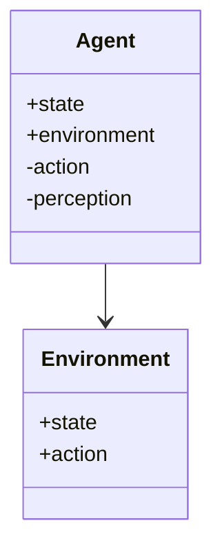
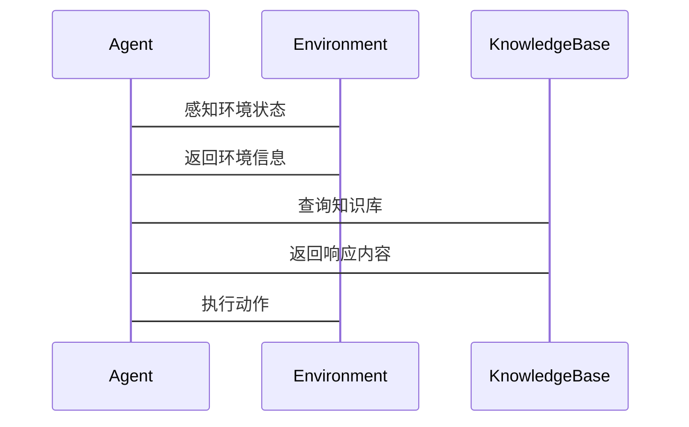
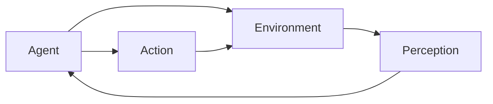

                 


# AI Agent基础：企业应用中的核心概念与重要性

> 关键词：AI Agent，企业应用，核心概念，算法原理，系统架构

> 摘要：本文将从AI Agent的基本概念出发，逐步深入探讨其核心概念、算法原理、系统架构设计以及实际应用案例，帮助读者全面理解AI Agent在企业应用中的重要性。

---

## 第四章: AI Agent的系统分析与架构设计

### 4.1 系统分析
#### 4.1.1 问题场景介绍
在企业应用中，AI Agent通常用于自动化任务执行、智能决策支持和复杂问题求解。例如，在供应链管理中，AI Agent可以实时监控库存变化，自动触发补货请求。通过实际案例，我们可以更好地理解AI Agent的核心价值和应用场景。

#### 4.1.2 项目介绍与目标
以一个简单的AI Agent项目为例，项目目标是开发一个能够自动处理客户查询的智能客服系统。通过这个案例，我们可以逐步分析系统的设计过程，包括需求分析、功能设计和系统架构的选择。

### 4.2 系统功能设计
#### 4.2.1 领域模型设计
在设计AI Agent系统时，首先需要建立领域模型。领域模型描述了系统中的核心实体及其关系。例如，在智能客服系统中，主要实体包括客户、查询、响应和知识库。



通过类图，我们可以清晰地看到AI Agent与其环境之间的交互关系。每个实体的属性和方法都需要详细设计，以确保系统功能的完整性和可扩展性。

#### 4.2.2 交互流程设计
AI Agent的交互流程通常包括感知环境、分析问题、决策和执行动作。在智能客服系统中，AI Agent会感知到客户的查询请求，分析请求内容，生成相应的响应，并通过知识库进行验证和优化。



通过序列图，我们可以清晰地看到AI Agent与环境之间的交互流程。这有助于我们更好地理解系统的设计和实现细节。

### 4.3 系统架构设计
#### 4.3.1 系统架构图
AI Agent的系统架构通常包括感知层、决策层和执行层。感知层负责获取环境信息，决策层负责分析和决策，执行层负责执行动作并反馈结果。



通过架构图，我们可以清晰地看到AI Agent系统的整体结构。每个层的功能和交互关系都需要详细设计，以确保系统的高效运行。

---

## 第五章: AI Agent的项目实战

### 5.1 项目实战：环境安装与配置
在开始开发AI Agent系统之前，我们需要先安装必要的开发环境和工具。以下是一个简单的Python开发环境配置示例：

```bash
# 安装Python和相关库
python -m pip install --upgrade pip
pip install numpy
pip install scikit-learn
pip install matplotlib
pip install pymermaid
```

### 5.2 核心代码实现
以下是一个简单的基于规则的AI Agent实现示例：

```python
class AI-Agent:
    def __init__(self):
        self.rules = {}  # 存储规则
    
    def add_rule(self, condition, action):
        self.rules[condition] = action
    
    def perceive(self, environment):
        # 获取环境信息
        return environment.get_state()
    
    def decide(self, state):
        # 根据状态选择动作
        for condition, action in self.rules.items():
            if condition(state):
                return action
        return None
    
    def execute(self, action):
        # 执行动作
        return action()

    def learn(self, state, action, reward):
        # 学习算法，可选
        pass
```

### 5.3 代码应用解读与分析
在上述代码中，AI Agent类包含感知环境、决策和执行动作的方法。通过添加规则，我们可以定义不同的条件和动作。例如，在智能客服系统中，当客户发送一个查询请求时，AI Agent会根据预设的规则生成相应的响应。

### 5.4 实际案例分析
以智能客服系统为例，我们可以详细分析AI Agent的实现过程。首先，AI Agent需要感知客户的查询内容，然后根据预设的规则生成响应，并通过知识库进行验证和优化。

### 5.5 项目小结
通过实际项目的开发，我们可以更好地理解AI Agent的核心概念和实现过程。同时，我们也需要注意代码的可扩展性和维护性，确保系统在实际应用中能够稳定运行。

---

## 第六章: AI Agent的最佳实践

### 6.1 最佳实践：系统设计与实现
在设计AI Agent系统时，我们需要关注以下几个方面：
1. 系统的可扩展性：确保系统能够适应未来的需求变化。
2. 系统的可维护性：方便后续的维护和优化。
3. 系统的安全性：确保数据的安全性和系统的稳定性。

### 6.2 小结
通过本文的详细介绍，我们可以看到AI Agent在企业应用中的重要性。从核心概念到算法原理，再到系统设计和实际应用，AI Agent为企业提供了强大的技术支持。

### 6.3 注意事项
在实际应用中，我们需要注意以下几点：
1. 确保系统的安全性和稳定性。
2. 定期更新和优化系统的规则和模型。
3. 提供良好的用户界面和交互体验。

### 6.4 拓展阅读
对于感兴趣的朋友，可以进一步阅读以下书籍和论文：
- 《AI Agent基础与应用》
- 《基于强化学习的AI Agent设计与实现》
- 《企业级AI Agent系统设计与优化》

---

通过本文的详细讲解，我们希望能够帮助读者全面理解AI Agent的核心概念和重要性，并能够在实际的企业应用中灵活运用这些知识。希望本文的内容能够为您的学习和工作提供有价值的参考！

