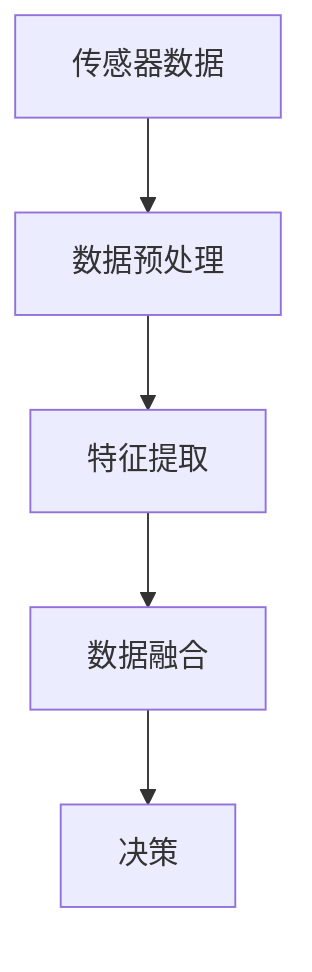
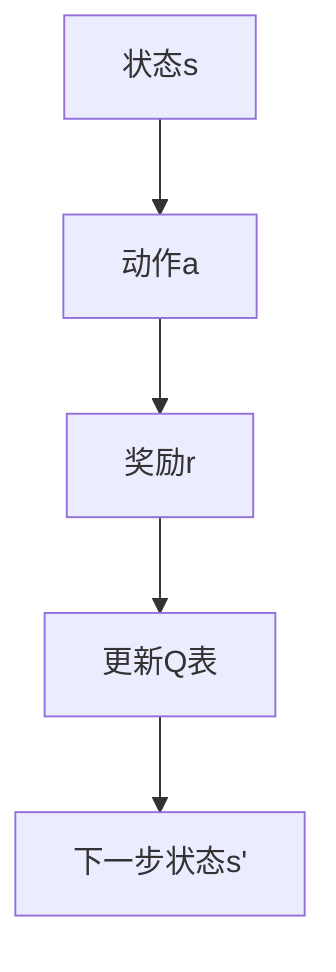
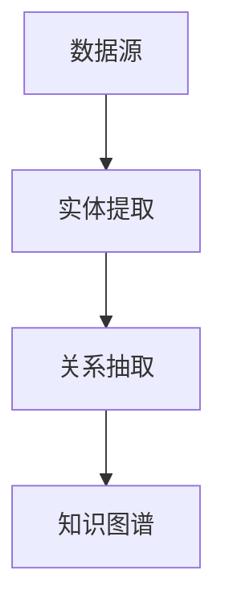
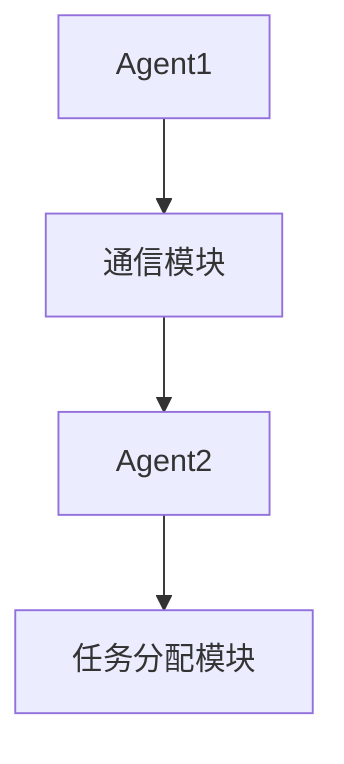
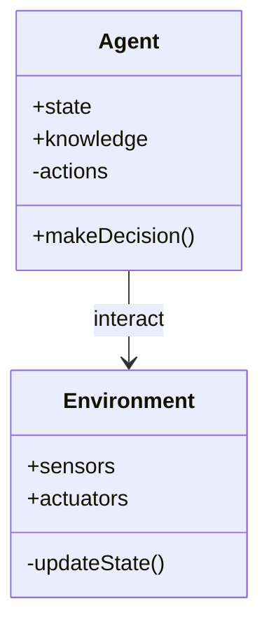

                 


# AI Agent开发中的常见挑战及对策

> 关键词：AI Agent，人工智能，机器学习，自然语言处理，强化学习，系统架构

> 摘要：本文系统地探讨了AI Agent开发中的常见挑战，包括环境感知、决策优化、协作与通信、安全与伦理、系统架构及实现等方面，并提出了相应的解决方案。文章结合理论分析、算法实现和实际案例，深入剖析了AI Agent开发的关键技术与实践策略。

---

## 第1章: AI Agent 概述

### 1.1 AI Agent 的定义与核心概念

AI Agent（人工智能代理）是一种能够感知环境、自主决策、执行任务的智能体。它通过传感器获取信息，利用算法进行推理和规划，并通过执行器与环境交互。AI Agent的核心功能包括感知、推理、决策和执行。

**核心概念对比表**

| 概念 | 描述 |
|------|------|
| 感知 | 通过传感器获取环境数据 | 
| 推理 | 基于知识和逻辑进行推理 | 
| 决策 | 根据推理结果选择最优动作 |
| 执行 | 通过执行器将决策转化为行动 |

**AI Agent 的边界与外延**

AI Agent的外延包括强化学习、自然语言处理、知识图谱等技术，但其核心是通过智能决策实现目标。

### 1.2 AI Agent 的发展历程

AI Agent的发展经历了从简单规则到复杂推理的阶段，逐步引入强化学习和多Agent协作，未来趋势将更加注重实时性和可解释性。

### 1.3 本章小结

本章介绍了AI Agent的核心概念、发展历程和未来趋势，为后续章节奠定了基础。

---

## 第2章: 环境感知与交互

### 2.1 多模态数据的处理与融合

AI Agent需要处理视觉、听觉和语言等多种数据，通过数据融合技术实现对环境的全面感知。

**多模态数据融合流程图**



### 2.2 自然语言理解与生成

基于大模型的NLP技术是AI Agent实现自然语言交互的关键，但需要解决生成内容的可解释性和边界问题。

### 2.3 多模态交互设计

交互界面的设计需要考虑实时反馈机制，确保用户行为的准确预测与引导。

### 2.4 本章小结

环境感知与交互是AI Agent的核心挑战，需要结合多模态数据和自然语言处理技术。

---

## 第3章: 决策与推理

### 3.1 强化学习与决策优化

强化学习是AI Agent决策优化的重要方法，Q-learning算法是典型的实现方式。

**Q-learning算法流程图**



数学公式：

$$ Q(s, a) = Q(s, a) + \alpha (r + \max Q(s', a) - Q(s, a)) $$

### 3.2 知识图谱与推理

知识图谱的构建是基于图的推理算法的基础，医疗诊断是典型应用。

**知识图谱构建流程图**



### 3.3 逻辑推理与不确定性处理

逻辑推理需要考虑不确定性，模糊逻辑和概率推理是常用方法。

### 3.4 本章小结

决策与推理是AI Agent的核心能力，需要结合强化学习和知识图谱技术。

---

## 第4章: 协作与通信

### 4.1 多Agent协作

多Agent协作需要分布式计算和任务分配机制，Docker是常用部署工具。

**多Agent协作架构图**



### 4.2 分布式计算与通信

分布式系统设计需要考虑容错机制和通信效率。

### 4.3 本章小结

协作与通信是AI Agent实现复杂任务的关键，需要分布式架构和高效通信机制。

---

## 第5章: 安全与伦理

### 5.1 隐私保护与数据安全

数据加密和访问控制是隐私保护的重要手段。

### 5.2 对抗攻击与防御

对抗攻击是AI Agent面临的安全威胁，需要构建防护机制。

### 5.3 伦理框架与责任归属

AI Agent的伦理问题需要明确责任归属和行为规范。

### 5.4 本章小结

安全与伦理是AI Agent开发中的重要挑战，需要综合考虑技术与法律因素。

---

## 第6章: 系统架构与实现

### 6.1 模块化设计

模块化设计是系统架构的核心，通过类图展示模块关系。

**系统架构类图**



### 6.2 异构计算与性能优化

异构计算是提升系统性能的关键，需要优化算法和硬件协同。

### 6.3 容错机制

容错机制是系统可靠性的重要保障，需要设计冗余和故障恢复策略。

### 6.4 本章小结

系统架构与实现是AI Agent开发的基础，需要模块化设计和性能优化。

---

## 第7章: 项目实战

### 7.1 环境搭建

安装Python、TensorFlow和相关库，配置开发环境。

### 7.2 核心实现

实现一个简单的AI Agent，包括感知、推理和决策模块。

**Python代码示例**

```python
class AI-Agent:
    def __init__(self):
        self.state = None
        self.knowledge = {}
    
    def perceive(self, environment):
        # 处理环境数据
        pass
    
    def decide(self):
        # 基于知识进行决策
        pass
    
    def execute(self, action):
        # 执行动作
        pass
```

### 7.3 实际案例分析

以医疗诊断为例，分析AI Agent在实际场景中的应用。

### 7.4 项目总结

总结项目经验，提出改进建议。

---

## 总结

AI Agent开发涉及多个技术领域，需要综合运用感知、决策、协作和安全等技术。通过本文章的探讨，读者可以全面了解AI Agent开发中的挑战及应对策略。

---

## 推荐阅读

- 《强化学习入门》
- 《自然语言处理实战》
- 《分布式系统设计》

