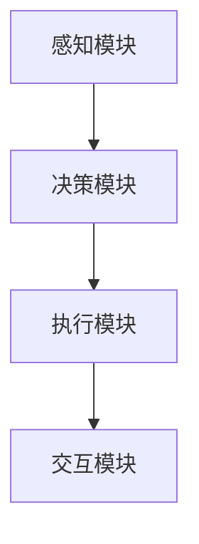
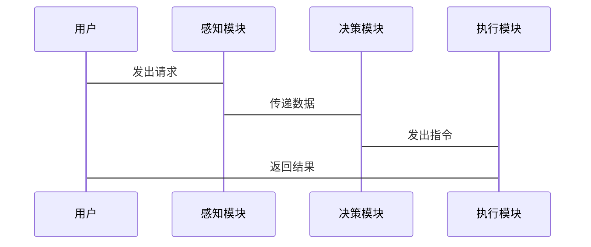

                 


# AI Agent开发实践：关键步骤和最佳实践

> 关键词：AI Agent，机器学习，深度学习，自然语言处理，强化学习，系统架构，最佳实践

> 摘要：本文系统地介绍了AI Agent开发的关键步骤和最佳实践，涵盖从基础概念到复杂系统的实现。通过详细讲解感知、决策、执行模块，强化学习算法，系统架构设计，项目实战和最佳实践，帮助读者全面掌握AI Agent开发的核心技术和实际应用技巧。

---

# 第1章 AI Agent概述

## 1.1 AI Agent的基本概念

### 1.1.1 什么是AI Agent
AI Agent（人工智能代理）是指能够感知环境、自主决策并执行任务的智能实体。它可以是一个软件程序，也可以是一个物理设备，通过传感器和执行器与环境交互。

### 1.1.2 AI Agent的核心特征
- **自主性**：无需外部干预，自主完成任务。
- **反应性**：能够实时感知环境并做出反应。
- **目标导向**：基于目标驱动行为。
- **学习能力**：通过数据和经验不断优化性能。

### 1.1.3 AI Agent的分类与应用场景
- **按智能水平**：简单反应式、基于模型的、具备推理能力。
- **按应用场景**：智能助手、自动驾驶、机器人、推荐系统。

---

## 1.2 AI Agent的发展历程

### 1.2.1 AI Agent的起源
AI Agent的概念起源于20世纪60年代的专家系统研究，早期主要用于解决特定领域的问题。

### 1.2.2 从单智能体到多智能体的演进
- **单智能体**：早期AI Agent主要用于单一任务。
- **多智能体协作**：现代AI Agent强调多智能体协作，提升复杂环境下的任务处理能力。

### 1.2.3 当前AI Agent技术的热点与趋势
- **强化学习**：通过试错优化决策。
- **人机协作**：强调人与AI Agent的协同工作。

---

## 1.3 AI Agent的核心技术栈

### 1.3.1 机器学习与深度学习
- **机器学习**：用于模式识别和数据分类。
- **深度学习**：通过神经网络处理复杂数据。

### 1.3.2 自然语言处理
- **NLP**：处理文本数据，实现语义理解。

### 1.3.3 知识图谱与推理引擎
- **知识图谱**：构建结构化的知识库。
- **推理引擎**：基于知识库进行推理。

---

# 第2章 AI Agent开发的核心概念

## 2.1 AI Agent的感知模块

### 2.1.1 感知模块的功能与作用
- **功能**：收集环境数据，如视觉、听觉信息。
- **作用**：为决策提供依据。

### 2.1.2 常见的感知技术
- **自然语言处理**：文本理解。
- **计算机视觉**：图像识别。

---

## 2.2 AI Agent的决策模块

### 2.2.1 决策算法概述
- **基于规则**：简单任务的决策。
- **基于模型**：复杂任务的建模决策。

### 2.2.2 基于强化学习的决策机制
- **强化学习**：通过试错优化决策。

### 2.2.3 基于规则的决策系统
- **规则引擎**：通过预定义规则进行决策。

---

## 2.3 AI Agent的执行模块

### 2.3.1 执行器的类型与特点
- **软件执行器**：处理数据。
- **硬件执行器**：物理设备执行操作。

### 2.3.2 执行模块与决策模块的协同工作
- **协同机制**：决策模块指导执行模块行动。

---

## 2.4 AI Agent的交互设计

### 2.4.1 人机交互的核心原则
- **简洁性**：用户友好。
- **一致性**：交互方式统一。

### 2.4.2 多轮对话的实现与优化
- **对话管理**：跟踪对话上下文。

---

## 2.5 本章小结

---

# 第3章 AI Agent开发的关键算法

## 3.1 强化学习算法

### 3.1.1 Q-Learning算法
- **公式**：$$ Q(s, a) = r + \gamma \max_{a'} Q(s', a') $$
- **流程**：通过试错更新Q值。

### 3.1.2 Deep Q-Network (DQN)算法
- **结构**：使用神经网络近似Q值函数。

### 3.1.3 多智能体协作的算法
- **Multi-Agent DQN**：多个智能体协作决策。

---

## 3.2 监督学习与无监督学习在AI Agent中的应用

### 3.2.1 监督学习在任务执行中的作用
- **分类任务**：通过标签数据分类。

### 3.2.2 无监督学习在知识发现中的应用
- **聚类分析**：发现数据中的潜在结构。

---

## 3.3 算法的数学模型与公式

### 3.3.1 Q-Learning的数学公式
$$ Q(s, a) = r + \gamma \max_{a'} Q(s', a') $$

### 3.3.2 Deep Q-Network的网络结构
- **输入层**：状态。
- **隐藏层**：处理特征。
- **输出层**：动作值。

---

## 3.4 本章小结

---

# 第4章 AI Agent的系统架构设计

## 4.1 系统架构概述

### 4.1.1 系统架构图


### 4.1.2 系统功能设计
- **感知模块**：收集数据。
- **决策模块**：处理数据。
- **执行模块**：执行任务。
- **交互模块**：用户交互。

---

## 4.2 系统架构设计

### 4.2.1 系统架构设计图


---

## 4.3 系统接口设计

### 4.3.1 接口设计
- **输入接口**：感知数据。
- **输出接口**：执行指令。

---

## 4.4 系统交互流程

### 4.4.1 交互流程图


---

## 4.5 本章小结

---

# 第5章 项目实战：AI Agent开发案例

## 5.1 智能助手开发案例

### 5.1.1 开发环境安装
- **Python**：安装必要的库，如TensorFlow、Keras。

### 5.1.2 系统核心实现
```python
class AIAssistant:
    def __init__(self):
        self.sensor = Sensor()
        self.decision = DecisionModule()
        self.executor = Executor()

    def process_request(self, request):
        data = self.sensor.perceive(request)
        action = self.decision.decide(data)
        self.executor.execute(action)
```

### 5.1.3 代码解读与分析
- **Sensor类**：感知环境。
- **DecisionModule类**：决策逻辑。
- **Executor类**：执行操作。

### 5.1.4 测试与优化
- **单元测试**：验证各模块功能。
- **性能优化**：提升决策效率。

### 5.1.5 案例分析
- **实际案例**：智能助手处理用户请求的过程。

---

## 5.2 本章小结

---

# 第6章 最佳实践与总结

## 6.1 开发中的注意事项

### 6.1.1 数据质量
- **数据清洗**：确保数据准确性。

### 6.1.2 模型选择
- **模型评估**：选择合适的算法。

### 6.1.3 系统优化
- **性能调优**：提升系统效率。

---

## 6.2 开发工具推荐

### 6.2.1 开发工具
- **Python**：编程语言。
- **TensorFlow**：深度学习框架。

---

## 6.3 未来发展趋势

### 6.3.1 多智能体协作
- **强化学习**：提升协作效率。

### 6.3.2 人机协作
- **增强交互**：提升用户体验。

---

## 6.4 小结

---

# 附录：拓展阅读

## 附录A AI Agent相关论文推荐

## 附录B 开源项目参考

---

# 结语

通过本文的系统介绍，读者可以全面掌握AI Agent开发的关键步骤和最佳实践，从理论到实践，从基础到高级，逐步提升AI Agent开发能力。

