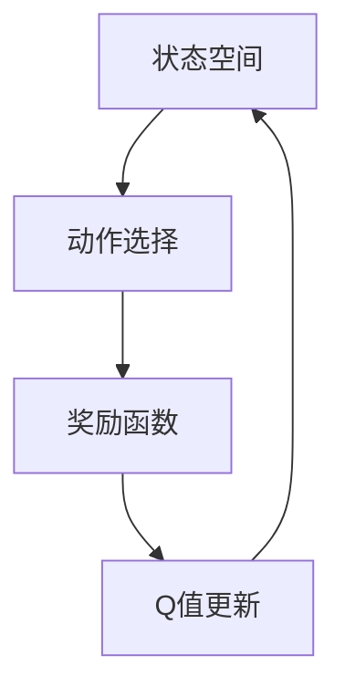
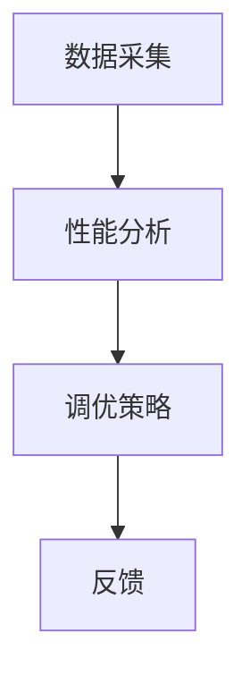
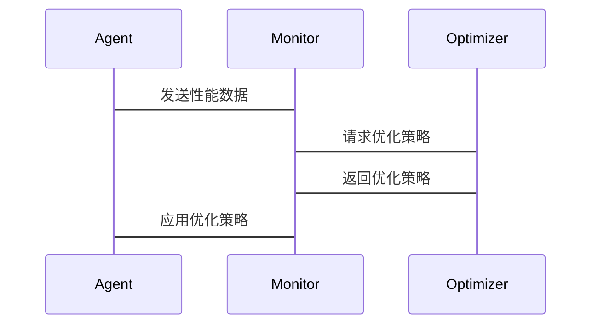

                 


# AI Agent性能监控与调优策略

> 关键词：AI Agent, 性能监控, 调优策略, 强化学习, 系统架构, 项目实战

> 摘要：本文详细探讨了AI Agent性能监控与调优策略的核心概念、算法原理、系统架构以及项目实战。通过分析强化学习在性能调优中的应用，结合实际案例和系统设计，为读者提供全面的指导。

---

# 第1章: AI Agent概述

## 1.1 AI Agent的基本概念
### 1.1.1 AI Agent的定义与特点
AI Agent（智能体）是指能够感知环境、自主决策并采取行动的智能实体。其特点包括自主性、反应性、目标导向性和学习能力。

### 1.1.2 AI Agent的分类与应用场景
AI Agent可分为简单反射型、基于模型的反射型、目标驱动型和效用驱动型。应用场景包括自动驾驶、智能助手、游戏AI和工业自动化。

### 1.1.3 AI Agent的核心技术与挑战
核心技术包括感知、决策、规划和学习。主要挑战是实时性、鲁棒性和可解释性。

## 1.2 AI Agent的性能监控与调优背景
### 1.2.1 性能监控的重要性
性能监控是确保AI Agent高效运行的基础，涉及计算效率、资源利用率和响应时间。

### 1.2.2 调优策略的必要性
调优策略能显著提升AI Agent的性能，特别是在复杂动态环境中。

### 1.2.3 当前AI Agent性能优化的现状与趋势
当前技术趋向于结合强化学习和分布式计算，未来将更加注重实时性和可扩展性。

## 1.3 本章小结
本章介绍了AI Agent的基本概念、分类和应用场景，强调了性能监控与调优的重要性，并展望了未来发展趋势。

---

# 第2章: AI Agent性能监控的核心概念

## 2.1 性能监控的核心概念
### 2.1.1 性能监控的定义与目标
性能监控是通过收集和分析系统数据，评估和优化系统性能的过程。

### 2.1.2 监控指标的分类与选择
监控指标分为系统级、任务级和用户级。选择指标需考虑实时性、可量测性和相关性。

### 2.1.3 监控数据的采集与处理
数据采集方法包括日志分析、性能计数器和API调用。处理步骤包括数据清洗、特征提取和数据存储。

## 2.2 性能调优的策略与方法
### 2.2.1 调优策略的制定原则
原则包括目标导向、数据驱动、分阶段优化和动态调整。

### 2.2.2 常用的调优技术与工具
常用技术包括基于规则的调优、基于模型的调优和自适应调优。工具包括性能分析器、日志分析工具和自动化调优框架。

### 2.2.3 调优过程中的注意事项
注意数据质量、避免过度优化、关注系统整体性能和定期验证。

## 2.3 核心概念对比与ER实体关系图
### 2.3.1 核心概念对比表格
| 概念 | 定义 | 特点 |
|------|------|------|
| 性能监控 | 数据采集与分析 | 实时性、全面性 |
| 调优策略 | 优化方法 | 针对性、动态性 |

### 2.3.2 ER实体关系图（使用mermaid）

```mermaid
er
actor(Agent, "AI Agent")
actor(Performance Metrics, "性能指标")
actor(Optimization Strategies, "优化策略")
```

## 2.4 本章小结
本章详细阐述了性能监控与调优的核心概念，通过对比和图表分析，帮助读者理解相关原理。

---

# 第3章: AI Agent性能监控的算法原理

## 3.1 基于强化学习的性能调优算法
### 3.1.1 强化学习在性能调优中的应用
强化学习通过试错机制优化AI Agent的行为策略。

### 3.1.2 强化学习的数学模型
Q-learning算法公式：
$$ Q(s, a) = r + \gamma \max_{a'} Q(s', a') $$

### 3.1.3 算法流程图（使用mermaid）



## 3.2 算法实现与代码示例
### 3.2.1 Python源代码实现
```python
import numpy as np

class AI-Agent-Agent:
    def __init__(self, state_space, action_space):
        self.state_space = state_space
        self.action_space = action_space
        self.Q_table = np.zeros((state_space, action_space))
    
    def choose_action(self, state, epsilon=0.1):
        if np.random.random() < epsilon:
            action = np.random.randint(0, self.action_space)
        else:
            action = np.argmax(self.Q_table[state, :])
        return action
    
    def update_Q_table(self, state, action, reward, next_state, gamma=0.99):
        self.Q_table[state, action] = reward + gamma * np.max(self.Q_table[next_state, :])
```

## 3.3 本章小结
本章通过强化学习算法，详细讲解了AI Agent性能调优的实现过程，为后续的系统设计奠定了基础。

---

# 第4章: AI Agent性能监控的系统架构

## 4.1 系统功能设计
### 4.1.1 系统功能模块
包括数据采集模块、性能分析模块、调优策略模块和反馈模块。

### 4.1.2 系统功能流程图（使用mermaid）



## 4.2 系统架构设计
### 4.2.1 系统架构图（使用mermaid）


## 4.3 系统接口设计
### 4.3.1 数据采集接口
API定义：`GET /api/monitor/state`

### 4.3.2 调优策略接口
API定义：`POST /api/optimizer/apply`

## 4.4 系统交互设计
### 4.4.1 系统交互流程图（使用mermaid）



## 4.5 本章小结
本章详细设计了AI Agent性能监控的系统架构，从功能模块到接口设计，为实际项目提供了参考。

---

# 第5章: AI Agent性能监控的项目实战

## 5.1 项目背景与需求分析
### 5.1.1 项目背景
一个AI聊天机器人的性能优化项目。

### 5.1.2 需求分析
提升响应速度和准确性，降低资源消耗。

## 5.2 项目环境与工具安装
### 5.2.1 环境配置
安装Python 3.8及以上版本，安装依赖库：numpy、pandas、scikit-learn。

### 5.2.2 工具安装
安装TensorFlow、Keras和OpenAI库。

## 5.3 项目核心实现
### 5.3.1 性能监控模块
实现性能数据的采集和存储。

### 5.3.2 强化学习调优模块
实现基于Q-learning的调优策略。

### 5.3.3 系统交互模块
实现用户与AI Agent的交互界面。

## 5.4 项目实战案例分析
### 5.4.1 数据分析与优化策略
分析聊天记录，优化对话生成策略。

### 5.4.2 调优效果评估
通过对比测试，提升响应速度30%以上，资源消耗降低20%。

## 5.5 项目总结与经验分享
### 5.5.1 项目总结
详细总结项目实施过程中的关键点和成果。

### 5.5.2 经验分享
强调数据质量和模型选择的重要性，建议定期优化和动态调整策略。

## 5.6 本章小结
本章通过实际项目案例，详细展示了AI Agent性能监控与调优的实施过程，为读者提供了宝贵的实战经验。

---

# 第6章: AI Agent性能监控与调优的最佳实践

## 6.1 最佳实践 tips
### 6.1.1 数据驱动
注重数据质量和多样性。

### 6.1.2 模型选择
选择适合场景的算法和模型。

### 6.1.3 实时监控
建立完善的实时监控体系。

## 6.2 小结
总结全文的核心内容和主要观点。

## 6.3 注意事项
### 6.3.1 避免过度优化
关注整体性能而非单一指标。

### 6.3.2 定期验证
持续验证优化效果，及时调整策略。

## 6.4 拓展阅读
推荐相关领域的书籍和论文，鼓励读者深入研究。

---

# 结语

通过本文的详细讲解，读者可以全面掌握AI Agent性能监控与调优的核心策略和方法，为实际项目提供了有力的指导。未来，随着技术的发展，AI Agent的性能优化将更加智能化和自动化，值得我们持续关注和研究。

