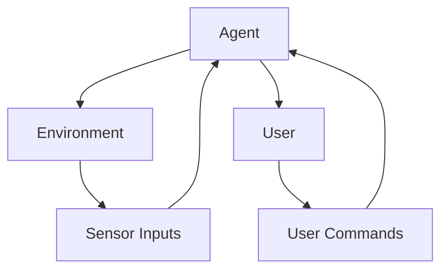
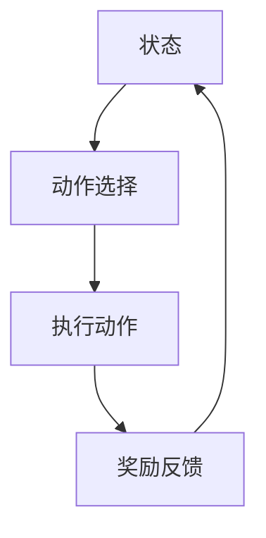
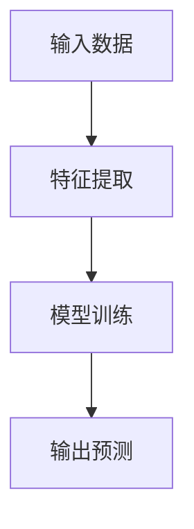
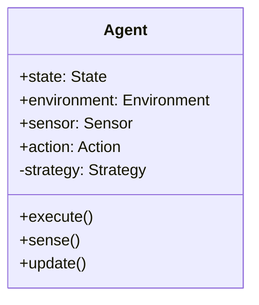
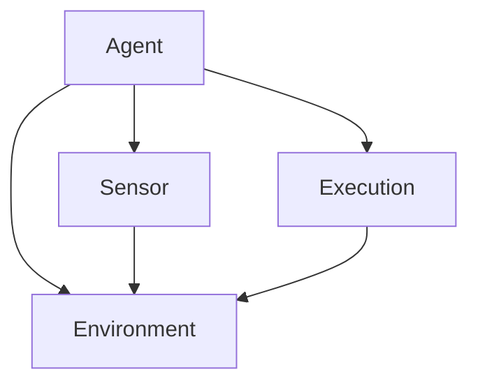
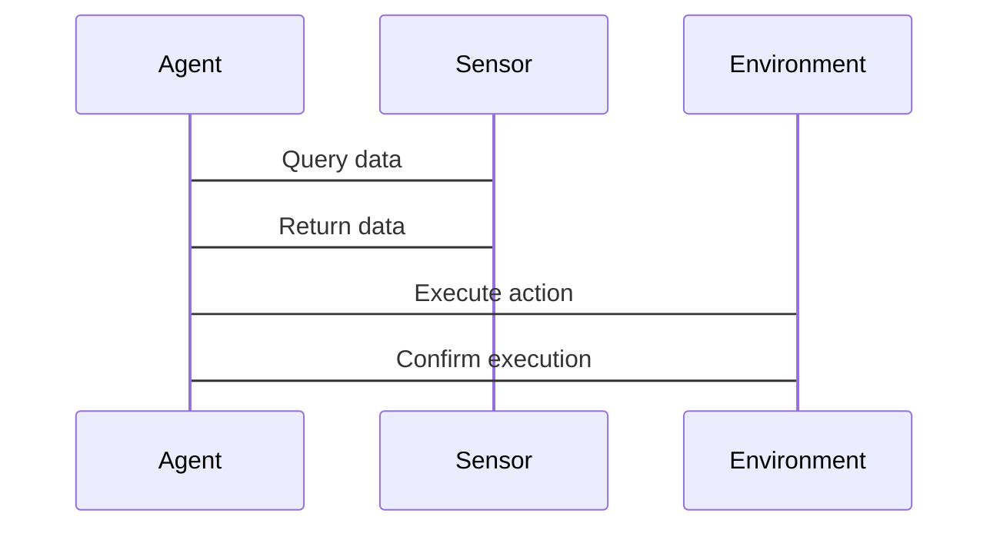

                 


# AI Agent技术未来发展趋势预测

## 关键词：AI Agent，人工智能，机器学习，强化学习，未来趋势，技术发展

## 摘要：本文预测了AI Agent技术的未来发展趋势，从算法优化、跨领域应用、人机协作增强、伦理安全等方面进行了详细分析，探讨了AI Agent如何在不同场景中发挥更大作用，并提出了未来可能的发展方向。

---

# 第一章: AI Agent技术背景与基础

## 1.1 AI Agent的基本概念

### 1.1.1 什么是AI Agent
AI Agent，即人工智能代理，是一种能够感知环境、自主决策并执行任务的智能实体。它通过传感器获取信息，利用算法处理信息，并通过执行器与环境交互。

### 1.1.2 AI Agent的核心特征
- **自主性**：能够在没有外部干预的情况下运行。
- **反应性**：能够实时感知环境并做出反应。
- **学习能力**：通过经验改进性能。
- **社交能力**：能够与其他Agent或人类进行协作。

### 1.1.3 AI Agent与传统AI的区别
| 特性       | 传统AI               | AI Agent              |
|------------|----------------------|------------------------|
| 决策能力   | 预设规则或固定模型    | 自主学习和动态决策     |
| 适应性     | 较低                 | 较高                   |
| 应用场景   | 静态任务             | 动态复杂任务           |

## 1.2 AI Agent的发展历程

### 1.2.1 AI Agent的历史演变
AI Agent的概念起源于20世纪60年代，经历了从简单规则驱动到复杂学习算法的演变。

### 1.2.2 重要里程碑与技术突破
- **20世纪90年代**：基于规则的专家系统。
- **21世纪初**：强化学习和深度学习的引入。
- **近年来**：人机协作和多智能体系统的发展。

## 1.3 AI Agent的应用领域

### 1.3.1 智能助手与个人应用
- 个人助理（如Siri、Alexa）。
- 健康监测与管理。

### 1.3.2 企业级应用与商业智能
- 供应链管理。
- 客户服务自动化。

### 1.3.3 行业特定应用案例
- 智慧城市中的交通管理。
- 金融领域的智能投资顾问。

## 1.4 AI Agent的未来发展趋势

### 1.4.1 技术融合
- 与区块链、物联网的结合。

### 1.4.2 应用场景扩展
- 更多行业中的应用，如医疗、教育。

### 1.4.3 伦理与安全
- 隐私保护和责任归属问题。

---

# 第二章: AI Agent的核心概念与技术联系

## 2.1 AI Agent的核心原理

### 2.1.1 感知与决策机制
- **感知**：通过传感器或数据源获取信息。
- **决策**：基于感知信息做出选择。

### 2.1.2 行为规划与执行
- **路径规划**：从起点到目标的最短路径。
- **任务分解**：将复杂任务分解为简单任务。

### 2.1.3 学习与自适应能力
- **强化学习**：通过奖励机制优化策略。
- **迁移学习**：将知识应用到新任务。

## 2.2 AI Agent与相关技术的对比

### 2.2.1 AI Agent与机器学习的对比
| 特性       | AI Agent               | 机器学习              |
|------------|------------------------|----------------------|
| 目标       | 完成特定任务           | 学习数据中的模式      |
| 应用场景   | 动态交互环境           | 数据分析与预测        |

### 2.2.2 AI Agent与机器人技术的关系
AI Agent可以作为机器人的“大脑”，负责决策和控制。

### 2.2.3 AI Agent与大数据分析的联系
AI Agent利用大数据分析技术进行决策优化。

## 2.3 AI Agent的实体关系架构



---

# 第三章: AI Agent算法原理

## 3.1 强化学习算法

### 3.1.1 算法流程


### 3.1.2 算法实现
```python
class Agent:
    def __init__(self, state_space, action_space):
        self.state_space = state_space
        self.action_space = action_space
        self.model = self.build_model()

    def build_model(self):
        # 网络结构定义
        pass

    def act(self, state):
        # 根据状态选择动作
        pass

    def remember(self, state, action, reward, next_state):
        # 存储经验
        pass

    def replay(self):
        # 从经验中学习
        pass
```

### 3.1.3 数学模型
$$ Q(s, a) = Q(s, a) + \alpha (r + \gamma \max Q(s', a') - Q(s, a)) $$

## 3.2 监督学习算法

### 3.2.1 算法流程


### 3.2.2 算法实现
```python
def supervised_learning(X, y):
    model = build_model()
    model.compile(optimizer='adam', loss='mse')
    model.fit(X, y, epochs=100, batch_size=32)
    return model
```

---

# 第四章: 系统分析与架构设计方案

## 4.1 问题场景介绍
设计一个AI Agent来优化办公室的能源消耗。

## 4.2 系统功能设计
- **传感器数据采集**：温度、湿度等。
- **数据处理**：分析数据，做出决策。
- **执行指令**：调节空调、照明等设备。

### 4.2.1 领域模型


## 4.3 系统架构设计

### 4.3.1 架构图


## 4.4 系统接口设计

### 4.4.1 接口定义
- **输入接口**：传感器数据。
- **输出接口**：执行指令。

## 4.5 系统交互设计

### 4.5.1 交互流程


---

# 第五章: 项目实战

## 5.1 环境安装

### 5.1.1 安装Python
```bash
python --version
pip install numpy matplotlib
```

## 5.2 核心代码实现

### 5.2.1 强化学习代码
```python
class Agent:
    def __init__(self, state_size, action_size):
        self.state_size = state_size
        self.action_size = action_size
        self.model = self.build_model()

    def build_model(self):
        model = Sequential()
        model.add(Dense(32, activation='relu', input_dim=self.state_size))
        model.add(Dense(self.action_size, activation='linear'))
        model.compile(optimizer='adam', loss='mse')
        return model

    def act(self, state):
        prediction = self.model.predict(state)
        return np.argmax(prediction[0])

    def remember(self, state, action, reward, next_state):
        # 经验回放
        pass

    def replay(self):
        # 回放训练
        pass
```

## 5.3 案例分析

### 5.3.1 应用场景
优化办公室能源消耗，减少电费开支。

## 5.4 项目小结

---

# 第六章: 最佳实践与未来展望

## 6.1 最佳实践

### 6.1.1 设计原则
- **模块化**：便于维护和扩展。
- **可解释性**：便于调试和优化。

### 6.1.2 开发工具
- **深度学习框架**：TensorFlow、PyTorch。
- **可视化工具**：TensorBoard。

## 6.2 小结

## 6.3 注意事项

## 6.4 拓展阅读

---

通过以上目录大纲，我们可以系统地了解AI Agent技术的背景、核心概念、算法原理、系统架构、项目实战以及未来的发展趋势。每个部分都深入浅出，结合理论与实践，帮助读者全面掌握AI Agent技术。

