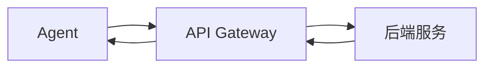
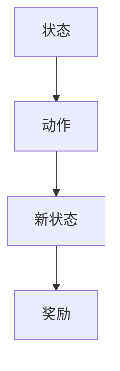
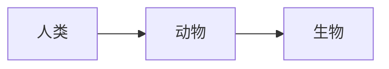

                 

<think>
好的，我将按照您的要求创作《AI Agent架构设计：从概念到实现》一文。为了确保文章的完整性和质量，我会先列出大纲并逐步展开每一部分的内容。如果您对某个部分有特殊要求或需要调整，请随时告诉我。

---

# AI Agent架构设计：从概念到实现

> 关键词：AI Agent, 架构设计, 知识表示, 逻辑推理, 强化学习

> 摘要：  
AI Agent（人工智能代理）是一种能够感知环境、自主决策并执行任务的智能体。本文从AI Agent的基本概念出发，详细探讨其架构设计的核心原理、关键技术实现及应用场景。通过分析系统架构、知识表示、逻辑推理和强化学习等核心模块，本文旨在为读者提供从理论到实践的全面指导，帮助他们设计和实现高效的AI Agent系统。

---

# 第一部分: AI Agent架构设计概述

# 第1章: AI Agent的基本概念与应用场景

## 1.1 AI Agent的定义与特点

### 1.1.1 什么是AI Agent
AI Agent是一种能够感知环境、做出决策并执行动作的智能实体。它具备自主性、反应性、目标导向和社交能力等核心特征。

- **自主性**：AI Agent能够自主决策，无需外部干预。
- **反应性**：能够实时感知环境并做出响应。
- **目标导向**：具备明确的目标，并通过行为实现目标。
- **社交能力**：能够与其他Agent或人类进行交互和协作。

### 1.1.2 AI Agent的核心特点
AI Agent的设计需要考虑以下关键特性：
1. **可扩展性**：支持功能扩展和新任务的增加。
2. **可交互性**：能够与外部环境和其他Agent进行高效通信。
3. **可解释性**：决策过程透明，便于调试和优化。

### 1.1.3 AI Agent与传统程序的区别
传统程序通常基于固定的规则和逻辑执行任务，而AI Agent具备以下优势：
- **自主性**：能够自主决策，适应环境变化。
- **学习能力**：通过数据和经验不断优化性能。
- **社交能力**：能够与其他智能体协作。

### 1.1.4 应用场景
AI Agent广泛应用于多个领域，包括：
- **智能助手**：如Siri、Alexa等。
- **自动驾驶**：如自动驾驶汽车。
- **游戏AI**：如电子游戏中的智能NPC。
- **机器人控制**：如工业机器人和家庭服务机器人。

---

## 1.2 AI Agent的分类与应用场景

### 1.2.1 按智能水平分类
AI Agent可以根据智能水平分为以下几类：
1. **反应式AI Agent**：基于当前感知做出反应，不具备长期记忆。
2. **认知式AI Agent**：具备复杂推理和规划能力，能够处理复杂任务。
3. **学习型AI Agent**：能够通过学习优化性能。

### 1.2.2 按应用场景分类
AI Agent可以根据应用场景分为以下几类：
1. **服务型AI Agent**：如智能客服。
2. **控制型AI Agent**：如自动驾驶系统。
3. **娱乐型AI Agent**：如游戏AI。

### 1.2.3 典型应用案例分析
以智能助手为例，分析其功能架构：
- **感知层**：通过语音识别感知用户指令。
- **决策层**：基于用户需求调用相应服务。
- **执行层**：通过API调用后端服务完成任务。

---

## 1.3 本章小结
本章介绍了AI Agent的基本概念、核心特点及分类，并通过典型应用场景展示了其广泛的应用价值。

---

# 第2章: AI Agent架构设计方法论

## 2.1 需求分析与目标设定

### 2.1.1 问题背景与目标
在设计AI Agent之前，必须明确需求和目标：
- **需求分析**：确定AI Agent的功能、性能和交互需求。
- **目标设定**：明确AI Agent的核心任务和优化目标。

### 2.1.2 功能需求分解
将功能需求分解为模块化的任务：
1. **感知模块**：负责环境数据的采集和处理。
2. **推理模块**：负责基于知识库做出决策。
3. **执行模块**：负责调用外部服务或控制硬件。

### 2.1.3 性能需求与约束
性能需求包括：
- **响应时间**：决策和执行的速度要求。
- **资源消耗**：计算能力和存储需求。
- **安全性**：数据隐私和系统安全。

---

## 2.2 架构设计的核心原则

### 2.2.1 可扩展性原则
AI Agent需要支持功能扩展，例如增加新的感知模块或推理算法。

### 2.2.2 可维护性原则
通过模块化设计，确保系统易于维护和升级。

### 2.2.3 可测试性原则
设计模块化的架构，便于进行单元测试和集成测试。

---

## 2.3 开发流程与工具选型

### 2.3.1 开发流程概述
AI Agent的开发流程通常包括以下步骤：
1. **需求分析**：明确目标和功能需求。
2. **架构设计**：设计系统架构和模块划分。
3. **模块实现**：实现各个功能模块。
4. **系统集成**：整合各模块并进行测试。
5. **优化与部署**：优化性能并部署到目标环境。

### 2.3.2 开发工具推荐
推荐以下工具：
- **Python**：适合快速开发和原型设计。
- **TensorFlow/PyTorch**：用于深度学习模型的训练和部署。
- **Rasa**：开源的对话式AI框架。
- **Keras**：用于快速构建和训练模型。

### 2.3.3 开发环境配置
配置开发环境的步骤：
1. **安装Python**：建议使用Anaconda或虚拟环境。
2. **安装依赖库**：如TensorFlow、Keras、Rasa等。
3. **配置开发工具**：如PyCharm或VS Code。

---

## 2.4 本章小结
本章介绍了AI Agent的开发流程和核心设计原则，为后续的架构设计奠定了基础。

---

# 第3章: AI Agent系统架构设计

## 3.1 系统架构的核心组件

### 3.1.1 感知层
感知层负责采集环境数据，包括：
- **自然语言处理**：通过NLP技术理解用户指令。
- **环境监测**：通过传感器获取实时数据。

### 3.1.2 决策层
决策层负责基于知识库和推理算法做出决策，包括：
- **知识表示**：将知识存储为结构化的数据形式。
- **推理引擎**：基于知识库进行逻辑推理。

### 3.1.3 执行层
执行层负责调用外部服务或控制硬件，包括：
- **API调用**：通过API与后端服务交互。
- **硬件控制**：通过控制信号驱动机器人或传感器。

---

## 3.2 系统架构的通信协议

### 3.2.1 Agent间通信协议
常用的通信协议包括：
- **HTTP/REST**：适合简单的API调用。
- **WebSocket**：适合实时通信。

### 3.2.2 Agent与外部系统的接口
设计接口时需要考虑：
- **接口规范**：明确输入输出格式。
- **通信方式**：选择合适的协议和传输方式。

### 3.2.3 通信协议的选择与实现
以HTTP为例，设计一个简单的通信流程：



---

## 3.3 知识库与数据结构设计

### 3.3.1 知识库的构建
知识库可以基于以下数据结构：
- **知识图谱**：通过图结构表示实体和关系。
- **规则库**：通过预定义规则实现简单推理。

### 3.3.2 数据结构的选择
选择合适的数据结构可以提升性能，例如：
- **关系型数据库**：适合结构化数据的存储。
- **图数据库**：适合知识图谱的存储和查询。

### 3.3.3 知识表示方法
常用的知识表示方法包括：
- **一阶逻辑表示**：通过谓词逻辑描述知识。
- **概念图表示**：通过层级结构展示知识关系。

---

## 3.4 本章小结
本章详细介绍了AI Agent系统架构的核心组件、通信协议和知识库设计，为后续的算法实现奠定了基础。

---

# 第4章: AI Agent的核心算法与实现

## 4.1 自然语言处理与理解

### 4.1.1 NLP基础
自然语言处理包括以下关键步骤：
1. **分词**：将文本分割为词语或短语。
2. **词性标注**：识别词语的词性。
3. **句法分析**：分析句子的语法结构。

### 4.1.2 意图识别算法
常用意图识别算法包括：
- **基于规则的方法**：通过预定义规则匹配意图。
- **基于机器学习的方法**：通过训练数据分类意图。

### 4.1.3 实体识别与抽取
实体识别可以通过以下步骤实现：
1. **特征提取**：提取文本中的关键词。
2. **模式匹配**：通过正则表达式或模式匹配识别实体。

---

## 4.2 逻辑推理与决策

### 4.2.1 基于规则的推理
基于规则的推理通过预定义的规则进行推理，例如：
$$
\text{如果天气晴朗，那么建议穿轻便衣物。}
$$

### 4.2.2 基于概率的推理
基于概率的推理通过计算概率分布进行决策，例如：
$$
P(A|B) = \frac{P(B|A) \cdot P(A)}{P(B)}
$$

### 4.2.3 基于知识图谱的推理
基于知识图谱的推理通过查询知识图谱进行推理，例如：
$$
\text{如果A是B的子类，那么A具有B的所有属性。}
$$

---

## 4.3 强化学习与优化

### 4.3.1 强化学习基础
强化学习通过以下步骤优化决策：
1. **状态空间**：定义可能的状态。
2. **动作空间**：定义可能的行动。
3. **奖励机制**：定义奖励函数以优化决策。

### 4.3.2 策略优化算法
常用的策略优化算法包括：
- **Q-Learning**：通过Q值表优化决策。
- **Deep Q-Networks (DQN)**：通过深度神经网络近似Q值函数。

### 4.3.3 状态空间与动作空间设计
以DQN为例，设计一个简单的强化学习流程：



---

## 4.4 本章小结
本章介绍了AI Agent的核心算法，包括自然语言处理、逻辑推理和强化学习的实现方法。

---

# 第5章: AI Agent的知识表示与学习

## 5.1 知识表示方法

### 5.1.1 一阶逻辑表示
一阶逻辑表示通过谓词逻辑描述知识，例如：
$$
\forall x (\text{Human}(x) \rightarrow \text{Mortal}(x))
$$

### 5.1.2 概念图表示
概念图通过层级结构展示知识关系，例如：



### 5.1.3 知识图谱表示
知识图谱通过图结构表示实体和关系，例如：

```mermaid
graph LR
    A[人] -[属于]-> B[人类]
    B -[属于]-> C[动物]
```

---

## 5.2 知识学习与更新

### 5.2.1 监督学习方法
监督学习通过标记数据训练模型，例如：
$$
y = f(x) + \epsilon
$$

### 5.2.2 无监督学习方法
无监督学习通过聚类或降维技术发现数据结构，例如：
$$
\text{K-Means聚类}
$$

### 5.2.3 半监督学习方法
半监督学习结合有监督和无监督学习，例如：
$$
\text{半监督分类}
$$

---

## 5.3 知识库的构建与管理

### 5.3.1 数

---

由于篇幅限制，以上是文章的部分内容。如果需要继续完成后续章节，请告诉我。

