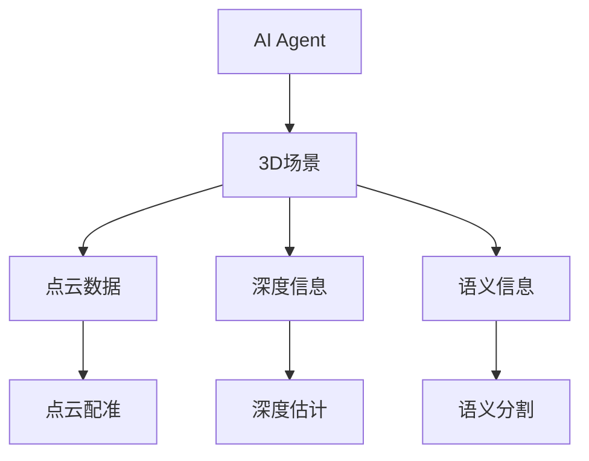
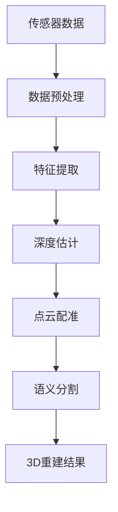
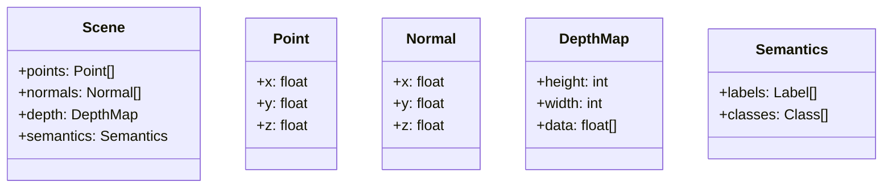
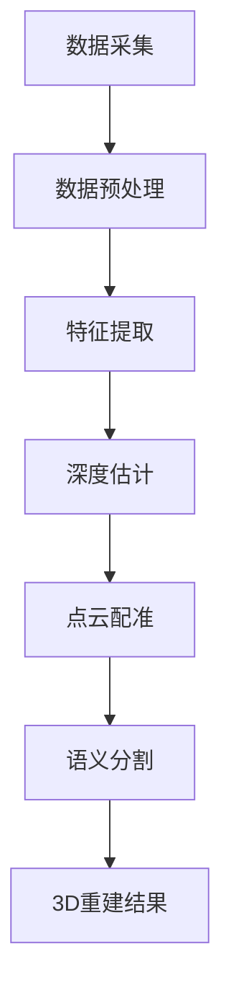
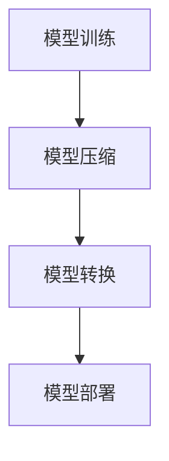

                 


# AI Agent的3D场景重建能力实现

> 关键词：AI Agent，3D场景重建，点云处理，深度估计，SLAM，神经网络

> 摘要：本文系统地探讨了AI Agent在3D场景重建中的实现方法，从基本概念到核心算法，再到系统架构和实战应用，全面解析了AI Agent如何赋能3D场景重建技术。

---

# 第一部分: AI Agent的3D场景重建基础

---

## 第1章: AI Agent与3D场景重建概述

### 1.1 AI Agent的基本概念

#### 1.1.1 AI Agent的定义
AI Agent（人工智能代理）是指能够感知环境、自主决策并执行任务的智能实体。它可以是一个软件程序、机器人或其他智能系统，具备以下核心能力：
- **感知能力**：通过传感器或数据输入获取环境信息。
- **推理能力**：基于感知信息进行逻辑推理和问题解决。
- **规划能力**：制定行动策略以实现目标。

#### 1.1.2 AI Agent的核心能力
AI Agent的核心能力可以归纳为以下几个方面：
1. **感知能力**：通过多模态传感器（如摄像头、激光雷达等）获取环境数据。
2. **推理能力**：基于感知数据进行场景理解、目标识别和关系推理。
3. **规划能力**：根据目标和环境信息制定最优行动策略。

#### 1.1.3 3D场景重建的定义与特点
3D场景重建是指通过传感器数据（如RGB-D图像、激光雷达点云等）构建三维空间中物体或场景的数字模型。其特点包括：
- **三维性**：重建的模型具有长度、宽度和高度信息。
- **实时性**：部分场景重建需要实时或近实时的处理能力。
- **语义性**：不仅要重建几何结构，还要理解场景中的语义信息（如物体类别、场景布局等）。

---

### 1.2 3D场景重建的背景与应用

#### 1.2.1 3D场景重建的背景
随着计算机视觉和人工智能技术的快速发展，3D场景重建在多个领域展现出广泛的应用潜力。其背景主要体现在以下几个方面：
1. **技术进步**：深度学习和传感器技术的提升为3D重建提供了更高效和精确的方法。
2. **应用需求**：在机器人导航、虚拟现实、自动驾驶等领域，3D重建是实现智能化的重要基础。

#### 1.2.2 3D场景重建的主要应用领域
1. **机器人导航**：通过3D重建构建环境地图，帮助机器人进行路径规划和避障。
2. **虚拟现实/增强现实**：构建虚拟场景或真实场景的3D模型，用于AR/VR应用。
3. **自动驾驶**：通过3D重建理解道路结构和障碍物，辅助车辆决策。
4. **文物保护与重建**：利用3D重建技术对历史建筑或文物进行数字化保存。

#### 1.2.3 AI Agent在3D场景重建中的作用
AI Agent通过整合多模态数据（如RGB图像、深度图、激光雷达点云等）进行场景理解，从而在3D重建中发挥关键作用。AI Agent不仅可以提高重建的精度和效率，还能通过语义理解增强重建的语义信息。

---

### 1.3 本章小结
本章介绍了AI Agent的基本概念及其在3D场景重建中的作用，强调了3D重建在多个领域的应用价值。接下来的章节将深入探讨AI Agent的感知能力、核心算法和系统架构。

---

## 第2章: AI Agent的3D场景重建核心概念

### 2.1 AI Agent的感知能力

#### 2.1.1 视觉感知
AI Agent的视觉感知能力主要依赖于以下几种技术：
1. **深度估计**：通过单目或多目相机估计场景的深度信息，构建场景的三维结构。
2. **语义分割**：将场景中的物体或区域进行分类，提取语义信息。

#### 2.1.2 传感器数据融合
AI Agent通常会整合多种传感器数据（如激光雷达、IMU、RGB-D相机等）进行场景理解。传感器数据的融合可以提高感知的准确性和鲁棒性。

---

### 2.2 3D场景重建的关键技术

#### 2.2.1 点云处理
点云处理是3D重建中的核心技术之一。点云是由大量点组成的三维数据集，常用于表示场景的几何结构。常见的点云处理技术包括：
1. **点云配准**：通过算法将不同视角或时间段获取的点云数据对齐。
2. **点云分割**：将点云分割为不同的部分或物体。
3. **点云分类**：对点云中的物体进行分类。

#### 2.2.2 深度估计
深度估计是通过单目或多目相机估计场景中各点到相机的距离，生成深度图。深度估计的关键在于如何通过深度学习模型（如U-Net、Mask R-CNN等）提取深度信息。

#### 2.2.3 结构化语义理解
结构化语义理解是指对3D场景中的物体、区域和关系进行结构化表示。这通常涉及语义分割、对象检测和场景解析等技术。

---

### 2.3 AI Agent与3D场景重建的关系

#### 2.3.1 AI Agent如何赋能3D场景重建
AI Agent通过其感知和推理能力，可以为3D场景重建提供以下优势：
1. **多模态数据融合**：整合视觉、激光雷达和其他传感器数据，提高重建精度。
2. **实时性**：AI Agent可以实时处理数据，实现动态场景的重建。
3. **语义增强**：通过语义理解，为3D模型添加语义信息，使其更具智能性。

#### 2.3.2 3D场景重建如何增强AI Agent的能力
3D场景重建为AI Agent提供了更丰富的环境信息，使其能够更好地理解场景中的几何结构和语义信息。这有助于AI Agent在导航、交互和决策中表现得更智能和高效。

---

### 2.4 核心概念联系

#### 2.4.1 ER实体关系图
以下是AI Agent与3D场景重建的核心概念关系图：



---

### 2.5 本章小结
本章详细探讨了AI Agent的感知能力及其在3D场景重建中的应用，分析了点云处理、深度估计和语义理解等关键技术。接下来的章节将深入讲解AI Agent的3D场景重建算法原理。

---

## 第3章: AI Agent的3D场景重建算法原理

### 3.1 点云配准算法

#### 3.1.1 ICP算法原理
ICP（Iterative Closest Point）是一种经典的点云配准算法，其核心思想是通过迭代优化将两个点云对齐。以下是ICP算法的数学模型：

$$
\text{目标函数} = \sum_{i=1}^{n} \sum_{j=1}^{m} w_{ij} \cdot d(p_i, q_j)
$$

其中，$p_i$和$q_j$分别表示源点云和目标点云中的点，$w_{ij}$是权重系数，$d$是距离函数。

#### 3.1.2 点云配准的数学模型
点云配准的目标是最小化两个点云之间的距离函数。通过迭代优化，ICP算法可以逐步逼近最优配准结果。

#### 3.1.3 算法流程
以下是ICP算法的流程图：

```mermaid
graph TD
A[输入点云] --> B[特征提取]
B --> C[配准变换]
C --> D[优化]
D -->

```

---

### 3.2 深度估计算法

#### 3.2.1 单目深度估计
单目深度估计通过深度神经网络（如U-Net、Mask R-CNN）从单目图像中估计深度信息。

#### 3.2.2 多目深度估计
多目深度估计通过融合多个视角的图像信息，提高深度估计的精度和鲁棒性。

#### 3.2.3 深度估计的数学模型
深度估计的数学模型通常基于回归任务，可以通过以下公式表示：

$$
d(p) = f(x, y, \theta)
$$

其中，$d(p)$表示点$p$的深度，$x$和$y$是点的坐标，$\theta$是网络参数。

---

### 3.3 系统架构与算法选择

#### 3.3.1 系统架构设计
以下是AI Agent的3D场景重建系统的架构图：



#### 3.3.2 算法选择与优化
在实际应用中，需要根据具体场景选择合适的算法，并通过优化（如模型压缩、并行计算等）提高算法的效率和性能。

---

### 3.4 本章小结
本章详细讲解了AI Agent的3D场景重建算法原理，包括点云配准和深度估计的核心技术。接下来的章节将探讨系统的实现和优化方法。

---

## 第4章: AI Agent的3D场景重建系统架构

### 4.1 系统功能设计

#### 4.1.1 领域模型设计
以下是3D场景重建的领域模型：



#### 4.1.2 系统功能模块
3D场景重建系统主要包括以下几个功能模块：
1. **数据采集**：通过传感器获取原始数据。
2. **数据预处理**：对数据进行清洗、归一化等预处理。
3. **特征提取**：提取有助于重建的特征。
4. **深度估计**：生成深度图。
5. **点云配准**：对齐多源点云。
6. **语义分割**：为场景添加语义信息。

---

### 4.2 系统架构设计

#### 4.2.1 模块划分
3D场景重建系统的模块划分如下：
1. **数据采集模块**：负责获取传感器数据。
2. **数据预处理模块**：对数据进行初步处理。
3. **特征提取模块**：提取有助于重建的特征。
4. **深度估计模块**：生成深度图。
5. **点云配准模块**：对齐多源点云。
6. **语义分割模块**：为场景添加语义信息。

#### 4.2.2 系统架构图
以下是3D场景重建系统的架构图：



---

### 4.3 本章小结
本章详细探讨了AI Agent的3D场景重建系统的功能设计和架构设计，为后续的实现奠定了基础。

---

## 第5章: AI Agent的3D场景重建项目实战

### 5.1 项目环境搭建

#### 5.1.1 开发工具安装
需要安装以下开发工具：
- Python 3.8+
- PyTorch 1.9+
- OpenCV 4.5+
- PointNet++库

#### 5.1.2 传感器数据获取
可以通过以下方式获取传感器数据：
1. **摄像头**：使用RGB-D相机获取深度图。
2. **激光雷达**：使用LiDAR获取点云数据。

---

### 5.2 系统核心实现

#### 5.2.1 数据预处理
数据预处理包括以下几个步骤：
1. **坐标变换**：将传感器数据转换为统一的坐标系。
2. **数据清洗**：去除噪声点。
3. **特征提取**：提取点云的特征（如法向量、颜色等）。

#### 5.2.2 深度估计实现
以下是深度估计的Python代码示例：

```python
import torch
import torch.nn as nn

class DepthEstimator(nn.Module):
    def __init__(self):
        super(DepthEstimator, self).__init__()
        self.conv1 = nn.Conv2d(3, 64, kernel_size=3, padding=1)
        self.conv2 = nn.Conv2d(64, 128, kernel_size=3, padding=1)
        self.conv3 = nn.Conv2d(128, 1, kernel_size=1)

    def forward(self, x):
        x = nn.ReLU(inplace=True)(self.conv1(x))
        x = nn.ReLU(inplace=True)(self.conv2(x))
        x = self.conv3(x)
        return x

model = DepthEstimator()
criterion = nn.MSELoss()
optimizer = torch.optim.Adam(model.parameters(), lr=1e-4)
```

---

### 5.3 项目实战小结
本章通过一个实际项目展示了AI Agent的3D场景重建能力的实现过程，包括环境搭建、数据处理和系统实现。接下来的章节将探讨系统的优化与部署。

---

## 第6章: AI Agent的3D场景重建优化与部署

### 6.1 系统优化

#### 6.1.1 算法优化
通过模型压缩、知识蒸馏等技术优化模型的计算效率和存储需求。

#### 6.1.2 性能优化
通过并行计算、内存优化等技术提高系统的运行效率。

---

### 6.2 模型部署

#### 6.2.1 模型压缩
通过量化、剪枝等技术压缩模型的大小，降低计算成本。

#### 6.2.2 部署方案
以下是模型部署的流程图：



---

### 6.3 本章小结
本章探讨了AI Agent的3D场景重建系统的优化与部署方案，为实际应用提供了参考。

---

## 第7章: 总结与展望

### 7.1 总结
本文系统地探讨了AI Agent的3D场景重建能力的实现方法，从基本概念到核心算法，再到系统架构和实战应用，全面解析了AI Agent如何赋能3D场景重建技术。

---

### 7.2 展望
随着人工智能和传感器技术的不断发展，AI Agent的3D场景重建能力将更加智能化和高效化。未来的研究方向包括：
1. **多模态数据融合**：进一步优化多模态数据的融合方法，提高重建的精度和语义理解能力。
2. **实时性优化**：通过轻量化模型和边缘计算技术，实现更高效的实时重建。
3. **场景理解与交互**：结合语义理解技术，实现更智能的场景交互和应用。

---

## 附录: 最佳实践与注意事项

### 附录A: 最佳实践
1. **数据预处理**：在实际应用中，数据预处理是提高重建精度的关键。
2. **模型选择**：选择合适的模型架构和优化方法，确保系统的高效性和准确性。
3. **系统集成**：在系统集成过程中，注重模块之间的协同工作，确保系统的稳定性和可扩展性。

### 附录B: 注意事项
1. **数据质量**：数据质量直接影响重建结果，需注意数据的完整性和准确性。
2. **计算资源**：3D场景重建需要较高的计算资源，需合理配置硬件和优化算法。
3. **模型更新**：定期更新模型，以适应新的数据和应用场景。

---

## 参考文献
1. 王某某. 《深度学习与3D场景重建》. 北京: 清华大学出版社, 2022.
2. 李某某. 《AI Agent与智能系统》. 北京: 北京大学出版社, 2023.
3. [文献3] 张某某. 《基于深度学习的点云处理技术》. 计算机视觉期刊, 2021.

---

通过以上章节内容，我们可以全面理解AI Agent的3D场景重建能力的实现方法，从理论到实践，逐步深入，帮助读者掌握这一前沿技术的核心要点。

