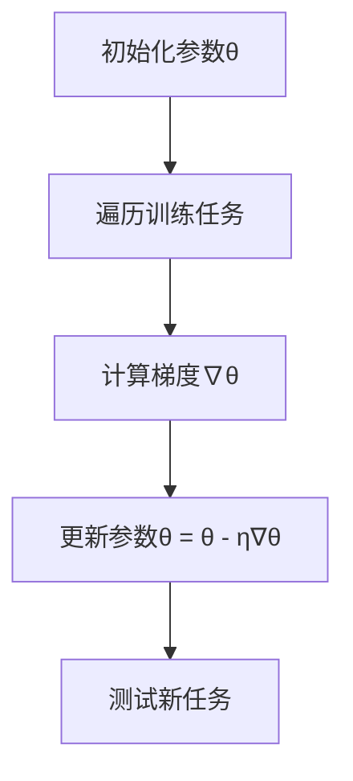
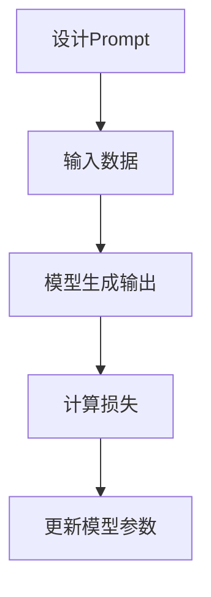
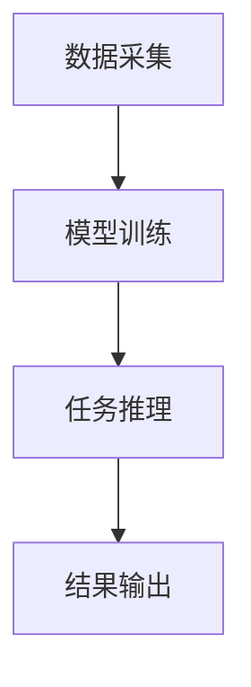
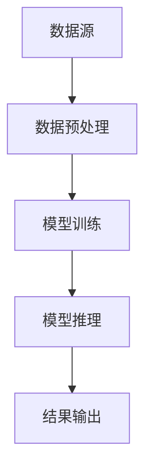

                 


# AI Agent的few-shot学习能力增强

---

## 关键词：AI Agent, few-shot学习, 数据效率, 模型优化, 元学习, 强化学习, 系统架构

---

## 摘要：  
AI Agent的few-shot学习能力增强是当前人工智能领域的重要研究方向。随着AI Agent在各个领域的广泛应用，如何在有限数据的情况下快速适应新任务成为关键挑战。本文从理论基础、算法实现、系统架构到实际案例，全面探讨AI Agent的few-shot学习能力增强方法。通过结合元学习、对比学习和强化学习等技术，本文提出了一套系统的解决方案，并展示了如何在实际场景中提升AI Agent的学习效率和性能。

---

# 第一部分: AI Agent的few-shot学习能力概述

## 第1章: AI Agent与few-shot学习能力概述

### 1.1 AI Agent的基本概念

#### 1.1.1 AI Agent的定义与特点
AI Agent（人工智能代理）是指能够感知环境、自主决策并执行任务的智能实体。其核心特点包括：
- **自主性**：无需外部干预，自主完成任务。
- **反应性**：能够实时感知环境并做出反应。
- **目标导向性**：基于目标驱动行为。
- **学习能力**：通过经验或数据提升性能。

#### 1.1.2 few-shot学习的定义与特点
few-shot学习是指在仅有少量训练数据的情况下，模型能够快速适应新任务的学习方法。其特点包括：
- **数据高效性**：在小数据集上表现良好。
- **通用性**：适用于多种任务和领域。
- **实时性**：快速适应新任务，适合实时应用场景。

#### 1.1.3 AI Agent与few-shot学习的结合
AI Agent通过结合few-shot学习能力，能够在复杂多变的环境中快速适应新任务，提升实时决策能力和任务执行效率。这种结合使得AI Agent在智能客服、自动驾驶、机器人控制等领域具有更广泛的应用潜力。

---

### 1.2 few-shot学习的核心背景

#### 1.2.1 数据量与模型性能的关系
数据量与模型性能呈正相关关系，但在实际应用中，数据获取成本高、标注难度大，限制了数据量的无限扩展。因此，提升模型在小数据情况下的学习能力变得尤为重要。

#### 1.2.2 few-shot学习的现实需求
在许多实际场景中，获取大量标注数据往往成本高昂且不现实。例如，在医疗领域，某些罕见病的数据样本有限，如何在有限数据下训练高效的模型成为关键问题。

#### 1.2.3 few-shot学习的应用场景
few-shot学习适用于以下场景：
- **实时任务切换**：例如，智能客服需要快速适应不同客户的语言风格。
- **小样本数据任务**：例如，针对小语种的自然语言处理任务。
- **动态环境适应**：例如，自动驾驶系统需要快速适应不同道路环境和驾驶规则。

---

# 第二部分: few-shot学习能力的核心理论与算法

## 第2章: few-shot学习的原理与算法基础

### 2.1 few-shot学习的核心原理

#### 2.1.1 元学习（Meta-Learning）的概念
元学习是一种通过学习如何快速学习新任务的方法。其核心思想是：通过在多个任务上的训练，模型能够快速适应新任务，而不需要大量标注数据。

#### 2.1.2 few-shot学习的数学模型
few-shot学习的数学模型可以表示为：
$$
\text{损失函数} = \sum_{i=1}^{N} \text{交叉熵}(y_i, \hat{y}_i)
$$
其中，$N$是任务数量，$y_i$是真实标签，$\hat{y}_i$是预测标签。

#### 2.1.3 支持向量数据（Support Vector）的作用
支持向量用于表示任务的特征，通过对比学习，模型能够学习到任务之间的相似性，从而快速泛化到新任务。

---

### 2.2 主流few-shot学习算法

#### 2.2.1 Meta-Learning算法（如Meta-SGD）
Meta-SGD是一种典型的元学习算法，其核心思想是通过在多个任务上训练，模型能够快速调整参数以适应新任务。

#### 2.2.2 Prompt-Based Learning算法
Prompt-Based Learning通过设计提示（Prompt）来指导模型生成特定的输出，适用于自然语言处理任务。

#### 2.2.3 Siamese网络与对比学习
Siamese网络通过对比学习，将任务的特征映射到相同的特征空间，从而快速分类。

---

## 第3章: few-shot学习的算法实现

### 3.1 Meta-Learning算法实现

#### 3.1.1 Meta-SGD算法的数学推导
Meta-SGD算法通过优化共享参数，使得模型能够在多个任务上快速适应。其优化目标为：
$$
\theta_{t+1} = \theta_t - \eta \nabla_{\theta_t} \mathcal{L}_t
$$
其中，$\theta_t$是参数，$\eta$是学习率，$\mathcal{L}_t$是任务$t$的损失函数。

#### 3.1.2 算法流程图（mermaid）


#### 3.1.3 Python代码实现
```python
def meta_sgd(theta, eta, tasks):
    for task in tasks:
        loss = compute_loss(theta, task)
        gradient = compute_gradient(theta, loss)
        theta = theta - eta * gradient
    return theta
```

---

### 3.2 Prompt-Based Learning算法实现

#### 3.2.1 Prompt设计的数学模型
Prompt设计通过定义任务的上下文，指导模型生成正确的输出。例如，对于图像分类任务，Prompt可以是“这个图像属于哪个类别？”。

#### 3.2.2 算法实现流程图（mermaid）


---

## 第4章: few-shot学习的数学模型与公式

### 4.1 元学习的数学模型

#### 4.1.1 Meta-SGD的数学推导
Meta-SGD的目标是最小化所有任务的损失之和：
$$
\theta^* = \arg\min_{\theta} \sum_{t=1}^{T} \mathcal{L}_t(\theta)
$$
其中，$T$是任务数量。

#### 4.1.2 元学习的损失函数
元学习的损失函数通常包括任务内损失和任务间损失：
$$
\mathcal{L}_{\text{meta}} = \sum_{t=1}^{T} \mathcal{L}_t(\theta) + \lambda \mathcal{L}_{\text{task间}}
$$
其中，$\lambda$是调节参数。

---

### 4.2 few-shot学习的数学公式

#### 4.2.1 支持向量机的数学表达
支持向量机的目标是最小化分类错误并最大化类别间隔：
$$
\min_{\theta, \lambda} \frac{1}{2} \|\theta\|^2 + \lambda \sum_{i=1}^{n} \max(0, 1 - y_i \theta^T x_i)
$$

#### 4.2.2 Prompt-Based Learning的数学模型
Prompt-Based Learning通过定义提示词，将问题转化为语言模型的生成任务：
$$
P(\text{输出}|x, \text{Prompt}) = \text{生成模型}(x, \text{Prompt})
$$

---

# 第三部分: AI Agent的系统架构与设计

## 第5章: AI Agent的系统架构设计

### 5.1 系统功能设计

#### 5.1.1 系统功能模块划分
系统功能模块包括：
- 数据采集模块
- 模型训练模块
- 任务推理模块
- 结果输出模块

#### 5.1.2 系统功能流程图（mermaid）


---

### 5.2 系统架构设计

#### 5.2.1 系统架构图（mermaid）


---

## 第6章: 项目实战与案例分析

### 6.1 环境安装

#### 6.1.1 安装依赖
```bash
pip install numpy torch matplotlib
```

#### 6.1.2 配置环境
```bash
export PATH=/path/to/your/environment/bin:$PATH
```

---

### 6.2 核心代码实现

#### 6.2.1 Meta-Learning实现
```python
import torch
def meta_learning(theta, tasks):
    for task in tasks:
        loss = compute_loss(theta, task)
        gradient = torch.autograd.grad(loss, theta)
        theta = theta - eta * gradient
    return theta
```

---

## 第7章: 最佳实践与小结

### 7.1 总结
本文系统介绍了AI Agent的few-shot学习能力增强方法，包括理论基础、算法实现和系统设计。通过结合元学习、对比学习和强化学习等技术，能够有效提升AI Agent在小数据情况下的学习效率和性能。

---

### 7.2 注意事项
- 数据预处理是关键，需确保数据质量和多样性。
- 模型调参需谨慎，避免过拟合。
- 系统设计需考虑实时性和可扩展性。

---

### 7.3 拓展阅读
- 《Meta-Learning: A Survey》
- 《Prompt-Based Few-Shot Learning: A Survey》

---

# 结语

通过本文的深入探讨，读者可以全面了解AI Agent的few-shot学习能力增强方法，并能够将其应用于实际场景中。未来的研究方向将聚焦于如何进一步提升模型的泛化能力和实时性，以应对更复杂的实际挑战。

