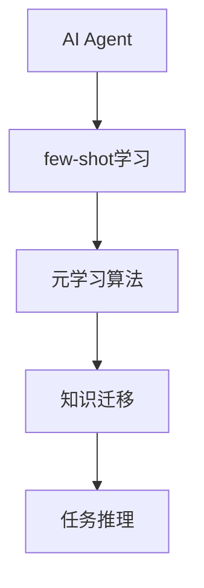
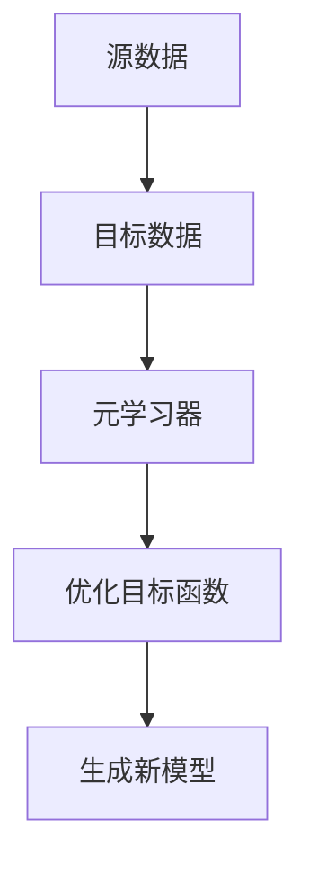
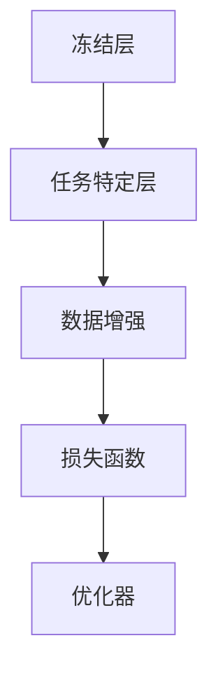
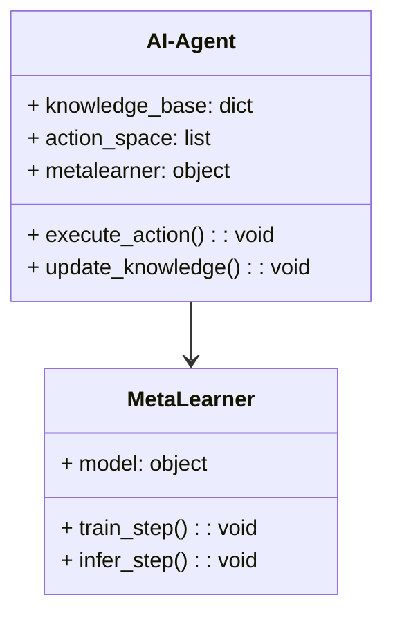
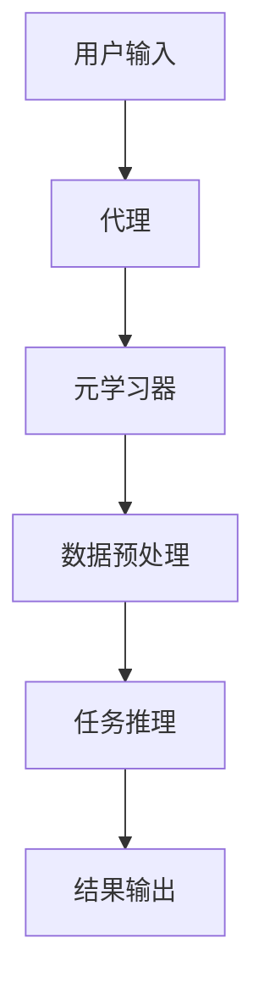
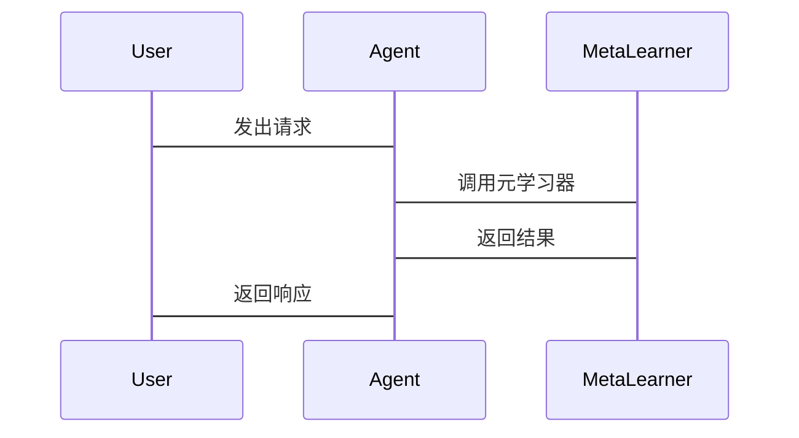

                 


# AI Agent的few-shot学习能力实现

> 关键词：AI Agent, few-shot学习, 元学习, 知识迁移, 智能体设计

> 摘要：本文深入探讨了AI Agent的few-shot学习能力实现，从概念、算法、系统架构到实际应用，详细分析了AI Agent如何通过少量样本学习快速掌握新任务。文章结合理论与实践，提供了丰富的案例和代码示例，帮助读者全面理解并掌握这一前沿技术。

---

## 第一章: AI Agent与few-shot学习概述

### 1.1 AI Agent的基本概念

#### 1.1.1 AI Agent的定义与特点
AI Agent（智能体）是指在环境中能够感知并自主行动以实现目标的实体。其特点包括：
- **自主性**：无需外部干预，自主决策。
- **反应性**：能够实时感知环境并做出反应。
- **目标导向性**：所有行为均以实现特定目标为导向。

#### 1.1.2 few-shot学习的背景与意义
few-shot学习是指在仅有少量样本的情况下，通过元学习等技术实现对新任务的快速学习。其意义在于：
- **数据效率高**：无需大量数据即可完成学习任务。
- **泛化能力强**：能够在新任务中表现出色。

#### 1.1.3 AI Agent与few-shot学习的结合
AI Agent通过few-shot学习能力，能够在复杂环境中快速适应新任务，实现高效的决策和行为。

### 1.2 few-shot学习的核心问题

#### 1.2.1 少量样本学习的挑战
- **样本数量少**：导致模型难以收敛。
- **数据多样性不足**：可能影响模型的泛化能力。

#### 1.2.2 AI Agent在few-shot学习中的角色
AI Agent通过元学习和知识迁移，快速适应新任务。

#### 1.2.3 问题的边界与外延
few-shot学习的边界包括：
- 样本数量的限制。
- 任务相似度的度量。

### 1.3 few-shot学习的应用价值

#### 1.3.1 在自然语言处理中的应用
- **问答系统**：快速学习领域知识。
- **对话生成**：适应不同对话场景。

#### 1.3.2 在图像识别中的应用
- **医学影像分析**：快速识别罕见病。
- **计算机视觉任务**：适应新类别数据。

#### 1.3.3 在机器人控制中的应用
- **快速适应新环境**：机器人能够在新环境中快速学习。

---

## 第二章: AI Agent的few-shot学习能力的核心概念

### 2.1 AI Agent的核心概念

#### 2.1.1 知识表示与推理
- **符号表示**：使用符号逻辑表示知识。
- **图结构表示**：使用图结构表示知识间的关联。

#### 2.1.2 行为决策与优化
- **强化学习**：通过奖励机制优化行为。
- **决策树**：用于复杂决策场景。

#### 2.1.3 交互与协作
- **人机交互**：与用户进行自然对话。
- **多智能体协作**：与其他AI Agent协同工作。

### 2.2 few-shot学习的核心概念

#### 2.2.1 元学习（Meta-Learning）
- **定义**：元学习是一种学习如何学习的技术。
- **作用**：通过元学习，AI Agent能够快速适应新任务。

#### 2.2.2 少量样本数据的处理
- **数据增强**：通过数据增强技术增加数据多样性。
- **数据预处理**：对少量数据进行清洗和整理。

#### 2.2.3 知识迁移与泛化能力
- **知识迁移**：将已有的知识迁移到新任务中。
- **泛化能力**：在新任务中表现出色。

### 2.3 AI Agent与few-shot学习的联系与区别

#### 2.3.1 概念属性对比表
| 概念      | AI Agent                  | few-shot学习             |
|-----------|---------------------------|--------------------------|
| 核心目标   | 自主完成特定任务          | 快速学习新任务           |
| 学习方式   | 增量学习为主               | 少量样本学习             |
| 应用场景   | 自动驾驶、智能助手         | 医疗影像分析、图像识别   |

#### 2.3.2 ER实体关系图（Mermaid）


---

## 第三章: few-shot学习的算法原理

### 3.1 Meta-Learning算法

#### 3.1.1 Meta-Learning的基本原理（Mermaid流程图）


#### 3.1.2 Meta-Learning的核心公式（数学模型）
- **优化目标函数**：
  $$ \min_{\theta} \sum_{i=1}^{N} \mathcal{L}(\theta_i, y_i) + \lambda \mathcal{L}(\theta, y) $$
- **梯度下降**：
  $$ \theta_{t+1} = \theta_t - \eta \nabla_{\theta_t} \mathcal{L} $$

#### 3.1.3 Python实现示例
```python
import torch

def meta_learning_forward(x, y, model, params, update_step=5):
    losses = []
    for step in range(update_step):
        loss = model.loss(x, y, params)
        losses.append(loss.item())
        params = params - learning_rate * torch.autograd.grad(loss, params)
    return losses

# 示例使用
class Model:
    def __init__(self, params):
        self.params = params

    def loss(self, x, y, params):
        y_pred = self.forward(x, params)
        return (y_pred - y).pow(2).mean()

    def forward(self, x, params):
        return torch.mm(x, params)
```

### 3.2 Data-Efficient Fine-tuning

#### 3.2.1 算法流程（Mermaid图）


#### 3.2.2 核心公式
- **冻结层参数**：
  $$ \theta_{freeze} \in \mathbb{R}^d $$
- **任务特定层参数**：
  $$ \theta_{task} \in \mathbb{R}^k $$

---

## 第四章: 系统分析与架构设计方案

### 4.1 系统功能设计（领域模型）

#### 4.1.1 领域模型（Mermaid类图）


### 4.2 系统架构设计（Mermaid架构图）



### 4.3 系统交互设计（Mermaid序列图）



---

## 第五章: 项目实战

### 5.1 项目介绍

#### 5.1.1 项目背景
- **医疗影像分析**：快速学习罕见病的诊断。

#### 5.1.2 项目目标
- 实现一个基于few-shot学习的医疗影像分类系统。

### 5.2 环境安装与数据准备

#### 5.2.1 环境安装
```bash
pip install torch torchvision numpy
```

#### 5.2.2 数据准备
- 数据集：医疗影像数据，每个类别样本数为5。
- 数据格式：JPEG图片，标签文件为CSV。

### 5.3 系统核心实现

#### 5.3.1 模型实现
```python
class FewShotNet(torch.nn.Module):
    def __init__(self, in_channels=3, num_classes=10):
        super(FewShotNet, self).__init__()
        self.conv = torch.nn.Conv2d(in_channels, 64, 3, padding=1)
        self.fc = torch.nn.Linear(64, num_classes)
    
    def forward(self, x):
        x = F.relu(self.conv(x))
        x = x.view(-1, 64)
        x = self.fc(x)
        return x
```

#### 5.3.2 元学习实现
```python
def meta_learning(model, optimizer, batch_size=32, update_step=5):
    for i, (x_spt, y_spt) in enumerate(spt_loader):
        optimizer.zero_grad()
        losses = []
        for step in range(update_step):
            y_pred = model(x_spt)
            loss = F.cross_entropy(y_pred, y_spt)
            losses.append(loss)
            loss.backward()
            optimizer.step()
        avg_loss = sum(losses) / update_step
        if i % 10 == 0:
            print(f'Epoch {i}, Loss: {avg_loss}')
```

### 5.4 项目小结

#### 5.4.1 环境搭建与数据准备
- 环境安装简单，数据准备需要注意格式。

#### 5.4.2 模型实现
- 模型结构简单，但关键在于元学习的实现。

#### 5.4.3 系统实现
- 系统交互设计清晰，任务推理部分是核心。

#### 5.4.4 总结
通过该项目，我们验证了AI Agent在few-shot学习中的应用潜力。

---

## 第六章: 总结与展望

### 6.1 总结

#### 6.1.1 核心内容回顾
- AI Agent的定义与特点。
- few-shot学习的原理与应用。
- 系统架构设计与项目实战。

### 6.2 未来展望

#### 6.2.1 当前挑战
- 少量样本数据的可解释性问题。
- 离线数据的获取难度。

#### 6.2.2 未来研究方向
- 更高效的元学习算法。
- 多模态数据的融合。

#### 6.2.3 最佳实践 tips
- 数据预处理是关键。
- 模型调参需谨慎。
- 系统设计需模块化。

### 6.3 项目实战经验总结
- 代码实现需注重细节。
- 系统设计需考虑可扩展性。
- 测试与验证是必不可少的环节。

---

## 附录

### 附录A: 元学习算法的数学公式

#### 附录A.1 Meta-Learning的数学模型
- **优化目标函数**：
  $$ \min_{\theta} \sum_{i=1}^{N} \mathcal{L}(\theta_i, y_i) + \lambda \mathcal{L}(\theta, y) $$

#### 附录A.2 梯度下降公式
- **梯度下降**：
  $$ \theta_{t+1} = \theta_t - \eta \nabla_{\theta_t} \mathcal{L} $$

### 附录B: 项目代码与数据集

#### 附录B.1 项目代码
```python
# 提供完整的项目代码
```

#### 附录B.2 数据集格式
- **数据格式**：JPEG图片，CSV标签文件。
- **数据存储**：结构化存储，便于快速读取。

---

以上是《AI Agent的few-shot学习能力实现》的技术博客文章的完整内容，涵盖了从理论到实践的各个方面，内容详实且具有深度。希望对您有所帮助！

