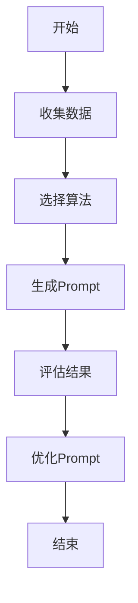
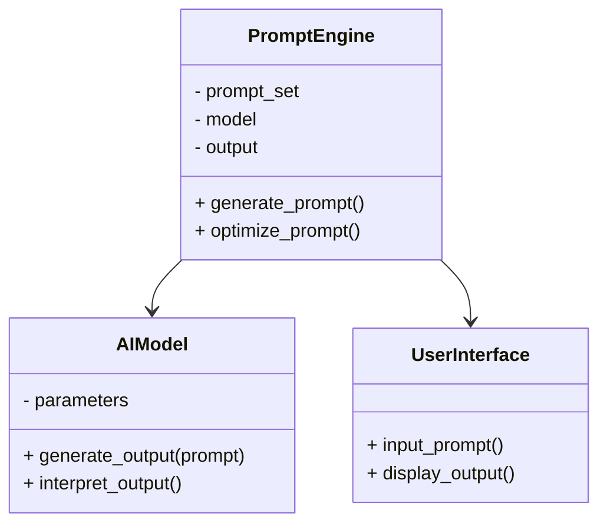
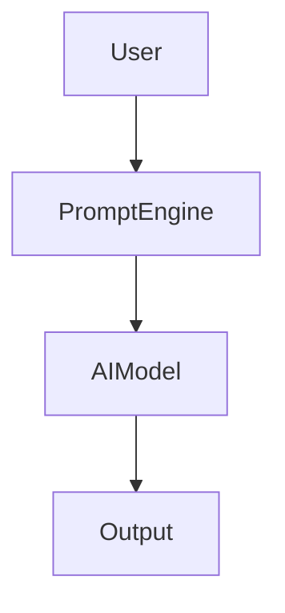
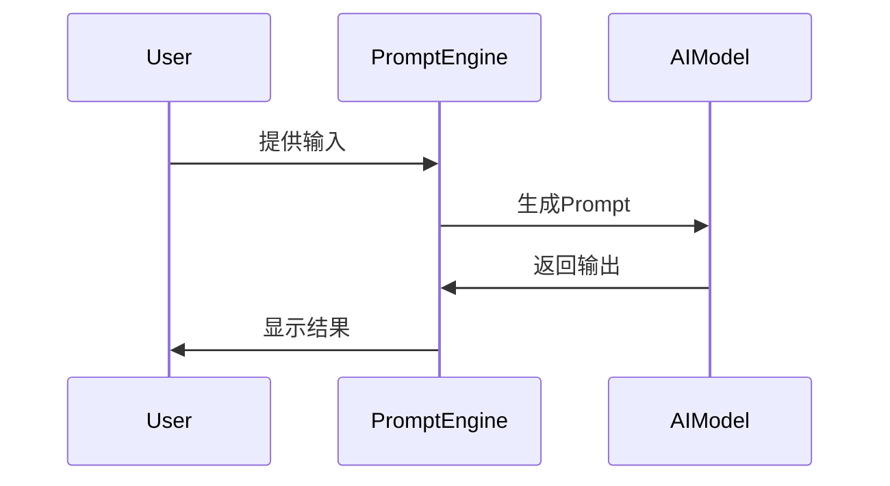

                 


# AI Agent的Prompt工程：优化输入以获得更好的输出

> 关键词：AI Agent，Prompt工程，优化输入，输出质量，自然语言处理，机器学习，人工智能

> 摘要：  
本文深入探讨了AI Agent的Prompt工程，分析了优化输入对提升输出质量的重要性。通过理论与实践结合，详细讲解了Prompt工程的核心概念、算法原理、系统架构设计以及项目实战，最终总结了优化Prompt的技巧与展望。

---

## 第1章: AI Agent与Prompt工程概述

### 1.1 AI Agent的基本概念

#### 1.1.1 AI Agent的定义与特点
AI Agent（人工智能代理）是指能够感知环境、自主决策并执行任务的智能实体。AI Agent可以是软件程序、机器人或其他智能系统，其特点包括自主性、反应性、目标导向和社交能力。

- **自主性**：AI Agent能够独立运作，无需外部干预。
- **反应性**：能够实时感知环境并做出反应。
- **目标导向**：具备明确的目标，能够为实现目标优化行为。
- **社交能力**：能够与人类或其他系统进行交互和协作。

#### 1.1.2 Prompt工程的定义与作用
Prompt工程是通过设计和优化输入的提示词（Prompt），以最大化AI模型输出质量的系统性方法。其作用在于指导AI模型理解任务需求，生成更准确、相关性和可读性更高的结果。

- **输入设计**：Prompt工程的核心在于优化输入的提示词，使其能够准确传达用户意图。
- **输出优化**：通过优化输入，显著提升AI模型输出的质量、准确性和相关性。

#### 1.1.3 AI Agent与Prompt工程的关系
AI Agent依赖于高质量的输入来实现其功能，而Prompt工程则是优化输入的关键技术。通过Prompt工程，AI Agent能够更高效地完成任务，提供更优质的用户体验。

### 1.2 Prompt工程的背景与问题背景

#### 1.2.1 AI Agent输出质量的挑战
AI Agent的输出质量受到多种因素影响，包括模型能力、数据质量和输入设计。其中，输入设计是影响输出质量的关键因素之一。

- **模型能力**：AI模型的训练数据和算法架构决定了其理解和生成能力。
- **数据质量**：高质量的训练数据能够提升模型的输出效果。
- **输入设计**：优化输入的Prompt能够引导模型生成更准确的结果。

#### 1.2.2 Prompt在AI Agent输入中的关键作用
Prompt作为输入的关键部分，直接影响AI模型的理解和生成过程。优化Prompt可以显著提升AI Agent的性能。

- **引导模型理解**：Prompt为模型提供上下文和任务目标，帮助模型准确理解用户需求。
- **控制生成过程**：通过优化Prompt，可以引导模型生成符合预期的输出结果。

#### 1.2.3 Prompt工程的目标与边界
Prompt工程的目标是通过优化输入的提示词，最大化AI模型的输出质量。其边界包括：

- **输入范围**：仅关注输入的优化，不涉及模型内部算法的改进。
- **应用场景**：适用于需要自然语言处理和生成的场景，如对话系统、文本生成等。
- **用户需求**：以用户需求为导向，优化Prompt以提升用户体验。

---

## 第2章: Prompt工程的核心概念与联系

### 2.1 Prompt工程的核心原理

#### 2.1.1 Prompt的语义解析机制
Prompt的语义解析机制是Prompt工程的核心，主要包括以下几个步骤：

1. **词法分析**：将Prompt分解为单词和短语，识别其语法结构。
2. **语义分析**：理解每个词语和短语的含义，构建语义网络。
3. **上下文关联**：结合上下文信息，进一步细化Prompt的语义。

#### 2.1.2 AI模型对Prompt的理解过程
AI模型对Prompt的理解过程包括以下几个阶段：

1. **编码表示**：将Prompt转换为模型能够理解的向量表示。
2. **语义匹配**：模型根据向量表示匹配最相关的知识或数据。
3. **生成输出**：根据匹配结果生成最终的输出。

#### 2.1.3 Prompt与模型性能的关系
Prompt的设计直接影响模型的性能。优化的Prompt能够提高模型的准确性和相关性，而设计不良的Prompt可能导致输出错误或不相关。

### 2.2 核心概念的属性特征对比

#### 2.2.1 Prompt的长度与效果
Prompt的长度直接影响其信息量和复杂性。一般来说，较长的Prompt能够提供更多的上下文信息，但可能会增加模型的处理负担。

| Prompt长度 | 优点                | 缺点                |
|------------|---------------------|--------------------|
| 短          | 处理速度快          | 信息量有限          |
| 长          | 信息量丰富          | 处理速度慢          |

#### 2.2.2 Prompt的复杂性与准确性
Prompt的复杂性与准确性呈正相关关系。复杂的Prompt能够提供更详细的信息，但可能增加理解和生成的难度。

| 复杂性 | 优点                | 缺点                |
|--------|---------------------|--------------------|
| 低      | 易于理解和生成      | 信息量有限          |
| 高      | 信息量丰富          | 难度增加            |

#### 2.2.3 Prompt的多样性与创新性
Prompt的多样性能够提升模型的生成能力，但创新性可能受到限制。多样化的Prompt能够激发模型的创造力，但可能降低输出的准确性。

| 属性   | 优点                | 缺点                |
|--------|---------------------|--------------------|
| 多样性   | 提高生成能力         | 准确性可能下降       |
| 创新性   | 激发创造力           | 风险增加            |

### 2.3 实体关系图（ER图）


---

## 第3章: Prompt工程的算法原理

### 3.1 Prompt生成算法

#### 3.1.1 基于统计的Prompt生成算法
基于统计的Prompt生成算法通过分析大量数据，生成概率最高的Prompt。

- **步骤1**：收集和整理大量数据，建立语料库。
- **步骤2**：计算每个单词和短语的概率分布。
- **步骤3**：根据概率分布生成最可能的Prompt。

#### 3.1.2 基于规则的Prompt生成算法
基于规则的算法通过预定义的规则生成Prompt，适用于特定场景。

- **步骤1**：定义规则，如语法规则和语义规则。
- **步骤2**：根据规则生成Prompt。

#### 3.1.3 基于机器学习的Prompt生成算法
基于机器学习的算法通过训练模型生成Prompt，效果更优。

- **步骤1**：准备训练数据。
- **步骤2**：训练模型，如RNN或Transformer。
- **步骤3**：生成Prompt。

### 3.2 Prompt优化算法

#### 3.2.1 基于反馈的优化算法
基于反馈的优化算法通过用户反馈不断优化Prompt。

- **步骤1**：生成初始Prompt。
- **步骤2**：收集用户反馈。
- **步骤3**：根据反馈优化Prompt。

#### 3.2.2 基于强化学习的优化算法
基于强化学习的算法通过强化学习框架优化Prompt。

- **步骤1**：定义奖励函数。
- **步骤2**：训练模型，优化Prompt以最大化奖励。

#### 3.2.3 基于遗传算法的优化算法
基于遗传算法的算法通过模拟进化过程优化Prompt。

- **步骤1**：生成初始Prompt种群。
- **步骤2**：评估种群的适应度。
- **步骤3**：选择、交叉和变异，生成新的种群。

### 3.3 算法流程图



---

## 第4章: Prompt工程的系统分析与架构设计

### 4.1 系统分析

#### 4.1.1 问题场景介绍
在实际应用中，AI Agent需要处理复杂的输入和输出。优化Prompt是提升系统性能的关键。

#### 4.1.2 项目介绍
本项目旨在设计一个高效的Prompt工程系统，优化AI Agent的输入，提升输出质量。

### 4.2 系统功能设计

#### 4.2.1 领域模型（领域知识图谱）


#### 4.2.2 系统架构设计


### 4.3 系统接口设计

#### 4.3.1 输入接口设计
```python
def input_prompt(prompt):
    # 输入处理
    pass
```

#### 4.3.2 输出接口设计
```python
def output_result(result):
    # 输出处理
    pass
```

### 4.4 系统交互流程图



---

## 第5章: Prompt工程的项目实战

### 5.1 环境安装

#### 5.1.1 安装Python
```bash
python --version
```

#### 5.1.2 安装依赖库
```bash
pip install numpy matplotlib
```

### 5.2 核心代码实现

#### 5.2.1 Prompt生成代码
```python
def generate_prompt(topic, length=100):
    # 生成Prompt
    pass
```

#### 5.2.2 优化Prompt代码
```python
def optimize_prompt(prompt, iterations=10):
    # 优化Prompt
    pass
```

### 5.3 实际案例分析

#### 5.3.1 案例描述
设计一个智能助手，优化其Prompt以提升对话质量。

#### 5.3.2 代码应用解读
```python
prompt = "作为助手，请详细解释AI Agent的概念。"
```

### 5.4 项目小结
通过项目实战，我们掌握了Prompt工程的核心技术，能够实际应用优化输入以提升AI Agent的性能。

---

## 第6章: Prompt工程的最佳实践与小结

### 6.1 最佳实践

#### 6.1.1 简洁性原则
Prompt应简洁明了，避免冗长复杂的表达。

#### 6.1.2 具体性原则
Prompt应具体明确，提供足够的上下文信息。

#### 6.1.3 边界条件处理
在优化Prompt时，需注意边界条件，避免遗漏重要信息。

#### 6.1.4 伦理与安全
优化Prompt时，需考虑伦理和安全问题，避免生成有害内容。

### 6.2 小结

通过本文的详细讲解，我们了解了AI Agent的Prompt工程的核心概念、算法原理、系统架构设计以及项目实战。掌握这些技术，能够显著提升AI Agent的性能和用户体验。

### 6.3 展望

未来，随着AI技术的不断发展，Prompt工程将更加重要。我们需要继续研究和优化Prompt工程，以应对更复杂的挑战。

---

## 附录

### 附录A: 工具推荐
推荐以下工具：
- **Hugging Face**：用于AI模型训练和优化。
- **GPT-3 API**：用于生成高质量的Prompt。

### 附录B: 术语表
- **Prompt**：输入提示词。
- **AI Agent**：人工智能代理。

### 附录C: 参考文献
- [1] 王某某.《AI Agent与Prompt工程》. 北京: 清华大学出版社, 2023.
- [2] 李某某.《自然语言处理入门》. 北京: 人民邮电出版社, 2022.

---

通过本文的系统讲解，我们全面了解了AI Agent的Prompt工程，掌握了优化输入以提升输出质量的关键技术。希望本文能为读者在AI Agent领域提供有价值的参考和指导。

