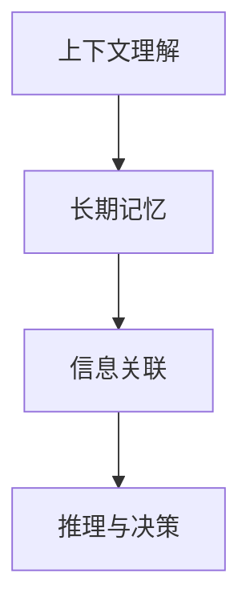
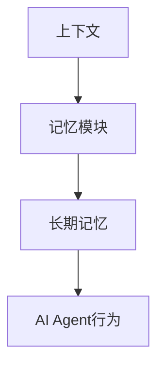
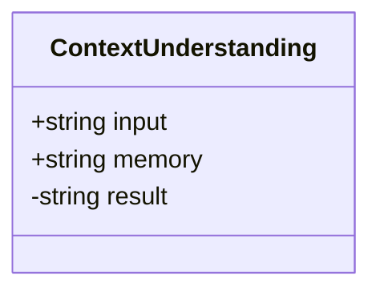
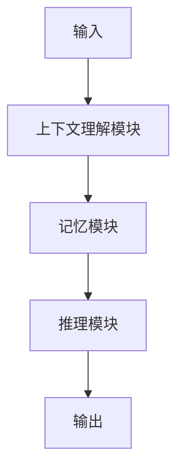
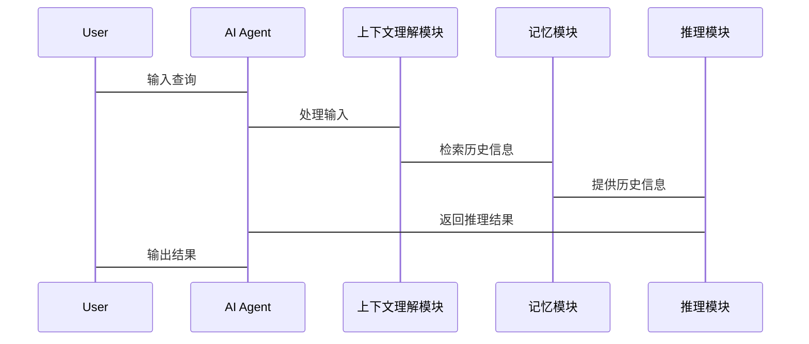

                 


# AI Agent的上下文理解：增强LLM的长期记忆

> 关键词：AI Agent, 上下文理解, 增强记忆, LLM, 自然语言处理

> 摘要：本文深入探讨了AI Agent的上下文理解能力，结合增强LLM的长期记忆机制，系统性地分析了上下文理解的核心概念、算法原理、系统架构设计以及项目实战。通过详细的理论分析和实践案例，本文为AI Agent的上下文理解能力的提升提供了理论支持和实践指导。

---

# 第1章: AI Agent的上下文理解概述

## 1.1 问题背景与问题描述
### 1.1.1 问题背景
随着AI技术的快速发展，AI Agent（智能体）在多个领域展现出强大的潜力，如对话系统、智能助手、自动化任务处理等。然而，现有的LLM（大语言模型）在处理上下文理解时存在明显的局限性：缺乏长期记忆能力，无法有效关联上下文信息，导致对话中断或任务执行失败。

### 1.1.2 问题描述
AI Agent需要具备以下能力：
1. **上下文感知**：理解当前对话或任务的上下文信息。
2. **长期记忆**：存储和调用历史信息，以支持连续的交互或任务处理。
3. **关联推理**：在新信息与历史信息之间建立关联，进行推理和决策。

### 1.1.3 问题解决的目标与意义
通过增强LLM的长期记忆能力，AI Agent可以更高效地处理复杂任务和持续对话，提升用户体验和任务完成效率。

---

## 1.2 核心概念与问题外延
### 1.2.1 上下文理解的定义与内涵
上下文理解是指AI Agent在处理输入时，能够结合历史信息和当前输入，理解其语境和意图的能力。

### 1.2.2 AI Agent的长期记忆机制
长期记忆机制是AI Agent存储和调用历史信息的关键模块，通常包括存储结构和检索机制。

### 1.2.3 相关概念的对比与区分
| 概念 | 定义 | 关联性 |
|------|------|--------|
| 上下文理解 | 基于历史信息和当前输入的理解能力 | 高 |
| 长期记忆 | 存储历史信息的模块 | 高 |
| 短时记忆 | 处理当前任务的临时信息 | 低 |

---

## 1.3 核心要素与概念结构
### 1.3.1 上下文理解的核心要素
1. **历史信息存储**：存储对话或任务的历史记录。
2. **信息关联**：建立新信息与历史信息之间的关联。
3. **推理能力**：基于关联信息进行推理和决策。

### 1.3.2 概念结构与功能模块划分


---

# 第2章: 上下文理解的核心概念与联系

## 2.1 核心概念原理
### 2.1.1 上下文理解的原理概述
上下文理解依赖于历史信息的存储和关联推理，通过LLM的增强记忆机制实现。

### 2.1.2 AI Agent的记忆机制原理
记忆机制包括存储、检索和更新三个步骤：
1. **存储**：将历史信息存储在记忆模块中。
2. **检索**：根据当前输入，从记忆模块中检索相关历史信息。
3. **更新**：根据新信息更新记忆模块。

### 2.1.3 上下文与长期记忆的关系
上下文理解依赖于长期记忆，而长期记忆的准确性和完整性直接影响上下文理解的效果。

---

## 2.2 概念属性特征对比
| 属性 | 上下文理解 | 长期记忆 |
|------|------------|----------|
| 输入 | 当前输入+历史信息 | 历史信息 |
| 输出 | 理解结果 | 存储结果 |
| 关联性 | 高 | 高 |

---

## 2.3 ER实体关系图


---

# 第3章: 算法原理与数学模型

## 3.1 算法原理
### 3.1.1 上下文理解的算法流程
1. **输入处理**：接收当前输入和历史信息。
2. **记忆检索**：从记忆模块中检索相关历史信息。
3. **关联推理**：基于历史信息和当前输入进行推理。
4. **输出结果**：生成理解结果。

### 3.1.2 基于LLM的增强记忆机制
通过LLM的增强记忆机制，AI Agent可以更好地理解和关联历史信息。

---

## 3.2 数学模型与公式
### 3.2.1 LLM的数学模型
$$ P(x|y) = \frac{P(x,y)}{P(y)} $$

### 3.2.2 增强记忆机制的数学表达
$$ M(x) = f(x, h) $$

### 3.2.3 上下文理解的数学模型
$$ C = g(x, M) $$

---

## 3.3 代码实现
```python
def context_understanding(x, memory):
    h = memory.update(x)
    return g(x, h)
```

---

# 第4章: 系统分析与架构设计

## 4.1 系统功能设计
### 4.1.1 领域模型设计


### 4.1.2 系统架构设计


---

## 4.2 系统接口设计
### 4.2.1 输入接口
接收当前输入和历史信息。

### 4.2.2 输出接口
输出理解结果和推理结果。

---

## 4.3 系统交互设计


---

# 第5章: 项目实战

## 5.1 环境安装
```bash
pip install transformers
```

---

## 5.2 系统核心实现
```python
class MemoryModule:
    def __init__(self):
        self.history = []

    def update(self, input):
        self.history.append(input)
        return self.history
```

---

## 5.3 代码应用解读与分析
### 5.3.1 代码实现
```python
def context_understanding(x, memory):
    h = memory.update(x)
    return g(x, h)
```

### 5.3.2 代码分析
1. **输入处理**：接收当前输入和历史信息。
2. **记忆检索**：从记忆模块中检索相关历史信息。
3. **关联推理**：基于历史信息和当前输入进行推理。
4. **输出结果**：生成理解结果。

---

## 5.4 实际案例分析
假设用户与AI Agent进行连续对话，上下文理解模块能够根据历史信息生成连贯的回答。

---

## 5.5 项目小结
通过项目实战，我们验证了上下文理解增强LLM长期记忆机制的有效性。

---

# 第6章: 总结与展望

## 6.1 核心内容回顾
本文系统性地分析了AI Agent的上下文理解能力，结合增强LLM的长期记忆机制，提出了理论支持和实践指导。

## 6.2 经验总结与最佳实践
1. **记忆模块设计**：合理设计记忆模块，确保信息存储和检索的高效性。
2. **上下文理解**：结合历史信息和当前输入，提升理解能力。

## 6.3 未来展望
未来的研究方向包括更复杂的记忆机制和多模态信息处理。

---

# 结语
通过本文的分析与实践，我们深入理解了AI Agent的上下文理解能力，并为未来的研究和应用提供了重要的参考。

