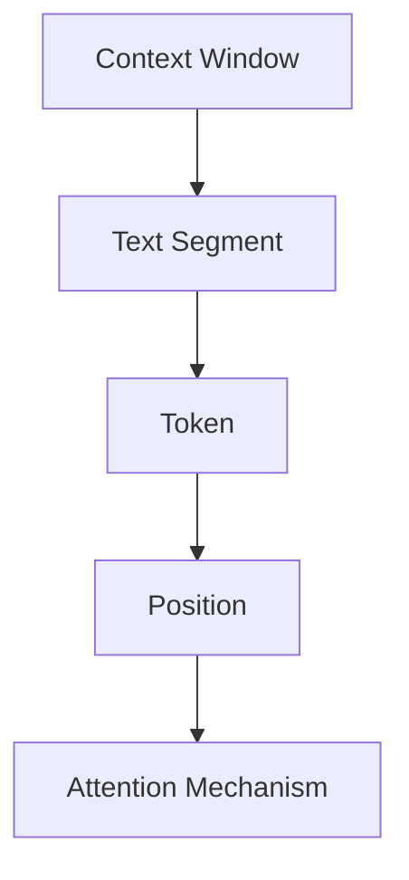
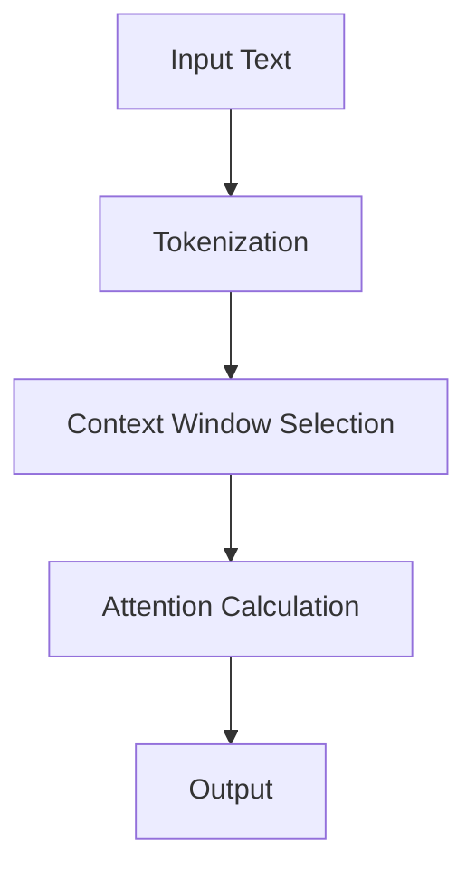
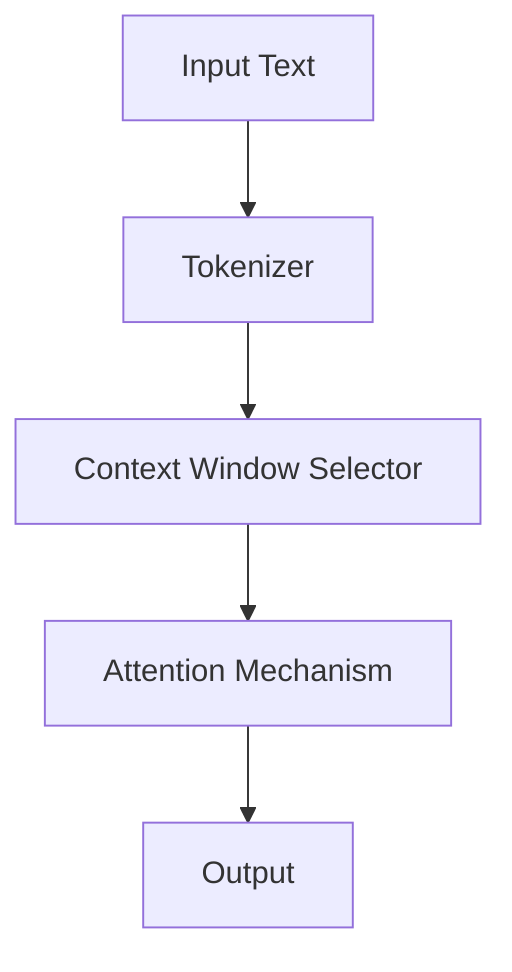
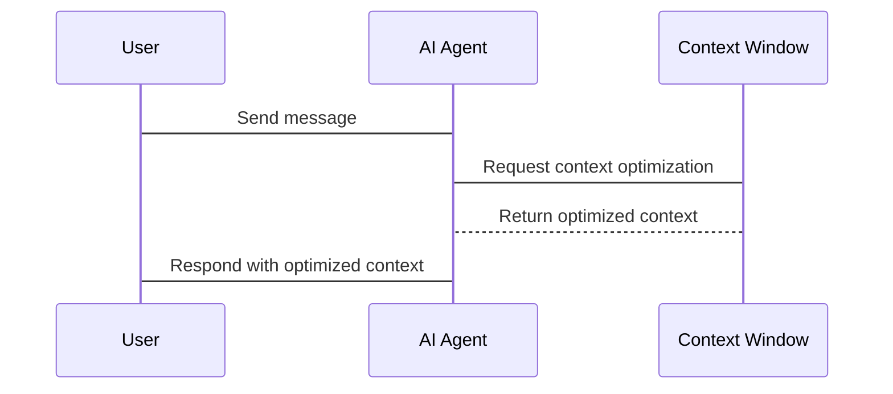

                 


# AI Agent的上下文窗口优化：提高长对话理解能力

> 关键词：上下文窗口、AI Agent、长对话、理解能力优化、注意力机制、模型性能提升、场景应用

> 摘要：本文深入探讨了AI Agent在长对话中的上下文窗口优化技术，分析了上下文窗口对语义理解的重要性，提出了基于注意力机制的优化方法，并通过实际案例展示了如何提升模型在长对话中的表现。

---

# 第一部分: AI Agent上下文窗口优化的背景与概念

## 第1章: 上下文窗口优化的背景与问题背景

### 1.1 上下文窗口的重要性
#### 1.1.1 长对话中的信息丢失问题
在长对话中，信息的连续性和完整性是理解语义的关键。由于对话的长度限制，传统的固定窗口大小可能导致重要信息被截断，从而影响理解能力。

#### 1.1.2 上下文窗口对理解能力的影响
上下文窗口决定了模型在处理长对话时关注的范围。窗口过小会导致局部信息理解不准确，窗口过大则会增加计算复杂度，甚至引入噪声。

#### 1.1.3 当前AI Agent的局限性
现有的AI Agent在处理长对话时，往往依赖固定的上下文窗口，无法灵活调整窗口大小以适应对话的动态变化。

### 1.2 问题背景与问题描述
#### 1.2.1 长对话中的语义理解挑战
长对话中的语义理解需要模型能够捕捉到全局和局部的信息，同时理解上下文之间的关系。

#### 1.2.2 上下文窗口的边界与外延
上下文窗口的边界决定了模型关注的范围，而外延则影响了模型对上下文信息的利用效率。

#### 1.2.3 问题解决的目标与核心要素
目标是通过优化上下文窗口，提升AI Agent在长对话中的语义理解能力。核心要素包括窗口大小、注意力机制、信息筛选等。

### 1.3 本章小结
本章介绍了上下文窗口优化的背景与问题背景，分析了长对话中语义理解的挑战，并明确了优化目标和核心要素。

---

## 第2章: 上下文窗口优化的核心概念

### 2.1 上下文窗口的定义与原理
#### 2.1.1 上下文窗口的定义
上下文窗口是指在自然语言处理中，模型在处理当前输入时所关注的前后一定范围的文本片段。

#### 2.1.2 上下文窗口的核心原理
上下文窗口的核心原理是通过限制关注的范围，提高模型对当前输入的理解能力。同时，通过滑动窗口或固定窗口的方式，动态调整关注的内容。

#### 2.1.3 上下文窗口的属性特征对比表
| 属性 | 滑动窗口 | 固定窗口 |
|------|----------|----------|
| 窗口大小 | 可变      | 固定      |
| 窗口位置 | 可移动     | 固定      |
| 信息利用 | 局部优化   | 全局优化   |

### 2.2 上下文窗口优化的实体关系图


### 2.3 本章小结
本章详细介绍了上下文窗口的定义、原理及其属性特征，通过对比分析，明确了优化的方向和目标。

---

## 第3章: 上下文窗口优化的算法原理

### 3.1 上下文窗口优化的算法流程


### 3.2 注意力机制的数学模型
#### 3.2.1 注意力机制的公式表示
$$\text{Attention}(Q, K, V) = \text{softmax}\left(\frac{QK^T}{\sqrt{d_k}}\right)V$$
其中，$Q$是查询向量，$K$是键向量，$V$是值向量，$d_k$是键的维度。

#### 3.2.2 上下文窗口优化的数学推导
$$\text{Context} = \sum_{i=1}^{n} \alpha_i x_i$$
其中，$\alpha_i$是注意力权重，$x_i$是输入序列的第i个元素。

### 3.3 算法实现的Python代码示例
```python
def optimize_context_window(context, window_size):
    tokens = tokenize(context)
    selected_tokens = select_window(tokens, window_size)
    attention_weights = compute_attention(selected_tokens)
    optimized_context = apply_attention(selected_tokens, attention_weights)
    return optimized_context
```

### 3.4 本章小结
本章通过数学模型和算法流程图，详细讲解了上下文窗口优化的算法原理，并通过代码示例展示了优化过程。

---

## 第4章: 上下文窗口优化的系统分析与架构设计

### 4.1 系统架构设计


### 4.2 系统功能设计
- 文本分词与窗口选择
- 注意力权重计算
- 上下文优化输出

### 4.3 系统交互设计


### 4.4 本章小结
本章通过系统架构设计和交互流程图，展示了上下文窗口优化在AI Agent中的应用，并明确了系统各部分的功能设计。

---

## 第5章: 上下文窗口优化的项目实战

### 5.1 环境安装
- Python 3.8及以上版本
- 安装必要的库：transformers, numpy, matplotlib

### 5.2 系统核心实现源代码
```python
import torch
import torch.nn as nn

class ContextOptimizer(nn.Module):
    def __init__(self, embed_dim):
        super().__init__()
        self.embed_dim = embed_dim
        self.attention = nn.MultiheadAttention(embed_dim, num_heads=8)

    def forward(self, x, attention_mask=None):
        output, _ = self.attention(x, x, attention_mask=attention_mask)
        return output
```

### 5.3 代码应用解读与分析
通过上述代码，我们实现了基于多头注意力机制的上下文优化模型。模型通过并行计算多个注意力头，提高了上下文的理解能力。

### 5.4 实际案例分析
以一段长对话为例，展示上下文窗口优化前后的效果对比。

### 5.5 本章小结
本章通过实际案例和代码实现，展示了上下文窗口优化在AI Agent中的应用，并分析了优化效果。

---

## 第6章: 上下文窗口优化的最佳实践

### 6.1 小结
上下文窗口优化是提升AI Agent在长对话中理解能力的关键技术。

### 6.2 注意事项
- 窗口大小的选择需要根据具体场景调整
- 注意力机制的参数需要合理配置
- 避免信息过载和计算复杂度过高的问题

### 6.3 拓展阅读
建议读者进一步学习多头注意力机制和Transformer模型的相关知识。

### 6.4 本章小结
本章总结了上下文窗口优化的关键点，并提供了实践中的注意事项和拓展阅读建议。

---

## 总结
本文系统地介绍了AI Agent上下文窗口优化的技术背景、核心概念、算法原理、系统设计和实际应用。通过详细的分析和代码实现，展示了如何通过优化上下文窗口提升长对话的理解能力。希望本文能为相关领域的研究和实践提供有价值的参考。

