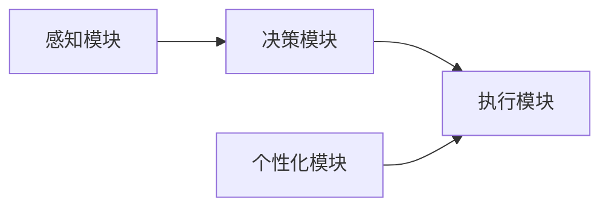

                 


# AI Agent的个性化与定制化实现

> **关键词**：AI Agent，个性化，定制化，推荐系统，机器学习，系统架构

> **摘要**：本文深入探讨了AI Agent的个性化与定制化实现方法，从基本概念到核心机制，再到具体实现步骤，结合实际案例和系统架构设计，详细讲解了如何构建一个高效且个性化的AI Agent。

---

# 第1章: AI Agent的基本概念与背景

## 1.1 AI Agent的定义与类型

### 1.1.1 什么是AI Agent
AI Agent（人工智能代理）是指能够感知环境、自主决策并执行任务的智能实体。它通过传感器获取信息，利用算法处理数据，并通过执行器与环境交互。

### 1.1.2 AI Agent的类型
AI Agent可以根据智能水平分为以下几类：
1. **反应式AI Agent**：基于当前感知做出反应，不依赖历史信息。
2. **认知式AI Agent**：具备复杂推理和规划能力，能够处理复杂任务。
3. **学习式AI Agent**：能够通过经验改进性能，具备自适应能力。

### 1.1.3 AI Agent的应用场景
AI Agent广泛应用于智能助手、推荐系统、自动驾驶等领域。例如，智能音箱通过语音交互为用户提供服务，就是一个典型的AI Agent应用。

## 1.2 个性化与定制化的核心概念

### 1.2.1 个性化AI Agent的定义
个性化AI Agent能够根据用户需求和偏好提供定制化服务。例如，智能音箱根据用户的听歌习惯推荐音乐。

### 1.2.2 定制化AI Agent的特征
定制化AI Agent具备灵活性和可扩展性，能够根据特定需求调整功能和行为。

### 1.2.3 个性化与定制化的区别与联系
个性化关注用户体验的差异性，而定制化关注功能的可调整性。两者相辅相成，共同提升AI Agent的适应性和智能性。

---

# 第2章: AI Agent的核心机制

## 2.1 感知模块

### 2.1.1 数据输入与处理
AI Agent通过传感器或API获取环境数据，例如语音输入、图像识别等。

### 2.1.2 感知算法
常用感知算法包括自然语言处理（NLP）和计算机视觉（CV）技术。

### 2.1.3 感知模块的实现流程
1. 数据采集
2. 数据预处理
3. 特征提取
4. 感知结果输出

## 2.2 决策模块

### 2.2.1 决策算法
基于感知结果，决策模块选择最优行动方案。常用算法包括随机森林和神经网络。

### 2.2.2 决策逻辑
通过条件判断和优先级排序，AI Agent决定执行的具体动作。

### 2.2.3 决策模块的实现流程
1. 分析感知结果
2. 生成候选方案
3. 选择最优方案
4. 输出决策结果

## 2.3 执行模块

### 2.3.1 执行算法
通过控制执行器（如电机、扬声器）实现决策结果的物理操作。

### 2.3.2 执行逻辑
根据决策模块的输出，执行模块驱动外部设备完成任务。

### 2.3.3 执行模块的实现流程
1. 接收决策指令
2. 调用执行器
3. 监控执行状态
4. 返回执行结果

---

# 第3章: AI Agent的个性化实现方法

## 3.1 用户需求分析

### 3.1.1 需求采集与处理
通过用户输入、日志分析等方式收集用户需求。

### 3.1.2 用户画像构建
基于收集的数据，构建用户画像，包括兴趣、习惯等特征。

### 3.1.3 需求分析算法
使用聚类分析和关联规则挖掘技术，识别用户的潜在需求。

## 3.2 特征提取与匹配

### 3.2.1 特征提取方法
从用户数据中提取关键特征，例如行为模式、偏好等。

### 3.2.2 特征匹配算法
通过相似度计算，将用户特征与系统提供的服务进行匹配。

### 3.2.3 特征提取与匹配的实现流程
1. 数据预处理
2. 特征提取
3. 特征匹配
4. 输出匹配结果

## 3.3 个性化推荐系统

### 3.3.1 推荐算法
使用协同过滤、内容过滤和混合推荐算法，为用户提供个性化推荐。

### 3.3.2 推荐系统实现流程
1. 数据收集
2. 用户建模
3. 推荐生成
4. 推荐输出

---

# 第4章: AI Agent的定制化实现方法

## 4.1 功能扩展

### 4.1.1 功能模块设计
根据需求添加新功能模块，例如多语言支持、个性化设置。

### 4.1.2 功能扩展算法
通过模块化设计，实现功能的动态加载和卸载。

### 4.1.3 功能扩展的实现流程
1. 需求分析
2. 模块开发
3. 集成测试
4. 上线部署

## 4.2 参数调优

### 4.2.1 参数优化方法
使用遗传算法和模拟退火算法优化模型参数。

### 4.2.2 参数调优算法
通过多次迭代，找到最优参数组合，提升模型性能。

### 4.2.3 参数调优的实现流程
1. 确定优化目标
2. 初始化参数
3. 迭代优化
4. 结果验证

## 4.3 模型微调

### 4.3.1 模型微调方法
基于特定任务调整模型参数和结构，提升模型适应性。

### 4.3.2 模型微调算法
通过迁移学习和微调技术，优化模型在特定场景下的表现。

### 4.3.3 模型微调的实现流程
1. 数据准备
2. 模型加载
3. 微调训练
4. 模型评估

---

# 第5章: AI Agent的系统架构设计与项目实战

## 5.1 系统模块划分

### 5.1.1 模块划分原则
按照功能需求，将系统划分为感知模块、决策模块、执行模块和个性化模块。

## 5.2 系统架构设计

### 5.2.1 系统架构设计
使用Mermaid图展示系统架构，包括各模块的交互关系和数据流。



## 5.3 项目实战

### 5.3.1 环境安装
安装必要的库和工具，例如Python、TensorFlow、Keras。

### 5.3.2 核心代码实现

```python
class AIAssistant:
    def __init__(self):
        self.sensors = []
        self actuators = []
        self个性模块 = PersonalizationModule()

    def感知(self):
        # 获取感知数据
        pass

    def决策(self, data):
        # 处理数据，生成决策
        pass

    def执行(self, decision):
        # 执行决策
        pass

    def个性化设置(self):
        # 应用个性化模块
        pass
```

### 5.3.3 代码应用解读与分析
详细解读代码结构，说明各模块的职责和交互方式。

### 5.3.4 实际案例分析
通过一个具体案例，展示AI Agent在个性化推荐中的应用。

### 5.3.5 项目小结
总结项目实现过程中的经验教训，提出改进建议。

---

# 总结与展望

本文详细探讨了AI Agent的个性化与定制化实现方法，从基本概念到具体实现，结合实际案例和系统架构设计，为读者提供了全面的指导。未来，随着技术的不断发展，AI Agent将具备更强的智能性和适应性，为更多领域带来创新和变革。

---

**注意事项**：
- 在实现个性化和定制化功能时，需注意数据隐私和安全问题。
- 系统架构设计应充分考虑可扩展性和可维护性。
- 推荐使用主流的机器学习框架（如TensorFlow、PyTorch）进行模型训练和优化。

**拓展阅读**：
- 《机器学习实战》
- 《深度学习入门：基于Python》
- 《设计模式：可复用面向对象软件的基础》

