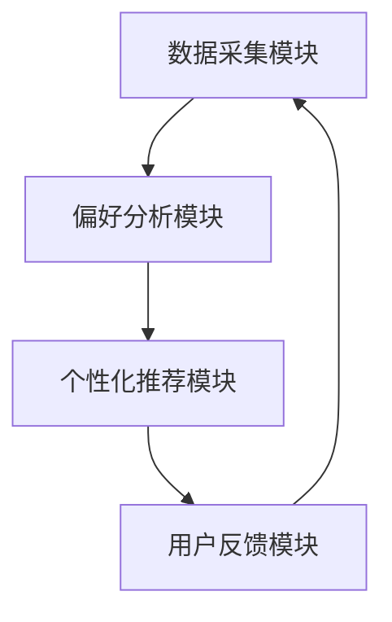
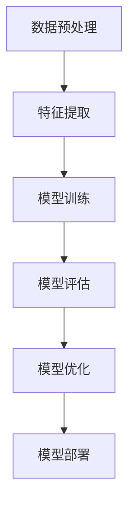
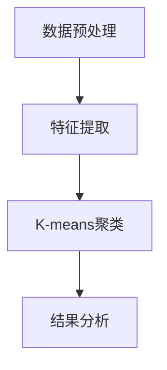
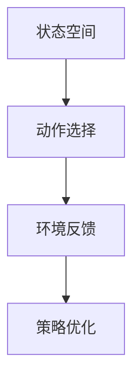

                 


# AI Agent的个性化定制：用户偏好学习与应用

## 关键词：AI Agent、个性化定制、用户偏好学习、机器学习、算法实现、系统架构

## 摘要：  
AI Agent的个性化定制是人工智能领域的重要研究方向，其核心在于如何有效学习和应用用户的偏好。本文从AI Agent的基本概念出发，详细探讨了用户偏好学习的原理与方法，并结合实际案例，系统讲解了AI Agent个性化定制的实现过程，包括算法实现、系统架构设计以及项目实战。通过本文的学习，读者能够全面理解AI Agent个性化定制的核心技术，并掌握实际应用的技能。

---

## 第一部分: AI Agent与用户偏好概述

### 第1章: AI Agent与用户偏好概述

#### 1.1 AI Agent的基本概念

##### 1.1.1 AI Agent的定义
AI Agent（人工智能代理）是指能够感知环境、自主决策并执行任务的智能实体。它能够通过与用户的交互或环境数据的分析，提供个性化服务或解决方案。AI Agent的核心在于其智能性，能够理解用户需求并主动优化输出。

##### 1.1.2 AI Agent的核心特征
- **自主性**：AI Agent能够在没有外部干预的情况下自主运行。
- **反应性**：能够实时感知环境变化并做出相应反应。
- **学习能力**：通过数据和经验不断优化自身行为。
- **决策能力**：基于当前状态和目标，选择最优行动方案。

##### 1.1.3 用户偏好在AI Agent中的作用
用户偏好是AI Agent实现个性化服务的关键。通过分析用户的偏好，AI Agent能够提供更精准的服务，提升用户体验。例如，推荐系统可以根据用户的偏好调整推荐内容，从而提高用户满意度。

#### 1.2 个性化定制的背景与意义

##### 1.2.1 个性化定制的背景
随着人工智能技术的快速发展，用户对个性化服务的需求日益增长。传统通用服务无法满足用户的多样化需求，个性化定制成为必然趋势。

##### 1.2.2 用户偏好学习的重要性
用户偏好学习是实现个性化定制的核心技术。通过对用户行为、反馈和偏好数据的分析，AI Agent能够更好地理解用户需求，提供更精准的服务。

##### 1.2.3 AI Agent个性化定制的必要性
个性化定制能够提高用户满意度，增强用户粘性，同时也能提高企业的竞争力。通过个性化定制，AI Agent能够更好地满足用户需求，提升服务质量。

#### 1.3 本章小结
本章介绍了AI Agent的基本概念及其核心特征，强调了用户偏好在AI Agent个性化定制中的重要性，并指出了个性化定制的背景与意义。

---

## 第二部分: 用户偏好学习的核心概念

### 第2章: 用户偏好学习的原理与方法

#### 2.1 用户偏好的定义与分类

##### 2.1.1 用户偏好的定义
用户偏好是指用户在特定场景下对某些事物的偏好程度。偏好可以通过用户的行为数据、反馈数据等进行建模和分析。

##### 2.1.2 用户偏好的分类
用户偏好可以分为显式偏好和隐式偏好。显式偏好是指用户主动提供的偏好信息，如评分、标签等；隐式偏好是指通过用户行为间接推断出的偏好，如点击、浏览时间等。

##### 2.1.3 用户偏好与个性化定制的关系
用户偏好是个性化定制的基础。通过分析用户的偏好，AI Agent能够提供更符合用户需求的服务。

#### 2.2 用户偏好学习的核心算法

##### 2.2.1 监督学习在用户偏好中的应用
监督学习是一种基于标签数据的机器学习方法。在用户偏好学习中，监督学习可以用于分类任务，如用户是否喜欢某个商品。

##### 2.2.2 无监督学习在用户偏好中的应用
无监督学习是一种基于无标签数据的机器学习方法。在用户偏好学习中，无监督学习可以用于聚类任务，如将用户分成不同的偏好群体。

##### 2.2.3 强化学习在用户偏好中的应用
强化学习是一种基于奖励机制的机器学习方法。在用户偏好学习中，强化学习可以用于推荐系统，通过不断优化推荐策略来提高用户满意度。

#### 2.3 用户偏好学习的挑战与解决方案

##### 2.3.1 数据稀疏性问题
数据稀疏性是指用户行为数据不足，导致模型难以准确捕捉用户偏好。解决方案包括数据增强和模型优化。

##### 2.3.2 用户行为的动态变化
用户的偏好可能随时间变化，导致模型需要不断更新。解决方案包括在线学习和模型重训练。

##### 2.3.3 解决方案与优化策略
通过结合多种学习方法和优化策略，可以有效应对用户偏好学习中的挑战。

#### 2.4 本章小结
本章详细介绍了用户偏好学习的核心算法及其应用场景，分析了用户偏好学习的挑战，并提出了相应的解决方案。

---

## 第三部分: AI Agent的个性化定制实现

### 第3章: AI Agent个性化定制的系统架构

#### 3.1 系统架构设计

##### 3.1.1 系统功能模块划分
AI Agent个性化定制系统通常包括数据采集、偏好分析、个性化推荐和用户反馈四个功能模块。

##### 3.1.2 系统架构图


#### 3.2 数据流与交互流程

##### 3.2.1 用户输入与偏好采集
用户输入包括用户的行为数据和反馈数据。数据采集模块负责收集这些数据，并将其传递给偏好分析模块。

##### 3.2.2 偏好分析与处理
偏好分析模块通过机器学习算法分析用户数据，提取用户的偏好信息，并将其传递给个性化推荐模块。

##### 3.2.3 个性化推荐生成
个性化推荐模块基于用户的偏好信息，生成个性化的推荐结果，并将其返回给用户。

#### 3.3 系统接口设计

##### 3.3.1 用户接口（UI）
用户可以通过图形界面与AI Agent进行交互，输入偏好信息或查看推荐结果。

##### 3.3.2 API接口设计
系统提供API接口，允许其他系统或应用调用AI Agent的服务，如推荐API。

##### 3.3.3 数据接口设计
系统提供数据接口，用于与其他系统或数据库进行数据交互。

#### 3.4 本章小结
本章介绍了AI Agent个性化定制系统的架构设计，包括功能模块划分、数据流与交互流程以及系统接口设计。

---

## 第四部分: 个性化定制的算法实现

### 第4章: 用户偏好分析的算法实现

#### 4.1 基于监督学习的偏好分析

##### 4.1.1 算法流程图


##### 4.1.2 Python代码实现
```python
import numpy as np
from sklearn.linear_model import LogisticRegression

# 数据预处理
X = np.array([[1, 2], [3, 4], [5, 6]])
y = np.array([0, 1, 0])

# 特征提取
# （假设特征提取已经完成）

# 模型训练
model = LogisticRegression()
model.fit(X, y)

# 模型评估
print(model.score(X, y))
```

#### 4.2 基于无监督学习的偏好分析

##### 4.2.1 算法流程图


##### 4.2.2 Python代码实现
```python
from sklearn.cluster import KMeans

X = np.array([[1, 2], [3, 4], [5, 6], [7, 8]])
y = np.array([0, 1, 0, 1])

model = KMeans(n_clusters=2)
model.fit(X)

print(model.labels_)
```

#### 4.3 基于强化学习的偏好分析

##### 4.3.1 算法流程图


##### 4.3.2 Python代码实现
```python
import gym
from gym import spaces

# 环境定义
class PreferenceEnv(gym.Env):
    def __init__(self):
        self.observation_space = spaces.Discrete(2)
        self.action_space = spaces.Discrete(2)
    
    def step(self, action):
        # 状态转移和奖励计算
        pass
    
    def reset(self):
        pass

# 策略优化
env = PreferenceEnv()
model = ...
```

#### 4.4 本章小结
本章详细介绍了用户偏好分析的算法实现，包括监督学习、无监督学习和强化学习的应用，并通过Python代码展示了具体实现过程。

---

## 第五部分: 项目实战

### 第5章: 个性化推荐系统实现

#### 5.1 环境安装
需要安装的Python库包括：numpy、pandas、scikit-learn、gym等。

#### 5.2 系统核心实现源代码

##### 5.2.1 数据采集模块
```python
import requests
import json

# 网页请求
response = requests.get('http://example.com/data')
data = json.loads(response.text)
```

##### 5.2.2 偏好分析模块
```python
from sklearn.decomposition import PCA

# 主成分分析
pca = PCA(n_components=2)
pca.fit(X)
```

##### 5.2.3 个性化推荐模块
```python
from sklearn.neighbors import NearestNeighbors

# k近邻算法
nbrs = NearestNeighbors(n_neighbors=3).fit(X)
distances, indices = nbrs.kneighbors(X)
```

#### 5.3 代码应用解读与分析
通过上述代码，可以实现用户偏好分析和个性化推荐功能。数据采集模块负责获取用户数据，偏好分析模块通过机器学习算法提取用户的偏好信息，个性化推荐模块基于偏好信息生成推荐结果。

#### 5.4 实际案例分析
以电影推荐系统为例，通过分析用户的观影记录和评分，生成个性化的电影推荐列表。

#### 5.5 项目小结
本章通过实际案例展示了AI Agent个性化定制的应用，详细讲解了项目的实现过程，并总结了项目中的经验与教训。

---

## 第六部分: 最佳实践与总结

### 第6章: 最佳实践与总结

#### 6.1 最佳实践
- 定期更新模型，以应对用户偏好变化。
- 结合多种算法，提高推荐系统的准确性。
- 优化用户反馈机制，提升用户体验。

#### 6.2 小结
本文详细讲解了AI Agent个性化定制的核心技术，包括用户偏好学习、算法实现和系统架构设计。通过实际案例分析，读者能够掌握AI Agent个性化定制的实现方法。

#### 6.3 注意事项
- 数据隐私保护
- 模型的可解释性
- 系统的可扩展性

#### 6.4 拓展阅读
- 《推荐系统导论》
- 《机器学习实战》
- 《强化学习：理论与应用》

---

## 总结
通过本文的学习，读者能够全面理解AI Agent个性化定制的核心技术，并掌握实际应用的技能。未来，随着人工智能技术的不断发展，AI Agent的个性化定制将更加智能化和个性化，为用户提供更优质的服务。

