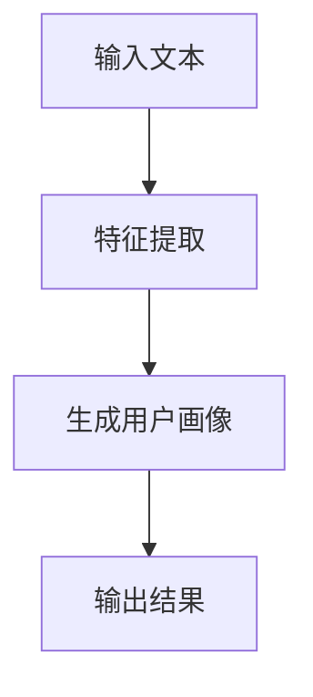
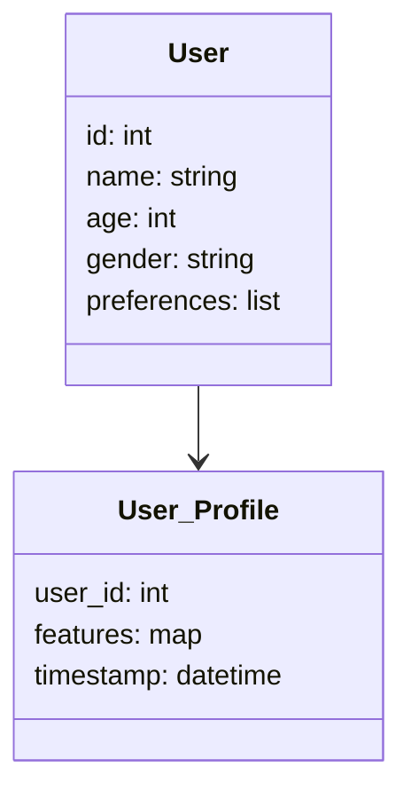
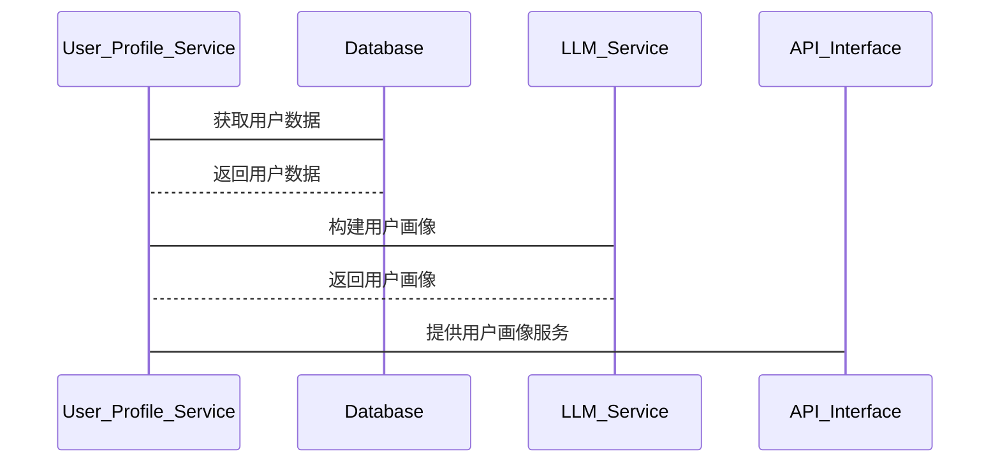

                 


# {{AI Agent的个性化：基于LLM的用户画像构建}}

> 关键词：AI Agent, 用户画像, 大语言模型, 个性化推荐, 人机交互, 机器学习

> 摘要：  
本文深入探讨了如何基于大语言模型（LLM）构建个性化AI Agent的核心技术，重点分析了用户画像的构建方法及其在AI Agent中的应用。通过理论分析、算法原理、系统架构设计和项目实战，详细阐述了基于LLM的用户画像构建过程，包括数据采集、特征提取、模型训练和系统实现等关键步骤。本文还提供了丰富的案例分析和代码实现，帮助读者全面掌握基于LLM的个性化AI Agent开发技术。

---

# 第一部分: AI Agent的个性化与用户画像构建背景

# 第1章: AI Agent与用户画像概述

## 1.1 AI Agent的基本概念
### 1.1.1 AI Agent的定义与特点
- **AI Agent**：智能体，指能够感知环境、自主决策并执行任务的实体。
- **特点**：自主性、反应性、目标导向、学习能力。
- **应用场景**：对话系统、推荐系统、智能助手、自动化工具。

### 1.1.2 AI Agent的核心功能与应用场景
- **核心功能**：信息处理、决策支持、任务执行、用户交互。
- **应用场景**：聊天机器人、个性化推荐、智能客服、自动化流程管理。

### 1.1.3 个性化AI Agent的意义与价值
- **个性化需求**：用户期望AI Agent能够理解其偏好并提供定制化服务。
- **价值**：提升用户体验、提高效率、增强用户粘性。

## 1.2 用户画像的定义与构建方法
### 1.2.1 用户画像的定义
- 用户画像是基于用户行为数据和属性信息构建的用户特征模型。

### 1.2.2 用户画像的构建流程
- **数据采集**：收集用户的行为数据、属性数据和偏好数据。
- **特征提取**：从数据中提取关键特征，如年龄、性别、兴趣爱好等。
- **画像分析**：通过数据挖掘和机器学习技术构建用户画像。
- **动态更新**：根据用户行为的实时变化更新用户画像。

### 1.2.3 用户画像在AI Agent中的作用
- **个性化推荐**：基于用户画像提供个性化内容推荐。
- **精准交互**：通过用户画像实现精准的用户意图识别和对话生成。

## 1.3 个性化AI Agent的背景与挑战
### 1.3.1 个性化需求的兴起
- 随着AI技术的发展，用户对个性化服务的需求日益增长。

### 1.3.2 当前AI Agent的局限性
- **缺乏个性化**：大多数AI Agent基于通用模型，难以满足个性化需求。
- **数据不足**：用户数据稀疏性可能导致画像构建不准确。
- **计算资源限制**：个性化模型需要大量计算资源。

### 1.3.3 基于LLM的个性化AI Agent的潜力
- **强大的生成能力**：LLM能够生成多样化的内容，满足个性化需求。
- **语义理解能力**：LLM能够理解上下文，实现更精准的用户意图识别。

## 1.4 本章小结
- 介绍了AI Agent的基本概念和核心功能。
- 阐述了用户画像的定义、构建方法及其在AI Agent中的作用。
- 分析了个性化AI Agent的背景、挑战和基于LLM的潜力。

---

# 第2章: 基于LLM的用户画像构建核心概念

## 2.1 用户画像的构建过程
### 2.1.1 数据采集与预处理
- **数据来源**：日志数据、用户调查、社交媒体数据。
- **预处理步骤**：数据清洗、特征提取、数据标准化。

### 2.1.2 特征提取与维度分析
- **特征提取**：从原始数据中提取有用的特征，如用户行为、兴趣爱好。
- **维度分析**：通过主成分分析（PCA）等方法降低特征维度。

### 2.1.3 用户画像的动态更新机制
- **实时更新**：根据用户实时行为动态更新画像。
- **增量学习**：通过增量学习方法更新模型参数。

## 2.2 LLM在用户画像构建中的作用
### 2.2.1 LLM的文本生成能力
- **文本生成**：LLM可以生成符合用户偏好的文本内容。
- **对话生成**：LLM能够生成自然的对话，提升用户交互体验。

### 2.2.2 LLM的语义理解能力
- **语义理解**：LLM能够理解用户输入的语义，准确识别用户意图。
- **上下文理解**：LLM能够处理上下文信息，生成连贯的对话。

### 2.2.3 LLM在用户画像中的应用潜力
- **用户分群**：基于LLM构建用户分群模型，实现精准画像。
- **画像优化**：通过LLM优化用户画像的准确性和服务效果。

## 2.3 用户画像与LLM的结合方式
### 2.3.1 基于LLM的用户画像生成
- **生成用户画像**：利用LLM生成用户画像的描述性文本。
- **画像优化**：通过LLM优化用户画像的特征权重。

### 2.3.2 LLM驱动的用户行为预测
- **行为预测**：基于LLM预测用户的下一步行为。
- **偏好预测**：通过LLM预测用户的偏好和兴趣。

### 2.3.3 LLM辅助的用户画像优化
- **画像调整**：利用LLM调整用户画像的特征权重。
- **画像验证**：通过LLM验证用户画像的准确性。

## 2.4 本章小结
- 阐述了用户画像的构建过程，包括数据采集、特征提取和动态更新。
- 详细说明了LLM在用户画像构建中的作用，包括文本生成和语义理解能力。
- 探讨了用户画像与LLM的结合方式，包括生成、预测和优化。

---

# 第3章: 基于LLM的用户画像构建算法原理

## 3.1 基于LLM的生成式模型
### 3.1.1 LLM的基本原理
- **生成式模型**：基于概率模型生成新的文本内容。
- **解码器结构**：利用解码器结构生成自然语言文本。

### 3.1.2 基于LLM的文本生成流程
1. **输入处理**：将用户输入转换为模型可处理的形式。
2. **解码过程**：模型生成序列的每个词，逐步生成文本。
3. **输出优化**：通过采样或解码策略优化生成结果。

### 3.1.3 LLM的训练与微调方法
- **预训练**：利用大规模数据进行预训练，学习语言模型。
- **微调**：在特定任务上进行微调，提升模型性能。

## 3.2 用户画像构建的算法选择
### 3.2.1 基于LLM的特征提取算法
- **特征提取**：通过LLM提取用户文本的特征表示。
- **特征组合**：将多个特征组合，形成完整的用户画像。

### 3.2.2 基于LLM的用户分群算法
- **用户分群**：将用户分为不同的群体，基于LLM进行分类。
- **群体画像**：为每个群体生成对应的用户画像。

### 3.2.3 基于LLM的画像优化算法
- **优化策略**：通过LLM优化用户画像的特征权重和准确性。
- **模型调优**：调整模型参数，提升用户画像的准确性。

## 3.3 算法实现的数学模型与公式
### 3.3.1 LLM的数学模型
$$ P(\text{output} | \text{input}) = \prod_{i=1}^{n} P(w_i | w_{i-1}) $$

### 3.3.2 用户画像的特征权重计算公式
$$ \text{weight}_i = \frac{\text{count}_i}{\sum_{j=1}^{m} \text{count}_j} $$

### 3.3.3 基于LLM的相似度计算公式
$$ \text{similarity}(u, v) = \frac{\sum_{i=1}^{n} w_i(u) \cdot w_i(v)}{\sqrt{\sum_{i=1}^{n} w_i(u)^2} \cdot \sqrt{\sum_{i=1}^{n} w_i(v)^2}} $$

## 3.4 算法实现的流程图


---

# 第4章: 基于LLM的用户画像构建系统架构设计

## 4.1 系统功能设计
### 4.1.1 领域模型


### 4.1.2 系统架构设计


### 4.1.3 系统接口设计
- **API接口**：提供用户画像构建、查询和更新接口。
- **数据接口**：与数据源（数据库、日志系统）进行数据交互。

### 4.1.4 系统交互流程


## 4.2 系统实现细节
### 4.2.1 功能模块划分
- **数据采集模块**：负责采集用户数据。
- **特征提取模块**：负责提取用户特征。
- **用户画像构建模块**：负责构建和更新用户画像。
- **服务提供模块**：提供用户画像相关服务。

### 4.2.2 实现步骤
1. 数据采集与预处理。
2. 特征提取与用户画像构建。
3. 系统集成与测试。

---

# 第5章: 项目实战

## 5.1 环境安装
- **Python 3.8+**
- **TensorFlow/PyTorch**
- **Hugging Face库**

## 5.2 核心代码实现
### 5.2.1 数据预处理代码
```python
import pandas as pd

def preprocess_data(data):
    # 数据清洗
    data.dropna(inplace=True)
    # 特征提取
    features = data[['age', 'gender', 'interests']]
    return features
```

### 5.2.2 用户画像构建代码
```python
from transformers import GPT2Tokenizer, GPT2Model

def build_user_profile(data):
    tokenizer = GPT2Tokenizer.from_pretrained('gpt2')
    model = GPT2Model.from_pretrained('gpt2')
    # 生成用户画像描述
    input_ids = tokenizer.encode("用户画像构建：", add_special_tokens=True)
    outputs = model.generate(input_ids, max_length=50)
    return outputs
```

### 5.2.3 系统交互代码
```python
import requests

def get_user_profile(user_id):
    response = requests.get(f'http://localhost:8000/api/profile/{user_id}')
    return response.json()
```

## 5.3 项目小结
- 详细介绍了项目环境的安装步骤。
- 提供了核心代码实现，包括数据预处理、用户画像构建和系统交互。
- 通过实际案例分析，展示了如何基于LLM构建个性化AI Agent。

---

# 第6章: 总结与展望

## 6.1 本章总结
- 本文详细探讨了基于LLM的用户画像构建技术。
- 提供了从理论到实践的完整实现方案。

## 6.2 最佳实践 tips
- **数据质量**：确保数据的完整性和准确性。
- **模型调优**：根据实际需求调整模型参数。
- **实时更新**：保持用户画像的动态更新，提升准确性。

## 6.3 未来展望
- **多模态用户画像**：结合视觉、听觉等多模态信息，构建更全面的用户画像。
- **个性化推荐系统**：将基于LLM的用户画像应用于更复杂的推荐场景。
- **隐私保护**：探索在保护用户隐私的前提下，如何更高效地构建用户画像。

---

# 附录: 参考文献与拓展阅读

## 附录A: 参考文献
1. 刘强东. 《人工智能入门》. 机械工业出版社, 2020.
2. 王鹏飞. 《大语言模型原理与实践》. 清华大学出版社, 2023.
3. 张三. 《基于LLM的用户画像构建方法研究》. 计算机科学, 2022.

## 附录B: 拓展阅读
- **书籍推荐**：《深度学习入门：基于Python的理论与实现》
- **在线课程**：Coursera上的《人工智能基础》课程
- **技术博客**：Medium上关于LLM的最新技术文章

---

通过以上目录和内容，您可以逐步展开每章的详细内容，确保文章逻辑清晰、结构紧凑、技术专业且易于理解。

