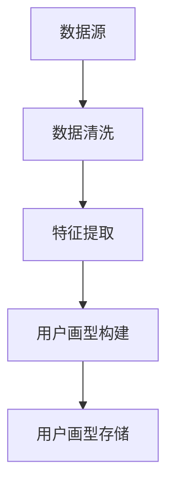
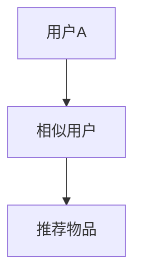
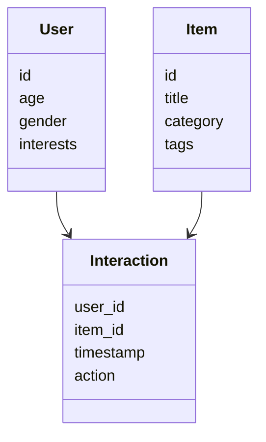
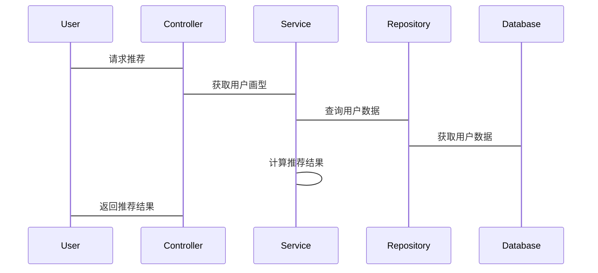

                 


# AI Agent的个性化：用户画像与偏好学习

## 关键词：
- AI Agent
- 用户画像
- 偏好学习
- 个性化推荐
- 机器学习

## 摘要：
本文深入探讨AI Agent在个性化推荐中的核心作用，重点分析用户画像与偏好学习的构建方法及其在AI Agent中的应用。文章从背景介绍出发，逐步解析用户画像与偏好学习的核心概念、算法原理、系统架构，并通过项目实战和最佳实践，帮助读者全面掌握AI Agent个性化推荐的技术细节。

---

## 第1章：背景介绍

### 1.1 AI Agent的基本概念与个性化推荐的背景

#### 1.1.1 AI Agent的定义与核心特征
AI Agent（人工智能代理）是指能够感知环境、自主决策并执行任务的智能实体。其核心特征包括：
- **自主性**：能够在没有外部干预的情况下独立执行任务。
- **反应性**：能够实时感知环境变化并做出响应。
- **目标导向**：具备明确的目标，并通过行为优化来实现目标。
- **学习能力**：能够通过数据和经验不断优化自身的决策和行为。

#### 1.1.2 AI Agent的分类与应用场景
AI Agent可以根据智能水平分为以下几类：
- **反应式AI Agent**：基于当前感知做出实时响应，适用于实时交互场景。
- **认知式AI Agent**：具备复杂问题解决能力，能够进行规划和推理，适用于复杂任务。
- **学习型AI Agent**：能够通过机器学习技术不断优化自身行为，适用于需要持续改进的任务。

AI Agent的应用场景广泛，包括智能助手、推荐系统、自动驾驶、智能客服等。

#### 1.1.3 个性化推荐的背景
个性化推荐是AI Agent的重要应用之一，旨在根据用户的偏好和行为提供定制化的信息或服务。随着互联网的快速发展，用户产生的数据量急剧增加，如何从海量数据中提取有价值的信息并提供个性化的服务成为企业竞争力的关键。

---

### 1.2 用户画像与偏好学习的背景

#### 1.2.1 用户画像的定义与作用
用户画像是基于用户数据构建的用户特征模型，能够反映用户的属性、行为和偏好。其作用包括：
- **用户细分**：通过用户画型将用户分为不同的群体，便于制定差异化的策略。
- **行为预测**：基于用户画像预测用户的未来行为，优化推荐算法。
- **精准营销**：通过用户画像实现精准的广告投放和产品推荐。

#### 1.2.2 偏好学习的定义与目标
偏好学习是通过学习用户的历史行为数据，推断用户的偏好和需求的过程。其目标包括：
- **个性化推荐**：根据用户的偏好提供定制化的推荐。
- **行为预测**：预测用户对新内容的偏好，优化推荐策略。
- **动态调整**：根据用户偏好变化动态调整推荐结果。

#### 1.2.3 AI Agent个性化推荐的核心问题
AI Agent个性化推荐的核心问题在于如何高效地构建用户画像，并通过偏好学习准确捕捉用户的偏好。这需要解决以下问题：
- **数据采集**：如何高效、准确地采集用户数据。
- **特征提取**：如何从海量数据中提取有用的用户特征。
- **模型构建**：如何构建高效的推荐模型，并实时更新用户的偏好。

---

## 第2章：用户画像与偏好学习的核心概念

### 2.1 用户画像的构建与分析

#### 2.1.1 用户画像的数据采集方法
用户数据的采集可以通过以下途径：
- **用户调查**：通过问卷、访谈等方式获取用户的基本信息。
- **日志数据**：收集用户在系统中的行为数据，如点击、浏览、购买等。
- **第三方数据**：利用社交网络、广告平台等第三方数据源获取用户信息。

#### 2.1.2 用户画像的特征提取与分类
用户画型的特征提取需要考虑以下几点：
- **属性特征**：如性别、年龄、职业等。
- **行为特征**：如用户的点击、浏览、购买频率等。
- **兴趣特征**：如用户偏好哪些类型的内容或产品。

用户画型的分类可以通过聚类分析、决策树等方法实现，将用户分为不同的群体。

#### 2.1.3 用户画像的动态更新与维护
用户画型不是静态的，需要根据用户的最新行为和反馈进行动态更新。动态更新的方法包括：
- **实时更新**：根据用户的实时行为不断更新用户画型。
- **周期性更新**：定期根据新的数据更新用户画型。

---

### 2.2 偏好学习的基本原理

#### 2.2.1 偏好学习的定义与核心要素
偏好学习是通过学习用户的历史行为数据，推断用户的偏好和需求。其核心要素包括：
- **用户行为数据**：用户的点击、购买、评分等行为。
- **推荐对象**：需要推荐的内容或产品。
- **偏好模型**：用于表示用户偏好的数学模型。

#### 2.2.2 偏好学习的特征对比与分析
偏好学习的特征对比可以通过以下表格展示：

| 特征维度 | 用户画型 | 偏好学习 |
|----------|----------|----------|
| 数据来源 | 用户属性、行为数据 | 用户行为数据 |
| 核心目标 | 描述用户特征 | 描述用户偏好 |
| 应用场景 | 用户细分、精准营销 | 个性化推荐 |

#### 2.2.3 偏好学习的ER实体关系图架构

```mermaid
erDiagram
    user&&{User} <---|{many} preference &&{Preference}
    user -->{many} item &&{Item}
    preference -->{many} item
    user -->{many} interaction &&{Interaction}
```

---

### 2.3 用户画像与偏好学习的联系

#### 2.3.1 用户画像在个性化推荐中的作用
用户画型在个性化推荐中的作用包括：
- **用户细分**：将用户分为不同群体，提高推荐的精准度。
- **特征提取**：为偏好学习提供丰富的特征信息。
- **动态调整**：根据用户画型的变化调整推荐策略。

#### 2.3.2 偏好学习在AI Agent中的应用
偏好学习在AI Agent中的应用包括：
- **个性化推荐**：根据用户的偏好提供定制化的推荐。
- **行为预测**：预测用户对新内容的偏好，优化推荐策略。
- **动态调整**：根据用户偏好变化动态调整推荐结果。

#### 2.3.3 个性化推荐的边界与外延
个性化推荐的边界包括：
- **数据隐私**：用户数据的隐私保护。
- **推荐精度**：推荐结果的准确性和相关性。
- **用户体验**：推荐结果对用户体验的影响。

个性化推荐的外延包括：
- **实时推荐**：根据用户的实时行为进行推荐。
- **情境感知**：根据用户所处的环境和情境进行推荐。
- **多模态推荐**：结合文本、图像、视频等多种数据进行推荐。

---

## 第3章：用户画像与偏好学习的算法原理

### 3.1 用户画像构建的算法原理

#### 3.1.1 数据采集与特征提取的流程



特征提取的关键步骤包括：
- **数据清洗**：去除噪声数据，确保数据质量。
- **特征选择**：选择对推荐有影响力的特征。
- **特征工程**：对特征进行标准化、归一化等处理。

#### 3.1.2 用户画型构建的数学模型

用户画型构建的数学模型可以表示为：

$$
U_i = \{u_{i1}, u_{i2}, ..., u_{in}\}
$$

其中，$U_i$ 表示第i个用户的画型，$u_{ij}$ 表示第j个特征的值。

#### 3.1.3 用户画型构建的Python代码实现

以下是一个简单的用户画型构建的Python代码示例：

```python
import pandas as pd
from sklearn.preprocessing import StandardScaler

# 数据加载
data = pd.read_csv('user_data.csv')

# 数据清洗
data.dropna(inplace=True)

# 特征选择
features = ['age', 'gender', 'interest']
data = data[features]

# 特征工程
scaler = StandardScaler()
data_scaled = scaler.fit_transform(data)

# 用户画型存储
data_scaled.to_csv('user_profile.csv', index=False)
```

---

### 3.2 偏好学习的算法原理

#### 3.2.1 偏好学习的核心算法与流程

偏好学习的核心算法包括：
- **协同过滤算法**：基于用户相似性进行推荐。
- **基于内容的推荐算法**：基于内容的相似性进行推荐。
- **混合推荐算法**：结合协同过滤和内容推荐的优点。

协同过滤算法的流程如下：



#### 3.2.2 偏好学习的数学模型与公式

协同过滤算法的相似性计算公式为：

$$
similarity(u_i, u_j) = \frac{\sum_{k} (r_{ik} - \bar{r_i})(r_{jk} - \bar{r_j})}{\sqrt{\sum_{k} (r_{ik} - \bar{r_i})^2} \cdot \sqrt{\sum_{k} (r_{jk} - \bar{r_j})^2}}
$$

其中，$r_{ik}$ 表示用户i对物品k的评分，$\bar{r_i}$ 表示用户i的平均评分。

#### 3.2.3 偏好学习的Python代码实现

以下是一个协同过滤算法的Python代码示例：

```python
import numpy as np

def cosine_similarity(user_vector, item_vector):
    return np.dot(user_vector, item_vector) / (np.linalg.norm(user_vector) * np.linalg.norm(item_vector))

# 示例数据
user_vector = np.array([1, 2, 3])
item_vector = np.array([4, 5, 6])

similarity = cosine_similarity(user_vector, item_vector)
print(similarity)
```

---

## 第4章：系统分析与架构设计方案

### 4.1 问题场景介绍

本节将介绍AI Agent在个性化推荐中的应用场景，包括智能助手、推荐系统、智能客服等。

### 4.2 项目介绍

项目名称：AI Agent个性化推荐系统

项目目标：构建一个基于用户画型和偏好学习的个性化推荐系统，实现精准的推荐服务。

### 4.3 系统功能设计

#### 4.3.1 领域模型设计



#### 4.3.2 系统架构设计


#### 4.3.3 系统接口设计

系统接口设计包括：
- **用户接口**：用户与系统交互的界面，包括推荐结果展示、用户反馈等。
- **数据接口**：与数据源（如数据库、API）交互的接口，用于数据的读取和写入。
- **算法接口**：与推荐算法模块交互的接口，用于推荐结果的计算和返回。

#### 4.3.4 系统交互设计



---

## 第5章：项目实战

### 5.1 环境安装

项目实战需要以下环境：
- **Python**：3.6+
- **Pandas**：用于数据处理
- **Scikit-learn**：用于机器学习算法
- **Flask**：用于构建API

### 5.2 系统核心实现源代码

以下是推荐系统的核心实现代码：

```python
from flask import Flask, request, jsonify
from sklearn.metrics.pairwise import cosine_similarity

app = Flask(__name__)

# 示例用户画型数据
user_profiles = {
    1: [25, 'male', 'technology'],
    2: [30, 'female', 'travel'],
    3: [22, 'male', 'sports']
}

@app.route('/recommend', methods=['POST'])
def recommend():
    data = request.json
    user_id = data['user_id']
    items = data['items']
    
    # 获取用户画型
    user_profile = user_profiles[user_id]
    
    # 计算相似性
    similarities = []
    for item in items:
        similarity = cosine_similarity(user_profile, item)
        similarities.append(similarity)
    
    # 返回推荐结果
    return jsonify({'recommendations': similarities})

if __name__ == '__main__':
    app.run(debug=True)
```

### 5.3 代码应用解读与分析

上述代码实现了一个简单的推荐系统API。用户可以通过发送POST请求，获取推荐结果。代码的核心部分包括：
- **数据处理**：用户画型数据的存储与获取。
- **推荐算法**：基于余弦相似性的推荐计算。
- **API接口**：提供RESTful接口，方便前端或其他服务调用。

### 5.4 实际案例分析和详细讲解剖析

以一个简单的案例为例，假设我们有三个用户和他们的偏好：

- **用户1**：25岁，男性，兴趣为技术。
- **用户2**：30岁，女性，兴趣为旅行。
- **用户3**：22岁，男性，兴趣为体育。

假设我们有三个物品：
- **物品A**：技术类书籍。
- **物品B**：旅行指南。
- **物品C**：体育新闻。

通过余弦相似性计算，我们可以得到推荐结果：

- **用户1**对物品A的相似性为1，对物品B的相似性为0，对物品C的相似性为0。
- **用户2**对物品A的相似性为0，对物品B的相似性为1，对物品C的相似性为0。
- **用户3**对物品A的相似性为0，对物品B的相似性为0，对物品C的相似性为1。

---

## 第6章：最佳实践

### 6.1 关键小结

- **数据质量**：数据是推荐系统的核心，确保数据的准确性和完整性至关重要。
- **模型选择**：根据具体场景选择合适的推荐算法，避免过度复杂化。
- **实时性**：实时更新用户画型和推荐结果，提高推荐的精准度。

### 6.2 注意事项

- **数据隐私**：在处理用户数据时，必须遵守相关法律法规，保护用户隐私。
- **模型调优**：根据实际效果不断调优推荐算法，提高推荐的准确性和相关性。
- **用户体验**：推荐结果不仅要准确，还要符合用户的使用习惯和偏好。

### 6.3 拓展阅读

- **推荐系统经典论文**：如《Matrix Factorization for Collaborative Filtering》。
- **机器学习教材**：如《Hands-On Machine Learning with Scikit-Learn, Keras, and TensorFlow》。
- **AI Agent相关书籍**：如《Artificial Intelligence: A Modern Approach》。

---

## 结语

AI Agent的个性化推荐是人工智能领域的重要应用之一，用户画型与偏好学习是实现个性化推荐的核心技术。通过本文的深入分析，读者可以全面了解用户画型与偏好学习的构建方法及其在AI Agent中的应用。未来，随着技术的不断发展，个性化推荐将更加智能化和精准化，为企业和个人提供更加优质的服务。

