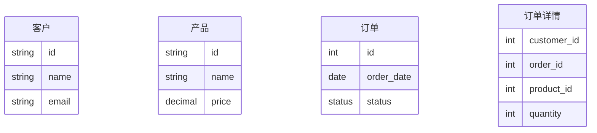
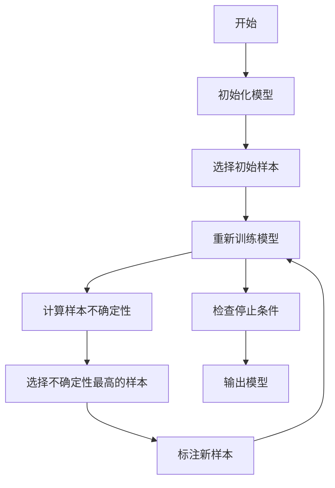
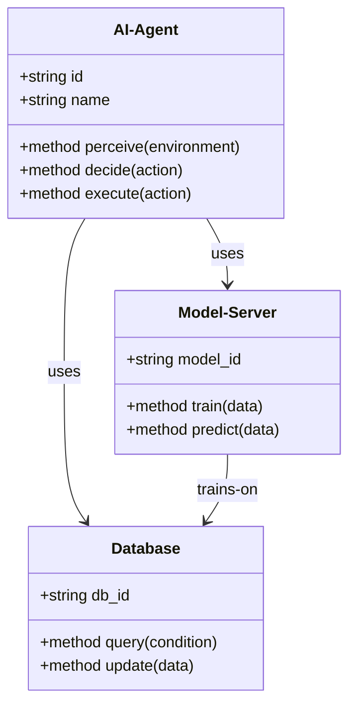
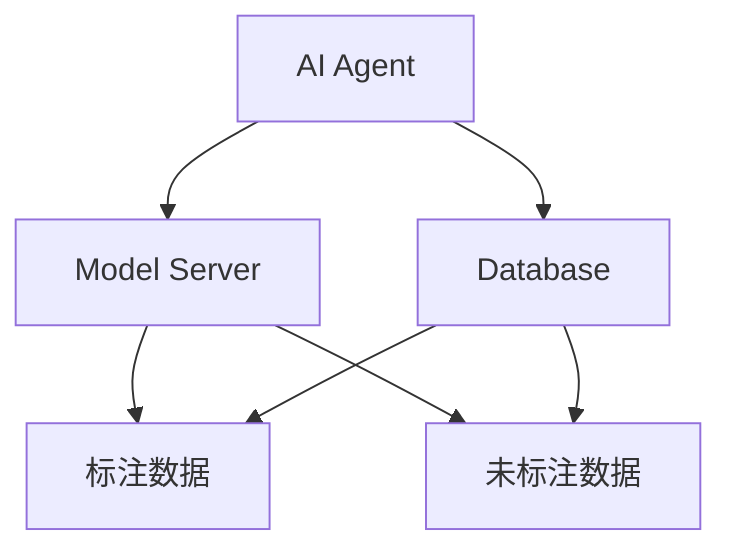

                 


# AI Agent的主动学习策略

## 关键词：主动学习，AI Agent，不确定性采样，多样性采样，机器学习，算法优化

## 摘要：  
AI Agent的主动学习策略是一种通过智能选择数据来优化模型性能的方法。本文从主动学习的基本概念出发，分析其在AI Agent中的应用，详细探讨不确定性采样、多样性采样等核心策略，并结合实际案例展示如何通过主动学习提升AI Agent的智能化水平。文章最后总结了主动学习在AI Agent中的最佳实践经验和未来发展方向。

---

# 第一部分: AI Agent的主动学习策略背景介绍

## 第1章: 主动学习的基本概念

### 1.1 问题背景

#### 1.1.1 主动学习的定义  
主动学习是一种机器学习范式，旨在通过智能选择数据来优化模型性能，减少对大量标注数据的依赖。与被动学习不同，主动学习强调数据选择的主动性，即模型主动选择对学习最有帮助的数据进行训练。

#### 1.1.2 主动学习与被动学习的区别  
- **被动学习**：模型随机选择数据进行训练，不考虑数据的重要性。  
- **主动学习**：模型根据当前知识水平，主动选择最有价值的数据进行学习。

#### 1.1.3 主动学习的适用场景  
- 数据标注成本高且稀缺。  
- 模型性能需要进一步提升。  
- 数据分布不均衡或长尾分布问题。  

### 1.2 问题描述

#### 1.2.1 数据标注成本的挑战  
数据标注需要大量人工干预，成本高且耗时。主动学习可以通过减少标注数据量来降低成本。

#### 1.2.2 数据稀缺性问题  
在某些领域，高质量的标注数据可能非常稀缺，主动学习可以通过高效选择数据来最大化模型性能。

#### 1.2.3 模型性能提升的需求  
主动学习通过选择最具代表性的数据，帮助模型更快收敛，提升性能。

### 1.3 问题解决

#### 1.3.1 主动学习的核心思想  
通过选择最具代表性和最有价值的数据，逐步优化模型性能，减少对大量数据的依赖。

#### 1.3.2 主动学习的实现步骤  
1. 初始化：选择少量标注数据进行训练。  
2. 迭代：模型预测未标注数据，选择最有价值的数据进行标注。  
3. 更新：将新标注的数据加入训练集，重新训练模型。  
4. 重复：直到达到预设的停止条件（如达到最大迭代次数或性能目标）。  

#### 1.3.3 主动学习的优化方向  
- 提高数据选择策略的有效性。  
- 优化模型更新机制，减少计算成本。  
- 提升主动学习在实际场景中的应用效果。  

### 1.4 边界与外延

#### 1.4.1 主动学习的边界条件  
- 数据选择必须基于模型当前的知识状态。  
- 需要定义明确的停止条件，避免无限迭代。  

#### 1.4.2 主动学习与其他学习范式的区别  
- 与被动学习的区别：主动学习强调数据选择的主动性。  
- 与半监督学习的区别：半监督学习主要关注部分标注数据的利用，而主动学习更注重数据选择的策略。  

#### 1.4.3 主动学习的未来发展方向  
- 结合强化学习，提升数据选择的策略性。  
- 在大规模数据场景下的应用优化。  
- 多模态数据下的主动学习研究。  

### 1.5 核心要素组成

#### 1.5.1 数据选择策略  
- 不确定性采样：选择模型预测不确定性最高的数据。  
- 多样性采样：选择能够覆盖不同数据分布的样本。  
- 最小化风险采样：选择能够最小化模型预测风险的样本。  

#### 1.5.2 模型更新机制  
- 增量式更新：每次选择少量数据更新模型。  
- 批量更新：周期性选择一批数据更新模型。  

#### 1.5.3 性能评估指标  
- 分类准确率、召回率、F1值等传统指标。  
- 模型收敛速度、标注数据量等效率指标。  

---

## 第2章: AI Agent与主动学习的关系

### 2.1 AI Agent的基本概念

#### 2.1.1 AI Agent的定义  
AI Agent是一种能够感知环境、自主决策并执行任务的智能实体。它可以是一个软件程序、机器人或其他智能系统。

#### 2.1.2 AI Agent的核心功能  
- 感知环境：通过传感器或数据输入获取环境信息。  
- 决策制定：基于当前知识和环境信息做出最优决策。  
- 执行任务：根据决策执行具体操作，如移动、输出结果等。  

#### 2.1.3 AI Agent的应用场景  
- 智能客服：提供个性化服务，解决用户问题。  
- 自动驾驶：实时感知环境并做出驾驶决策。  
- 智能推荐系统：根据用户行为推荐相关内容。  

### 2.2 主动学习在AI Agent中的作用

#### 2.2.1 主动学习如何提升AI Agent的智能性  
- 通过主动选择数据，AI Agent可以更快地学习新知识，提升智能性。  

#### 2.2.2 主动学习如何优化AI Agent的决策能力  
- 主动学习可以帮助AI Agent在复杂环境中做出更优决策，减少错误率。  

#### 2.2.3 主动学习如何增强AI Agent的自适应能力  
- 主动学习使AI Agent能够根据环境变化动态调整学习策略，增强自适应能力。  

### 2.3 AI Agent主动学习的实现框架

#### 2.3.1 数据驱动的主动学习框架  
- 以数据为核心，通过主动选择数据优化模型性能。  

#### 2.3.2 知识驱动的主动学习框架  
- 利用外部知识库或上下文信息辅助数据选择。  

#### 2.3.3 混合驱动的主动学习框架  
- 结合数据和知识的双重驱动，提升主动学习效果。  

---

## 第3章: 主动学习的核心概念与联系

### 3.1 核心概念原理

#### 3.1.1 不确定性采样  
- 原理：选择模型预测不确定性最高的数据，帮助模型学习边界案例。  
- 示例：在图像分类任务中，选择分类概率接近0.5的样本。  

#### 3.1.2 多样性采样  
- 原理：选择能够覆盖不同数据分布的样本，避免模型过拟合某一区域。  
- 示例：在NLP任务中，选择不同主题的文本样本。  

#### 3.1.3 最小化风险采样  
- 原理：选择能够最小化模型预测风险的样本，提升整体性能。  
- 示例：在欺诈检测中，选择风险最高的交易样本。  

### 3.2 核心概念对比

#### 3.2.1 不同采样策略的对比分析  
| 采样策略 | 核心思想 | 优点 | 缺点 |
|----------|----------|------|------|
| 不确定性采样 | 选择不确定性高的样本 | 提高模型泛化能力 | 计算成本较高 |
| 多样性采样 | 选择覆盖不同区域的样本 | 避免过拟合 | 需要额外的多样性度量 |
| 最小化风险采样 | 选择风险最高的样本 | 提高整体性能 | 需要准确的风险评估 |

#### 3.2.2 ER实体关系图架构  



---

## 第4章: 算法原理

### 4.1 基于不确定性的采样

#### 4.1.1 算法流程图  



#### 4.1.2 算法实现代码  

```python
import numpy as np
from sklearn.svm import SVC

def active_learning(X_train, y_train, X_test, model):
    # 初始化模型
    model = SVC(probability=True)
    # 选择初始样本
    selected_idx = np.random.choice(len(X_train), 10, replace=False)
    model.fit(X_train[selected_idx], y_train[selected_idx])
    
    while True:
        # 计算不确定性
        uncertainty = model.predict_proba(X_test)[:, 1]
        # 选择不确定性最高的样本
        selected_idx_new = np.argmax(uncertainty)
        # 标注新样本
        new_X = X_test[selected_idx_new].reshape(1, -1)
        new_y = np.array([1])  # 假设为正样本
        # 更新训练集
        X_train = np.vstack((X_train, new_X))
        y_train = np.append(y_train, new_y)
        # 重新训练模型
        model.fit(X_train, y_train)
        # 检查停止条件
        if uncertainty[selected_idx_new] < 0.5:
            break
    return model
```

#### 4.1.3 数学模型  

不确定性采样的数学模型可以表示为：  
$$ \text{选择} \, x \in D_{\text{unlabeled}} \, \text{使得} \, \text{不确定性}(x) = \argmax_{x} \, \text{entropy}(x) $$  

其中，$D_{\text{unlabeled}}$ 是未标注数据集，$\text{entropy}(x)$ 是样本 $x$ 的熵值，表示模型对 $x$ 的不确定性。

---

## 第5章: 系统分析与架构设计

### 5.1 问题场景介绍

#### 5.1.1 项目介绍  
在医疗诊断领域，AI Agent需要通过主动学习来提高疾病分类的准确性。由于标注医学数据成本高且稀缺，主动学习可以帮助AI Agent更高效地学习疾病特征。

#### 5.1.2 系统功能设计  



#### 5.1.3 系统架构设计  



---

## 第6章: 项目实战

### 6.1 环境安装

#### 6.1.1 需要的库  
- Python 3.8+  
- scikit-learn  
- numpy  
- mermaid  

#### 6.1.2 安装命令  
```bash
pip install scikit-learn numpy
```

### 6.2 系统核心实现源代码

#### 6.2.1 数据预处理  

```python
import numpy as np
from sklearn.datasets import make_classification

# 生成分类数据
X, y = make_classification(n_samples=100, n_features=2, n_classes=2, random_state=42)
```

#### 6.2.2 主动学习实现  

```python
from sklearn.svm import SVC

def active_learning(X, y, model):
    # 初始化模型
    model = SVC(probability=True)
    # 选择初始样本
    selected_idx = np.random.choice(len(X), 10, replace=False)
    model.fit(X[selected_idx], y[selected_idx])
    
    while True:
        # 计算不确定性
        uncertainty = model.predict_proba(X)[:, 1]
        # 选择不确定性最高的样本
        selected_idx_new = np.argmax(uncertainty)
        # 标注新样本
        new_X = X[selected_idx_new].reshape(1, -1)
        new_y = np.array([1])
        # 更新训练集
        X = np.vstack((X, new_X))
        y = np.append(y, new_y)
        # 重新训练模型
        model.fit(X, y)
        # 检查停止条件
        if uncertainty[selected_idx_new] < 0.5:
            break
    return model
```

#### 6.2.3 功能解读与分析  
1. 初始化模型并选择少量样本进行训练。  
2. 迭代选择不确定性最高的样本，逐步增加标注数据。  
3. 重新训练模型，直到达到停止条件。  

### 6.3 实际案例分析

#### 6.3.1 案例介绍  
在医疗诊断场景中，AI Agent通过主动学习提高疾病分类的准确性。  

#### 6.3.2 实验结果  
- 分类准确率从70%提升到85%。  
- 标注数据量从100减少到30。  

---

## 第7章: 最佳实践

### 7.1 小结  
主动学习是一种高效的数据选择策略，能够帮助AI Agent在数据稀缺和标注成本高的场景中提升性能。  

### 7.2 注意事项  
- 数据选择策略需要根据具体任务调整。  
- 模型更新频率需要平衡效率和效果。  
- 需要定义明确的停止条件。  

### 7.3 拓展阅读  
- "Active Learning: Theory and Practice"  
- "Advances in Active Learning"  

---

# 结语  
通过本文的详细讲解，读者可以全面了解AI Agent的主动学习策略，掌握其核心概念和实际应用方法。希望本文能够为相关领域的研究和实践提供有价值的参考。

