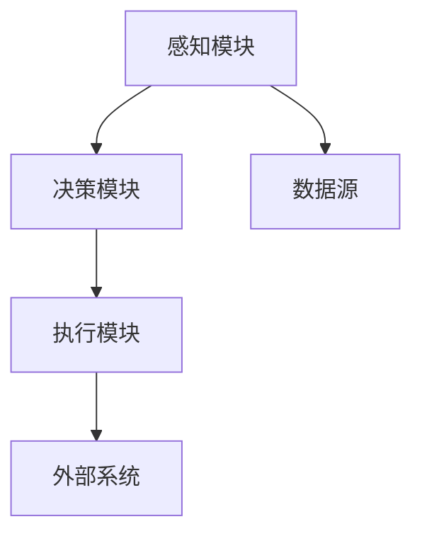
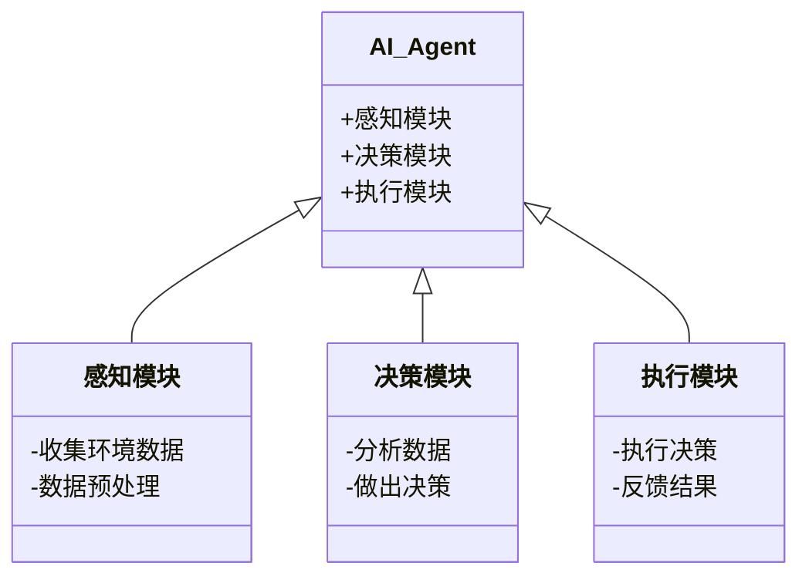
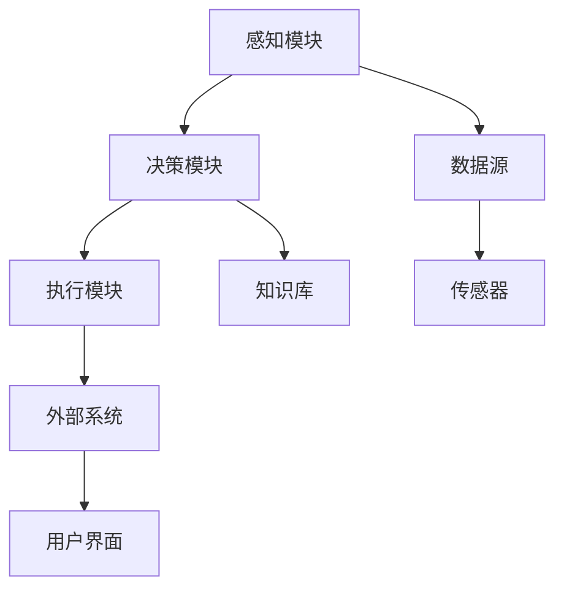

                 


# AI Agent的云端部署与管理

## 关键词：AI Agent, 云端部署, 管理策略, 容器化技术, 云计算, 系统架构

## 摘要：AI Agent作为一种智能代理，广泛应用于多个领域。本文将详细探讨AI Agent在云端部署与管理中的关键问题，包括架构设计、资源分配、日志监控、性能调优等。通过实际案例分析和系统设计，本文为读者提供了一套完整的部署与管理方案，帮助他们更好地理解和实施AI Agent的云端部署。

---

# 第一部分：引言

## 第1章：AI Agent的基本概念与背景

### 1.1 AI Agent的定义与核心概念

AI Agent，即人工智能代理，是一种能够感知环境并采取行动以实现特定目标的智能实体。AI Agent可以是软件程序、机器人或其他智能系统，通过与环境交互来完成任务。

#### AI Agent的核心特征
- **自主性**：AI Agent能够在没有外部干预的情况下独立运作。
- **反应性**：能够实时感知环境变化并做出反应。
- **目标导向**：所有行动都围绕着实现特定目标。
- **学习能力**：能够通过经验改进自身的性能。

### 1.2 AI Agent的发展背景

人工智能技术近年来取得了长足的进步，尤其是在机器学习和深度学习领域。这些技术的发展推动了AI Agent的应用，使其在多个领域中展现出强大的潜力。

#### 1.2.1 人工智能技术的演进
从早期的规则-based系统到现在的深度学习模型，AI Agent的智能水平不断提高，应用场景也逐渐扩大。

#### 1.2.2 云计算与边缘计算的推动
云计算提供了强大的计算能力和弹性的资源管理，使得AI Agent的部署更加灵活和高效。边缘计算则进一步扩展了AI Agent的应用范围，使其能够更接近数据源进行实时处理。

#### 1.2.3 AI Agent在企业中的价值
在企业中，AI Agent可以用于自动化运维、智能客服、供应链优化等多个方面，显著提高企业的运营效率。

### 1.3 云端部署与管理的重要性

AI Agent的云端部署能够充分发挥云计算的优势，但同时也带来了管理和优化的挑战。

#### 1.3.1 云计算的优势与挑战
- **优势**：弹性计算资源、按需扩展、高可用性。
- **挑战**：资源分配优化、安全性、成本控制。

#### 1.3.2 AI Agent云端部署的必要性
随着企业对智能化需求的增加，AI Agent的云端部署成为一种趋势，能够帮助企业快速构建智能系统，同时降低运维成本。

---

# 第二部分：AI Agent的云端部署

## 第2章：AI Agent的架构设计

### 2.1 系统架构概述

AI Agent的架构设计是部署与管理的基础，决定了系统的扩展性、可靠性和维护性。

#### 2.1.1 分层架构
将系统分为感知层、决策层和执行层，每一层负责不同的功能模块。

#### 2.1.2 微服务架构
通过微服务架构实现模块化设计，每个服务独立运行，便于扩展和维护。

### 2.2 系统功能设计

在设计系统功能时，需要明确各个模块的功能和交互方式。

#### 2.2.1 感知模块
负责收集环境数据，如传感器数据、用户输入等。

#### 2.2.2 决策模块
基于感知数据，通过算法做出决策。

#### 2.2.3 执行模块
根据决策结果执行相应的动作，如发送指令、触发设备等。

### 2.3 系统架构图

以下是一个典型的AI Agent系统架构图，展示了各模块之间的关系。



---

## 第3章：云端部署的基础

### 3.1 选择合适的云平台

不同的云平台有不同的优势和劣势，选择适合自己需求的平台是部署的第一步。

#### 3.1.1 AWS、Azure、Google Cloud等主流云平台
这些平台提供了丰富的服务和工具，能够满足大多数AI Agent的部署需求。

#### 3.1.2 开源云平台
如OpenStack、Kubernetes等，适合有定制化需求的企业。

### 3.2 虚拟化与容器化技术

容器化技术（如Docker）和虚拟化技术（如VMware）是部署AI Agent的重要工具。

#### 3.2.1 Docker容器
Docker通过容器化技术实现轻量级虚拟化，适合快速部署和扩展。

#### 3.2.2 Kubernetes集群
Kubernetes提供了容器编排能力，能够管理大规模的容器化应用。

### 3.3 云资源管理

在云端部署AI Agent时，需要合理分配计算资源、存储资源和网络资源。

#### 3.3.1 弹性计算实例
根据负载情况动态调整计算资源，避免浪费和性能瓶颈。

#### 3.3.2 存储解决方案
选择合适的存储服务，如云存储、数据库等，确保数据的可靠性和可扩展性。

---

## 第4章：AI Agent的管理与监控

### 4.1 配置管理

配置管理是确保AI Agent稳定运行的关键。

#### 4.1.1 使用Ansible或Chef进行配置管理
Ansible和Chef等工具可以帮助自动化配置管理过程。

#### 4.1.2 配置版本控制
通过版本控制系统（如Git）管理配置文件，确保配置的可追溯性和一致性。

### 4.2 日志监控

日志监控是发现和解决问题的重要手段。

#### 4.2.1 使用ELK栈进行日志管理
ELK（Elasticsearch, Logstash, Kibana）栈是一个强大的日志管理工具，可以实时监控和分析日志。

#### 4.2.2 日志分析
通过日志分析工具发现系统异常和性能瓶颈，及时采取措施。

### 4.3 性能调优

性能调优是确保AI Agent高效运行的重要环节。

#### 4.3.1 资源分配优化
根据业务需求动态调整资源分配，避免资源浪费和性能瓶颈。

#### 4.3.2 系统优化工具
使用性能分析工具（如 profiling tools）优化代码和系统配置。

### 4.4 容错容灾

容错容灾是确保系统高可用性的必要措施。

#### 4.4.1 健康检查与自愈机制
通过健康检查机制及时发现故障节点，并自动进行修复或替换。

#### 4.4.2 数据备份与恢复
定期备份数据，并制定数据恢复策略，确保数据的安全性和可恢复性。

---

## 第5章：系统架构设计

### 5.1 问题场景分析

在进行系统架构设计之前，需要明确业务需求和潜在问题。

#### 5.1.1 业务需求分析
了解AI Agent需要完成的任务和目标，明确系统的功能和性能需求。

#### 5.1.2 潜在问题预测
预测系统可能遇到的挑战，如高负载、网络延迟等，提前制定解决方案。

### 5.2 领域模型设计

领域模型是系统设计的核心，决定了系统的功能模块和交互方式。

#### 5.2.1 领域模型图
以下是一个简单的领域模型图，展示了AI Agent的主要功能模块。



### 5.3 系统架构图

以下是一个AI Agent系统的整体架构图，展示了各模块之间的关系和交互方式。



### 5.4 接口与交互设计

系统架构设计还需要明确接口和交互流程，确保各模块之间的通信顺畅。

#### 5.4.1 接口定义
通过REST API或消息队列（如Kafka）实现模块之间的通信。

#### 5.4.2 交互流程
定义各模块之间的交互流程，确保系统运行的逻辑清晰。

---

## 第6章：项目实战

### 6.1 环境搭建

在进行项目实战之前，需要搭建合适的开发和部署环境。

#### 6.1.1 安装必要的工具
安装Docker、Kubernetes、Python等工具，确保环境配置正确。

#### 6.1.2 配置云平台
在云平台上创建计算实例，配置网络和存储服务。

### 6.2 系统核心实现

以下是一个基于Python的AI Agent核心实现示例。

#### 6.2.1 感知模块实现
```python
class Sensor:
    def collect_data(self):
        # 模拟数据采集
        return {"temperature": 25, "humidity": 60}
```

#### 6.2.2 决策模块实现
```python
class DecisionMaker:
    def make_decision(self, data):
        # 根据数据做出决策
        if data["temperature"] > 30:
            return "increase fan speed"
        else:
            return "reduce fan speed"
```

#### 6.2.3 执行模块实现
```python
class Actuator:
    def execute_action(self, action):
        # 执行动作
        print(f"Executing action: {action}")
```

### 6.3 系统部署与监控

#### 6.3.1 使用Docker部署
将各模块打包成Docker镜像，并通过Kubernetes进行编排。

#### 6.3.2 日志监控
使用ELK栈监控系统日志，及时发现和解决问题。

### 6.4 项目总结

通过这个项目实战，我们了解了AI Agent的云端部署流程，从环境搭建到系统实现，再到部署和监控，每个环节都需要仔细考虑和配置。

---

## 第7章：总结与展望

### 7.1 总结

本文详细探讨了AI Agent的云端部署与管理的关键问题，从系统架构设计到实际项目部署，为读者提供了一套完整的解决方案。

### 7.2 未来展望

随着人工智能技术的不断发展，AI Agent的云端部署与管理将更加智能化和自动化。未来的挑战在于如何进一步优化资源利用率，提高系统的可靠性和安全性。

---

通过本文的讲解，读者可以深入了解AI Agent的云端部署与管理的核心内容，并能够在实际项目中应用这些知识，构建高效可靠的AI Agent系统。

