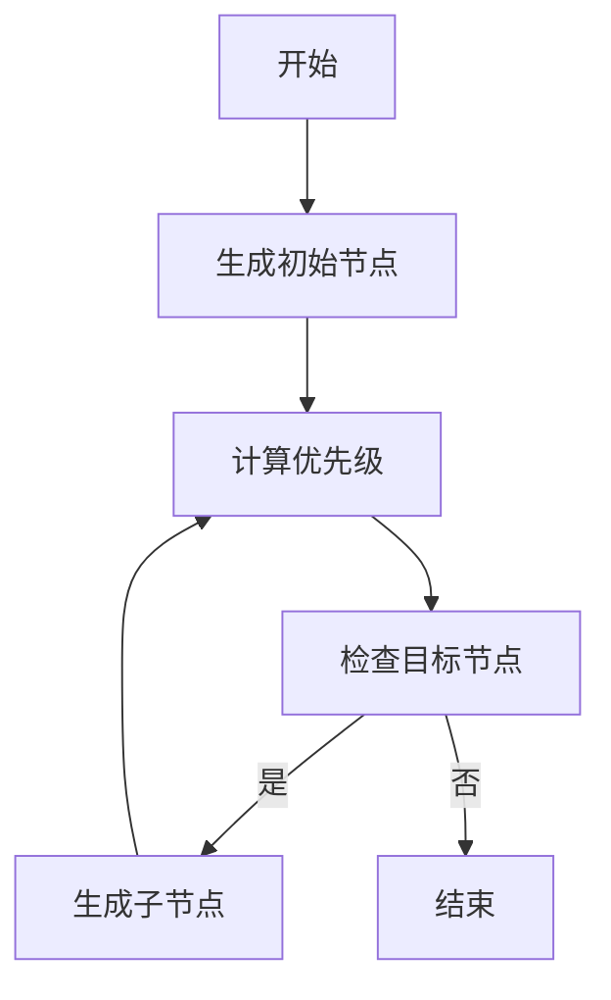
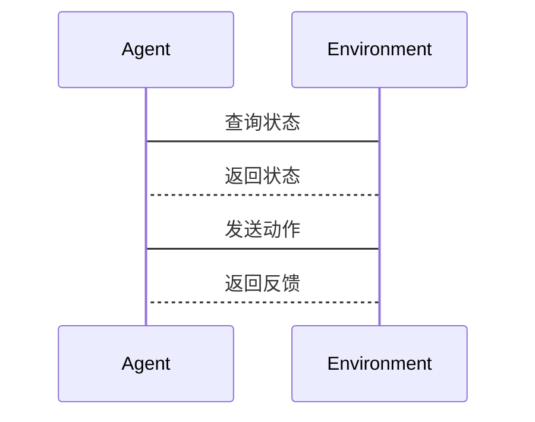

                 


# AI Agent的任务规划与执行框架

> 关键词：AI Agent，任务规划，执行框架，算法原理，系统设计，项目实战

> 摘要：本文详细探讨AI Agent的任务规划与执行框架，从核心概念到算法原理，再到系统设计和项目实战，全面解析其技术实现和应用。通过理论与实践相结合的方式，帮助读者深入了解AI Agent在任务规划与执行中的关键技术与应用场景。

---

## 第1章 AI Agent的任务规划与执行框架概述

### 1.1 AI Agent的基本概念

#### 1.1.1 什么是AI Agent
AI Agent（人工智能代理）是指能够感知环境、自主决策并执行任务的智能实体。它通过传感器获取信息，利用推理能力制定计划，并通过执行器完成目标。

#### 1.1.2 AI Agent的类型与特点
AI Agent可以分为简单反射型、基于模型的反射型、目标驱动型和效用驱动型。目标驱动型AI Agent通过明确的目标进行任务规划，是最常见的类型。

#### 1.1.3 任务规划与执行的基本概念
任务规划是AI Agent根据目标生成可行的行动序列，而执行则是将规划转化为实际操作的过程。两者的结合使得AI Agent能够高效完成任务。

### 1.2 任务规划与执行的背景与问题

#### 1.2.1 问题背景
在复杂环境中，AI Agent需要应对不确定性、动态变化和资源限制，这对任务规划与执行提出了更高要求。

#### 1.2.2 问题描述
任务规划需要解决如何分解任务、处理优先级和依赖关系，而执行则需要考虑环境动态和异常处理。

#### 1.2.3 问题解决方法
采用分层规划、启发式搜索和在线重规划等方法，结合任务分解和动态调整，提高规划效率和执行可靠性。

#### 1.2.4 边界与外延
任务规划的边界包括环境模型、任务目标和资源限制，而外延则涉及多智能体协作和人机交互。

#### 1.2.5 概念结构与核心要素组成
任务规划的核心要素包括目标、任务、动作、状态和环境模型。通过这些要素的组合，构建任务规划的基本框架。

---

## 第2章 任务规划的核心概念与联系

### 2.1 核心概念原理

#### 2.1.1 任务分解与组合
任务分解是将复杂任务拆解为简单子任务，任务组合则是将子任务整合为整体计划。

#### 2.1.2 任务优先级排序
通过优先级排序，AI Agent可以根据重要性选择最优执行路径。

#### 2.1.3 任务依赖关系
任务之间的依赖关系决定了执行顺序和资源分配。

### 2.2 核心概念对比表

#### 表2-1 任务分解方法对比

| 方法       | 描述                                                                 |
|------------|--------------------------------------------------------------------|
| 分层分解   | 将任务分解为子任务，逐层细化                                       |
| 目标分解   | 根据目标层次分解任务                                               |
| 动作分解   | 根据可能的动作分解任务                                             |

### 2.3 ER实体关系图

#### 图2-1 任务规划的ER实体关系图
```mermaid
erd
    %%{init: {'title': '任务规划的ER实体关系图', 'font': '微软雅黑', 'direction': 'TB'}}
    图书表
    +----+-------+-----------------+------------+
    | ID  | ISBN  | Title           | PublishDate|
    +----+-------+-----------------+------------+
    借阅人
    +----+--------+-----------------+
    | ID  | Name  | StudentID       |
    +----+--------+-----------------+
    图书借阅
    +----+-------------+--------+---------+
    | ID | BookID      | UserID  | BorrowDate|
    +----+-------------+--------+---------+
```

---

## 第3章 任务规划算法原理

### 3.1 算法原理讲解

#### 3.1.1 A*算法
A*算法是一种启发式搜索算法，结合了广度优先搜索和贪心算法的优点，适用于路径规划。

#### 3.1.2 Dijkstra算法
Dijkstra算法用于在权重图中找到最短路径，适用于静态环境下的任务规划。

#### 3.1.3 蒙特卡洛树搜索
蒙特卡洛树搜索适用于动态和不确定环境，通过多次模拟选择最优路径。

### 3.2 算法流程图

#### 图3-1 A*算法流程图


---

## 第4章 任务执行框架的设计

### 4.1 系统架构设计

#### 4.1.1 分层架构
分层架构将系统分为感知层、规划层和执行层，各层之间通过接口通信。

#### 4.1.2 微服务架构
微服务架构将任务分解为独立服务，通过API进行通信，提高系统的扩展性和灵活性。

#### 4.1.3 事件驱动架构
事件驱动架构通过订阅-发布模式处理异步事件，适用于动态环境下的任务执行。

### 4.2 系统接口设计

#### 4.2.1 API接口定义
定义RESTful API接口，包括GET、POST、PUT和DELETE方法。

#### 4.2.2 接口交互流程
通过序列图展示接口调用流程。

#### 4.2.3 接口协议选择
选择HTTP协议，确保跨平台兼容性。

### 4.3 交互流程图

#### 图4-1 系统交互流程图


---

## 第5章 项目实战

### 5.1 环境安装与配置

#### 5.1.1 Python环境安装
安装Python 3.8及以上版本，确保支持asyncio和aiohttp库。

#### 5.1.2 库依赖安装
安装numpy、pandas和scikit-learn库，用于数据处理和机器学习。

#### 5.1.3 开发环境配置
配置虚拟环境，安装jupyter notebook用于开发和调试。

### 5.2 核心代码实现

#### 5.2.1 任务分解代码
```python
def decompose_task(main_task):
    # 分解主任务为子任务
    sub_tasks = []
    return sub_tasks
```

#### 5.2.2 优先级排序代码
```python
def prioritize_tasks(tasks):
    # 根据优先级排序
    return sorted(tasks, key=lambda x: x['priority'])
```

#### 5.2.3 执行框架代码
```python
class TaskExecutor:
    def __init__(self, environment):
        self.environment = environment

    async def execute(self, task):
        # 执行任务
        pass
```

### 5.3 案例分析与解读
通过实际案例分析，展示任务规划与执行框架在物流调度中的应用，详细解读代码实现和系统设计。

---

## 第6章 系统优化与扩展

### 6.1 系统优化

#### 6.1.1 性能优化
通过缓存技术和并行计算提高系统效率。

#### 6.1.2 算法优化
改进搜索算法，降低计算复杂度。

#### 6.1.3 资源优化
合理分配资源，减少浪费。

### 6.2 扩展与协作

#### 6.2.1 多智能体协作
通过通信协议实现多智能体协同工作。

#### 6.2.2 人机协作
结合人类专家意见，优化任务规划。

#### 6.2.3 跨平台协作
支持多种平台和设备的协作执行。

---

## 第7章 总结与展望

### 7.1 总结
总结AI Agent的任务规划与执行框架的核心内容和实现方法。

### 7.2 未来展望
展望未来的研究方向，包括强化学习、边缘计算和人机协作。

---

### 最佳实践 tips
- 在任务规划中，优先考虑简单反射型AI Agent，适用于简单任务。
- 使用A*算法进行路径规划，确保高效性和准确性。
- 在系统设计中，采用微服务架构，提高系统的扩展性和灵活性。

---

通过本文的详细讲解，读者可以全面了解AI Agent的任务规划与执行框架，从理论到实践，掌握其关键技术与应用。

