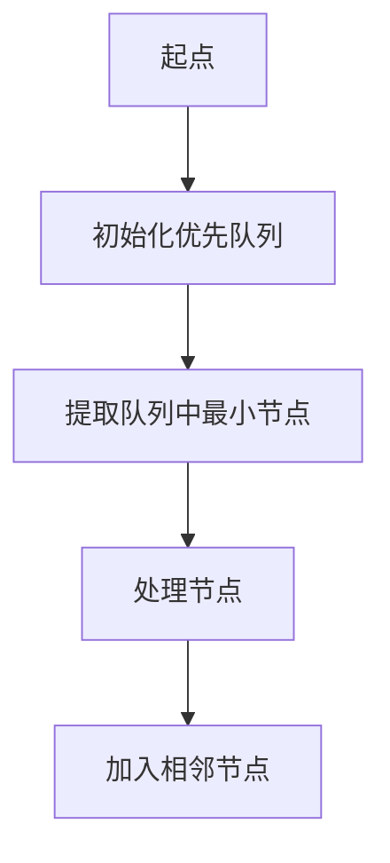
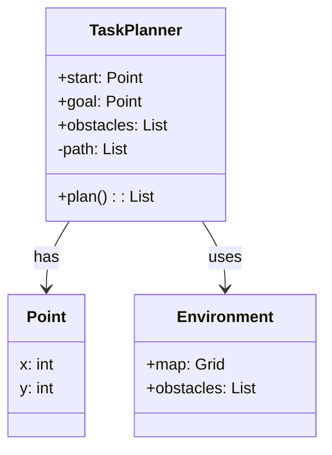
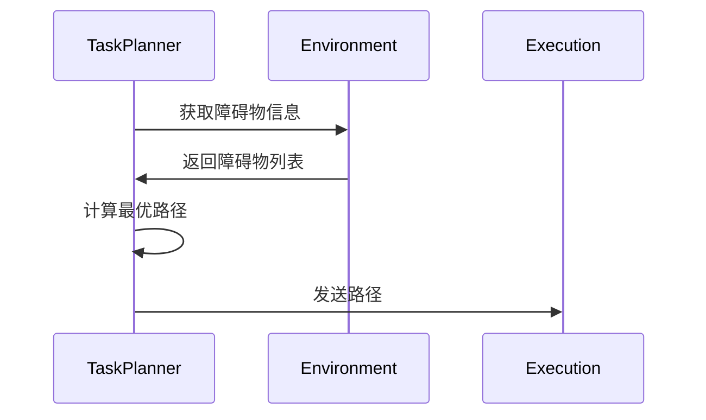

                 


# AI Agent的任务规划与执行模块开发

## 关键词：AI Agent，任务规划，执行模块，算法，系统设计

## 摘要：  
本文深入探讨AI Agent的任务规划与执行模块的开发，从基本概念到算法原理，再到系统设计与实战案例，全面解析任务规划的核心思想与实现方法。文章详细介绍了任务规划的数学模型、常见算法（如A*和Dijkstra）及其在实际系统中的应用，同时结合Mermaid图和Python代码，帮助读者理解并掌握任务规划与执行模块的开发技巧。

---

## 第1章: AI Agent与任务规划概述

### 1.1 AI Agent的基本概念

#### 1.1.1 AI Agent的定义与特点  
AI Agent（智能体）是指能够感知环境、做出决策并执行动作的实体。它具备以下特点：  
- **自主性**：能够独立完成任务，无需外部干预。  
- **反应性**：能实时感知环境并做出响应。  
- **目标导向**：以目标为导向，优先完成关键任务。  

#### 1.1.2 任务规划的核心概念  
任务规划是AI Agent的核心模块之一，负责将目标分解为具体行动步骤，并选择最优路径。  

#### 1.1.3 任务规划的背景与意义  
随着AI技术的发展，任务规划在自动驾驶、机器人、智能助手等领域发挥着重要作用。任务规划能提高系统的效率和准确性，是实现复杂任务的关键。

---

### 1.2 AI Agent的任务规划模块

#### 1.2.1 任务规划的基本流程  
任务规划通常包括以下步骤：  
1. **目标分解**：将大目标分解为小任务。  
2. **环境感知**：获取当前环境状态。  
3. **路径规划**：计算从起点到终点的最优路径。  
4. **任务执行**：按照规划的路径执行任务。  

#### 1.2.2 任务规划的分类与特点  
任务规划可分为以下几类：  
- **静态规划**：环境不变，提前规划路径。  
- **动态规划**：环境动态变化，实时调整路径。  
- **混合规划**：结合静态和动态规划的特点。  

#### 1.2.3 任务规划在AI Agent中的作用  
任务规划模块是AI Agent的核心，负责协调感知、决策和执行模块，确保任务高效完成。

---

### 1.3 任务规划的数学模型与算法

#### 1.3.1 状态空间与动作空间  
- **状态空间**：系统所有可能的状态集合。  
- **动作空间**：系统所有可能执行的动作集合。  

#### 1.3.2 状态转移方程  
状态转移方程描述了系统在执行某个动作后，状态的变化关系：  
$$ s' = f(s, a) $$  
其中，$s$ 是当前状态，$a$ 是执行的动作，$s'$ 是新的状态。  

#### 1.3.3 任务规划的数学模型  
任务规划的数学模型可以表示为：  
$$ \text{找到从 } s_{\text{start}} \text{ 到 } s_{\text{end}} \text{ 的最优路径} $$  

---

## 第2章: 任务规划的核心概念与联系

### 2.1 任务规划的核心概念

#### 2.1.1 问题背景与问题描述  
任务规划的核心问题在于：在复杂环境中，如何找到从起点到终点的最优路径。

#### 2.1.2 问题解决方法与边界  
常用解决方法包括A*算法、Dijkstra算法等。边界条件包括环境动态变化、任务优先级等。  

#### 2.1.3 核心要素与概念结构  
任务规划的核心要素包括：  
- **起始点**：任务的起点。  
- **目标点**：任务的终点。  
- **障碍物**：环境中的障碍物。  
- **权重**：路径的权重（如距离、时间等）。  

### 2.2 核心概念的联系

#### 2.2.1 任务规划与其他模块的关系  
任务规划模块与感知、决策和执行模块密切相关。  

#### 2.2.2 任务规划与感知模块的交互  
感知模块提供环境信息，任务规划模块基于这些信息进行路径规划。  

#### 2.2.3 任务规划与执行模块的协同  
任务规划模块生成路径，执行模块根据路径执行动作。

---

## 第3章: 任务规划的算法原理

### 3.1 常见任务规划算法

#### 3.1.1 A*算法  
A*算法是一种基于优先队列的最短路径搜索算法。  

#### 3.1.2 Dijkstra算法  
Dijkstra算法用于找到从起点到所有其他节点的最短路径。  

#### 3.1.3 蒙特卡洛树搜索(MCTS)  
MCTS适用于不确定环境下的路径规划。  

### 3.2 算法原理与流程图

#### 3.2.1 A*算法的流程图  
```mermaid
graph TD
    start[起点] --> open[优先队列中加入起点]
    open --> evaluate[评估候选节点]
    evaluate --> choose[选择最优节点]
    choose --> end[路径规划完成]
```

#### 3.2.2 Dijkstra算法的流程图  


### 3.3 算法实现与代码

#### 3.3.1 A*算法的Python实现  
```python
import heapq

def a_star(grid, start, goal):
    open_set = {start}
    closed_set = set()
    came_from = {}
    g_score = {start: 0}
    f_score = {start: 0}

    while open_set:
        current = heapq.heappop(open_set)
        if current == goal:
            return reconstruct_path(came_from, start, goal)
        open_set.remove(current)
        closed_set.add(current)
        for neighbor in grid[current]:
            if neighbor in closed_set:
                continue
            tentative_g_score = g_score[current] + 1
            if neighbor not in g_score or tentative_g_score < g_score[neighbor]:
                came_from[neighbor] = current
                g_score[neighbor] = tentative_g_score
                f_score[neighbor] = g_score[neighbor] + heuristic(neighbor, goal)
                heapq.heappush(open_set, (f_score[neighbor], neighbor))
    return None
```

#### 3.3.2 Dijkstra算法的Python实现  
```python
import heapq

def dijkstra(grid, start, goal):
    open_set = {start}
    closed_set = set()
    dist = {start: 0}
    prev = {start: None}

    while open_set:
        current = heapq.heappop(open_set)
        if current == goal:
            return reconstruct_path(prev, start, goal)
        closed_set.add(current)
        for neighbor in grid[current]:
            if neighbor in closed_set:
                continue
            new_dist = dist[current] + 1
            if neighbor not in dist or new_dist < dist[neighbor]:
                dist[neighbor] = new_dist
                prev[neighbor] = current
                heapq.heappush(open_set, (new_dist, neighbor))
    return None
```

### 3.4 算法的数学模型与公式

#### 3.4.1 A*算法的数学模型  
$$ f(n) = g(n) + h(n) $$  
其中，$g(n)$ 是从起点到节点$n$的实际成本，$h(n)$ 是从节点$n$到目标的估算成本。  

#### 3.4.2 Dijkstra算法的数学模型  
$$ \text{找到从起点到所有节点的最短路径} $$  

---

## 第4章: 任务规划的系统分析与架构设计

### 4.1 系统分析

#### 4.1.1 任务场景介绍  
以自动驾驶为例，任务规划模块需要规划车辆的行驶路径。  

#### 4.1.2 系统功能设计  
系统功能模块包括：  
- **任务分解模块**：分解复杂任务。  
- **路径规划模块**：计算最优路径。  
- **障碍物检测模块**：检测环境中的障碍物。  

### 4.2 系统架构设计

#### 4.2.1 领域模型（Mermaid类图）  


#### 4.2.2 系统架构图（Mermaid架构图）  
```mermaid
container AI Agent {
    TaskPlanner
    Perception
    Execution
}
```

### 4.3 系统接口设计

#### 4.3.1 接口描述  
- **输入接口**：接收起点、目标点和障碍物信息。  
- **输出接口**：输出规划路径。  

#### 4.3.2 交互流程图（Mermaid序列图）  


---

## 第5章: 项目实战

### 5.1 环境安装

#### 5.1.1 Python环境安装  
安装Python和必要的库（如`heapq`、`mermaid`等）。  

#### 5.1.2 依赖管理  
使用`pip install`安装所需依赖。  

### 5.2 核心代码实现

#### 5.2.1 A*算法实现  
```python
def a_star(grid, start, goal):
    open_set = {start}
    closed_set = set()
    came_from = {}
    g_score = {start: 0}
    f_score = {start: 0}

    while open_set:
        current = heapq.heappop(open_set)
        if current == goal:
            return reconstruct_path(came_from, start, goal)
        closed_set.add(current)
        for neighbor in grid[current]:
            if neighbor in closed_set:
                continue
            tentative_g_score = g_score[current] + 1
            if tentative_g_score < g_score.get(neighbor, float('inf')):
                came_from[neighbor] = current
                g_score[neighbor] = tentative_g_score
                f_score[neighbor] = g_score[neighbor] + heuristic(neighbor, goal)
                heapq.heappush(open_set, (f_score[neighbor], neighbor))
    return None
```

#### 5.2.2 Dijkstra算法实现  
```python
def dijkstra(grid, start, goal):
    open_set = {start}
    closed_set = set()
    dist = {start: 0}
    prev = {start: None}

    while open_set:
        current = heapq.heappop(open_set)
        if current == goal:
            return reconstruct_path(prev, start, goal)
        closed_set.add(current)
        for neighbor in grid[current]:
            if neighbor in closed_set:
                continue
            new_dist = dist[current] + 1
            if new_dist < dist.get(neighbor, float('inf')):
                dist[neighbor] = new_dist
                prev[neighbor] = current
                heapq.heappush(open_set, (new_dist, neighbor))
    return None
```

### 5.3 代码解读与分析

#### 5.3.1 A*算法解读  
A*算法通过优先队列选择最优节点，结合启发式函数提高效率。  

#### 5.3.2 Dijkstra算法解读  
Dijkstra算法适用于静态环境，逐步松弛节点的距离，找到最短路径。  

### 5.4 实际案例分析

#### 5.4.1 案例描述  
以一个迷宫为例，起点为左上角，目标点为右下角。  

#### 5.4.2 案例分析  
通过A*和Dijkstra算法分别计算路径，比较两者的优劣。  

### 5.5 项目小结  
任务规划模块的实现需要结合具体场景，选择合适的算法，并确保代码的高效性和可扩展性。

---

## 第6章: 最佳实践与总结

### 6.1 开发经验总结

#### 6.1.1 小结  
任务规划是AI Agent的核心模块，需要结合具体场景选择合适的算法。  

#### 6.1.2 注意事项  
- 确保环境感知的准确性。  
- 处理动态环境时，需实时更新路径。  
- 注意算法的计算效率。  

#### 6.1.3 拓展阅读  
建议学习强化学习和实时路径规划算法（如RRT*）。  

---

## 结语  
任务规划与执行模块是AI Agent实现智能行为的核心，本文从理论到实践，全面解析了任务规划的实现方法。通过本文的学习，读者可以掌握任务规划的核心思想，并将其应用到实际项目中。  

--- 

**（全文完）**

