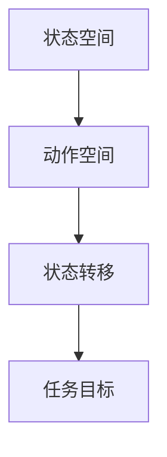
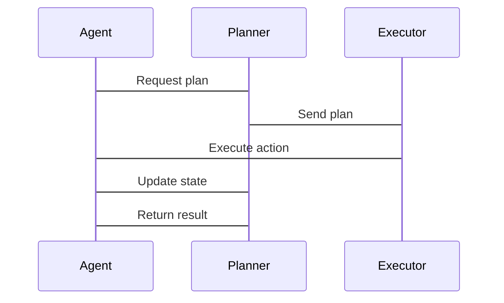

                 


# AI Agent的任务规划与执行模块设计

> 关键词：AI Agent, 任务规划, 执行模块, 算法原理, 系统设计

> 摘要：本文详细探讨了AI Agent的任务规划与执行模块的设计，从基本概念到算法实现，再到系统架构，逐步分析了该模块的核心原理和实际应用。文章通过实例分析，展示了如何设计和实现一个高效的AI Agent任务规划与执行系统。

---

# 第一部分: AI Agent的任务规划与执行模块背景

## 第1章: AI Agent与任务规划概述

### 1.1 AI Agent的基本概念
AI Agent（人工智能代理）是指能够感知环境并采取行动以实现目标的智能实体。它可以分为简单反射型、基于模型的反射型、目标驱动型和效用驱动型四种类型。

### 1.2 任务规划的基本概念
任务规划是指AI Agent根据目标和环境约束，生成一系列行动步骤的过程。任务规划的核心是将目标分解为可执行的动作，并确保这些动作能够引导AI Agent达到目标状态。

### 1.3 AI Agent在任务规划中的作用
AI Agent通过任务规划模块，能够根据当前状态和环境信息，自主地制定行动计划，并在执行过程中动态调整以应对不确定性。

---

## 第2章: 任务规划与执行模块的背景

### 2.1 任务规划的定义与特点
任务规划是AI Agent实现目标的核心模块，其特点包括：明确的目标、动态的环境、复杂的约束条件。

### 2.2 任务执行的基本流程
任务执行包括：目标分解、环境感知、计划生成、计划执行和反馈调整五个阶段。

### 2.3 AI Agent与任务规划的关系
AI Agent的任务规划模块是其实现智能行为的基础，任务规划模块的质量直接影响AI Agent的性能。

---

## 第3章: 任务规划与执行模块的应用场景

### 3.1 智能助手与个人任务管理
AI Agent可以协助用户进行日常任务管理，如日程安排、任务提醒等。

### 3.2 自动化系统中的任务规划
在工业自动化、智能家居等领域，AI Agent的任务规划模块可以实现高效的自动化操作。

### 3.3 多智能体协作中的任务分配
在多智能体协作场景中，任务规划模块需要协调多个AI Agent的任务分配，确保整体目标的实现。

---

# 第二部分: 任务规划与执行的核心概念与联系

## 第4章: 任务规划的核心原理

### 4.1 状态空间与动作空间
- **状态空间**：所有可能的状态集合。
- **动作空间**：AI Agent可以执行的所有动作的集合。
- **状态转移**：动作执行后引起的状态变化。

### 4.2 任务规划的搜索算法
- **广度优先搜索（BFS）**：逐层探索所有可能的状态。
- **深度优先搜索（DFS）**：优先探索某一条路径。
- **A*算法**：基于启发式搜索，结合当前节点的评估函数和目标的接近程度。

### 4.3 任务规划的约束与优化
- **约束条件**：时间、资源、环境限制。
- **优化目标**：最小化成本、最大化效率。

---

## 第5章: 核心概念与联系的Mermaid图



---

# 第三部分: 任务规划与执行的算法原理

## 第6章: 任务规划算法的实现

### 6.1 A*算法的实现
- **伪代码实现**：
  ```python
  def a_star_search(start, goal):
      open_set = {start}
      came_from = {}
      g_score = {start: 0}
      f_score = {start: heuristic(start, goal)}
      
      while open_set:
          current = node_with_min_f_score(open_set)
          if current == goal:
              break
          open_set.remove(current)
          for neighbor in neighbors(current):
              tentative_g_score = g_score[current] + cost(current, neighbor)
              if neighbor not in g_score or tentative_g_score < g_score[neighbor]:
                  came_from[neighbor] = current
                  g_score[neighbor] = tentative_g_score
                  f_score[neighbor] = g_score[neighbor] + heuristic(neighbor, goal)
                  if neighbor not in open_set:
                      open_set.add(neighbor)
      return came_from, g_score
  ```

- **优化技巧**：
  - 使用优先队列优化节点选择。
  - 增加启发函数的准确性。

---

## 第7章: 数学模型与公式

### 7.1 状态价值函数
$$ V(s) = \max_{a} \sum_{s'} P(s'|s,a) V(s') $$

### 7.2 策略优化目标
$$ \theta^* = \arg\max_{\theta} \sum_{s,a} \rho_{\theta}(s,a) Q(s,a;\theta) $$

---

# 第四部分: 系统分析与架构设计

## 第8章: 问题场景介绍

### 8.1 系统功能设计
- **任务分解**：将目标分解为子任务。
- **环境感知**：获取环境状态。
- **计划生成**：生成执行计划。
- **计划执行**：按计划执行任务。
- **动态调整**：根据反馈调整计划。

---

## 第9章: 系统架构设计

### 9.1 领域模型类图
```mermaid
classDiagram
    class State {
        + name: string
        + actions: list
    }
    class Action {
        + name: string
        + cost: float
    }
    class Planner {
        + state_space: list
        + action_space: list
        + heuristic: function
        - states: list
        - actions: list
        - path: list
    }
    Planner o State
    Planner o Action
```

### 9.2 系统架构图


---

## 第10章: 系统交互设计

### 10.1 序列图


---

# 第五部分: 项目实战

## 第11章: 智能助手任务规划模块实现

### 11.1 环境安装
- 安装Python和相关库（如numpy、pandas、scipy）。

### 11.2 核心实现代码
```python
class Planner:
    def __init__(self, state_space, action_space, heuristic):
        self.state_space = state_space
        self.action_space = action_space
        self.heuristic = heuristic
    
    def a_star(self, start, goal):
        # 实现A*算法
        pass
```

### 11.3 案例分析
通过一个智能助手的任务规划案例，详细分析系统的实现过程和优化方法。

---

## 第12章: 项目小结

### 12.1 核心代码解读
- 解释关键代码的作用和实现原理。

### 12.2 案例分析
- 总结案例中的设计思路和实现效果。

### 12.3 项目总结
- 项目成果。
- 经验教训。
- 改进建议。

---

# 第六部分: 总结

## 第13章: 最佳实践

### 13.1 设计建议
- 明确目标和约束条件。
- 选择合适的算法和工具。
- 注重系统的可扩展性和可维护性。

### 13.2 小结
通过本文的讲解，读者可以深入了解AI Agent的任务规划与执行模块的设计与实现，掌握核心算法和系统设计的方法。

### 13.3 注意事项
- 确保算法的效率和准确性。
- 重视系统的动态调整能力。
- 定期进行系统测试和优化。

### 13.4 拓展阅读
推荐相关的书籍和论文，供读者深入学习。

---

# 结语

通过系统性的分析和详细的设计，本文为AI Agent的任务规划与执行模块提供了一个全面的解决方案。希望本文能够为读者在设计和实现类似系统时提供有价值的参考和指导。

--- 

**全文完**

