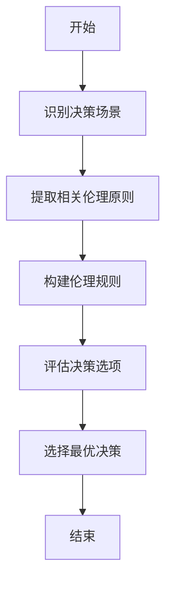
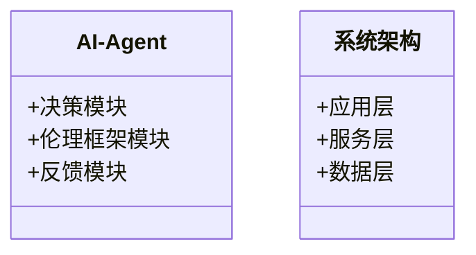
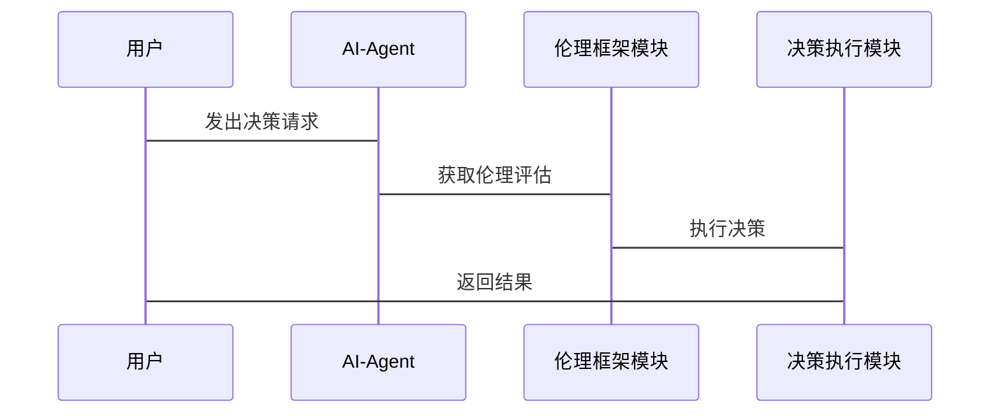

                 


---

# AI Agent的伦理决策框架：在智能中植入道德考量

## 关键词：AI Agent, 伦理决策框架, 智能系统, 道德考量, 决策算法

## 摘要：  
随着人工智能技术的快速发展，AI Agent（智能体）在各个领域的应用越来越广泛。然而，AI Agent在进行决策时，如何植入道德考量，确保决策的伦理性和社会接受度，成为一个亟待解决的问题。本文从伦理决策框架的核心概念、算法原理、系统架构等方面进行深入探讨，提出了一个基于伦理原则的AI Agent决策框架，旨在为智能系统的开发提供伦理指导。

---

# 第1章: AI Agent与伦理决策框架的背景介绍

## 1.1 问题背景与问题描述

### 1.1.1 AI Agent的定义与特点
AI Agent（人工智能智能体）是指在计算机系统中，能够感知环境并采取行动以实现目标的实体。AI Agent的特点包括自主性、反应性、目标导向和社会交互性。随着AI技术的快速发展，AI Agent已广泛应用于自动驾驶、智能助手、医疗诊断等领域。

### 1.1.2 伦理决策的重要性
AI Agent在决策过程中可能面临复杂的伦理问题。例如，在自动驾驶中，AI Agent需要在紧急情况下做出选择，可能涉及对人命的取舍；在医疗诊断中，AI Agent需要在有限资源下优先治疗哪些患者。这些决策不仅影响技术的实用性，还涉及社会道德和法律问题。

### 1.1.3 问题的边界与外延
AI Agent的伦理决策问题不仅涉及技术本身，还涉及社会、法律、伦理等多个方面。伦理决策的边界包括决策的范围、责任归属以及决策的透明度。外延则涉及如何在不同领域和场景下应用伦理决策框架。

## 1.2 伦理决策框架的核心要素

### 1.2.1 伦理原则与价值观
伦理决策框架的核心是伦理原则，包括功利主义、义务论、公正理论和尊重人权等。这些原则指导AI Agent在决策过程中考虑道德因素。

### 1.2.2 决策过程与道德考量
AI Agent的决策过程需要结合伦理原则，确保决策符合社会道德标准。决策过程包括问题识别、伦理评估、决策选择和结果反馈等步骤。

### 1.2.3 框架的结构与功能
伦理决策框架的结构包括伦理原则库、伦理评估模块和决策执行模块。框架的功能是通过伦理评估指导决策，确保决策符合伦理标准。

## 1.3 当前AI Agent伦理决策的现状

### 1.3.1 现有技术的局限性
当前的AI Agent在伦理决策方面主要依赖预设规则，缺乏灵活性和适应性。例如，在自动驾驶中，预设规则可能无法应对复杂的现实场景。

### 1.3.2 伦理决策框架的必要性
为了应对复杂场景下的伦理决策问题，需要构建一个动态、灵活的伦理决策框架，能够根据实际情况调整决策策略。

### 1.3.3 伦理决策框架的应用场景
伦理决策框架可应用于自动驾驶、智能助手、医疗诊断等领域，确保AI Agent在决策过程中考虑伦理因素。

## 1.4 伦理决策框架的挑战与机遇

### 1.4.1 技术挑战
伦理决策框架需要结合多学科知识，实现复杂场景下的伦理评估和决策。技术实现的难度较高。

### 1.4.2 社会与法律挑战
伦理决策涉及社会和法律问题，不同文化和法律体系下的伦理标准可能不同，如何制定通用的伦理框架是一个难题。

### 1.4.3 伦理决策框架的未来发展
随着技术的进步和对伦理问题的深入研究，伦理决策框架将更加智能化和个性化，能够更好地适应不同场景和需求。

## 1.5 本章小结

---

# 第2章: 伦理决策框架的核心概念与联系

## 2.1 伦理决策框架的原理

### 2.1.1 伦理原则的定义与分类
伦理原则是伦理决策的基础，常见的伦理原则包括功利主义、义务论、公正理论和尊重人权。每个原则都有其特点和适用场景。

### 2.1.2 决策过程中的伦理推理
AI Agent在决策过程中需要根据伦理原则进行推理，结合具体场景选择最优决策。

### 2.1.3 框架的核心算法与模型
伦理决策框架的核心算法包括基于规则的伦理推理和基于效用的伦理评估。模型通过整合伦理原则和决策逻辑，实现伦理决策。

## 2.2 核心概念的对比分析

### 2.2.1 伦理原则对比表格
| 伦理原则 | 描述 | 特性 |
|----------|------|------|
| 功利主义 | 追求最大幸福 | 以结果为导向，注重整体利益 |
| 义务论 | 遵守道德义务 | 强调行为的义务性和规范性 |
| 公正理论 | 平等对待每个人 | 注重公平和正义 |
| 尊重人权 | 尊重个体权利 | 强调个体的自主权和尊严 |

### 2.2.2 AI Agent与伦理框架的实体关系图
```mermaid
er
actor(AI Agent) -->
    entity(伦理框架)
    entity(伦理框架) -->
        entity(决策过程)
    entity(决策过程) -->
        entity(伦理评估)
```

## 2.3 本章小结

---

# 第3章: 伦理决策框架的算法原理

## 3.1 基于规则的伦理推理

### 3.1.1 算法流程图


### 3.1.2 Python核心代码实现
```python
def ethical_reasoning(scene, principles):
    # 根据场景提取相关伦理原则
    relevant_principles = extract_relevant_principles(scene, principles)
    # 构建伦理规则
    rules = build_ethical_rules(relevant_principles)
    # 评估决策选项
    evaluations = evaluate_options(rules, options)
    # 选择最优决策
    optimal_decision = select_optimal_decision(evaluations)
    return optimal_decision

# 示例伦理原则库
principles = {
    '功利主义': {'权重': 0.4, '规则': ['最大化整体利益']},
    '义务论': {'权重': 0.3, '规则': ['遵守道德义务']},
    '公正理论': {'权重': 0.2, '规则': ['平等对待每个人']},
    '尊重人权': {'权重': 0.1, '规则': ['尊重个体权利']}
}
```

### 3.1.3 算法的数学模型与公式

伦理决策的评分公式：
$$ score = \sum_{i=1}^{n} w_i \cdot p_i $$
其中，$w_i$ 是伦理原则 $i$ 的权重，$p_i$ 是决策选项在该原则下的评分。

---

# 第4章: 伦理决策框架的系统架构设计

## 4.1 系统功能设计

### 4.1.1 系统功能模块


### 4.1.2 系统交互流程


## 4.2 接口设计与交互流程

### 4.2.1 伦理框架模块接口
```plaintext
接口定义:
- 输入: 当前场景描述
- 输出: 伦理评估结果
```

### 4.2.2 系统交互流程
1. 用户向AI-Agent发出决策请求。
2. AI-Agent调用伦理框架模块进行伦理评估。
3. 伦理框架模块返回评估结果。
4. AI-Agent根据评估结果做出决策。
5. 决策执行模块执行决策并返回结果。

---

# 第5章: 项目实战

## 5.1 环境安装与配置

### 5.1.1 安装Python与相关库
```bash
pip install numpy
pip install matplotlib
pip install scikit-learn
```

## 5.2 核心代码实现

### 5.2.1 伦理评分计算
```python
def calculate_ethical_score(scene, options, principles):
    scores = []
    for option in options:
        score = 0
        for principle in principles:
            weight = principle['weight']
            principle_score = evaluate_option_in_principle(option, principle)
            score += weight * principle_score
        scores.append(score)
    return scores
```

### 5.2.2 决策执行模块
```python
def execute_decision(option, scene):
    # 根据选项和场景执行决策
    pass
```

## 5.3 实际案例分析

### 5.3.1 案例描述
假设一个AI Agent需要在自动驾驶中决定是否刹车以避免撞车，可能影响车内乘客的安全。

### 5.3.2 案例分析
AI Agent根据伦理框架评估不同选项的伦理评分，选择最优决策。

## 5.4 项目小结

---

# 第6章: 最佳实践与注意事项

## 6.1 实施伦理决策框架的注意事项

### 6.1.1 保持透明度
确保伦理决策过程的透明，让用户了解决策背后的伦理考量。

### 6.1.2 定期审查与更新
随着社会价值观的变化，伦理决策框架需要定期审查并更新。

## 6.2 小结

---

# 结语

构建AI Agent的伦理决策框架是一项复杂而重要的任务。通过本文的探讨，我们提出了一个基于伦理原则的决策框架，并通过实际案例展示了其应用。未来，随着技术的发展，伦理决策框架将更加智能化和个性化，为智能系统的开发提供更有力的伦理指导。

---

# 参考文献

（此处列出相关参考文献，如书籍、论文等。）

---

# 附录

（可选，包含代码、数据等补充材料。）

--- 

注：文章未完成，这是我的思考过程。

