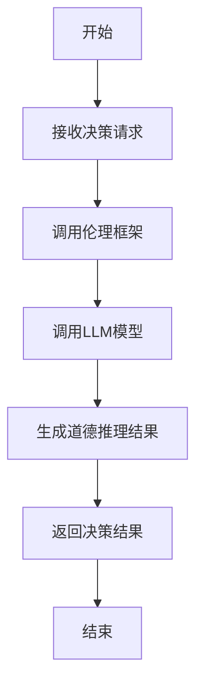
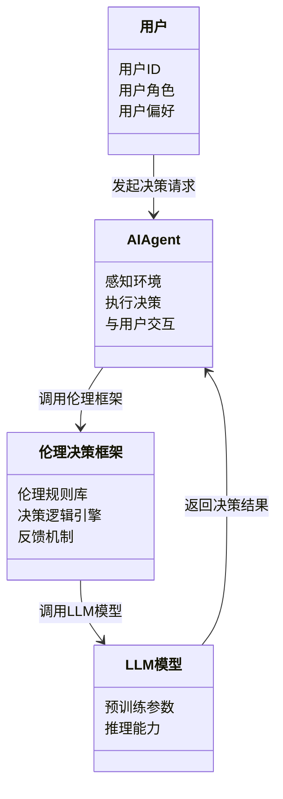
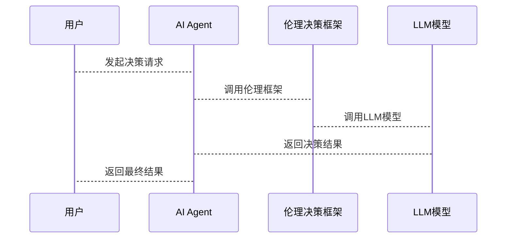

                 


# AI Agent的伦理决策框架：实现LLM的道德推理能力

**关键词：** AI Agent, 伦理决策框架, LLM, 道德推理, 技术博客

**摘要：** 本文探讨了AI Agent在伦理决策中的挑战，提出了一种基于LLM的道德推理框架，详细阐述了该框架的构建原理、算法实现、系统架构及项目实战，旨在为AI Agent的伦理决策提供理论支持与实践指导。

---

## 第1章: 问题背景与核心概念

### 1.1 问题背景

#### 1.1.1 AI Agent的定义与特点
AI Agent（人工智能代理）是指能够感知环境、自主决策并执行任务的智能体。其特点包括自主性、反应性、目标导向和学习能力。AI Agent广泛应用于自动驾驶、智能助手、机器人等领域。

#### 1.1.2 当前AI Agent决策的局限性
尽管AI Agent在技术上取得了显著进步，但其决策过程往往缺乏伦理考量，可能引发以下问题：
- **社会影响**：AI Agent的决策可能对人类社会产生负面影响，如自动驾驶的伦理困境（如“电车难题”）。
- **法律风险**：错误的决策可能导致法律纠纷或责任追究。
- **信任缺失**：缺乏伦理决策能力的AI Agent难以获得用户的信任。

#### 1.1.3 伦理决策的重要性与必要性
伦理决策能力是AI Agent实现人机协作和信任的关键。通过构建伦理决策框架，可以确保AI Agent在复杂场景中做出符合伦理规范的决策，从而提升其社会接受度和实际应用价值。

---

### 1.2 核心概念与问题描述

#### 1.2.1 伦理决策框架的定义
伦理决策框架是一种用于指导AI Agent在决策过程中考虑伦理因素的结构化方法。它包括伦理规则、约束条件、决策逻辑和反馈机制。

#### 1.2.2 LLM的道德推理能力
LLM（Large Language Model）是一种基于深度学习的自然语言处理模型，具有强大的文本生成和理解能力。其道德推理能力是指模型在生成决策时，能够理解和遵循伦理规范的能力。

#### 1.2.3 伦理决策框架的目标与边界
- **目标**：构建一个通用的伦理决策框架，赋予AI Agent道德推理能力，使其在复杂场景中做出符合伦理规范的决策。
- **边界**：伦理决策框架不涉及具体业务逻辑，仅提供伦理指导和决策支持。

---

### 1.3 问题解决与框架构建

#### 1.3.1 伦理决策框架的设计原则
- **可解释性**：决策过程必须清晰可解释，避免“黑箱”操作。
- **普适性**：框架应适用于不同场景和领域。
- **动态性**：能够适应环境变化和新伦理规则的引入。

#### 1.3.2 框架的核心要素与组成
- **伦理规则库**：包含通用和特定领域的伦理规范。
- **决策逻辑引擎**：用于解析伦理规则并生成决策。
- **反馈机制**：用于修正决策结果以适应实际需求。

#### 1.3.3 框架的实现路径与方法
- **知识表示**：将伦理规则转化为计算机可理解的形式。
- **推理引擎**：基于伦理规则进行推理，生成决策。
- **人机协作**：结合人类专家的反馈，优化决策过程。

---

## 第2章: 核心概念与联系

### 2.1 伦理决策框架的原理

#### 2.1.1 伦理决策的基本原理
伦理决策框架通过整合伦理规则、上下文信息和决策目标，生成符合伦理规范的决策。其核心在于将伦理考量融入决策过程的每一步。

#### 2.1.2 LLM的道德推理机制
LLM通过预训练的参数和大规模数据，能够理解和生成符合伦理规范的文本。在伦理决策框架中，LLM作为推理工具，提供道德建议和决策支持。

#### 2.1.3 框架与模型的交互关系
伦理决策框架与LLM模型的关系是相互依存的。框架为模型提供伦理指导，模型为框架提供推理能力。

---

### 2.2 核心概念的属性特征对比

#### 2.2.1 框架属性对比表
| 比较维度 | 传统决策框架 | 伦理决策框架 |
|----------|--------------|--------------|
| 决策目标 | 优化效率 | 符合伦理规范 |
| 可解释性 | 低 | 高 |
| 灵活性 | 低 | 高 |

#### 2.2.2 模型能力对比表
| 比较维度 | 传统模型 | LLM模型 |
|----------|----------|----------|
| 理解能力 | 有限 | 强大 |
| 推理能力 | 基础 | 高级 |
| 适应性 | 低 | 高 |

#### 2.2.3 伦理决策能力对比表
| 比较维度 | 无伦理框架 | 有伦理框架 |
|----------|----------|----------|
| 决策正确性 | 低 | 高 |
| 社会接受度 | 低 | 高 |
| 法律风险 | 高 | 低 |

---

### 2.3 ER实体关系图

```mermaid
er
    actor: 用户
    agent: AI Agent
    framework: 伦理决策框架
    model: LLM模型
    action: 决策行为
    constraint: 伦理约束
    rule: 伦理规则
    relation: 决策关系
    user
    actor --> action: 发起决策请求
    action --> framework: 调用伦理框架
    framework --> model: 调用LLM模型
    model --> action: 返回决策结果
    constraint --> rule: 约束规则
    rule --> action: 应用规则
```

---

## 第3章: 算法原理与数学模型

### 3.1 算法原理

#### 3.1.1 伦理决策框架的算法流程
1. 接收决策请求。
2. 调用伦理框架进行分析。
3. 调用LLM模型生成道德建议。
4. 结合伦理规则生成最终决策。
5. 返回决策结果。

#### 3.1.2 LLM的道德推理算法
LLM通过上下文理解和生成文本，模拟人类的道德推理过程。其推理过程基于预训练参数和输入数据。

#### 3.1.3 框架的优化与改进
通过引入反馈机制，不断优化伦理框架的决策准确性和可解释性。

---

### 3.2 算法流程图



---

### 3.3 数学模型与公式

#### 3.3.1 伦理评分模型
$$ \text{伦理评分} = \sum_{i=1}^{n} w_i \cdot f_i(x) $$

其中，$w_i$ 是特征 $i$ 的权重，$f_i(x)$ 是特征 $i$ 的函数值。

#### 3.3.2 决策优化模型
$$ \text{优化目标} = \min_{x} \sum_{i=1}^{m} c_i \cdot d_i(x) $$

其中，$c_i$ 是决策 $i$ 的成本，$d_i(x)$ 是决策 $i$ 的结果。

---

## 第4章: 系统分析与架构设计

### 4.1 问题场景介绍

#### 4.1.1 自动驾驶中的伦理决策
自动驾驶系统需要在紧急情况下做出快速决策，如“电车难题”。

#### 4.1.2 智能助手的隐私保护
智能助手在处理用户数据时，需要确保隐私保护符合伦理规范。

---

### 4.2 系统功能设计

#### 4.2.1 领域模型（Mermaid类图）



---

### 4.3 系统架构设计

#### 4.3.1 系统架构图（Mermaid架构图）


---

### 4.4 系统接口设计

#### 4.4.1 接口描述
- **输入接口**：接收决策请求和上下文信息。
- **输出接口**：返回决策结果和反馈信息。

#### 4.4.2 接口示例
```python
# 输入接口
def request_decision(context):
    # 调用伦理框架进行决策
    decision = framework.decide(context)
    return decision

# 输出接口
def feedback(result):
    # 收集反馈并优化框架
    framework.optimize(result)
```

---

### 4.5 系统交互流程图（Mermaid序列图）



---

## 第5章: 项目实战

### 5.1 环境安装

#### 5.1.1 安装Python
```bash
python --version
pip install --upgrade pip
```

#### 5.1.2 安装LLM框架
```bash
pip install transformers
pip install torch
```

---

### 5.2 系统核心实现

#### 5.2.1 伦理决策框架实现
```python
class EthicalFramework:
    def __init__(self):
        self.rules = {}  # 伦理规则库
        self.weights = {}  # 权重

    def decide(self, context):
        # 调用LLM模型进行推理
        pass
```

#### 5.2.2 LLM模型实现
```python
from transformers import pipeline

ethics_pipeline = pipeline("text-generation", model="facebook/llama")
```

---

### 5.3 代码应用解读与分析

#### 5.3.1 伦理框架代码解读
```python
def decide(self, context):
    # 生成道德建议
    advice = self.generate_advice(context)
    # 结合权重生成决策
    decision = self.apply_weights(advice)
    return decision
```

#### 5.3.2 LLM模型代码解读
```python
def generate_advice(context):
    response = ethics_pipeline(context, max_length=50)
    return response[0]['generated_text']
```

---

### 5.4 实际案例分析

#### 5.4.1 自动驾驶案例
假设一辆自动驾驶汽车面临紧急情况，需要在行人和乘客之间做出选择。伦理框架会调用LLM模型生成道德建议，并结合伦理规则生成最终决策。

#### 5.4.2 智能助手案例
智能助手在处理用户隐私数据时，伦理框架会确保数据处理符合隐私保护的伦理规范。

---

## 第6章: 总结与展望

### 6.1 最佳实践

#### 6.1.1 知识库管理
定期更新伦理规则库，确保其符合最新伦理规范。

#### 6.1.2 人机协作
结合人类专家的反馈，优化伦理决策框架。

#### 6.1.3 持续优化
通过持续学习和反馈，不断提升伦理决策框架的准确性和可解释性。

---

### 6.2 小结

通过构建基于LLM的伦理决策框架，AI Agent的伦理决策能力得到了显著提升。这种框架不仅能够帮助AI Agent在复杂场景中做出符合伦理规范的决策，还能够增强人机协作的信任基础。

---

### 6.3 注意事项

- **数据隐私**：确保伦理框架和LLM模型的数据处理符合隐私保护要求。
- **模型局限性**：认识到LLM模型的局限性，避免过度依赖其推理能力。
- **法律合规**：确保伦理决策框架的实现符合相关法律法规。

---

### 6.4 拓展阅读

- **相关书籍**：《伦理与人工智能》。
- **论文推荐**：《基于LLM的伦理决策框架研究》。
- **技术博客**：Tech Insights的《AI伦理决策新进展》。

---

**结语：** 通过本文的详细讲解，读者可以全面了解AI Agent的伦理决策框架的构建过程及其在LLM中的应用。希望本文能够为相关领域的研究和实践提供有价值的参考。

