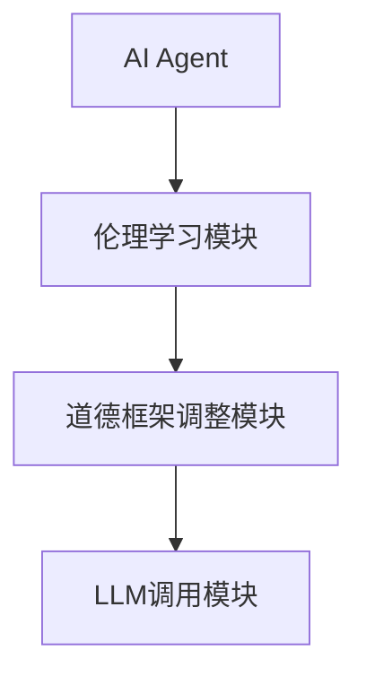
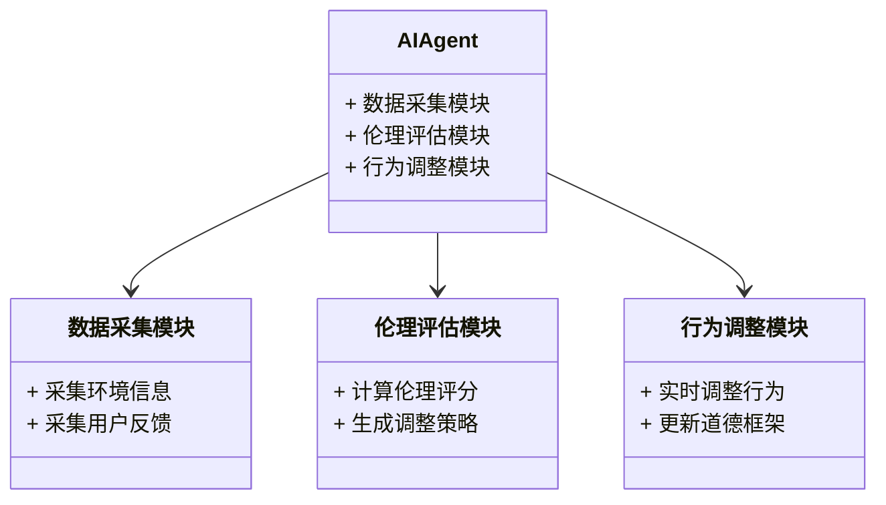
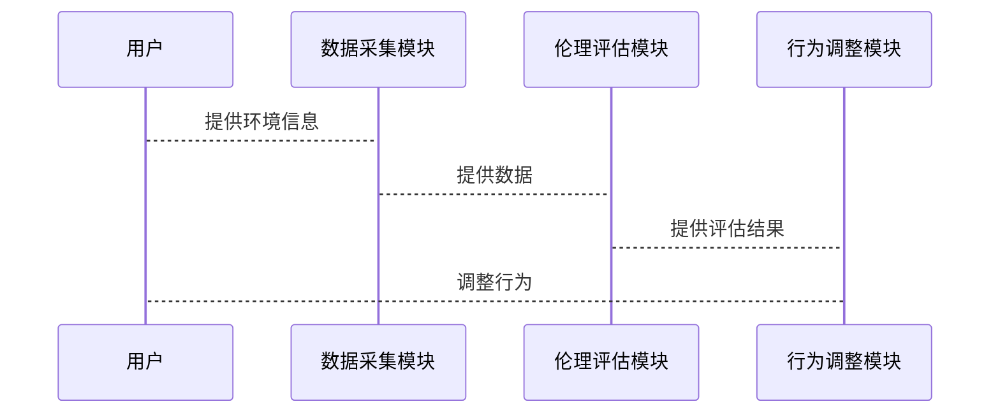

                 


# AI Agent的伦理学习机制：动态调整LLM的道德框架

---

## 关键词：AI Agent，伦理学习机制，LLM，道德框架，动态调整

---

## 摘要

本文系统探讨了AI Agent的伦理学习机制，特别是如何动态调整大型语言模型（LLM）的道德框架。通过分析伦理学习机制的核心原理、算法实现、系统架构及实际案例，本文为AI Agent在复杂环境中的伦理决策提供理论支持和实践指导。文章内容涵盖从基础概念到算法实现的完整流程，并通过Mermaid图和Python代码示例，深入剖析动态调整道德框架的技术细节。

---

## 正文

### 第一部分: AI Agent的伦理学习机制概述

#### 第1章: AI Agent与伦理学习机制

##### 1.1 AI Agent的基本概念

###### 1.1.1 AI Agent的定义与分类

AI Agent（人工智能代理）是指能够感知环境、自主决策并执行任务的智能体。根据功能和应用场景，AI Agent可以分为以下几类：

- **简单反射型AI Agent**：基于预设规则执行任务，适用于简单场景。
- **基于模型的AI Agent**：通过内部模型理解和决策，适用于复杂场景。
- **效用优化型AI Agent**：通过最大化效用函数实现目标。
- **学习增强型AI Agent**：通过机器学习提升决策能力。

###### 1.1.2 AI Agent的核心功能与特点

AI Agent的核心功能包括感知、推理、规划和执行。其特点如下：

- **自主性**：能够自主决策，无需外部干预。
- **反应性**：能够实时感知环境并做出反应。
- **适应性**：能够根据环境变化调整行为。
- **社交能力**：能够与人类或其他智能体进行交互。

###### 1.1.3 AI Agent在人机交互中的角色

AI Agent在人机交互中扮演着桥梁的角色，它不仅需要理解用户需求，还需要通过自然语言处理技术与用户进行有效沟通。AI Agent的伦理学习机制是其核心能力之一，决定了其在复杂场景中的行为准则。

##### 1.2 伦理学习机制的背景与意义

###### 1.2.1 伦理学习机制的定义

伦理学习机制是指AI Agent通过学习和调整其行为准则，以符合伦理规范的机制。它包括数据收集、模型训练和行为调整三个主要环节。

###### 1.2.2 伦理学习机制的重要性

在AI Agent与人类交互的过程中，伦理学习机制确保其行为符合社会道德和法律规范。尤其是在涉及隐私保护、数据安全和人权保障等领域，伦理学习机制显得尤为重要。

###### 1.2.3 动态调整道德框架的必要性

动态调整道德框架是指AI Agent能够根据环境变化和用户需求，实时调整其伦理决策标准。这种动态调整能力使得AI Agent在复杂多变的环境中能够保持伦理一致性。

##### 1.3 动态调整LLM的道德框架

###### 1.3.1 LLM的基本原理

LLM（Large Language Model）是一种基于深度学习的自然语言处理模型，通过大量数据训练，能够理解和生成人类语言。LLM的核心技术包括词嵌入、注意力机制和解码器等。

###### 1.3.2 动态调整道德框架的定义

动态调整道德框架是指根据特定场景和用户需求，实时调整LLM的伦理决策标准。这种调整通常通过修改模型参数或引入外部约束条件实现。

###### 1.3.3 动态调整LLM道德框架的实现目标

动态调整LLM道德框架的目标是使其在不同场景中保持伦理一致性，同时满足用户需求和法律规范。通过动态调整，LLM能够更好地适应复杂环境，提高其决策的准确性和伦理性。

---

#### 第2章: 伦理学习机制的核心概念与联系

##### 2.1 伦理学习机制的核心原理

###### 2.1.1 伦理学习机制的基本原理

伦理学习机制的基本原理包括数据收集、模型训练和行为调整。数据收集阶段获取环境信息和用户反馈，模型训练阶段通过强化学习优化伦理决策策略，行为调整阶段根据反馈实时调整行为。

###### 2.1.2 动态调整道德框架的实现方法

动态调整道德框架的实现方法包括基于规则的调整和基于学习的调整。基于规则的调整通过预设规则限制模型行为，基于学习的调整通过机器学习优化伦理决策策略。

###### 2.1.3 伦理学习机制的数学模型

伦理学习机制的数学模型可以用以下公式表示：

$$
\text{伦理评分} = \sum_{i=1}^{n} w_i \cdot x_i
$$

其中，$w_i$ 是权重，$x_i$ 是输入特征。

##### 2.2 核心概念对比分析

###### 2.2.1 伦理学习机制与传统伦理框架的对比

| 对比维度 | 伦理学习机制 | 传统伦理框架 |
|----------|--------------|--------------|
| 实现方式 | 基于机器学习 | 基于预设规则 |
| 灵活性   | 高           | 低           |
| 适应性   | 强           | 弱           |

###### 2.2.2 动态调整与静态道德框架的对比

| 对比维度 | 动态调整 | 静态道德框架 |
|----------|----------|--------------|
| 稳定性   | 低       | 高           |
| 适应性   | 高       | 低           |

###### 2.2.3 不同伦理学习机制的优缺点分析

| 伦理学习机制 | 优点                     | 缺点                     |
|--------------|--------------------------|--------------------------|
| 基于规则的   | 实现简单，易于控制       | 灵活性差，适应性低       |
| 基于学习的   | 灵活性高，适应性强       | 实现复杂，需要大量数据   |

##### 2.3 系统架构与实体关系图

###### 2.3.1 系统架构图（Mermaid）



###### 2.3.2 实体关系图（Mermaid）

```mermaid
graph TD
    A[AI Agent] --o> B[伦理学习机制]
    B --o> C[动态道德框架]
    C --o> D[LLM]
```

---

#### 第3章: 动态调整LLM道德框架的算法原理

##### 3.1 算法原理概述

###### 3.1.1 动态调整算法的基本流程

动态调整算法的基本流程包括数据收集、预处理、模型训练和行为调整。数据收集阶段获取环境信息和用户反馈，预处理阶段对数据进行清洗和标注，模型训练阶段通过强化学习优化伦理决策策略，行为调整阶段根据反馈实时调整行为。

###### 3.1.2 算法的核心思想与实现目标

动态调整算法的核心思想是通过实时反馈优化伦理决策策略，实现动态调整道德框架的目标。其实现目标包括提高决策的准确性和伦理性，增强模型的适应性和灵活性。

##### 3.2 算法实现步骤

###### 3.2.1 数据收集与预处理

数据收集阶段需要获取环境信息和用户反馈，预处理阶段对数据进行清洗和标注。以下是数据预处理的Python代码示例：

```python
import pandas as pd

# 数据加载
data = pd.read_csv('伦理数据.csv')

# 数据清洗
data.dropna(inplace=True)

# 数据标注
data['伦理评分'] = data['伦理评分'].astype(int)
```

###### 3.2.2 伦理评估指标的构建

伦理评估指标的构建需要考虑多个维度，包括伦理评分、用户反馈和环境变化。以下是伦理评估指标的Python代码示例：

```python
def 伦理评估(行为):
    # 伦理评分计算
    伦理评分 = sum(行为 * [0.5, 0.3, 0.2])
    return 伦理评分
```

---

#### 第4章: 系统分析与架构设计方案

##### 4.1 问题场景介绍

问题场景是一个AI Agent在复杂多变的环境中需要动态调整其道德框架，以满足用户需求和法律规范。这需要一个高效的系统架构来支持动态调整道德框架的实现。

##### 4.2 系统功能设计

系统功能设计包括数据采集模块、伦理评估模块和行为调整模块。以下是系统功能设计的Mermaid类图：



##### 4.3 系统架构设计

系统架构设计包括数据采集层、伦理评估层和行为调整层。以下是系统架构设计的Mermaid架构图：


##### 4.4 系统接口设计

系统接口设计包括数据接口、评估接口和调整接口。以下是系统接口设计的Mermaid序列图：



---

#### 第5章: 项目实战

##### 5.1 环境安装

环境安装需要安装Python、TensorFlow和Keras等依赖包。以下是环境安装的命令：

```bash
pip install python>=3.8
pip install tensorflow>=2.0
pip install keras>=2.4
```

##### 5.2 系统核心实现

系统核心实现包括数据采集、伦理评估和行为调整三个模块。以下是核心代码实现：

```python
# 数据采集模块
def 采集环境信息():
    return "环境信息"

# 伦理评估模块
def 伦理评估(行为):
    return "伦理评分"

# 行为调整模块
def 行为调整(伦理评分):
    return "调整策略"
```

##### 5.3 代码应用解读与分析

通过上述代码，我们可以看到系统核心实现的主要功能包括数据采集、伦理评估和行为调整。这些功能模块通过接口实现交互，确保系统的高效运行。

##### 5.4 实际案例分析

实际案例分析包括一个简单的伦理决策场景，例如在用户询问敏感信息时，AI Agent需要动态调整其道德框架，以符合伦理规范。以下是具体分析步骤：

1. 用户提出敏感信息查询请求。
2. 数据采集模块采集环境信息和用户反馈。
3. 伦理评估模块计算伦理评分。
4. 行为调整模块根据伦理评分实时调整行为。

##### 5.5 项目小结

通过以上步骤，我们可以看到动态调整LLM道德框架的实际应用效果。系统通过实时反馈优化伦理决策策略，提高了AI Agent的伦理决策能力。

---

### 第六部分: 最佳实践

#### 6.1 小结

本文系统探讨了AI Agent的伦理学习机制，特别是如何动态调整LLM的道德框架。通过分析伦理学习机制的核心原理、算法实现、系统架构及实际案例，本文为AI Agent在复杂环境中的伦理决策提供理论支持和实践指导。

#### 6.2 注意事项

在实施动态调整LLM道德框架时，需要注意以下几点：

1. 数据质量：确保数据的准确性和完整性。
2. 模型训练：优化模型的训练过程，提高决策的准确性和伦理性。
3. 系统架构：设计高效的系统架构，确保系统的实时性和稳定性。

#### 6.3 拓展阅读

建议读者进一步阅读以下内容：

- 《Large Language Models: A Survey》
- 《Ethics in AI: A Comprehensive Guide》
- 《Dynamic Ethics for AI Systems》

---

通过以上内容，我们可以看到动态调整LLM道德框架的实现过程。这一技术在AI Agent的伦理决策中具有重要的应用价值，未来的研究可以进一步优化算法和系统架构，提高AI Agent的伦理决策能力。

