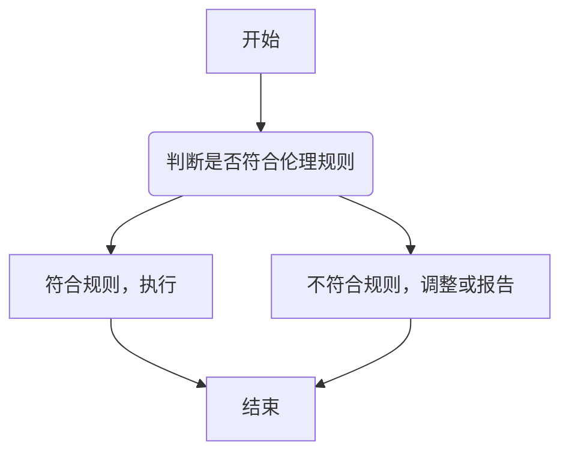
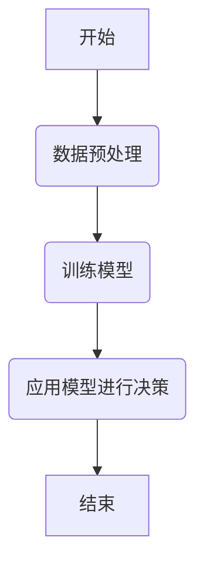
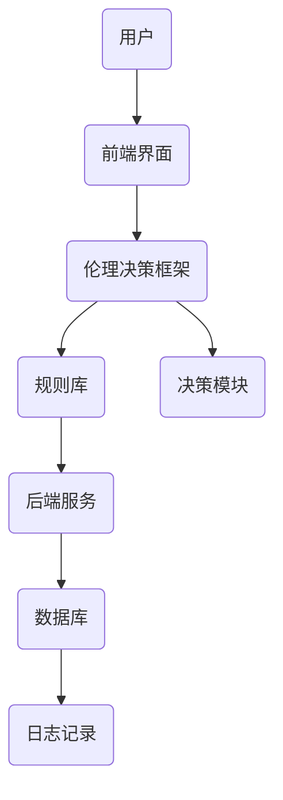

                 


# AI Agent的伦理学习：在LLM中植入道德决策框架

## 关键词：
AI Agent、伦理学习、大语言模型、道德决策框架、伦理算法、人机协作

## 摘要：
随着AI Agent技术的迅速发展，伦理决策框架在大语言模型中的应用变得至关重要。本文深入探讨了AI Agent在LLM中的伦理学习方法，系统地分析了伦理决策的算法原理、系统架构设计以及实际应用案例。通过构建伦理决策框架，我们能够提升AI Agent在复杂场景中的道德判断能力，确保其决策符合人类社会的伦理规范。本文不仅为AI Agent的伦理学习提供了理论基础，还通过实际案例展示了如何将伦理框架融入LLM中，为未来的研究和实践提供了有价值的参考。

---

# 第一部分: AI Agent的伦理学习背景与核心概念

## 第1章: AI Agent与伦理学习概述

### 1.1 AI Agent的基本概念

#### 1.1.1 AI Agent的定义与分类
AI Agent，即人工智能代理，是指能够感知环境并采取行动以实现目标的智能实体。AI Agent可以分为以下几类：
1. **简单反射型Agent**：基于简单的条件反射执行任务。
2. **基于模型的反射型Agent**：利用内部模型进行推理和决策。
3. **目标驱动型Agent**：根据目标选择最优行动。
4. **实用驱动型Agent**：根据效用函数优化决策。

#### 1.1.2 大语言模型（LLM）与AI Agent的关系
大语言模型（Large Language Model, LLM）通过处理大量文本数据，具备生成、理解和推理能力。AI Agent可以利用LLM作为其知识库和推理引擎，从而提升决策的准确性和智能化。

#### 1.1.3 伦理学习的必要性
AI Agent在现实应用中面临复杂的伦理问题，例如自动驾驶的交通事故处理、医疗AI的诊断决策等。伦理学习使AI Agent能够在遵循伦理规范的前提下，做出合理决策。

---

### 1.2 伦理决策框架的基本原理

#### 1.2.1 伦理决策的定义与特点
伦理决策是基于伦理规范和价值观的决策过程，其特点包括：
1. **情境依赖性**：决策依赖于具体场景。
2. **复杂性**：涉及多方面的利益权衡。
3. **可解释性**：决策过程需要透明和可理解。

#### 1.2.2 伦理决策框架的核心要素
1. **伦理规则库**：存储社会认可的伦理规范。
2. **情境分析模块**：分析当前场景并提取相关信息。
3. **决策推理模块**：基于规则和推理生成决策。
4. **评估优化模块**：优化决策以符合伦理目标。

#### 1.2.3 伦理决策与AI Agent的结合
AI Agent通过集成伦理决策框架，能够在决策过程中考虑伦理因素，确保其行为符合社会道德。

---

### 1.3 当前AI Agent伦理决策的挑战

#### 1.3.1 伦理决策的复杂性
不同场景下的伦理规范可能冲突，AI Agent需要在复杂情境中权衡利弊。

#### 1.3.2 伦理决策的可解释性问题
复杂的决策过程可能导致AI Agent的决策难以被人类理解和信任。

#### 1.3.3 伦理决策的边界与外延
AI Agent的伦理决策范围需要明确界定，避免过度干预或决策失误。

---

## 第2章: 伦理学习的核心概念与联系

### 2.1 伦理框架的原理与结构

#### 2.1.1 伦理框架的层次结构
伦理框架通常分为以下层次：
1. **基础伦理原则**：如诚实、公正、不伤害等。
2. **具体伦理规范**：根据不同领域制定详细规范。
3. **情境化伦理决策**：根据具体场景调整决策。

#### 2.1.2 伦理框架的属性特征对比表

| 属性 | 描述 |
|------|------|
| 灵活性 | 高度可定制化 |
| 可扩展性 | 支持新增伦理规则 |
| 可解释性 | 高度透明 |

#### 2.1.3 伦理框架的ER实体关系图
```mermaid
erDiagram
    actor 用户
    actor 开发者
    actor 伦理专家
    actor 系统管理员
    框架 <-----> 规则库
    规则库 <-----> 决策模块
    用户 --> 框架
    开发者 --> 框架
    伦理专家 --> 框架
    系统管理员 --> 框架
```

---

### 2.2 伦理决策机制的实现原理

#### 2.2.1 基于规则的伦理决策机制
基于预定义的伦理规则进行决策，适用于规则明确的场景。

#### 2.2.2 基于学习的伦理决策机制
通过机器学习模型从数据中学习伦理决策模式。

#### 2.2.3 混合型伦理决策机制
结合规则和学习的优势，适用于复杂场景。

---

## 第3章: AI Agent的伦理学习算法原理

### 3.1 基于规则的伦理决策算法

#### 3.1.1 算法流程图


#### 3.1.2 算法实现代码
```python
def ethical_decision(moral_rule, action):
    if moral_rule.evaluate(action):
        return "执行"
    else:
        return "不执行"
```

#### 3.1.3 数学模型与公式
$$
\text{如果 } P \rightarrow \text{执行 } A \\
\text{否则 } \rightarrow \text{执行 } B
$$

### 3.2 基于学习的伦理决策算法

#### 3.2.1 算法流程图


#### 3.2.2 神经网络模型结构
$$
\text{损失函数 } L = \sum_{i=1}^{n} (y_i - \hat{y}_i)^2
$$

---

## 第4章: 伦理决策框架的系统分析与架构设计

### 4.1 系统功能设计

#### 4.1.1 领域模型
```mermaid
classDiagram
    class 用户
    class 开发者
    class 伦理专家
    class 系统管理员
    class 框架
    class 规则库
    class 决策模块
    用户 --> 框架
    开发者 --> 框架
    伦理专家 --> 框架
    系统管理员 --> 框架
    框架 <-----> 规则库
    框架 <-----> 决策模块
```

#### 4.1.2 系统架构设计


---

## 第5章: 项目实战

### 5.1 环境安装与配置
安装必要的Python库，如TensorFlow、PyTorch等。

### 5.2 核心模块实现代码
```python
def ethical_framework(rules, input):
    for rule in rules:
        if rule.applies_to(input):
            return rule.decision(input)
    return default_decision
```

### 5.3 实际案例分析
以自动驾驶场景为例，分析AI Agent如何在紧急情况下做出符合伦理的决策。

---

## 第6章: 最佳实践与小结

### 6.1 小结
本文详细探讨了AI Agent的伦理学习方法，分析了伦理决策框架的实现原理和系统架构。

### 6.2 注意事项
确保伦理决策的透明性和可解释性，避免算法偏见。

### 6.3 未来挑战
探索更复杂的伦理决策场景，提升AI Agent的自主学习能力。

### 6.4 扩展阅读
推荐相关书籍和论文，供读者深入学习。

---

通过以上内容，我们系统地分析了AI Agent的伦理学习方法，为未来的实践提供了理论和方法论的支持。

