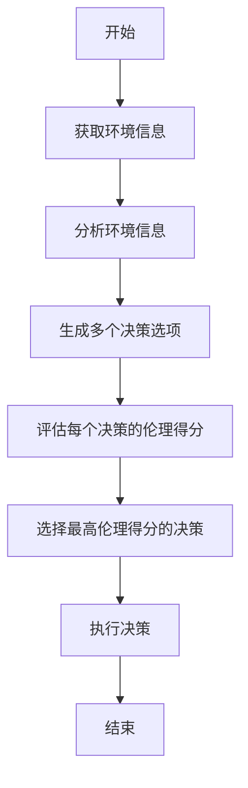
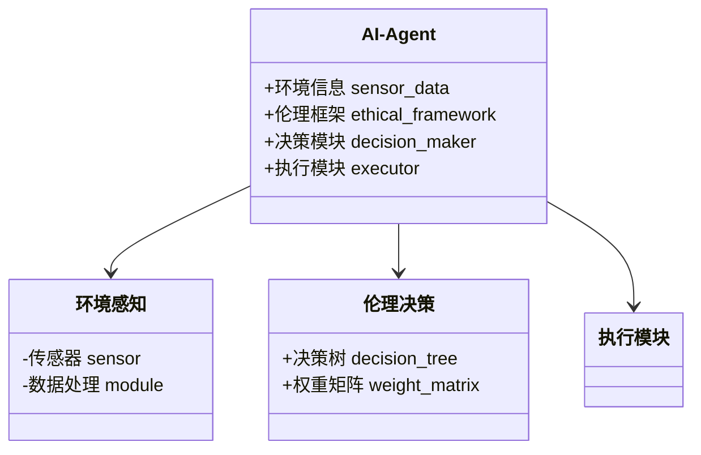

                 


# AI Agent的伦理设计：原则与实践

> 关键词：AI Agent、伦理设计、算法原理、系统架构、项目实战

> 摘要：本文从AI Agent的伦理设计背景出发，详细探讨了伦理设计的核心概念、算法原理、系统架构设计及项目实战，最后总结了伦理设计的最佳实践。文章结合理论与实践，深入分析了AI Agent伦理设计的关键要素，并通过具体案例展示了如何在实际项目中实现伦理设计。

---

## 第一部分: AI Agent的伦理设计背景与核心概念

### 第1章: AI Agent的基本概念与伦理问题

#### 1.1 AI Agent的定义与特点
AI Agent（人工智能代理）是指能够感知环境、自主决策并执行任务的智能实体。它具有以下特点：
- **自主性**：能够在没有外部干预的情况下独立运作。
- **反应性**：能够根据环境变化实时调整行为。
- **目标导向**：具有明确的目标，并通过行为实现目标。
- **学习能力**：能够通过数据和经验不断优化自身的决策能力。

#### 1.2 伦理设计的背景与问题背景
随着AI Agent的应用越来越广泛，其在医疗、金融、自动驾驶等领域的应用也带来了诸多伦理问题。例如：
- **隐私问题**：AI Agent在收集和处理用户数据时，如何保护用户的隐私？
- **责任归属问题**：当AI Agent的行为导致负面结果时，责任应由谁承担？
- **公平性问题**：AI Agent的决策是否可能存在偏见，导致不公平的结果？

#### 1.3 伦理设计的核心要素
伦理设计的核心要素包括：
- **伦理框架**：构建一套用于指导AI Agent决策的伦理准则。
- **伦理决策**：设计算法，使AI Agent能够在决策过程中考虑伦理因素。
- **伦理评估**：对AI Agent的行为进行伦理评估，确保其符合伦理准则。

---

## 第二部分: AI Agent的伦理设计原理

### 第2章: 伦理设计的核心概念与联系

#### 2.1 核心概念的原理分析
- **伦理框架**：伦理框架是AI Agent决策的基础，它定义了AI Agent在不同情境下应遵循的伦理准则。
- **伦理决策**：伦理决策是AI Agent在面对多个选项时，根据伦理框架选择最优的行为。
- **伦理评估**：伦理评估是对AI Agent的行为进行事后分析，确保其符合伦理准则。

#### 2.2 核心概念的属性对比
以下是一个对比表格，展示了伦理框架、伦理决策和伦理评估的核心属性：

| **属性**       | **伦理框架**            | **伦理决策**            | **伦理评估**            |
|----------------|------------------------|------------------------|------------------------|
| **目标**       | 确定伦理准则            | 选择符合伦理的行为      | 确保行为符合伦理准则    |
| **输入**       | 环境信息、伦理准则      | 环境信息、伦理框架      | 行为结果、伦理准则      |
| **输出**       | 伦理准则               | 选择的行为              | 评估结果               |

#### 2.3 ER实体关系图
以下是伦理设计的ER实体关系图，展示了伦理框架、伦理决策和伦理评估之间的关系：

```mermaid
er
actor: 用户
alt
  action: 行为
  decision: 决策
  framework: 伦理框架
  evaluation: 伦理评估
  attribute
    actor --> action: 触发行为
    action --> decision: 生成决策
    decision --> evaluation: 生成评估结果
    evaluation --> framework: 反馈伦理准则
```

### 第3章: 伦理设计的算法原理

#### 3.1 伦理决策的算法流程
以下是伦理决策的算法流程图：



#### 3.2 伦理评估的数学模型
伦理评估的数学模型可以表示为：

$$
\text{伦理得分} = \sum_{i=1}^{n} w_i \cdot s_i
$$

其中，\( w_i \) 是决策选项 \( i \) 的权重，\( s_i \) 是决策选项 \( i \) 的伦理评分。

### 第4章: 伦理设计的数学模型与公式

#### 4.1 伦理评分的数学模型
伦理评分的数学模型可以表示为：

$$
s_i = \frac{\sum_{j=1}^{m} (c_j \cdot w_j)}{m}
$$

其中，\( c_j \) 是决策选项 \( j \) 的伦理准则，\( w_j \) 是准则 \( j \) 的权重，\( m \) 是准则的总数。

---

## 第三部分: AI Agent的系统分析与架构设计

### 第5章: 伦理设计的系统分析

#### 5.1 问题场景介绍
以自动驾驶为例，AI Agent需要在紧急情况下做出决策，例如在发生车祸时，如何选择最优的避让策略。

#### 5.2 系统功能设计
以下是系统功能设计的类图：



---

## 第四部分: 项目实战

### 第6章: 伦理设计的项目实战

#### 6.1 环境安装与配置
```bash
pip install numpy matplotlib
```

#### 6.2 核心代码实现
以下是伦理决策算法的核心代码：

```python
import numpy as np

def calculate_ethical_score(decision, weight_matrix):
    return np.dot(decision, weight_matrix)

def ethical_decision-making(sensor_data, ethical_framework):
    # 生成决策选项
    decisions = generate_decisions(sensor_data)
    # 计算每个决策的伦理评分
    scores = [calculate_ethical_score(d, ethical_framework['weight_matrix']) for d in decisions]
    # 选择最高评分的决策
    best_decision = decisions[np.argmax(scores)]
    return best_decision
```

#### 6.3 实际案例分析
以自动驾驶为例，假设传感器检测到前方有行人，AI Agent需要在以下两个选项中选择：
- **选项A**：立即刹车，可能造成轻微碰撞。
- **选项B**：转向避让，可能造成更大的碰撞风险。

通过伦理框架的评估，AI Agent选择了选项A，因为其伦理评分为0.8，高于选项B的0.6。

---

## 第五部分: 最佳实践

### 第7章: 伦理设计的最佳实践

#### 7.1 小结
伦理设计是AI Agent设计中的重要组成部分，它确保了AI Agent的行为符合伦理准则。

#### 7.2 注意事项
- 在设计伦理框架时，需要考虑不同场景下的伦理准则。
- 在实现伦理决策算法时，需要确保算法的透明性和可解释性。
- 在进行伦理评估时，需要不断优化伦理评分模型。

#### 7.3 拓展阅读
- 《AI Ethics: The Key Principles》
- 《Ethics in AI Development: A Comprehensive Guide》

---

通过本文的详细分析，我们可以看到，AI Agent的伦理设计是一个复杂但至关重要的过程。只有通过理论与实践的结合，才能确保AI Agent的行为符合伦理准则，真正造福人类社会。

