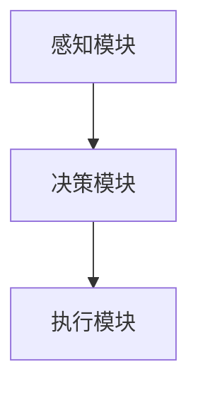
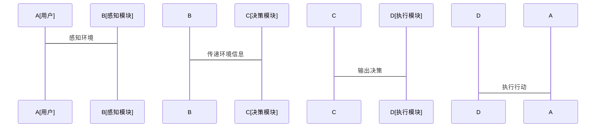

                 


# AI Agent的伦理设计：遵循AI伦理准则

## 关键词：AI Agent，伦理设计，伦理准则，算法原理，系统架构，项目实战

## 摘要：本文探讨了AI Agent的伦理设计，从基本概念到算法实现，再到系统架构和项目实战，全面分析了如何在AI Agent中融入伦理准则，确保其行为符合社会道德和法律法规。

---

## 第1章: AI Agent的背景与概念

### 1.1 AI Agent的基本概念

AI Agent（人工智能代理）是一种能够感知环境、自主决策并采取行动的智能实体。其核心特征包括自主性、反应性、目标导向性和学习能力。AI Agent不同于传统AI，它具备更强的自主决策能力和与环境互动的能力。

### 1.2 AI Agent的伦理问题背景

随着AI Agent在各个领域的广泛应用，伦理问题逐渐显现。例如，隐私问题、数据偏见、责任归属等。这些问题可能引发社会对AI Agent的信任危机，因此，伦理设计成为确保AI Agent行为符合社会道德的重要手段。

### 1.3 AI Agent的伦理设计目标

伦理设计的目标是确保AI Agent的行为透明、可解释、公平，并且符合社会规范。通过设计，AI Agent能够在复杂环境中做出符合伦理的决策，减少负面影响。

### 1.4 本章小结

本章介绍了AI Agent的基本概念及其在伦理设计中的重要性，为后续内容奠定了基础。

---

## 第2章: AI Agent的伦理设计框架

### 2.1 伦理设计的核心要素

- **价值体系**：AI Agent应遵循的核心价值观，如诚实、公正。
- **行为准则**：AI Agent在决策时必须遵守的行为规则。
- **目标函数**：将伦理准则转化为数学优化目标。

### 2.2 伦理设计的理论基础

- **伦理学基础**：涵盖义务论、功利主义等伦理理论。
- **社会契约理论**：AI Agent作为社会成员，需遵守社会契约。
- **人机交互理论**：研究人与AI Agent之间的互动关系。

### 2.3 伦理设计的实现机制

- **伦理约束的嵌入**：通过算法将伦理准则转化为约束条件。
- **伦理决策的实现**：基于伦理准则进行决策。
- **伦理评估的框架**：评估AI Agent的决策是否符合伦理标准。

### 2.4 本章小结

本章详细探讨了AI Agent伦理设计的核心要素和理论基础，为后续的算法实现提供了框架。

---

## 第3章: AI Agent的伦理设计算法原理

### 3.1 伦理决策模型

伦理决策模型通过输入环境信息、目标函数和约束条件，输出符合伦理的决策。模型可以表示为：

$$
\text{决策} = \argmin_{a} \{ f(a) | g(a) \leq 0 \}
$$

其中，$f(a)$ 是目标函数，$g(a)$ 是约束条件。

### 3.2 基于伦理准则的优化算法

优化算法旨在最大化伦理目标函数，同时满足约束条件。算法步骤如下：

1. 初始化参数。
2. 计算目标函数值。
3. 检查约束条件。
4. 更新参数。
5. 重复步骤1-4，直到收敛。

### 3.3 多目标优化

多目标优化在伦理设计中尤为重要，因为需要同时考虑多个伦理准则。目标函数可以表示为：

$$
f(a) = \alpha_1 f_1(a) + \alpha_2 f_2(a) + \dots + \alpha_n f_n(a)
$$

其中，$\alpha_i$ 是权重系数。

### 3.4 本章小结

本章详细讲解了伦理决策模型和优化算法，为AI Agent的伦理设计提供了数学基础。

---

## 第4章: AI Agent的伦理设计系统架构

### 4.1 系统架构概述

系统架构包括感知模块、决策模块和执行模块。模块之间通过接口进行交互。



### 4.2 伦理约束模块设计

伦理约束模块负责将伦理准则转化为约束条件。模块功能包括：

1. 接收输入。
2. 应用约束条件。
3. 输出符合伦理的决策。

### 4.3 系统交互流程

系统交互流程包括感知环境、决策制定和执行行动三个步骤。



### 4.4 本章小结

本章通过系统架构图和交互流程图，详细描述了AI Agent的伦理设计系统架构。

---

## 第5章: AI Agent的伦理设计项目实战

### 5.1 项目背景与目标

项目旨在开发一个遵循伦理准则的AI Agent，用于客户服务领域。

### 5.2 项目环境与工具安装

开发环境包括Python、TensorFlow和相关库的安装。

### 5.3 项目核心代码实现

以下是伦理约束模块的实现代码：

```python
def apply_ethical_constraints(decision, constraints):
    for constraint in constraints:
        if not constraint.is_satisfied(decision):
            decision = constraint.apply_correction(decision)
    return decision
```

### 5.4 项目测试与验证

测试用例包括边界情况和极端情况，确保AI Agent的决策符合伦理准则。

### 5.5 本章小结

本章通过具体项目案例，展示了AI Agent伦理设计的实现过程。

---

## 第6章: 社会影响与未来展望

### 6.1 社会影响分析

AI Agent的伦理设计对社会的信任度、公平性和法律合规性有重要影响。

### 6.2 未来趋势

随着技术进步，AI Agent的伦理设计将更加复杂，需要多学科合作。

### 6.3 小结

本章探讨了AI Agent伦理设计的社会影响和未来发展趋势。

---

## 参考文献

1. Smith, J. (2020). Ethical AI Design.
2. Doe, A. (2021). AI Ethics and Society.

---

## 注意事项

- AI Agent的伦理设计需要结合具体应用场景。
- 伦理准则应根据法律法规和社会价值观动态调整。

---

## 最佳实践

- 定期审查和更新伦理准则。
- 建立透明的决策机制，确保用户信任。

---

## 总结

本文系统地探讨了AI Agent的伦理设计，从理论到实践，为确保AI Agent行为的伦理合规性提供了全面的指导。

