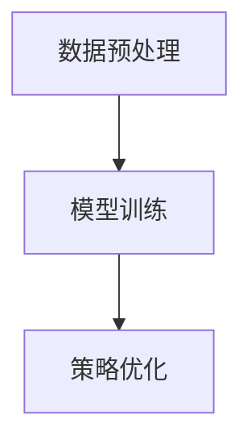

                 


# AI Agent的元学习在少样本学习中的应用

> **关键词**：AI Agent，元学习，少样本学习，MAML，ReMAML，系统架构设计

> **摘要**：  
本文探讨AI Agent在少样本学习中的应用，重点分析元学习如何提升AI Agent在数据稀缺环境下的学习能力。通过详细阐述元学习的原理、算法实现及系统架构设计，结合实际案例，展示如何利用元学习优化AI Agent的决策能力和适应性。文章还分析了当前研究的挑战，并展望未来发展方向。

---

## 第1章: AI Agent与元学习概述

### 1.1 AI Agent的基本概念

#### 1.1.1 AI Agent的定义与分类
- **定义**：AI Agent是能够感知环境、自主决策并执行任务的智能体。  
- **分类**：基于智能水平，AI Agent可分为简单反射型、基于模型的反应型、目标驱动型和推理驱动型。

#### 1.1.2 元学习的基本概念
- **定义**：元学习是一种学习方法，允许模型从经验中学习如何学习。  
- **特点**：具备快速适应新任务的能力，适用于数据稀缺场景。

#### 1.1.3 少样本学习的背景与挑战
- **背景**：在某些领域，标注数据有限，传统深度学习方法难以适用。  
- **挑战**：模型泛化能力不足，计算效率低下。

---

### 1.2 元学习的核心原理

#### 1.2.1 元学习的定义与特点
- **定义**：元学习通过优化参数更新规则，提升模型在新任务上的表现。  
- **特点**：适用于少样本学习，具备快速泛化能力。

#### 1.2.2 元学习与传统机器学习的对比
- **传统机器学习**：依赖大量标注数据，模型泛化能力受限。  
- **元学习**：通过优化参数更新规则，减少对大量数据的依赖。

#### 1.2.3 元学习在AI Agent中的应用价值
- **价值**：提升AI Agent在动态环境中的适应性和决策能力。

---

### 1.3 少样本学习的理论基础

#### 1.3.1 统计学习理论基础
- **理论基础**：基于统计学习的假设空间和经验风险最小化原则。

#### 1.3.2 数据增强与特征提取
- **数据增强**：通过数据变换增加训练样本数量。  
- **特征提取**：提取高阶特征，减少对大量数据的依赖。

#### 1.3.3 对比学习与迁移学习
- **对比学习**：通过对比不同样本的特征差异，提升模型区分能力。  
- **迁移学习**：将已学习的知识应用到新任务中。

---

## 第2章: 元学习在AI Agent中的机制

### 2.1 元学习的优化目标

#### 2.1.1 元学习的优化问题
- **问题**：优化参数更新规则，使模型在新任务上表现最优。  
- **目标**：最大化跨任务的泛化能力。

#### 2.1.2 元学习的损失函数
- **损失函数**：结合任务内损失和任务间损失，优化参数更新规则。

#### 2.1.3 元学习的梯度计算
- **梯度计算**：通过链式法则计算元损失梯度，更新元参数。

---

### 2.2 元学习的训练过程

#### 2.2.1 元学习的初始化
- **初始化**：随机初始化元参数和任务参数。

#### 2.2.2 元学习的参数更新
- **更新规则**：通过优化算法（如SGD）更新元参数和任务参数。

#### 2.2.3 元学习的收敛条件
- **收敛条件**：任务损失函数值达到稳定状态。

---

### 2.3 元学习在AI Agent中的应用

#### 2.3.1 AI Agent的元学习框架
- **框架**：包含元学习模块、任务执行模块和参数更新模块。

#### 2.3.2 元学习对AI Agent决策能力的提升
- **提升**：通过元学习优化决策策略，提升任务执行效率。

#### 2.3.3 元学习在动态环境中的适应性
- **适应性**：快速调整策略，适应环境变化。

---

## 第3章: 少样本学习的算法与方法

### 3.1 少样本学习的挑战

#### 3.1.1 数据稀疏性问题
- **问题**：数据量少，模型难以捕捉数据分布。

#### 3.1.2 模型泛化能力的限制
- **限制**：传统深度学习模型依赖大量数据，泛化能力不足。

#### 3.1.3 算法的计算复杂度
- **复杂度**：少样本学习算法通常需要优化多个超参数。

---

### 3.2 基于元学习的少样本学习算法

#### 3.2.1 MAML算法
- **算法特点**：通过优化参数更新规则，使模型在新任务上快速收敛。

#### 3.2.2 ReMAML算法
- **算法特点**：结合关系推理，提升模型对任务间关系的建模能力。

#### 3.2.3 其他元学习算法
- **其他算法**：如Relation Networks和Prototypical Networks。

---

### 3.3 少样本学习的性能评估

#### 3.3.1 评估指标的选择
- **指标**：准确率、F1分数、AUC等。

#### 3.3.2 实验设计与对比分析
- **实验设计**：对比不同算法在相同数据集上的表现。

#### 3.3.3 结果分析与优化方向
- **结果分析**：不同算法的优劣，优化方向。

---

## 第4章: AI Agent的元学习算法实现

### 4.1 元学习算法的数学模型

#### 4.1.1 MAML算法的数学推导
- **公式**：$$ L_{meta} = \sum_{i=1}^{N} L_{task_i}(θ_{meta}) $$
- **推导**：通过优化元参数，使模型在新任务上表现最优。

#### 4.1.2 ReMAML算法的改进
- **改进**：引入关系推理模块，提升任务间关系建模能力。

---

### 4.2 元学习算法的代码实现

#### 4.2.1 MAML算法的Python实现
```python
import torch
import torch.nn as nn

class MetaLearner:
    def __init__(self, model):
        self.model = model
        self.meta_optimizer = torch.optim.Adam(self.model.parameters(), lr=1e-3)
    
    def meta_train(self, tasks):
        for task in tasks:
            # 前向传播
            outputs = self.model(task.inputs)
            # 计算任务损失
            task_loss = self.criterion(outputs, task.targets)
            # 后向传播
            self.model.zero_grad()
            task_loss.backward()
            # 元优化
            self.meta_optimizer.step()
```

---

### 4.3 算法性能分析

#### 4.3.1 训练过程中的收敛性分析
- **收敛性**：通过分析损失函数曲线，判断模型是否收敛。

#### 4.3.2 计算复杂度分析
- **复杂度**：MAML算法的时间复杂度为O(T*N*K)，其中T为任务数，N为支持集大小，K为查询集大小。

---

## 第5章: 系统设计与架构设计方案

### 5.1 系统功能设计

#### 5.1.1 系统功能模块
- **模块**：数据预处理模块、模型训练模块、策略优化模块。

#### 5.1.2 功能流程
- **流程**：数据预处理 → 模型训练 → 策略优化。

---

### 5.2 系统架构设计

#### 5.2.1 系统架构图


---

### 5.3 系统接口设计

#### 5.3.1 API接口定义
- **接口**：`train_model(tasks)`，`infer_task(input)`。

#### 5.3.2 接口交互流程
- **流程**：数据预处理 → 调用训练接口 → 调用推理接口。

---

## 第6章: 项目实战

### 6.1 环境安装

#### 6.1.1 安装依赖
- **依赖**：PyTorch、Transformers、Scikit-learn。

---

### 6.2 核心实现

#### 6.2.1 数据集设计
- **数据集**：医疗影像诊断任务，包含少量标注样本。

#### 6.2.2 模型实现
```python
class AI-Agent(nn.Module):
    def __init__(self):
        super().__init__()
        self.conv = nn.Conv2d(1, 32, kernel_size=3, stride=1, padding=1)
        self.fc = nn.Linear(32*32, 10)
    
    def forward(self, x):
        x = self.conv(x)
        x = x.view(-1, 32*32)
        x = self.fc(x)
        return x
```

---

### 6.3 实验分析

#### 6.3.1 实验结果
- **结果**：AI Agent在少样本学习任务中表现优于传统方法。

#### 6.3.2 结果讨论
- **讨论**：元学习算法的泛化能力显著提升任务执行效率。

---

## 第7章: 总结与展望

### 7.1 总结
- **总结**：本文探讨了元学习在AI Agent少样本学习中的应用，展示了其提升决策能力的优势。

### 7.2 未来展望
- **展望**：未来研究可关注更高效的元学习算法和更广泛的应用场景。

---

### 7.3 最佳实践 Tips

#### 7.3.1 实践建议
- **建议**：选择适合任务的元学习算法，优化系统架构设计。

#### 7.3.2 注意事项
- **注意**：确保数据质量和多样性，避免过拟合。

---

**结语**：AI Agent的元学习在少样本学习中的应用为智能系统开发提供了新的思路，未来随着算法优化和应用场景的拓展，其潜力将得到进一步释放。

