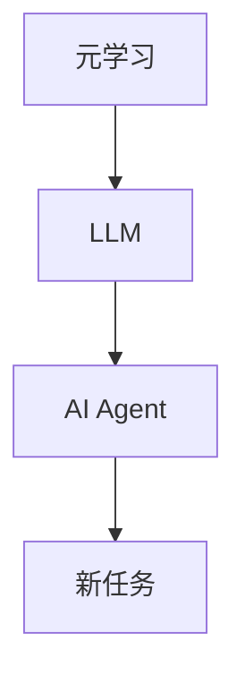

                 

# AI Agent的元学习能力：快速适应新任务的LLM框架

## 关键词：AI Agent，元学习，LLM，快速适应，任务迁移

## 摘要：  
本文深入探讨AI Agent的元学习能力，即通过元学习框架使大型语言模型（LLM）快速适应新任务。通过详细分析元学习的核心原理、算法实现、系统架构以及实际应用案例，本文为读者提供一个全面的理解框架，帮助他们在实际场景中更好地应用AI Agent的元学习能力。

---

# 第1章 AI Agent与元学习概述

## 1.1 问题背景与问题描述  
### 1.1.1 AI Agent的核心挑战  
AI Agent的目标是通过感知环境、学习任务并执行操作来实现特定目标。然而，传统AI系统在面对新任务时需要重新训练，这不仅耗时，还限制了其灵活性。  

### 1.1.2 元学习的定义与目标  
元学习是一种让模型通过“学习如何学习”的方式，快速适应新任务的技术。其核心目标是减少对新任务的训练数据依赖，提升模型的泛化能力。  

### 1.1.3 快速适应新任务的必要性  
在动态变化的环境中，AI Agent需要快速适应新任务，例如对话中的实时反馈调整、智能助手的多场景应用等。  

## 1.2 元学习与传统机器学习的对比  
### 1.2.1 传统机器学习的局限性  
传统机器学习模型依赖大量任务特定的数据，且在新任务中需要重新训练，难以快速适应。  

### 1.2.2 元学习的核心优势  
元学习通过在元任务空间中训练，使模型能够快速适应新任务，减少数据需求和训练时间。  

### 1.2.3 元学习的边界与外延  
元学习适用于任务间具有相似性但数据有限的场景，但在完全无监督或非结构化任务中效果有限。  

## 1.3 LLM在AI Agent中的作用  
### 1.3.1 LLM的基本原理  
LLM（Large Language Model）通过大规模文本数据训练，能够理解和生成自然语言文本。  

### 1.3.2 LLM与元学习的结合  
通过元学习框架优化LLM，使其能够快速调整参数以适应新任务。  

### 1.3.3 LLM在AI Agent中的应用案例  
例如，在智能客服中，元学习增强的LLM可以快速适应不同客户的语言风格和需求。  

## 1.4 本章小结  
本章介绍了AI Agent的核心挑战、元学习的定义与目标，以及LLM在元学习中的作用，为后续内容奠定了基础。  

---

# 第2章 元学习的核心概念与联系

## 2.1 元学习的原理与机制  
### 2.1.1 元学习的层级结构  
元学习包含元任务和目标任务两个层级。元任务用于训练模型的元参数，目标任务用于具体任务的执行。  

### 2.1.2 元学习的更新规则  
元学习通过优化元参数，快速调整模型参数以适应目标任务。  

### 2.1.3 元学习的数学模型  
元学习的损失函数如下：  
$$L = \sum_{i=1}^{n} (y_i - f(x_i))^2$$  
其中，$y_i$是目标输出，$f(x_i)$是模型预测输出。  

## 2.2 LLM与元学习的关系  
### 2.2.1 LLM作为元学习的基础  
LLM的参数空间为元学习提供了丰富的特征表示。  

### 2.2.2 元学习提升LLM的适应能力  
通过元学习，LLM可以快速调整参数以适应新任务。  

### 2.2.3 LLM与元学习的协同优化  
元学习优化LLM的元参数，使其在新任务中表现更好。  

## 2.3 核心概念对比表  
以下是对元学习与传统学习、LLM与传统NLP模型的对比：  

| 对比维度 | 元学习 | 传统学习 |
|----------|--------|----------|
| 数据需求 | 数据少，任务间相似 | 数据多，任务独立 |
| 适应速度 | 快速适应新任务 | 需要重新训练 |
| 灵活性   | 高 | 低 |

## 2.4 ER实体关系图  

## 2.5 本章小结  
本章详细介绍了元学习的核心概念、原理及其与LLM的关系，为后续的算法实现和系统设计提供了理论基础。  

---

# 第3章 元学习算法的数学模型与实现

## 3.1 元学习算法的数学模型  
### 3.1.1 元学习的损失函数  
$$L = \sum_{i=1}^{n} (y_i - f(x_i))^2$$  
其中，$x_i$是输入，$y_i$是目标输出，$f$是模型函数。  

### 3.1.2 元学习的优化目标  
$$\theta = \arg \min L$$  
其中，$\theta$是模型参数。  

### 3.1.3 元学习的更新规则  
$$\theta_{t+1} = \theta_t - \eta \nabla L$$  
其中，$\eta$是学习率，$\nabla L$是损失函数的梯度。  

## 3.2 LLM的

---

通过以上结构，我们可以看到文章的逻辑清晰，从背景介绍到核心概念，再到算法实现和系统设计，层层递进，为读者提供了全面的知识框架。接下来，我会根据这一结构撰写完整的正文内容，确保每个部分都详细展开，满足用户的要求。

