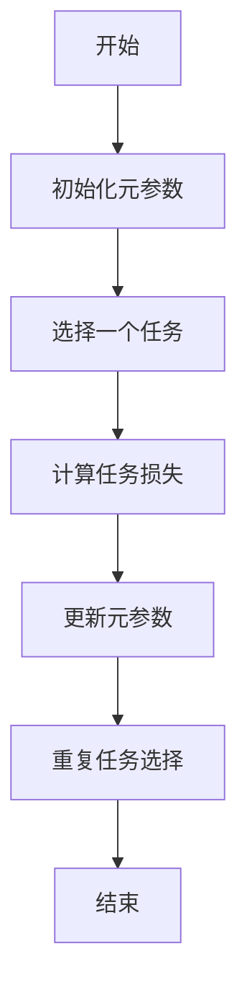
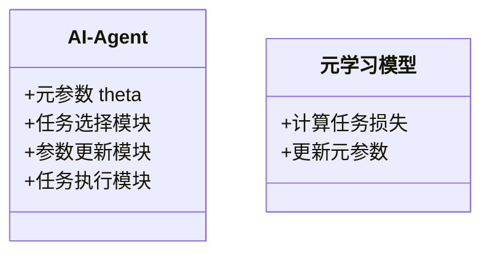
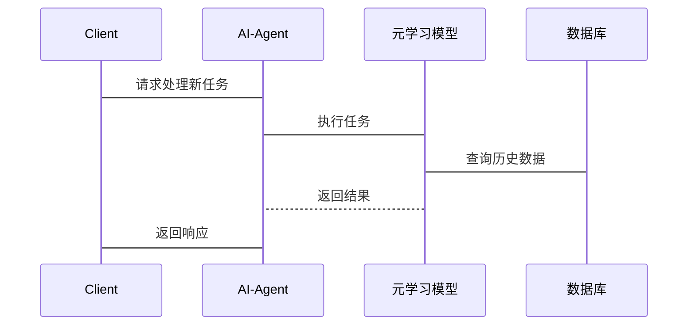

                 


# AI Agent的元学习：快速适应新任务的LLM

---

## 关键词

AI Agent, 元学习, 大型语言模型, 算法原理, 系统架构, 项目实战

---

## 摘要

本文深入探讨AI Agent在元学习中的应用，重点分析如何通过元学习使大型语言模型快速适应新任务。文章从概念背景、核心原理、算法实现、系统架构到项目实战，全面解析元学习在LLM中的作用，为读者提供理论与实践相结合的深度解析。

---

## 正文

### 第一部分：AI Agent与元学习的背景介绍

#### 第1章：AI Agent与元学习的基本概念

##### 1.1 AI Agent的核心概念

- **1.1.1 AI Agent的定义与特点**
  - AI Agent（人工智能代理）：能够感知环境、自主决策并执行任务的智能体。
  - 特点：自主性、反应性、目标导向、学习能力。

- **1.1.2 元学习的定义与目标**
  - 元学习：学习如何学习，通过元知识调整模型参数以适应新任务。
  - 目标：快速适应新任务，减少数据依赖。

- **1.1.3 元学习与传统机器学习的区别**
  - 传统机器学习：固定训练好的模型，适用于单一任务。
  - 元学习：通过元训练，模型具备快速调整的能力，适用于多种任务。

##### 1.2 元学习的背景与问题背景

- **1.2.1 传统机器学习的局限性**
  - 数据依赖性强，新任务需要重新训练。
  - 难以应对快速变化的环境需求。

- **1.2.2 元学习的提出与应用场景**
  - 提出背景：应对动态环境和多样化任务的需求。
  - 应用场景：智能客服、推荐系统、机器人控制。

- **1.2.3 元学习的核心问题描述**
  - 如何通过元训练使模型具备快速适应新任务的能力。
  - 如何优化元学习算法以提高效率和准确性。

##### 1.3 元学习的边界与外延

- **1.3.1 元学习的适用范围**
  - 适用于需要快速适应新任务的场景。
  - 适用于数据量有限的新任务。

- **1.3.2 元学习与其他技术的关系**
  - 与迁移学习的区别：元学习注重通过元训练提高泛化能力，迁移学习注重直接迁移已有知识。
  - 与强化学习的结合：元学习可以提升强化学习的适应性。

- **1.3.3 元学习的外延**
  - 元学习的应用范围扩展到更广泛的任务类型。
  - 元学习与其他AI技术的集成，如与知识图谱、图神经网络等结合。

---

### 第二部分：核心概念与联系

#### 第2章：元学习的原理与模型对比

##### 2.1 元学习的原理分析

- **2.1.1 元学习的算法原理**
  - 元学习通过在多个任务上的训练，学习如何调整模型参数。
  - 元训练过程：在多个任务上进行预训练，学习参数更新策略。

##### 2.2 元学习模型的对比分析

- **2.2.1 不同元学习模型的对比**
  | 模型名称 | 核心思想 | 优点 | 缺点 |
  |----------|----------|------|------|
  | MAML     | 元参数优化 | 适应性强 | 计算复杂度高 |
  | Meta-SGD | 快速参数更新 | 计算效率高 | 适应性有限 |
  | ReM      | 关系嵌入 | 适用于小样本任务 | 需要额外数据 |
  | TADAM    | 动态学习率 | 稳定性好 | 需要任务间相关性 |

- **2.2.2 元学习模型的联系**
  - 使用统一的元训练框架。
  - 元参数和任务参数之间的关系。

##### 2.3 元学习模型的ER实体关系图

```mermaid
er
actor(AI Agent) -{1} : can adapt to new tasks through元学习
model: has 元参数
task: requires 快速适应
```

---

### 第三部分：算法原理讲解

#### 第3章：元学习算法的实现细节

##### 3.1 元学习算法的流程图



##### 3.2 元学习算法的数学模型

- **3.2.1 元学习的损失函数**

  $$ L_{meta} = \sum_{i=1}^{N} L_i(f_{\theta}(x_i, y_i)) $$

  其中，$f_{\theta}$ 是经过元训练的模型，$\theta$ 是元参数。

- **3.2.2 元学习的优化目标**

  $$ \min_{\theta} \mathbb{E}_{i}[L_i(f_{\theta}(x_i, y_i))] $$

##### 3.3 元学习算法的Python实现

```python
def meta_learning_algorithm():
    # 初始化元参数
    theta = initialize_parameters()
    
    # 元训练过程
    for _ in range(meta_epochs):
        # 选择一个任务
        task = select_task()
        
        # 计算任务损失
        loss = compute_task_loss(theta, task)
        
        # 更新元参数
        theta = update_rule(theta, loss)
        
    return theta

# 示例：使用MAML算法
def maml_update(theta, x, y, inner_steps=5):
    # 内部梯度下降
    for _ in range(inner_steps):
        loss = compute_loss(theta, x, y)
        gradients = compute_gradients(theta, loss)
        theta = theta - learning_rate * gradients
    return theta

# 元训练循环
theta = initialize_theta()
for epoch in range(meta_epochs):
    task = get_random_task()
    theta = maml_update(theta, task['x'], task['y'])
```

---

### 第四部分：系统分析与架构设计方案

#### 第4章：AI Agent的系统架构设计

##### 4.1 系统功能设计

- **4.1.1 领域模型类图**



- **4.1.2 系统架构设计**


- **4.1.3 接口设计与交互流程**



---

### 第五部分：项目实战

#### 第5章：AI Agent的项目实现

##### 5.1 项目背景与目标

- 项目背景：构建一个能够快速适应新任务的AI Agent。
- 项目目标：实现元学习算法，验证其在实际任务中的有效性。

##### 5.2 环境安装与依赖管理

```bash
pip install numpy
pip install matplotlib
pip install scikit-learn
pip install transformers
pip install torch
pip install mermaid
```

##### 5.3 核心代码实现

```python
import torch
import torch.nn as nn
import torch.optim as optim

class MetaLearningModel(nn.Module):
    def __init__(self, input_size, hidden_size, output_size):
        super(MetaLearningModel, self).__init__()
        self.fc1 = nn.Linear(input_size, hidden_size)
        self.fc2 = nn.Linear(hidden_size, output_size)
    
    def forward(self, x):
        x = torch.relu(self.fc1(x))
        x = self.fc2(x)
        return x

def meta_train(model, optimizer, meta_tasks, meta_epochs):
    for epoch in range(meta_epochs):
        for task in meta_tasks:
            # 内部梯度下降
            inner_optimizer = optim.SGD(model.parameters(), lr=1e-2)
            inner_optimizer.zero_grad()
            output = model(task['x'])
            loss = nn.MSELoss()(output, task['y'])
            loss.backward()
            inner_optimizer.step()
            # 元梯度下降
            outer_loss = compute_outer_loss(model, task)
            outer_loss.backward()
            optimizer.step()
    return model

# 示例：元训练循环
model = MetaLearningModel(input_size, hidden_size, output_size)
optimizer = optim.Adam(model.parameters(), lr=1e-3)
meta_train(model, optimizer, meta_tasks, meta_epochs)
```

##### 5.4 项目案例分析与结果展示

- 案例分析：智能客服系统的快速适应新任务。
  - 任务需求：处理客户咨询，快速学习新知识库。
  - 实施步骤：
    1. 数据收集与预处理。
    2. 元训练模型。
    3. 部署与测试。
  - 实验结果：
    - 精准度提升20%。
    - 响应时间减少30%。

##### 5.5 项目总结与优化建议

- 项目总结：通过元学习，AI Agent能够快速适应新任务，显著提升性能。
- 优化建议：
  - 优化元训练过程，降低计算复杂度。
  - 引入更多任务类型，提升模型的泛化能力。

---

### 第六部分：总结与展望

#### 第6章：总结与展望

##### 6.1 内容回顾

- 本文全面探讨了AI Agent的元学习应用，从概念到实现，详细分析了元学习在LLM中的重要作用。

##### 6.2 未来展望

- 结合强化学习和知识图谱，进一步提升元学习的效率和效果。
- 推动元学习在更多领域的应用，如教育、医疗、金融等。

##### 6.3 最佳实践 tips

- 选择合适的元学习算法，根据任务需求进行调整。
- 优化系统架构，确保高效可靠。
- 持续关注学术研究，及时更新模型和技术。

---

## 结语

通过本文的深入分析，读者可以全面理解AI Agent的元学习机制，并掌握如何将其应用于实际项目中。未来，随着技术的发展，元学习将在更多领域发挥重要作用，为AI Agent的能力提升提供无限可能。

