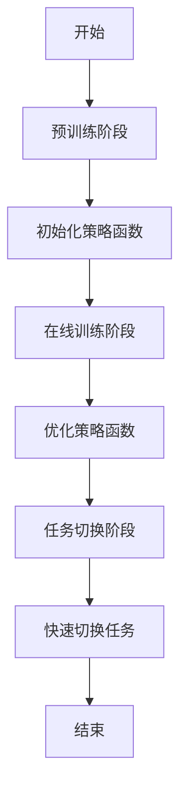
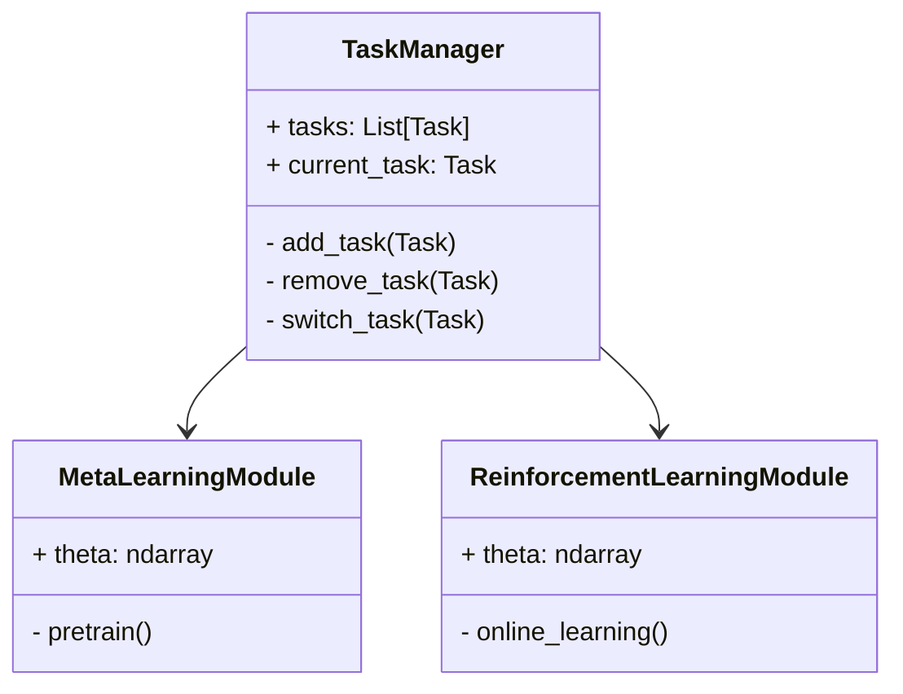
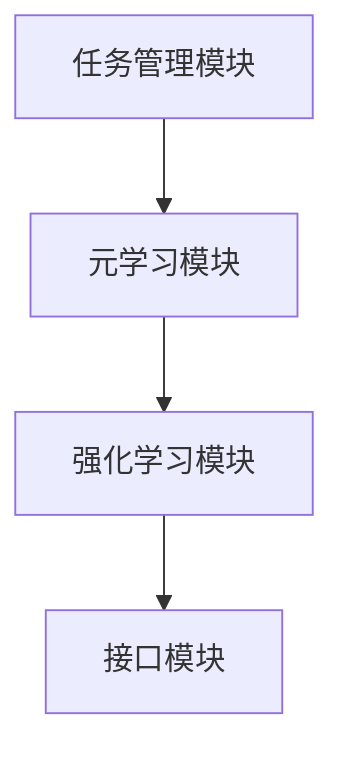

                 


# AI Agent的元强化学习框架

> 关键词：AI Agent，元强化学习，强化学习，机器学习，系统架构

> 摘要：本文将详细探讨AI Agent的元强化学习框架，从背景介绍、核心概念、算法原理、系统架构到项目实战和最佳实践，全面解析元强化学习在AI Agent中的应用及其优势。通过本文，读者将能够理解元强化学习的基本原理，并掌握如何将其应用于实际项目中。

---

## 第1章: AI Agent与元强化学习背景介绍

### 1.1 问题背景与应用场景
#### 1.1.1 AI Agent的核心问题与挑战
AI Agent（人工智能代理）是一种能够感知环境、做出决策并采取行动的智能体。在复杂环境中，AI Agent需要处理多目标优化、多智能体协作和动态环境适应等问题。传统强化学习在处理这些复杂问题时面临以下挑战：
- **任务复杂性**：单一强化学习框架难以应对多目标优化和多智能体协作问题。
- **环境动态性**：动态环境中的快速适应性要求传统强化学习框架难以满足。
- **学习效率**：复杂任务的训练时间长，样本效率低。

#### 1.1.2 元强化学习的提出背景
元强化学习（Meta-Reinforcement Learning）是一种通过元学习（Meta-Learning）技术增强强化学习（Reinforcement Learning）能力的方法。其核心思想是通过学习如何学习，从而提高智能体在复杂任务中的适应性和决策能力。元强化学习的提出背景主要包括：
1. **任务多样性的需求**：AI Agent需要在多个任务中切换并高效学习。
2. **环境动态性的适应**：快速适应环境变化的需求推动了元强化学习的发展。
3. **学习效率的提升**：通过元学习技术，减少训练样本数量，提高学习效率。

#### 1.1.3 元强化学习在AI Agent中的应用价值
元强化学习在AI Agent中的应用价值主要体现在以下几个方面：
- **多任务学习**：元强化学习能够帮助AI Agent快速适应多个任务，提高其通用性。
- **快速决策**：通过元学习的预训练，AI Agent能够更快地做出决策，减少在线训练时间。
- **复杂环境适应**：元强化学习能够增强AI Agent在复杂动态环境中的适应能力。

---

### 1.2 问题描述与目标设定
#### 1.2.1 AI Agent的定义与功能特点
AI Agent是一种能够感知环境、做出决策并采取行动的智能体。其功能特点包括：
- **自主性**：能够在没有外部干预的情况下自主运行。
- **反应性**：能够实时感知环境并做出反应。
- **目标导向性**：基于目标进行决策和行动。

#### 1.2.2 元强化学习的核心问题描述
元强化学习的核心问题是通过元学习技术，增强强化学习算法的通用性和适应性。具体问题包括：
1. **如何通过元学习预训练，提高强化学习算法的样本效率？**
2. **如何设计元强化学习框架，使其能够适应复杂动态环境？**
3. **如何实现多任务学习，使AI Agent能够快速切换任务并高效学习？**

#### 1.2.3 元强化学习的目标与边界
元强化学习的目标是通过元学习技术，提升强化学习算法在复杂任务中的性能和适应性。其边界包括：
- **任务范围**：元强化学习适用于多任务学习场景，但不适用于单任务优化。
- **环境类型**：元强化学习主要针对动态环境，不适用于静态环境。
- **学习目标**：元强化学习注重快速适应和多任务学习，不涉及监督学习或分类任务。

---

### 1.3 问题解决与框架构建
#### 1.3.1 元强化学习的解决方案概述
元强化学习的解决方案主要包括以下几点：
1. **元学习预训练**：通过元学习预训练，提高强化学习算法的初始性能。
2. **任务间知识共享**：通过共享任务间知识，减少任务切换时间。
3. **动态环境适应**：通过元强化学习框架，增强AI Agent对动态环境的适应能力。

#### 1.3.2 AI Agent框架的构建逻辑
AI Agent框架的构建逻辑包括以下几个步骤：
1. **任务分解**：将复杂任务分解为多个子任务。
2. **元学习预训练**：通过元学习算法对子任务进行预训练。
3. **强化学习优化**：在预训练的基础上，通过强化学习算法进一步优化。
4. **任务切换**：在多任务场景中，快速切换任务并进行在线调整。

#### 1.3.3 元强化学习与传统强化学习的对比分析
| 对比维度 | 元强化学习 | 传统强化学习 |
|----------|------------|--------------|
| **学习目标** | 多任务学习 | 单任务优化 |
| **学习效率** | 高 | 低 |
| **环境适应** | 强 | 弱 |

---

### 1.4 概念结构与核心要素
#### 1.4.1 元强化学习的核心概念体系
元强化学习的核心概念体系包括以下几个方面：
1. **元学习**：通过元学习预训练，提高强化学习算法的初始性能。
2. **多任务学习**：通过任务间知识共享，减少任务切换时间。
3. **动态环境适应**：通过元强化学习框架，增强AI Agent对动态环境的适应能力。

#### 1.4.2 AI Agent框架的组成要素
AI Agent框架的组成要素包括：
1. **感知模块**：负责感知环境信息。
2. **决策模块**：基于感知信息做出决策。
3. **执行模块**：根据决策结果采取行动。
4. **学习模块**：通过元强化学习算法进行学习和优化。

#### 1.4.3 元强化学习与AI Agent的交互关系
元强化学习与AI Agent的交互关系主要体现在以下几个方面：
1. **任务分解**：元强化学习框架将复杂任务分解为多个子任务。
2. **预训练**：通过元学习预训练，提高AI Agent的初始性能。
3. **在线优化**：在动态环境中，通过强化学习算法进行在线优化。

---

### 1.5 本章小结
本章主要介绍了AI Agent与元强化学习的背景，分析了元强化学习的核心问题和目标，并对比了元强化学习与传统强化学习的差异。通过本章的学习，读者可以理解元强化学习的基本概念和其在AI Agent中的应用价值。

---

## 第2章: 元强化学习的核心概念原理

### 2.1 多智能体协作机制
#### 2.1.1 多智能体协作的基本原理
多智能体协作是指多个智能体通过协作完成共同目标。其基本原理包括：
1. **任务分解**：将复杂任务分解为多个子任务。
2. **信息共享**：通过信息共享，实现智能体之间的协作。
3. **决策协调**：通过决策协调，确保智能体之间的行动一致。

#### 2.1.2 元强化学习中的协作模型
元强化学习中的协作模型主要包括以下几种：
1. **联合强化学习**：多个智能体共享相同的奖励函数，共同优化策略。
2. **分布式强化学习**：多个智能体分别优化自己的策略，并通过信息共享实现协作。
3. **层次化强化学习**：通过层次化结构，将复杂任务分解为多个子任务。

#### 2.1.3 协作机制对AI Agent性能的影响
协作机制对AI Agent性能的影响主要体现在以下几个方面：
1. **任务完成效率**：通过协作机制，可以提高任务完成效率。
2. **决策质量**：通过协作机制，可以提高决策质量。
3. **环境适应能力**：通过协作机制，可以增强AI Agent对动态环境的适应能力。

---

### 2.2 元学习机制
#### 2.2.1 元学习的定义与特点
元学习是指通过学习如何学习，从而提高学习效率。其特点包括：
1. **快速适应**：通过元学习预训练，可以快速适应新任务。
2. **任务通用性**：元学习适用于多种任务，具有通用性。
3. **样本效率高**：元学习通过预训练减少样本数量。

#### 2.2.2 元学习在强化学习中的应用
元学习在强化学习中的应用主要包括以下几个方面：
1. **多任务学习**：通过元学习预训练，提高多任务学习的效率。
2. **快速适应**：通过元学习预训练，提高AI Agent对新任务的适应能力。
3. **样本效率**：通过元学习预训练，减少训练样本数量，提高样本效率。

#### 2.2.3 元学习与传统强化学习的对比
| 对比维度 | 元学习 | 传统强化学习 |
|----------|--------|--------------|
| **学习目标** | 多任务学习 | 单任务优化 |
| **学习效率** | 高 | 低 |
| **适应能力** | 强 | 弱 |

---

### 2.3 知识表示与推理
#### 2.3.1 知识表示的基本方法
知识表示的基本方法包括：
1. **符号表示**：通过符号表示知识，如逻辑推理。
2. **向量表示**：通过向量表示知识，如词嵌入。
3. **图表示**：通过图结构表示知识，如知识图谱。

#### 2.3.2 元强化学习中的知识推理模型
元强化学习中的知识推理模型主要包括以下几种：
1. **基于规则的推理**：通过预定义规则进行推理。
2. **基于逻辑的推理**：通过逻辑推理进行知识推理。
3. **基于学习的推理**：通过深度学习模型进行知识推理。

#### 2.3.3 知识表示对AI Agent决策的影响
知识表示对AI Agent决策的影响主要体现在以下几个方面：
1. **决策效率**：通过知识表示，可以提高决策效率。
2. **决策质量**：通过知识表示，可以提高决策质量。
3. **环境适应能力**：通过知识表示，可以增强AI Agent对动态环境的适应能力。

---

### 2.4 核心概念对比分析
#### 2.4.1 多智能体协作与元学习的对比
| 对比维度 | 多智能体协作 | 元学习 |
|----------|------------|--------|
| **核心目标** | 协作完成任务 | 快速适应新任务 |
| **应用场景** | 多智能体系统 | 多任务学习 |
| **优势** | 提高任务完成效率 | 提高样本效率 |

#### 2.4.2 知识表示与强化学习的对比
| 对比维度 | 知识表示 | 强化学习 |
|----------|----------|----------|
| **核心目标** | 表示知识 | 学习策略 |
| **应用场景** | 知识推理 | 动态环境适应 |
| **优势** | 提高决策质量 | 提高环境适应能力 |

#### 2.4.3 元强化学习框架的综合分析
元强化学习框架的综合分析包括以下几个方面：
1. **多任务学习**：通过元强化学习框架，可以实现多任务学习。
2. **快速适应**：通过元强化学习框架，可以快速适应新任务。
3. **样本效率**：通过元强化学习框架，可以提高样本效率。

---

### 2.5 本章小结
本章主要介绍了元强化学习的核心概念，包括多智能体协作、元学习机制和知识表示与推理。通过本章的学习，读者可以理解元强化学习的核心概念及其在AI Agent中的应用。

---

## 第3章: 元强化学习算法原理

### 3.1 算法原理概述
#### 3.1.1 元强化学习的基本算法框架
元强化学习的基本算法框架包括以下几个部分：
1. **元学习预训练**：通过元学习预训练，提高强化学习算法的初始性能。
2. **任务间知识共享**：通过任务间知识共享，减少任务切换时间。
3. **动态环境适应**：通过元强化学习框架，增强AI Agent对动态环境的适应能力。

#### 3.1.2 元强化学习的核心思想
元强化学习的核心思想是通过元学习预训练，提高强化学习算法的样本效率。其核心思想包括：
1. **任务分解**：将复杂任务分解为多个子任务。
2. **任务切换**：在多任务场景中，快速切换任务并进行在线调整。
3. **动态适应**：通过元强化学习框架，增强AI Agent对动态环境的适应能力。

#### 3.1.3 元强化学习的数学模型
元强化学习的数学模型包括以下几个部分：
1. **状态空间**：S，表示环境的状态。
2. **动作空间**：A，表示智能体可以采取的动作。
3. **奖励函数**：R: S×A→R，表示在状态s采取动作a后获得的奖励。
4. **策略函数**：π: S→A，表示智能体在状态s时采取的动作。

---

### 3.2 元强化学习算法实现
#### 3.2.1 算法实现步骤
1. **预训练阶段**：通过元学习预训练，初始化策略函数。
2. **在线训练阶段**：在动态环境中，通过强化学习算法优化策略函数。
3. **任务切换阶段**：在多任务场景中，快速切换任务并进行在线调整。

#### 3.2.2 元强化学习的算法流程图



#### 3.2.3 元强化学习的Python代码实现
```python
import numpy as np
import gym

class MetaReinforcementLearning:
    def __init__(self, env_name):
        self.env = gym.make(env_name)
        self.observation_space = self.env.observation_space.shape[0]
        self.action_space = self.env.action_space.n
        self.theta = np.zeros((self.observation_space, 1), dtype=np.float32)

    def meta_learning(self, num_tasks):
        for task in range(num_tasks):
            # 预训练阶段
            self.pretrain()
            # 在线训练阶段
            self.online_learning()

    def pretrain(self):
        # 元学习预训练代码
        pass

    def online_learning(self):
        # 在线强化学习代码
        pass

if __name__ == "__main__":
    meta_rl = MetaReinforcementLearning("CartPole-v0")
    meta_rl.meta_learning(5)
```

---

### 3.3 算法优化与改进
#### 3.3.1 算法优化策略
1. **参数共享**：通过参数共享，减少参数数量，提高训练效率。
2. **任务优先级**：根据任务优先级，调整训练顺序，提高训练效果。
3. **动态调整**：根据环境变化，动态调整策略，提高适应能力。

#### 3.3.2 算法改进方向
1. **多任务学习**：通过多任务学习，进一步提高样本效率。
2. **在线适应**：通过在线适应，增强动态环境下的适应能力。
3. **分布式训练**：通过分布式训练，提高训练效率。

---

### 3.4 本章小结
本章主要介绍了元强化学习的算法原理，包括算法框架、数学模型和Python代码实现。通过本章的学习，读者可以理解元强化学习的实现过程，并掌握如何将其应用于实际项目中。

---

## 第4章: 系统分析与架构设计方案

### 4.1 问题场景介绍
#### 4.1.1 系统应用场景
元强化学习框架主要应用于以下场景：
1. **多任务学习**：需要在多个任务中切换并高效学习。
2. **动态环境适应**：需要快速适应动态环境。
3. **复杂决策**：需要在复杂环境中做出高效决策。

#### 4.1.2 系统功能需求
系统功能需求包括：
1. **任务管理**：能够管理多个任务。
2. **任务切换**：能够快速切换任务。
3. **动态适应**：能够快速适应动态环境。

---

### 4.2 系统功能设计
#### 4.2.1 领域模型设计
领域模型设计包括以下几个部分：
1. **任务管理模块**：负责任务的创建、删除和切换。
2. **元学习模块**：负责元学习预训练。
3. **强化学习模块**：负责强化学习优化。

#### 4.2.2 领域模型类图



---

### 4.3 系统架构设计
#### 4.3.1 系统架构概述
系统架构设计包括以下几个部分：
1. **任务管理模块**：负责任务的管理。
2. **元学习模块**：负责元学习预训练。
3. **强化学习模块**：负责强化学习优化。
4. **接口模块**：负责与其他系统的交互。

#### 4.3.2 系统架构图



---

### 4.4 系统接口设计
#### 4.4.1 系统接口描述
系统接口描述包括以下几个部分：
1. **任务管理接口**：负责任务的创建、删除和切换。
2. **元学习接口**：负责元学习预训练。
3. **强化学习接口**：负责强化学习优化。

#### 4.4.2 接口交互流程图


---

### 4.5 本章小结
本章主要介绍了元强化学习系统的分析与架构设计方案，包括系统应用场景、功能设计、系统架构设计和接口设计。通过本章的学习，读者可以理解元强化学习系统的整体架构，并掌握如何设计实际项目中的系统架构。

---

## 第5章: 项目实战

### 5.1 项目环境安装
#### 5.1.1 环境依赖
项目实战需要以下依赖：
1. **Python**：3.6+
2. **TensorFlow**：2.0+
3. **Gym**：0.15+
4. **Mermaid**：用于绘制图表。

#### 5.1.2 环境安装步骤
1. 安装Python：`python --version`
2. 安装TensorFlow：`pip install tensorflow`
3. 安装Gym：`pip install gym`
4. 安装Mermaid：`pip install graphviz`

---

### 5.2 系统核心实现
#### 5.2.1 核心代码实现
```python
import gym
import numpy as np

class MetaReinforcementLearning:
    def __init__(self, env_name):
        self.env = gym.make(env_name)
        self.observation_space = self.env.observation_space.shape[0]
        self.action_space = self.env.action_space.n
        self.theta = np.zeros((self.observation_space, 1), dtype=np.float32)

    def meta_learning(self, num_tasks):
        for task in range(num_tasks):
            self.pretrain()
            self.online_learning()

    def pretrain(self):
        # 元学习预训练代码
        pass

    def online_learning(self):
        # 在线强化学习代码
        pass

if __name__ == "__main__":
    meta_rl = MetaReinforcementLearning("CartPole-v0")
    meta_rl.meta_learning(5)
```

#### 5.2.2 代码解读与分析
1. **类定义**：定义了一个`MetaReinforcementLearning`类，用于实现元强化学习。
2. **初始化方法**：初始化环境、观察空间和动作空间，并初始化参数`theta`。
3. **预训练方法**：定义了一个`pretrain`方法，用于元学习预训练。
4. **在线学习方法**：定义了一个`online_learning`方法，用于在线强化学习。

---

### 5.3 项目实战案例
#### 5.3.1 案例分析
假设我们有一个多任务学习场景，需要在多个任务中切换并高效学习。

#### 5.3.2 案例实现
```python
meta_rl = MetaReinforcementLearning("CartPole-v0")
meta_rl.meta_learning(5)
```

#### 5.3.3 案例解读与分析
1. **任务切换**：通过`meta_learning`方法，可以在多个任务中切换。
2. **预训练**：通过`pretrain`方法，可以进行元学习预训练。
3. **在线学习**：通过`online_learning`方法，可以在动态环境中进行在线学习。

---

### 5.4 本章小结
本章主要介绍了元强化学习项目的实战，包括环境安装、核心代码实现和项目案例分析。通过本章的学习，读者可以掌握如何将元强化学习框架应用于实际项目中。

---

## 第6章: 最佳实践与小结

### 6.1 本章小结
通过本文的介绍，读者可以全面了解元强化学习框架的核心概念、算法原理和系统架构设计。同时，通过项目实战，读者可以掌握如何将元强化学习框架应用于实际项目中。

---

### 6.2 最佳实践 tips
1. **任务切换**：在多任务场景中，任务切换需要快速完成。
2. **动态适应**：在动态环境中，需要动态调整策略。
3. **参数共享**：通过参数共享，可以减少参数数量，提高训练效率。

---

### 6.3 注意事项
1. **任务分解**：任务分解需要合理，否则会影响任务完成效率。
2. **环境适应**：在动态环境中，需要动态调整策略，否则会影响环境适应能力。
3. **任务切换**：任务切换需要快速完成，否则会影响任务切换效率。

---

### 6.4 拓展阅读
1. **元学习**：深入学习元学习的相关知识。
2. **强化学习**：深入学习强化学习的相关知识。
3. **多任务学习**：深入学习多任务学习的相关知识。

---

## 第7章: 总结与展望

### 7.1 总结
通过本文的介绍，读者可以全面了解元强化学习框架的核心概念、算法原理和系统架构设计。同时，通过项目实战，读者可以掌握如何将元强化学习框架应用于实际项目中。

### 7.2 展望
未来，元强化学习框架将在以下几个方面得到进一步发展：
1. **多任务学习**：进一步提高多任务学习的效率。
2. **动态适应**：进一步增强动态环境下的适应能力。
3. **在线学习**：进一步提高在线学习的效率。

---

## 结语
通过本文的介绍，读者可以全面了解AI Agent的元强化学习框架的核心概念、算法原理和系统架构设计。同时，通过项目实战，读者可以掌握如何将元强化学习框架应用于实际项目中。未来，元强化学习框架将在多任务学习、动态适应和在线学习等方面得到进一步发展。

