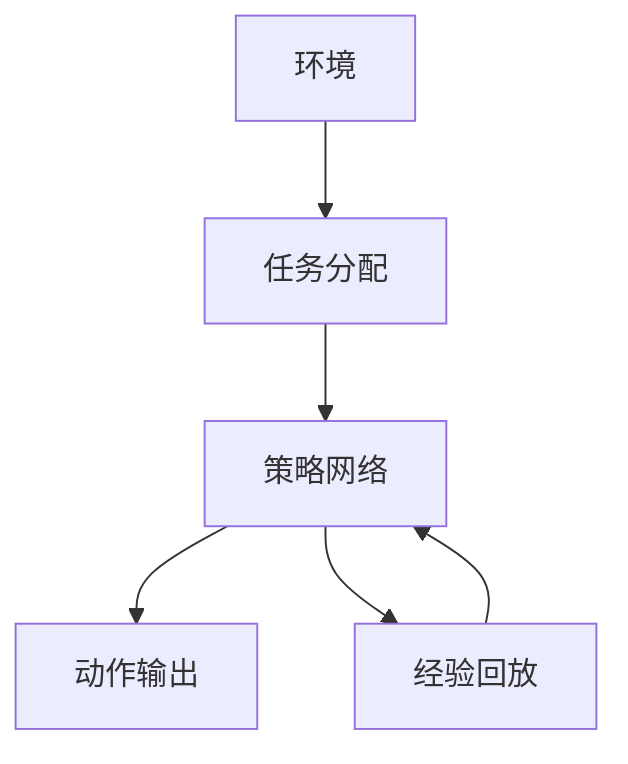

                 


# AI Agent的元强化学习策略开发

> 关键词：AI Agent、元强化学习、策略开发、强化学习、机器学习、人工智能

> 摘要：本文深入探讨AI Agent的元强化学习策略开发，涵盖核心概念、算法原理、数学模型、系统架构、项目实战等内容，为读者提供全面的技术指导。

---

## 第一章：引言

### 1.1 AI Agent与元强化学习概述

#### 1.1.1 AI Agent的基本概念
AI Agent（人工智能代理）是指能够感知环境并采取行动以实现目标的智能实体。它可以分为两类：基于规则的代理和基于学习的代理。基于规则的代理依赖预定义的规则，而基于学习的代理通过与环境的交互来改进其策略。

#### 1.1.2 元强化学习的背景与意义
元强化学习（Meta Reinforcement Learning）是一种新兴的强化学习范式，旨在通过元学习（Meta-Learning）提升AI Agent的适应性和通用性。与传统强化学习不同，元强化学习允许AI Agent在新任务中快速学习，减少对大量数据的依赖。

#### 1.1.3 元强化学习的应用场景
元强化学习在多个领域展现出巨大潜力，如机器人控制、游戏AI、自动驾驶等。它能够帮助AI Agent在动态变化的环境中快速适应新任务，提升实时决策能力。

---

### 1.2 元强化学习的核心概念
元强化学习通过元学习框架，将强化学习过程分解为多个子任务，使AI Agent能够快速迁移和适应新任务。其核心在于优化策略的初始化和更新机制，以提高学习效率和通用性。

---

## 第二章：元强化学习的核心概念与联系

### 2.1 元强化学习的核心原理

#### 2.1.1 元强化学习的定义
元强化学习是一种结合元学习和强化学习的框架，旨在通过元学习优化强化学习过程。它允许AI Agent在多个任务中共享经验，从而加快新任务的学习速度。

#### 2.1.2 元强化学习与传统强化学习的区别
- **传统强化学习**：针对单一任务进行优化，需要大量样本和时间。
- **元强化学习**：针对多个任务进行优化，通过元学习快速适应新任务。

#### 2.1.3 元强化学习的数学基础
元强化学习的优化目标是通过元学习更新策略参数，以最小化多个任务的损失函数。

$$ \min_{\theta} \sum_{i=1}^{N} \mathcal{L}_i(\theta) $$

其中，$\mathcal{L}_i$ 表示第i个任务的损失函数。

---

### 2.2 元强化学习的核心算法

#### 2.2.1 Model-Agnostic Meta-Learning (MAML)
MAML是一种基于梯度的元学习算法，适用于各种模型结构。其核心思想是通过在多个任务上优化参数，使模型在新任务上快速收敛。

#### 2.2.2 Gradient-Based Meta-Learning
基于梯度的元学习通过计算任务梯度的线性组合，优化参数以适应多个任务。

---

## 第三章：元强化学习的算法原理

### 3.1 算法流程

#### 3.1.1 初始化
初始化参数 $\theta_0$。

#### 3.1.2 任务采样
从任务分布中采样多个任务 $t \sim P(t)$。

#### 3.1.3 策略更新
针对每个任务，计算梯度并更新参数：

$$ \theta_{t+1} = \theta_t - \eta \nabla_{\theta} \mathcal{L}_t(\theta_t) $$

#### 3.1.4 元更新
将多个任务的梯度进行线性组合，得到最终的参数更新：

$$ \theta_{final} = \theta_0 - \alpha \sum_{t=1}^{N} \nabla_{\theta} \mathcal{L}_t(\theta_0) $$

---

### 3.2 算法实现

#### 3.2.1 环境配置
使用OpenAI Gym或其他框架定义环境和任务。

#### 3.2.2 网络结构
设计参数化策略网络，如多层感知机（MLP）。

#### 3.2.3 梯度计算
使用自动求导库（如PyTorch）计算任务梯度。

#### 3.2.4 参数更新
根据梯度更新规则，优化参数。

---

## 第四章：数学模型与公式推导

### 4.1 优化目标
元强化学习的目标是最小化多个任务的损失函数：

$$ \min_{\theta} \sum_{t=1}^{N} \mathcal{L}_t(\theta) $$

其中，$\mathcal{L}_t(\theta)$ 是第t个任务的损失函数。

### 4.2 梯度计算
计算每个任务的梯度，并对梯度进行线性组合：

$$ \nabla_{\theta} \sum_{t=1}^{N} \mathcal{L}_t(\theta) = \sum_{t=1}^{N} \nabla_{\theta} \mathcal{L}_t(\theta) $$

---

## 第五章：系统分析与架构设计

### 5.1 系统架构设计
使用Mermaid绘制系统架构图，展示各模块之间的关系。



---

## 第六章：项目实战

### 6.1 环境安装
安装必要的库：

```bash
pip install gym torch matplotlib
```

### 6.2 核心代码实现

#### 6.2.1 策略网络定义
```python
import torch
import torch.nn as nn

class PolicyNetwork(nn.Module):
    def __init__(self, input_dim, output_dim):
        super(PolicyNetwork, self).__init__()
        self.fc1 = nn.Linear(input_dim, 64)
        self.fc2 = nn.Linear(64, output_dim)
    def forward(self, x):
        x = torch.relu(self.fc1(x))
        x = torch.sigmoid(self.fc2(x))
        return x
```

#### 6.2.2 元强化学习算法实现
```python
import torch.optim as optim

def meta_reinforcement_learning():
    model = PolicyNetwork(input_dim, output_dim)
    optimizer = optim.Adam(model.parameters(), lr=0.001)
    for task in tasks:
        optimizer.zero_grad()
        loss = compute_loss(model, task)
        loss.backward()
        optimizer.step()
    return model
```

---

## 第七章：总结与展望

### 7.1 总结
本文详细探讨了AI Agent的元强化学习策略开发，从核心概念到算法实现，再到项目实战，为读者提供了全面的技术指导。

### 7.2 未来展望
未来的研究方向包括更高效的元学习算法、多任务学习的优化以及在复杂场景中的应用。

---

通过以上内容，读者可以系统地了解AI Agent的元强化学习策略开发，掌握核心概念、算法原理和实际应用方法。

