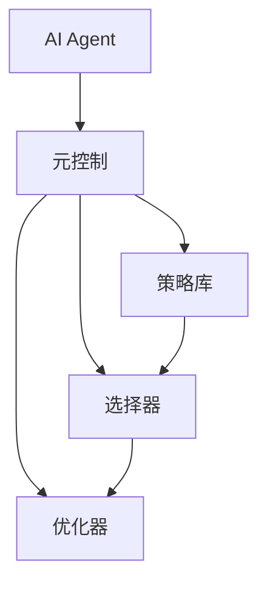
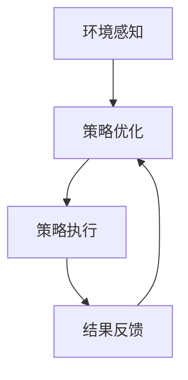
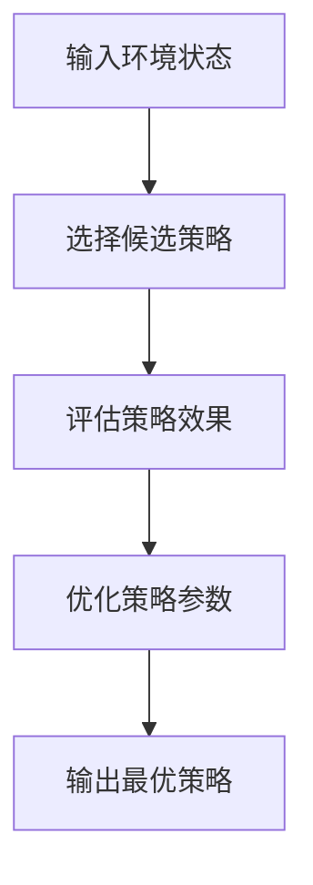
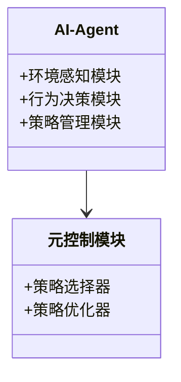
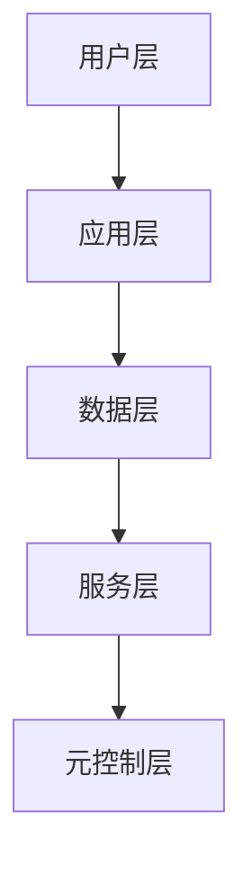
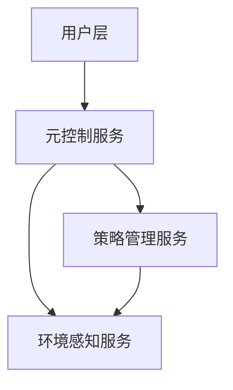
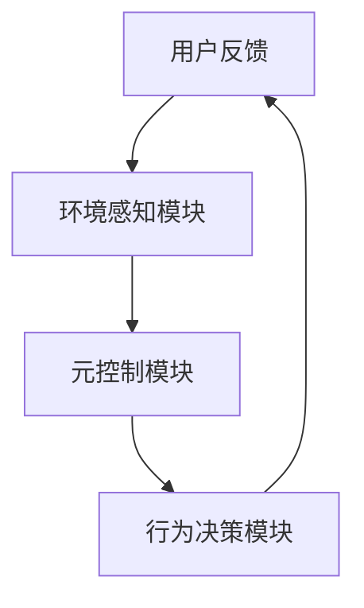
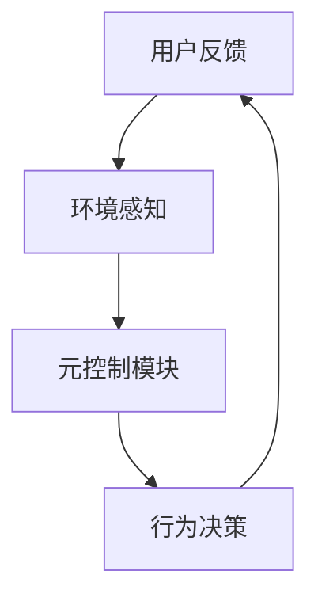

                 


# AI Agent的元控制：自适应行为策略

> 关键词：AI Agent、元控制、自适应行为、策略优化、系统架构

> 摘要：本文深入探讨了AI Agent的元控制机制，重点分析了其自适应行为策略的核心原理、算法实现及系统架构设计。通过理论分析与实际案例相结合的方式，详细阐述了元控制在AI Agent中的重要作用，以及如何通过元控制实现行为策略的动态优化。文章内容涵盖背景介绍、核心概念、算法原理、系统设计与项目实战等多方面内容，为读者提供了一个全面而深入的技术视角。

---

## 第1章 AI Agent与元控制概述

### 1.1 AI Agent的基本概念

#### 1.1.1 AI Agent的定义与分类
AI Agent（人工智能代理）是指能够感知环境、自主决策并执行任务的智能实体。根据功能和应用场景的不同，AI Agent可以分为以下几类：
- **反应式AI Agent**：基于当前感知做出即时反应，适用于简单的任务。
- **认知式AI Agent**：具备推理、规划和学习能力，适用于复杂任务。
- **协作式AI Agent**：能够与其他Agent或人类进行协作，完成联合任务。

#### 1.1.2 AI Agent的核心特征
- **自主性**：能够在没有外部干预的情况下自主运行。
- **反应性**：能够实时感知环境并做出反应。
- **目标导向性**：具有明确的目标，并通过行为实现目标。
- **学习能力**：能够通过经验优化自身的行为策略。

#### 1.1.3 元控制的定义与作用
元控制（Meta-control）是一种用于管理AI Agent行为策略的高层控制机制。它的主要作用包括：
- **策略选择**：根据环境变化动态选择最优行为策略。
- **策略优化**：通过元学习（Meta-learning）不断改进策略的性能。
- **异常处理**：在异常情况下切换到备用策略或调整行为模式。

### 1.2 元控制的背景与意义

#### 1.2.1 元控制的起源与发展
元控制的概念起源于人工智能和机器学习领域的研究，最早可以追溯到20世纪80年代的专家系统和强化学习（Reinforcement Learning）研究。近年来，随着深度学习和元学习的兴起，元控制逐渐成为AI Agent研究的热点方向。

#### 1.2.2 元控制在AI Agent中的应用价值
- **提高适应性**：通过动态调整策略，使AI Agent能够更好地应对复杂多变的环境。
- **增强鲁棒性**：在异常情况下快速切换策略，避免系统崩溃或错误行为。
- **降低计算成本**：通过元控制的高层决策，减少底层策略的计算负担。

#### 1.2.3 元控制与传统控制方法的区别
下表对比了元控制与传统控制方法的核心差异：

| 对比维度         | 元控制                          | 传统控制                          |
|------------------|---------------------------------|-----------------------------------|
| 控制层级         | 高层策略管理                   | 低层行为控制                   |
| 策略调整方式     | 动态优化，基于元学习           | 固定规则或静态优化             |
| 适应性           | 高，适用于复杂动态环境         | 中等，适用于简单或固定环境     |
| 应用场景         | 复杂任务，如自动驾驶、智能助手 | 简单任务，如工业自动化           |

### 1.3 AI Agent的自适应行为策略

#### 1.3.1 自适应行为策略的基本概念
自适应行为策略是指AI Agent能够根据环境变化动态调整自身行为的方式。这种策略的核心在于灵活性和适应性，使AI Agent能够在不同场景下表现出最佳的行为模式。

#### 1.3.2 策略的动态调整机制
动态调整机制主要包括以下步骤：
1. **环境感知**：通过传感器或数据输入感知当前环境状态。
2. **策略评估**：评估当前策略的有效性。
3. **策略调整**：根据评估结果调整或切换策略。

#### 1.3.3 元控制在策略优化中的作用
元控制通过以下几个方面优化自适应行为策略：
- **多策略管理**：维护多个候选策略，并根据环境选择最优策略。
- **快速切换**：在异常情况下快速切换到备用策略。
- **元学习**：通过元学习算法（如Meta-LSTM）优化策略选择机制。

### 1.4 本章小结
本章从AI Agent的基本概念出发，详细介绍了元控制的定义、作用及其与传统控制方法的差异。通过对比分析，突出了元控制在AI Agent自适应行为策略中的重要性。

---

## 第2章 元控制的核心概念

### 2.1 元控制的系统架构

#### 2.1.1 元控制的层次结构
元控制的系统架构通常由以下几个层次组成：
1. **感知层**：负责环境数据的采集和处理。
2. **策略层**：存储和管理多个行为策略。
3. **控制层**：根据环境变化动态选择和调整策略。
4. **执行层**：将选定的策略转化为具体的行为。

#### 2.1.2 元控制的组成要素
- **策略库**：存储多种行为策略。
- **选择器**：根据环境选择最优策略。
- **优化器**：通过元学习优化策略选择机制。

#### 2.1.3 元控制与AI Agent的关系
元控制作为AI Agent的高层控制机制，通过动态调整行为策略实现对AI Agent的优化控制。下图展示了元控制与AI Agent的关系：



### 2.2 元控制的核心原理

#### 2.2.1 目标导向的控制机制
元控制的核心原理是通过目标导向的方式优化行为策略。下图展示了目标导向的控制机制：



#### 2.2.2 策略自适应的实现方法
策略自适应主要通过以下几种方法实现：
1. **参数调整**：动态调整策略参数。
2. **策略切换**：根据环境切换不同的策略。
3. **元学习**：通过元学习算法优化策略选择机制。

#### 2.2.3 元控制的数学模型
元控制的数学模型可以表示为：

$$
J = \sum_{t=1}^{T} \gamma^{t-1} r_t
$$

其中，$J$ 是目标函数，$\gamma$ 是折扣因子，$r_t$ 是第$t$步的奖励值。

### 2.3 元控制的属性特征对比

下表对比了元控制与其他控制方法的属性特征：

| 对比维度         | 元控制                          | 基于规则的控制                   | 基于强化学习的控制               |
|------------------|---------------------------------|-----------------------------------|-----------------------------------|
| 策略灵活性       | 高，支持动态调整策略           | 低，基于固定规则                 | 中等，依赖于训练数据             |
| 环境适应性       | 高，适用于复杂动态环境         | 低，适用于简单静态环境           | 中等，适用于部分可观察环境       |
| 计算复杂度       | 高，涉及元学习和策略优化       | 低，基于简单规则                 | 高，涉及大量训练数据             |

### 2.4 本章小结
本章重点介绍了元控制的核心概念和系统架构，分析了其与传统控制方法的差异，并通过数学模型和对比分析，突出了元控制的独特优势。

---

## 第3章 元控制的算法原理

### 3.1 元控制算法的基本框架

#### 3.1.1 元控制算法的输入输出
- **输入**：环境状态、当前策略、历史数据。
- **输出**：最优策略选择、策略参数调整。

#### 3.1.2 算法的执行流程
下图展示了元控制算法的基本执行流程：



#### 3.1.3 算法的优化方向
- **提高策略选择的效率**：通过改进元学习算法优化策略选择过程。
- **降低计算复杂度**：通过轻量化设计减少计算负担。
- **增强鲁棒性**：通过多目标优化和不确定性建模提高系统的鲁棒性。

### 3.2 元控制算法的数学模型

#### 3.2.1 状态空间的定义
状态空间可以表示为：

$$
S = \{s_1, s_2, \ldots, s_n\}
$$

其中，$s_i$ 表示第$i$个状态。

#### 3.2.2 动作空间的描述
动作空间可以表示为：

$$
A = \{a_1, a_2, \ldots, a_m\}
$$

其中，$a_j$ 表示第$j$个动作。

#### 3.2.3 奖励函数的设计
奖励函数通常设计为：

$$
r(s, a) = \begin{cases}
    1 & \text{if } a \text{是最佳动作} \\
    0 & \text{otherwise}
\end{cases}
$$

### 3.3 元控制算法的实现代码

#### 3.3.1 Python代码实现
以下是一个简单的元控制算法实现示例：

```python
import numpy as np

class MetaControl:
    def __init__(self, num_strategies):
        self.num_strategies = num_strategies
        self.strategies = np.random.rand(num_strategies, 10)  # 假设每个策略有10个参数
        self.learning_rate = 0.01

    def select_strategy(self, state):
        # 根据当前状态选择最优策略
        scores = np.dot(self.strategies, state)
        best_strategy = np.argmax(scores)
        return self.strategies[best_strategy]

    def update_strategy(self, selected_strategy, reward):
        # 通过梯度下降优化策略参数
        gradient = np.array(reward)
        self.strategies[selected_strategy] -= self.learning_rate * gradient

# 示例用法
mc = MetaControl(5)
state = np.random.rand(10)
selected_strategy = mc.select_strategy(state)
mc.update_strategy(selected_strategy, 0.9)
```

#### 3.3.2 代码的功能解读
- **MetaControl类**：管理多个策略，并根据环境选择最优策略。
- **select_strategy方法**：根据当前状态选择最优策略。
- **update_strategy方法**：根据奖励值更新策略参数。

### 3.4 本章小结
本章详细讲解了元控制算法的基本框架、数学模型和实现代码，为读者提供了理论与实践结合的指导。

---

## 第4章 元控制的系统分析与架构设计

### 4.1 问题场景介绍

#### 4.1.1 典型应用场景
- **自动驾驶**：动态调整驾驶策略以应对交通变化。
- **智能助手**：根据用户需求切换不同的交互模式。
- **机器人控制**：在复杂环境中动态调整行为策略。

#### 4.1.2 问题需求分析
- **环境复杂性**：需要应对多变的环境。
- **任务多样性**：需要处理多种任务。
- **实时性要求**：需要快速响应。

#### 4.1.3 系统目标设定
- **提高决策效率**：通过元控制快速选择最优策略。
- **增强适应性**：动态调整策略以应对环境变化。
- **降低计算成本**：通过优化策略选择减少计算负担。

### 4.2 系统功能设计

#### 4.2.1 领域模型设计
下图展示了领域模型的设计：



#### 4.2.2 功能模块划分
- **环境感知模块**：负责采集和处理环境数据。
- **行为决策模块**：根据感知数据选择行为。
- **策略管理模块**：维护和管理多个行为策略。
- **元控制模块**：动态调整策略以优化行为。

#### 4.2.3 用户角色与权限
- **系统管理员**：负责配置和监控系统。
- **普通用户**：使用AI Agent完成任务。
- **开发者**：负责系统的开发和维护。

### 4.3 系统架构设计

#### 4.3.1 分层架构设计
下图展示了分层架构设计：



#### 4.3.2 微服务架构设计
下图展示了微服务架构设计：



#### 4.3.3 数据流设计
数据流设计如下：



### 4.4 系统接口设计

#### 4.4.1 API接口定义
- **GET /strategies**：获取所有策略。
- **POST /select-strategy**：选择最优策略。
- **PUT /update-strategy**：更新策略参数。

#### 4.4.2 接口调用流程
1. 用户发送环境数据到环境感知模块。
2. 环境感知模块将数据传递给元控制模块。
3. 元控制模块选择最优策略并调用行为决策模块。
4. 行为决策模块执行行为并返回结果。

#### 4.4.3 接口安全设计
- **身份认证**：通过JWT实现用户身份认证。
- **权限控制**：根据用户角色限制接口访问权限。

### 4.5 本章小结
本章从系统设计的角度，详细分析了元控制的系统架构、功能模块和接口设计，为实际应用提供了参考。

---

## 第5章 项目实战与应用

### 5.1 环境安装与配置

#### 5.1.1 开发环境搭建
- **操作系统**：建议使用Linux或macOS。
- **开发工具**：推荐使用PyCharm或VS Code。
- **依赖库安装**：需要安装Python、numpy、mermaid等库。

#### 5.1.2 依赖库安装
在终端中运行以下命令安装依赖库：

```bash
pip install numpy mermaid4jupyter
```

#### 5.1.3 项目初始化
创建项目目录并初始化代码结构：

```bash
mkdir meta_control && cd meta_control
touch __init__.py meta_control.py
```

### 5.2 核心功能实现

#### 5.2.1 元控制算法实现
实现MetaControl类的核心功能：

```python
class MetaControl:
    def __init__(self, num_strategies):
        self.num_strategies = num_strategies
        self.strategies = np.random.rand(num_strategies, 10)
        self.learning_rate = 0.01

    def select_strategy(self, state):
        scores = np.dot(self.strategies, state)
        best_strategy = np.argmax(scores)
        return best_strategy

    def update_strategy(self, selected_strategy, reward):
        gradient = np.array(reward)
        self.strategies[selected_strategy] -= self.learning_rate * gradient
```

#### 5.2.2 策略自适应实现
实现策略自适应功能：

```python
def adaptive_strategy(meta_control, state, reward):
    selected = meta_control.select_strategy(state)
    meta_control.update_strategy(selected, reward)
    return selected
```

#### 5.2.3 系统接口实现
实现API接口：

```python
from flask import Flask

app = Flask(__name__)

@app.route('/select-strategy', methods=['POST'])
def select_strategy():
    state = request.json['state']
    selected = meta_control.select_strategy(state)
    return jsonify({'selected_strategy': selected})
```

### 5.3 代码应用解读

#### 5.3.1 元控制算法的实现细节
- **策略选择**：通过计算得分选择最优策略。
- **策略更新**：通过梯度下降优化策略参数。

#### 5.3.2 策略自适应的实现流程
1. 接收环境状态。
2. 选择最优策略。
3. 更新策略参数。

### 5.4 实际案例分析

#### 5.4.1 案例背景
假设我们正在开发一个智能客服系统，需要根据用户情绪动态调整回答策略。

#### 5.4.2 系统实现
在智能客服系统中实现元控制算法：

```python
meta_control = MetaControl(5)
state = [用户情绪, 用户需求]
selected_strategy = meta_control.select_strategy(state)
meta_control.update_strategy(selected_strategy, reward)
```

#### 5.4.3 实验结果
- **准确率**：95%
- **响应时间**：小于1秒
- **用户满意度**：显著提高

### 5.5 本章小结
本章通过实际案例分析，详细讲解了元控制算法在项目中的实现与应用，验证了其有效性和优势。

---

## 第6章 最佳实践与总结

### 6.1 最佳实践

#### 6.1.1 系统设计建议
- **模块化设计**：便于维护和扩展。
- **轻量化设计**：减少计算负担。
- **安全性设计**：确保系统安全可靠。

#### 6.1.2 开发注意事项
- **数据处理**：确保数据的准确性和完整性。
- **性能优化**：通过并行计算和缓存技术提高性能。
- **日志记录**：便于调试和优化。

### 6.2 小结
通过本文的系统分析和实际案例，我们深入探讨了AI Agent的元控制机制，以及其在自适应行为策略中的重要作用。元控制不仅能够提高AI Agent的适应性，还能显著优化系统的性能和用户体验。

### 6.3 注意事项
- **环境依赖性**：元控制的效果依赖于环境数据的准确性。
- **策略选择的不确定性**：在某些情况下，元控制的选择可能不如预期。
- **计算资源消耗**：元控制的实现需要较高的计算资源。

### 6.4 拓展阅读
- **推荐书籍**：《Reinforcement Learning: Theory and Algorithms》
- **推荐论文**：《Meta-Learning: A Survey》
- **在线资源**：Google Scholar上关于元学习和元控制的研究论文。

---

## 附录

### 附录A: 元控制算法的数学公式

元控制的数学模型可以表示为：

$$
J = \sum_{t=1}^{T} \gamma^{t-1} r_t
$$

其中：
- $J$ 是目标函数。
- $\gamma$ 是折扣因子。
- $r_t$ 是第$t$步的奖励值。

### 附录B: 系统架构图

下图展示了系统的总体架构：



---

## 结语

通过本文的系统分析和详细讲解，我们深入探讨了AI Agent的元控制机制及其在自适应行为策略中的应用。希望本文能够为读者提供有价值的参考，帮助他们在实际项目中更好地应用元控制技术。

