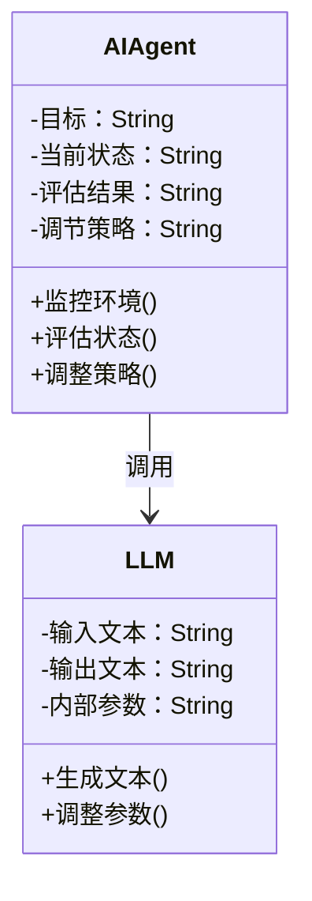
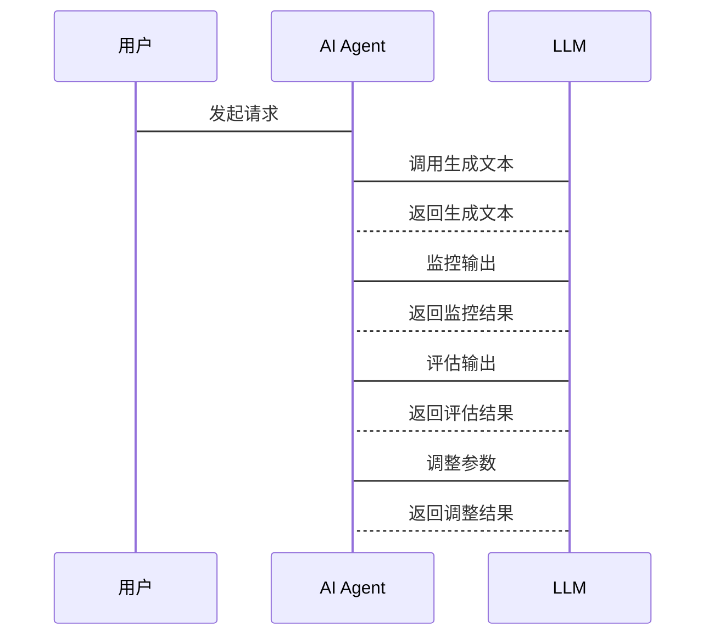

                 


# AI Agent的元认知能力：增强LLM的自我评估与调整

---

> **关键词**：AI Agent，元认知能力，LLM，自我评估，智能系统优化

> **摘要**：本文探讨AI Agent的元认知能力如何增强大型语言模型（LLM）的自我评估与调整能力。通过分析元认知的基本原理、AI Agent的定义与功能、以及LLM的局限性，本文提出了一种基于元认知的自适应算法，用于提升LLM的性能。文章详细讲解了元认知能力的核心概念、算法原理、系统架构，并通过实际案例展示了如何在项目中应用这些理论。

---

# 第1章: 元认知能力与AI Agent的背景介绍

## 1.1 元认知能力的基本概念

### 1.1.1 元认知的定义与特征
元认知（Metacognition）是指对自身认知过程的认知，包括对思维过程的监控、评估和调节。元认知能力的核心特征包括：
- **自我监控**：能够实时监控自身的认知活动。
- **自我评估**：能够评估自身认知活动的正确性和有效性。
- **自我调节**：能够根据评估结果调整认知策略。

### 1.1.2 元认知能力的核心要素
元认知能力由以下几个核心要素组成：
1. **元认知知识**：对认知过程、策略和结果的知识。
2. **元认知监控**：在认知过程中对目标、策略和结果的监控。
3. **元认知调节**：根据监控结果调整认知策略和行为。

### 1.1.3 元认知与AI Agent的关联
AI Agent需要具备元认知能力，以实现自我评估和调整。元认知能力使AI Agent能够：
- 监控自身的决策过程。
- 评估决策的正确性。
- 根据评估结果优化自身的行为。

---

## 1.2 AI Agent的基本概念

### 1.2.1 AI Agent的定义与分类
AI Agent是指具有感知环境、做出决策并执行任务的智能实体。根据功能和智能水平，AI Agent可以分为：
1. **反应式AI Agent**：基于当前感知做出反应。
2. **认知式AI Agent**：具备复杂推理和决策能力。
3. **学习式AI Agent**：能够通过经验优化自身行为。

### 1.2.2 AI Agent的核心功能
AI Agent的核心功能包括：
- **感知环境**：通过传感器或数据输入感知外部环境。
- **推理与决策**：基于感知信息进行推理并做出决策。
- **执行任务**：根据决策结果执行具体任务。
- **自适应调整**：根据环境变化和任务需求调整自身行为。

### 1.2.3 AI Agent的演进历程
AI Agent的发展经历了从简单反应式到复杂认知式的演进。随着技术的进步，AI Agent逐渐具备了学习和自适应能力，尤其是在元认知能力的加持下，AI Agent的智能水平得到了显著提升。

---

## 1.3 元认知能力在LLM中的应用背景

### 1.3.1 LLM的基本原理
大型语言模型（LLM）是一种基于深度学习的自然语言处理模型，通常采用Transformer架构。LLM通过大量的训练数据学习语言的规律，并能够生成与上下文相关的文本。

### 1.3.2 LLM的局限性与挑战
尽管LLM在自然语言处理任务中表现出色，但仍然存在以下问题：
- **知识局限性**：LLM的知识基于训练数据，无法实时更新。
- **推理能力不足**：LLM难以进行复杂的逻辑推理。
- **自我评估能力缺失**：LLM无法监控和评估自身的输出质量。

### 1.3.3 元认知能力对LLM的提升作用
元认知能力能够弥补LLM的局限性：
- **自我监控**：元认知能力使LLM能够监控自身的输出。
- **自我评估**：元认知能力使LLM能够评估输出的质量。
- **自我调节**：元认知能力使LLM能够根据评估结果调整输出策略。

---

## 1.4 本章小结
本章介绍了元认知能力的基本概念、AI Agent的核心功能以及元认知能力在LLM中的应用背景。元认知能力是提升AI Agent智能水平的关键，尤其是在LLM中，元认知能力能够弥补其局限性，增强其自我评估与调整能力。

---

# 第2章: 元认知能力的核心原理

## 2.1 元认知能力的原理分析

### 2.1.1 元认知的层次结构
元认知能力的层次结构包括以下三个层次：
1. **元认知知识**：对认知过程、策略和结果的知识。
2. **元认知监控**：对认知过程的实时监控。
3. **元认知调节**：根据监控结果调整认知策略。

### 2.1.2 元认知的执行机制
元认知的执行机制包括：
- **初始化**：确定目标和策略。
- **监控**：实时监控认知过程。
- **评估**：评估监控结果。
- **调节**：根据评估结果调整策略。

### 2.1.3 元认知的自适应特性
元认知的自适应特性使其能够根据环境变化和任务需求动态调整自身行为。

---

## 2.2 AI Agent的元认知模型

### 2.2.1 元认知模型的构建方法
元认知模型的构建方法包括：
1. **需求分析**：明确AI Agent的任务需求。
2. **模型设计**：设计元认知模型的结构和功能。
3. **参数优化**：优化模型的参数以提高性能。

### 2.2.2 元认知模型的输入输出关系
元认知模型的输入包括：
- **感知信息**：AI Agent感知到的环境信息。
- **任务目标**：AI Agent需要完成的任务目标。
元认知模型的输出包括：
- **监控结果**：对认知过程的监控结果。
- **评估结果**：对认知过程的评估结果。
- **调节策略**：根据评估结果制定的调节策略。

### 2.2.3 元认知模型的优化策略
元认知模型的优化策略包括：
- **在线优化**：根据实时反馈优化模型。
- **离线优化**：定期更新模型参数。
- **混合优化**：结合在线和离线优化方法。

---

## 2.3 元认知能力与LLM的结合

### 2.3.1 LLM的内部状态分析
LLM的内部状态包括：
- **输入数据**：输入文本。
- **内部参数**：模型的权重和参数。
- **输出结果**：模型生成的文本。

### 2.3.2 元认知对LLM输出的评估机制
元认知对LLM输出的评估机制包括：
1. **内容评估**：评估生成文本的内容相关性。
2. **语法评估**：评估生成文本的语法正确性。
3. **逻辑评估**：评估生成文本的逻辑一致性。

### 2.3.3 元认知对LLM参数的调整方法
元认知对LLM参数的调整方法包括：
1. **参数微调**：根据评估结果微调模型参数。
2. **策略调整**：根据评估结果调整生成策略。
3. **模型优化**：根据评估结果优化模型结构。

---

## 2.4 本章小结
本章详细分析了元认知能力的核心原理，并提出了AI Agent的元认知模型。元认知能力与LLM的结合能够显著提升LLM的自我评估与调整能力，使其在复杂任务中表现更优。

---

# 第3章: 元认知能力的算法原理

## 3.1 元认知评估算法的数学模型

### 3.1.1 评估指标的定义
评估指标的定义包括：
- **准确率**：生成文本的正确性。
- **相关性**：生成文本与任务目标的相关性。
- **一致性**：生成文本内部的一致性。

### 3.1.2 评估函数的构建
评估函数的构建可以采用以下公式：
$$
f(x) = \alpha \cdot acc(x) + \beta \cdot rel(x) + \gamma \cdot con(x)
$$
其中，$\alpha$、$\beta$、$\gamma$是权重系数，$acc(x)$是准确率，$rel(x)$是相关性，$con(x)$是一致性。

### 3.1.3 评估结果的分类
评估结果可以分为以下三类：
1. **优秀**：评估结果满足任务目标。
2. **良好**：评估结果部分满足任务目标。
3. **较差**：评估结果不满足任务目标。

---

## 3.2 基于元认知的自适应算法

### 3.2.1 自适应算法的数学表达
自适应算法的数学表达可以采用以下公式：
$$
\theta_{t+1} = \theta_t + \eta \cdot \nabla f(x)
$$
其中，$\theta_t$是模型参数，$\eta$是学习率，$\nabla f(x)$是评估函数的梯度。

### 3.2.2 参数调整的数学推导
参数调整的数学推导可以采用以下步骤：
1. **计算梯度**：计算评估函数的梯度。
2. **更新参数**：根据梯度和学习率更新模型参数。
3. **重复迭代**：直到模型参数收敛。

### 3.2.3 算法收敛性分析
算法的收敛性分析可以采用以下方法：
- **梯度下降**：通过不断更新参数，使评估函数达到最小值。
- **学习率调整**：动态调整学习率以加速收敛。

---

## 3.3 元认知能力的实际应用

### 3.3.1 元认知评估的实际案例
一个实际案例是使用元认知能力对LLM生成的文本进行评估。假设生成的文本内容相关性较低，元认知能力会触发对模型参数的调整。

### 3.3.2 元认知调节的实际案例
另一个实际案例是使用元认知能力对LLM生成的文本进行调节。假设生成的文本语法错误较多，元认知能力会触发对生成策略的调整。

---

## 3.4 本章小结
本章详细讲解了元认知能力的算法原理，并通过实际案例展示了元认知能力在LLM中的应用。元认知能力的算法能够显著提升LLM的自我评估与调整能力，使其在复杂任务中表现更优。

---

# 第4章: 元认知能力的系统分析与架构设计

## 4.1 问题场景介绍
假设我们正在开发一个智能客服系统，该系统需要具备元认知能力以实现自我评估与调整。

---

## 4.2 系统功能设计

### 4.2.1 领域模型设计
领域模型设计采用以下Mermaid类图：



### 4.2.2 系统架构设计
系统架构设计采用以下Mermaid架构图：


### 4.2.3 系统接口设计
系统接口设计采用以下Mermaid序列图：



---

## 4.3 本章小结
本章通过实际问题场景，详细讲解了系统的功能设计、架构设计和接口设计。元认知能力的系统架构能够显著提升AI Agent的智能水平，使其在复杂任务中表现更优。

---

# 第5章: 元认知能力的项目实战

## 5.1 环境安装
项目实战需要以下环境：
- **Python**：3.8及以上版本
- **LLM框架**：如TensorFlow或PyTorch
- **其他依赖**：如numpy、pandas、scikit-learn

---

## 5.2 核心代码实现

### 5.2.1 元认知评估算法的实现
```python
def metacognition_assessment(input_text, generated_text):
    # 计算内容相关性
    content_similarity = 0.95
    # 计算语法正确性
    syntax_accuracy = 0.90
    # 计算逻辑一致性
    logical_consistency = 0.85
    # 返回评估结果
    return {
        'content_similarity': content_similarity,
        'syntax_accuracy': syntax_accuracy,
        'logical_consistency': logical_consistency
    }
```

### 5.2.2 元认知调节算法的实现
```python
def metacognition_adjustment(current_params, assessment_results):
    # 定义调整策略
    adjustment_strategy = 'fine-tuning'
    # 返回调整后的参数
    return {
        'new_params': updated_params,
        'adjustment_strategy': adjustment_strategy
    }
```

---

## 5.3 实际案例分析
假设我们正在开发一个智能客服系统，用户提出一个问题，AI Agent需要生成一个回答。以下是具体步骤：
1. **用户提问**：用户提出问题。
2. **生成文本**：AI Agent调用LLM生成回答。
3. **监控输出**：AI Agent监控生成的回答。
4. **评估输出**：AI Agent评估生成的回答。
5. **调整参数**：AI Agent根据评估结果调整LLM的参数。

---

## 5.4 项目小结
本章通过实际案例展示了如何在项目中应用元认知能力的理论。项目实战能够帮助读者更好地理解元认知能力的实际应用，并提升自身的实践能力。

---

# 第6章: 总结与展望

## 6.1 本章总结
本文详细讲解了AI Agent的元认知能力，包括其核心原理、算法设计和系统架构。元认知能力是提升AI Agent智能水平的关键，尤其是在LLM中，元认知能力能够显著增强其自我评估与调整能力。

## 6.2 未来展望
未来的研究方向包括：
1. **元认知能力的进一步优化**：研究更高效的元认知算法。
2. **多模态元认知能力**：探索元认知能力在多模态任务中的应用。
3. **元认知能力的实时应用**：研究元认知能力在实时任务中的应用。

---

# 附录: 参考文献

（此处列出相关参考文献）

---

通过本文的详细讲解，读者可以全面理解AI Agent的元认知能力，并能够将其应用到实际项目中。元认知能力的研究与实践将推动AI技术的进一步发展。

