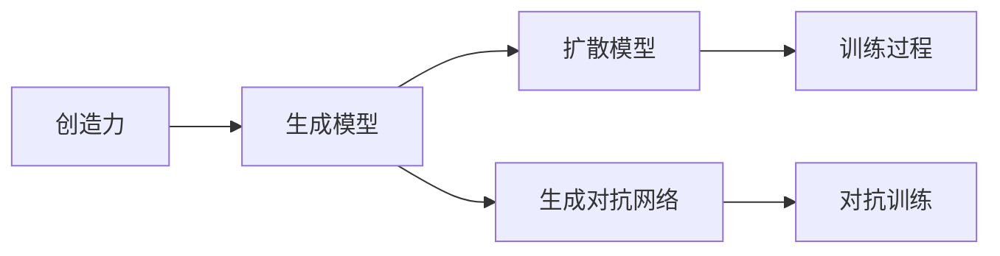
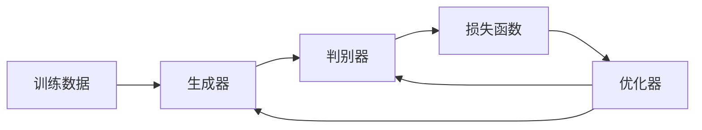
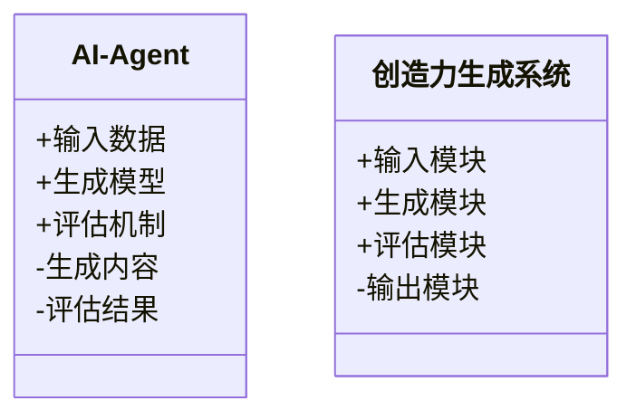

                 


# AI Agent的创造力：生成新颖内容

## 关键词：AI Agent，创造力，生成模型，扩散模型，生成对抗网络，创新算法

## 摘要：  
本文深入探讨了AI Agent在生成新颖内容方面的创造力，从基本概念到核心算法，再到系统设计和实际应用，全面解析AI Agent如何通过创新算法生成独特、有价值的内容。文章结合理论与实践，分析了多种创造力生成模型的原理与优劣，并通过具体案例展示了AI Agent在不同场景下的应用潜力。

---

# 第一部分: AI Agent的创造力基础

## 第1章: AI Agent与创造力概述

### 1.1 AI Agent的基本概念
#### 1.1.1 AI Agent的定义与分类
AI Agent（人工智能代理）是指具有感知环境、执行任务和做出决策能力的智能实体。根据功能和应用场景，AI Agent可以分为以下几类：
- **简单反射型Agent**：基于预定义规则做出反应。
- **基于模型的反射型Agent**：利用内部状态和环境模型进行决策。
- **目标驱动型Agent**：以明确目标为导向，主动规划行动。
- **效用驱动型Agent**：通过最大化效用函数来优化决策。

#### 1.1.2 创造力的定义与特征
创造力是指生成新颖、独特且具有价值的想法或内容的能力。创造力的核心特征包括：
1. **新颖性**：结果与现有知识或经验不同。
2. **有用性**：结果具有实际价值或潜在应用。
3. **复杂性**：涉及多维度的信息处理与组合。

#### 1.1.3 AI Agent与创造力的关系
AI Agent通过模拟人类创造力的机制，利用算法生成新颖内容。创造力是AI Agent实现高级任务（如内容创作、问题解决）的关键能力。

---

### 1.2 AI Agent的创造力问题背景
#### 1.2.1 当前AI Agent的发展现状
AI Agent技术在近年来取得了显著进展，尤其是在自然语言处理、图像生成和自动化决策领域。然而，大多数AI Agent仍依赖于预定义的规则或数据驱动的模式识别，缺乏真正的创造力。

#### 1.2.2 创造力在AI Agent中的重要性
创造力是区分AI Agent与传统自动化工具的重要标志。具备创造力的AI Agent能够生成超越训练数据的新内容，适用于创新设计、艺术创作等领域。

#### 1.2.3 创造力的边界与外延
创造力的边界在于其生成内容的原创性和实用性。外延则涉及AI Agent在不同领域的应用，如文学创作、音乐生成、产品设计等。

---

### 1.3 创造力的核心要素与概念结构
#### 1.3.1 创造力的核心要素分析
创造力的核心要素包括：
1. **输入数据**：AI Agent的训练数据和环境信息。
2. **生成模型**：算法和数学模型。
3. **评估机制**：衡量生成内容的创新性和实用性。

#### 1.3.2 创造力与AI Agent的结合模型
创造力与AI Agent的结合模型包括以下步骤：
1. **输入处理**：解析任务需求和环境信息。
2. **生成阶段**：通过算法生成候选内容。
3. **评估阶段**：筛选并优化生成内容。
4. **输出阶段**：输出最终结果。

#### 1.3.3 创造力的评估标准与方法
创造力的评估标准包括：
- 新颖性：生成内容的独特性。
- 有用性：生成内容的实际价值。
- 可控性：生成过程的可调节性。

---

## 第2章: 创造力的机制与模型

### 2.1 创造力的生成模型
#### 2.1.1 基于扩散模型的创造力生成
扩散模型是一种通过逐步添加噪声并学习去噪过程的生成模型。其核心思想是将生成过程分解为多个阶段，逐步降低噪声，最终生成高质量内容。

#### 2.1.2 基于生成对抗网络的创造力生成
生成对抗网络（GAN）通过两个神经网络（生成器和判别器）的对抗训练生成新颖内容。生成器的目标是欺骗判别器，使其认为生成的内容与真实数据无异。

#### 2.1.3 其他创新模型的对比分析
以下表格对比了几种常见的创造力生成模型的优缺点：

| 模型类型          | 优点                           | 缺点                           |
|-------------------|-------------------------------|-------------------------------|
| 扩散模型          | 高质量生成，稳定性好           | 训练时间长，参数量大           |
| 生成对抗网络（GAN）| 创新性强，多样性高             | 易出现模式坍缩，训练不稳定       |
| 变分自编码器（VAE）| 参数高效，生成速度快           | 生成质量较低                   |

---

### 2.2 创造力模型的属性特征对比
#### 2.2.1 不同创造力模型的特征分析
- **扩散模型**：生成质量高，适用于图像和文本生成。
- **生成对抗网络**：创新能力强，适用于多样化内容生成。
- **变分自编码器**：生成速度快，适用于轻量级应用。

#### 2.2.2 创造力模型的优缺点对比
通过对比分析，可以帮助选择适合特定任务的创造力生成模型。

---

### 2.3 创造力的ER实体关系图
以下是创造力生成过程的ER实体关系图：



---

## 第3章: 创造力生成的算法原理

### 3.1 基于扩散模型的创造力生成
#### 3.1.1 扩散模型的基本原理
扩散模型通过逐步添加噪声并学习去噪过程，最终生成高质量内容。其数学公式如下：

$$p(x_t|x_{t-1}) = \text{Normal}(x_t; \mu_\theta(x_{t-1}), \sigma^2)$$

其中，$x_t$表示第$t$步的样本，$\mu_\theta$和$\sigma$是模型的参数。

#### 3.1.2 扩散模型的数学公式
扩散模型的训练目标是最小化去噪过程的损失函数：

$$\mathcal{L} = \mathbb{E}_{t=1}^T \mathbb{E}_{x_0 \sim p_{data}}[\|x_t - \mu_\theta(x_{t-1})\|^2]$$

### 3.2 基于生成对抗网络的创造力生成
#### 3.2.1 GAN的基本结构
生成对抗网络由生成器和判别器组成，其损失函数如下：

$$\mathcal{L} = \mathbb{E}_{x \sim p_{data}}[\log D(x)] + \mathbb{E}_{z \sim p_z}[\log(1 - D(G(z)))]$$

其中，$D$是判别器，$G$是生成器，$z$是随机噪声。

#### 3.2.2 GAN的训练流程
以下是扩散模型和生成对抗网络的训练流程图：



---

## 第4章: 创造力生成的系统设计与实现

### 4.1 系统功能设计
以下是系统功能设计的类图：



---

## 第5章: 项目实战与案例分析

### 5.1 项目环境安装
```bash
pip install torch
pip install transformers
pip install numpy
```

### 5.2 核心实现代码
以下是扩散模型的Python实现示例：

```python
import torch
import torch.nn as nn

class DiffusionModel(nn.Module):
    def __init__(self, input_dim, hidden_dim, output_dim):
        super(DiffusionModel, self).__init__()
        self.fc1 = nn.Linear(input_dim, hidden_dim)
        self.fc2 = nn.Linear(hidden_dim, output_dim)
    
    def forward(self, x):
        return torch.sigmoid(self.fc2(torch.relu(self.fc1(x))))
```

---

## 第6章: 最佳实践与小结

### 6.1 小结
AI Agent的创造力是实现高级任务的关键能力。通过扩散模型和生成对抗网络等创新算法，AI Agent能够生成新颖且有价值的内容。

### 6.2 注意事项
- 创造力生成模型的训练需要大量高质量的数据。
- 模型的评估需要结合具体应用场景的需求。

### 6.3 拓展阅读
建议读者进一步阅读以下内容：
1. 《生成对抗网络：从原理到实现》
2. 《扩散模型：原理与应用》
3. 《AI Agent在艺术创作中的应用》

---

以上是《AI Agent的创造力：生成新颖内容》的完整目录和内容框架。

