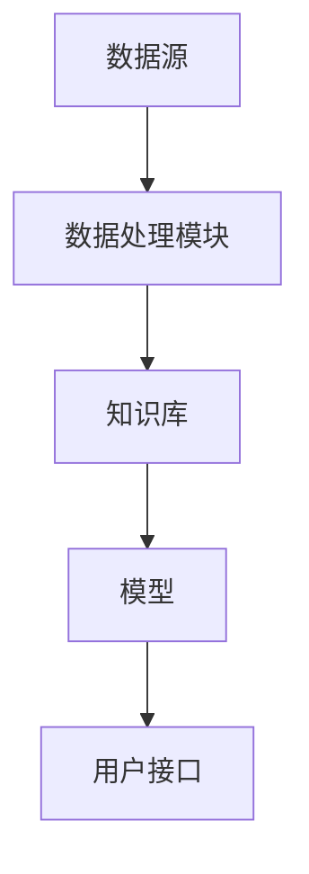
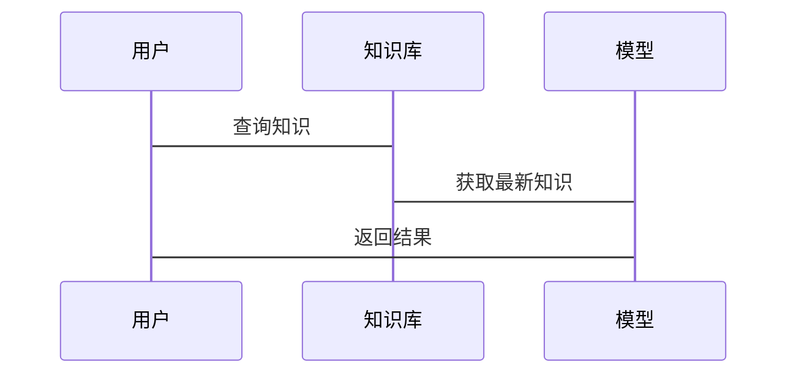
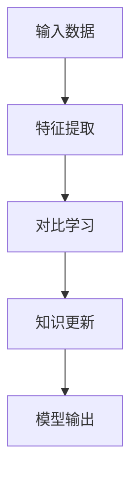
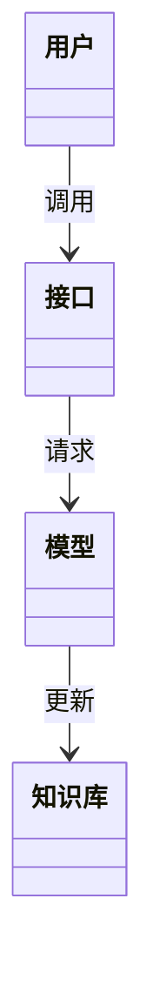
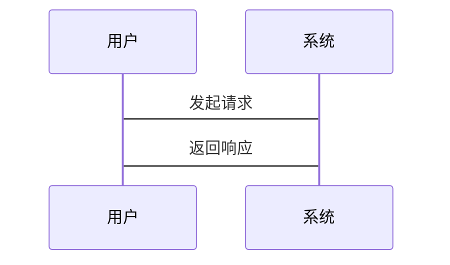

                 


# AI Agent的动态知识更新：保持LLM知识的实时性

---

## 关键词：  
AI Agent、动态知识更新、LLM、知识库、实时性、知识表示、对比学习

---

## 摘要：  
本文旨在探讨AI Agent在动态知识更新中的核心原理与实践方法，特别是如何保持大语言模型（LLM）知识的实时性。文章从背景、核心概念、算法原理、系统架构、项目实战等多维度进行分析，详细阐述了动态知识更新的必要性、实现方法及应用案例，帮助读者全面理解AI Agent的知识更新机制，并掌握实际落地的技术要点。

---

## 第一部分：引言

### 1.1 本书的目的与范围  
- **问题背景与挑战**：随着AI Agent在各个领域的广泛应用，知识的实时性需求日益增长，传统静态知识库已无法满足动态变化的需求。  
- **本书的核心目标**：通过系统性分析，提出一种基于动态知识更新的AI Agent设计方法，确保LLM知识的实时性与准确性。  
- **适用读者**：AI开发者、算法工程师、架构师及对动态知识更新感兴趣的读者。

### 1.2 AI Agent与动态知识更新的概述  
- **AI Agent的基本概念**：AI Agent是一种智能实体，能够感知环境并自主决策。  
- **动态知识更新的定义与重要性**：动态知识更新是指AI Agent能够实时获取并整合新知识，保持知识库的最新性。  
- **LLM在动态知识更新中的作用**：大语言模型通过持续学习和更新，能够快速适应新的知识和场景。

---

## 第二部分：AI Agent动态知识更新的背景与核心概念

### 2.1 AI Agent的知识表示与更新机制  
- **知识表示的基本原理**：知识表示是将信息组织成可计算的形式，常见的表示方法包括符号表示、向量表示等。  
- **动态知识更新的驱动因素**：外部事件、用户反馈、数据流等都可能触发知识更新。  
- **LLM与知识库的结合方式**：LLM通过微调或提示工程技术，与知识库实现无缝对接。

### 2.2 动态知识更新的背景与挑战  
- **知识实时性的需求**：在实时应用场景中，知识库需要快速响应最新变化。  
- **动态知识更新的技术难点**：数据稀疏性、知识冲突、更新效率等问题亟待解决。  
- **现有技术的局限性**：传统知识库更新方法效率低，难以应对大规模实时数据。

### 2.3 AI Agent动态知识更新的核心概念  
- **知识表示的动态调整**：根据新数据动态调整知识表示形式。  
- **知识更新的触发条件与策略**：基于事件、时间或用户反馈触发更新。  
- **LLM在动态更新中的角色**：作为知识生成与整合的核心工具。

---

## 第三部分：动态知识更新的核心概念与联系

### 3.1 动态知识更新的原理与方法  
- **知识表示的动态调整**：通过对比学习等方法，动态更新知识表示。  
- **知识更新的算法与流程**：包括数据预处理、特征提取、模型训练等步骤。  
- **LLM与知识库的协同更新**：通过反馈机制实现知识库与模型的同步更新。

### 3.2 核心概念对比与特征分析  
- **动态知识更新与静态知识库的对比**：通过表格对比两者的优缺点，包括更新频率、响应时间、存储效率等。  

| 对比维度       | 动态知识更新          | 静态知识库          |
|----------------|---------------------|---------------------|
| 更新频率       | 高                  | 低                  |
| 响应时间       | 短                  | 长                  |
| 存储效率       | 低                  | 高                  |

- **不同知识更新策略的特征分析**：通过对比学习、增量学习等策略，分析其适用场景与性能差异。

### 3.3 实体关系与架构设计  
- **实体关系图（ER图）的构建**：通过Mermaid绘制系统实体关系图，展示知识库、模型、用户之间的关系。  

```mermaid
erDiagram
    actor 用户
    actor 知识库
    actor 模型
    用户 --> 知识库: 查询
    知识库 --> 模型: 更新
    模型 --> 用户: 响应
```

- **动态知识更新的架构设计**：通过分层架构设计，展示数据源、处理模块和接口设计。  



- **系统实体之间的关系与交互**：通过序列图展示系统实体之间的交互流程。  



---

## 第四部分：动态知识更新的算法原理

### 4.1 动态知识更新的算法流程  
- **预训练与微调**：通过对比学习方法，动态更新知识表示。  
- **数学模型与公式**：通过公式 $$L = \frac{1}{N}\sum_{i=1}^{N} (x_i - y_i)^2$$ 展示对比学习的目标函数。  



- **代码实现与解释**：通过Python代码示例，展示动态知识更新的实现过程。  

```python
def dynamic_update(data):
    # 数据预处理
    processed_data = preprocess(data)
    # 特征提取
    features = extract_features(processed_data)
    # 对比学习
    updated_features = update_features(features)
    # 模型更新
    model.update(updated_features)
    return model
```

---

## 第五部分：系统分析与架构设计方案

### 5.1 系统功能设计  
- **领域模型**：通过Mermaid类图展示系统功能模块之间的关系。  



### 5.2 系统架构设计  
- **架构设计**：通过Mermaid架构图展示系统的整体架构。  

```mermaid
context 智能系统 {
    client -->> app: 请求
    app -->> service: 服务调用
    service -->> db: 数据查询
    db -->> model: 模型更新
    model -->> service: 返回结果
    service -->> client: 响应
}
```

### 5.3 系统接口设计  
- **接口定义**：通过RESTful API定义系统接口，包括查询、更新等操作。

### 5.4 系统交互流程图  
- **交互流程**：通过Mermaid序列图展示用户与系统的交互流程。  



---

## 第六部分：项目实战

### 6.1 项目背景与目标  
- **项目背景**：构建一个动态更新的知识库，实现AI Agent的实时知识更新。  
- **项目目标**：通过实际案例，展示动态知识更新的实现过程。

### 6.2 环境配置与安装  
- **环境要求**：Python 3.8以上版本，安装必要的库如TensorFlow、Keras等。

### 6.3 核心实现代码  
```python
class KnowledgeUpdater:
    def __init__(self, knowledge_base):
        self.knowledge_base = knowledge_base

    def update_knowledge(self, new_data):
        # 数据处理
        processed_data = self.preprocess(new_data)
        # 知识更新
        updated_knowledge = self.knowledge_base.update(processed_data)
        return updated_knowledge

    def preprocess(self, data):
        # 数据预处理
        return data
```

### 6.4 代码解读与分析  
- **代码功能分析**：展示代码的模块功能，包括数据预处理、知识更新等。  
- **代码优化建议**：结合实际场景，提出代码优化的方向。

### 6.5 案例分析与效果评估  
- **案例分析**：通过具体案例，展示动态知识更新的效果。  
- **效果评估**：从准确率、响应时间等指标评估系统的性能。

---

## 第七部分：总结与展望

### 7.1 本章总结  
- **核心内容回顾**：总结全文的核心内容，包括动态知识更新的原理、算法实现及系统设计。  

### 7.2 未来展望  
- **研究方向**：提出未来的研究方向，如更高效的对比学习算法、分布式知识库设计等。  

### 7.3 最佳实践tips  
- **实践建议**：结合实际场景，给出动态知识更新的实践建议，如选择合适的算法、优化数据处理流程等。  
- **注意事项**：提醒读者在实际应用中需要注意的问题，如数据安全、模型泛化能力等。  

### 7.4 拓展阅读  
- **推荐阅读书籍**：推荐相关的技术书籍和论文，帮助读者进一步深入学习。

---

## 结语  
通过本文的系统性分析与实践，读者可以全面掌握AI Agent动态知识更新的核心原理与技术实现。希望本文能够为相关领域的研究与应用提供有价值的参考与启发。

