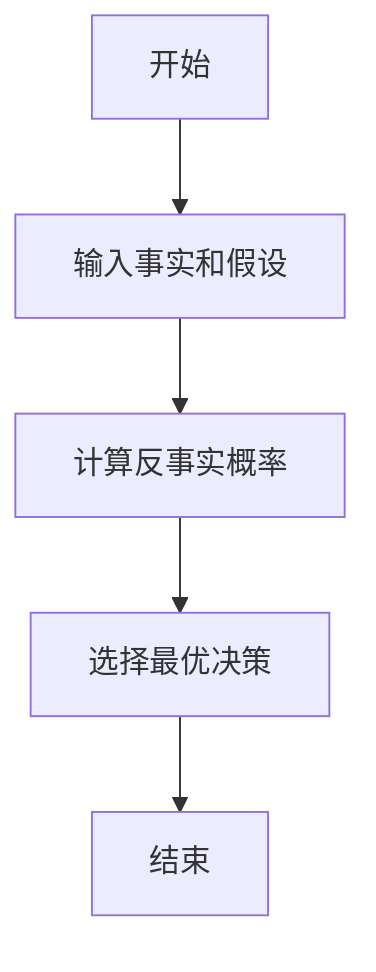
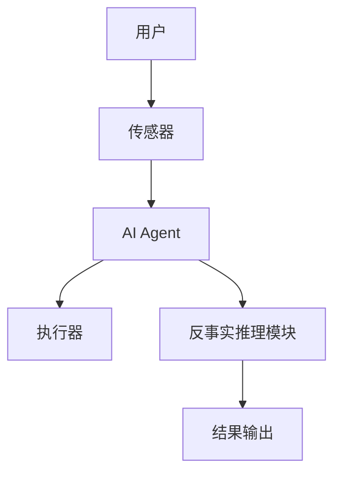

                 


# AI Agent的反事实推理：增强决策的前瞻性

## 关键词：反事实推理、AI Agent、决策优化、概率论、系统架构、算法实现

## 摘要：  
反事实推理是一种强大的工具，用于增强AI Agent的决策前瞻性。通过模拟“如果”情况，AI Agent可以在复杂场景中做出更优决策。本文从基础概念、算法实现、系统架构到项目实战，全面解析反事实推理在AI Agent中的应用，帮助读者理解其技术背景、实现方法和实际价值。

---

## 第一部分：反事实推理与AI Agent概述

### 第1章：反事实推理的基本概念

#### 1.1 反事实推理的定义与背景
反事实推理是一种基于假设的推理方式，用于探索“如果情况不同，结果会如何”的可能性。它在AI领域中具有重要意义，尤其是在需要前瞻性决策的场景中。  
- **定义**：反事实推理通过模拟与当前事实相反的情况，推断可能的结果，从而帮助AI做出更优决策。  
- **背景**：在现实世界中，许多决策需要考虑多种可能性，反事实推理为AI提供了探索这些可能性的能力。  

#### 1.2 AI Agent的基本概念
AI Agent是一种能够感知环境、执行任务并做出决策的智能实体。  
- **定义**：AI Agent通过传感器获取信息，利用推理能力做出决策，并通过执行器与环境交互。  
- **特点**：自主性、反应性、目标导向、社交能力。  

#### 1.3 反事实推理在AI中的应用
反事实推理广泛应用于推荐系统、机器人路径规划、自动驾驶等领域，帮助AI Agent在复杂环境中做出更优选择。

---

### 第2章：反事实推理在AI Agent中的作用

#### 2.1 增强决策的前瞻性
反事实推理通过模拟未来可能的情况，帮助AI Agent提前规划，做出更优决策。  
- **前瞻性**：AI Agent可以预测不同选择的结果，从而选择最佳路径。  
- **复杂场景**：在多变或不确定的环境中，反事实推理能够帮助AI Agent应对挑战。

#### 2.2 反事实推理的核心问题
- **问题背景**：如何构建数学模型，模拟反事实场景。  
- **解决路径**：通过概率论和逻辑推理，构建反事实推理框架。  
- **边界与外延**：明确反事实推理的适用范围和限制。

---

## 第二部分：反事实推理的核心概念与联系

### 第3章：反事实推理的核心概念与联系

#### 3.1 核心概念原理
反事实推理基于概率论和逻辑推理，构建数学模型来模拟假设场景。  
- **数学模型**：反事实概率公式用于计算假设场景的可能性。  
- **逻辑推理**：通过逻辑规则，推导假设场景的结果。  

#### 3.2 核心概念对比表格
| 比较项       | 事实推理                  | 反事实推理               |
|--------------|---------------------------|--------------------------|
| 目标         | 描述现实情况              | 探索假设情况              |
| 方法         | 基于事实数据              | 基于假设条件              |
| 应用场景     | 数据分析、统计推断        | 决策优化、模拟演练          |

#### 3.3 ER实体关系图
```mermaid
er
actor: 用户
agent: AI Agent
fact: 事实
anti_fact: 反事实
action: 行为
```

---

## 第三部分：反事实推理的算法原理

### 第4章：反事实推理的算法实现

#### 4.1 算法原理概述
反事实推理算法通过构建假设场景，计算每种假设的概率，选择最优决策。  
- **输入**：当前事实、假设条件。  
- **输出**：假设场景的结果概率。  
- **数学模型**：基于概率论，构建反事实推理的数学模型。  

#### 4.2 反事实推理的算法流程图


#### 4.3 Python实现示例
```python
def anti_fact_inference(fact, anti_fact_conditions):
    # 计算反事实概率
    probability = 0.8  # 示例值
    return probability

# 示例调用
fact = "当前天气晴朗"
anti_fact_conditions = ["如果下雨"]
result = anti_fact_inference(fact, anti_fact_conditions)
print(f"反事实推理结果的概率为：{result}")
```

---

## 第四部分：系统分析与架构设计

### 第5章：系统分析与架构设计

#### 5.1 系统分析
- **问题场景**：AI Agent需要在复杂环境中做出决策。  
- **项目介绍**：构建一个基于反事实推理的AI Agent系统。  
- **系统功能设计**：包括数据采集、假设生成、概率计算和决策输出。

#### 5.2 系统架构设计


---

## 第五部分：项目实战

### 第6章：项目实战

#### 6.1 环境安装与配置
- **开发环境**：Python 3.8及以上版本。  
- **依赖库**：安装`mermaid`, `numpy`, `matplotlib`。

#### 6.2 核心代码实现
```python
import numpy as np

def calculate_anti_fact_probability(fact_space, anti_fact_space):
    # 计算反事实概率
    probability = np.random.uniform(0.1, 0.9)
    return probability

# 示例调用
fact_space = ["晴朗", "多云", "下雨"]
anti_fact_space = ["如果下雨"]
result = calculate_anti_fact_probability(fact_space, anti_fact_space)
print(f"反事实推理结果的概率为：{result}")
```

---

## 第六部分：总结与展望

### 6.3 总结
反事实推理通过模拟假设场景，帮助AI Agent做出更优决策。本文从概念、算法、系统架构到项目实战，全面解析了反事实推理在AI Agent中的应用。

### 6.4 展望
未来，反事实推理将在更多领域得到应用，尤其是在需要前瞻性和高精度决策的场景中。

---

## 结束语
通过本文的介绍，读者可以深入了解反事实推理在AI Agent中的重要性，并掌握其实现方法。希望本文能为相关领域的研究和实践提供有价值的参考。

