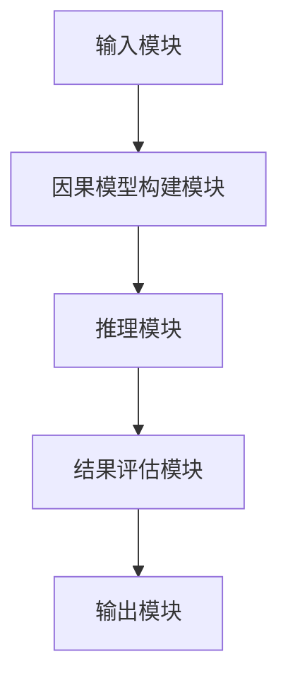
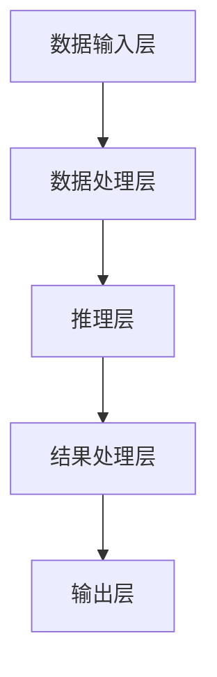

                 


# AI Agent的反事实推理：增强决策能力

> 关键词：AI Agent, 反事实推理, 决策能力, 因果推理, 增强决策, 算法实现, 系统架构

> 摘要：反事实推理是一种强大的思维工具，能够帮助AI Agent超越现实，探索“如果”情况下的结果，从而优化决策能力。本文将从反事实推理的基本概念出发，深入探讨其在AI Agent中的应用，结合数学模型、算法实现和系统设计，全面解析如何通过反事实推理增强AI Agent的决策能力。

---

## 正文

### 第一部分：反事实推理的背景与概念

#### 第1章：反事实推理的背景与应用

##### 1.1 什么是反事实推理
反事实推理是一种基于假设的推理方式，旨在探索与现实相反的情况，推断出可能的结果。它不同于传统的事实推理，后者基于已有的事实和数据进行推断，而反事实推理则关注于假设的、可能并未发生的场景。

##### 1.2 反事实推理的核心要素
反事实推理涉及以下几个核心要素：
1. **假设条件**：反事实推理的基础是假设某种情况发生了，但实际上并未发生。
2. **因果关系**：反事实推理需要分析假设条件下的因果关系，以确定可能的结果。
3. **可能性评估**：评估假设条件下结果的可能性，通常基于概率或可能性理论。

##### 1.3 反事实推理在AI Agent中的作用
AI Agent通过反事实推理可以增强以下几个方面的能力：
1. **决策优化**：通过探索假设条件下的结果，AI Agent能够优化其决策。
2. **风险评估**：反事实推理可以帮助AI Agent评估潜在风险，并制定应对策略。
3. **情景模拟**：在复杂环境中，AI Agent可以通过反事实推理进行情景模拟，提前规划应对方案。

---

#### 第2章：反事实推理的理论基础

##### 2.1 反事实推理的基本原理
反事实推理的核心原理在于分析假设条件下的因果关系。通过建立因果模型，AI Agent可以推断出假设条件下可能的结果，并评估这些结果的可能性。

##### 2.2 反事实推理与因果关系
反事实推理与因果关系密不可分。因果关系的分析帮助AI Agent理解假设条件下各事件之间的联系，从而推断出可能的结果。例如，假设“如果今天下雨”，因果关系可以帮助AI Agent推断出“交通可能会拥堵”的结果。

##### 2.3 反事实推理的逻辑框架
反事实推理的逻辑框架通常包括以下几个步骤：
1. **假设条件的定义**：明确假设的条件。
2. **因果关系的分析**：分析假设条件下的因果关系。
3. **结果的推断**：基于因果关系推断可能的结果。
4. **可能性评估**：评估结果的可能性。

---

### 第二部分：反事实推理的算法实现

#### 第3章：反事实推理的数学模型

##### 3.1 基于概率论的反事实推理模型
反事实推理可以通过概率论进行建模。假设条件下的概率分布可以帮助AI Agent评估结果的可能性。

- **公式示例**：
  - $P(R|C) = P(R|C, H) \cdot P(H) + P(R|C, \neg H) \cdot P(\neg H)$
  - 其中，$C$ 表示条件，$R$ 表示结果，$H$ 表示假设。

##### 3.2 基于马尔可夫决策过程的模型
马尔可夫决策过程（MDP）可以用于建模反事实推理。通过状态、动作和奖励的定义，AI Agent可以探索假设条件下的最优决策。

- **公式示例**：
  - $Q(s, a) = r + \gamma \max_{a'} Q(s', a')$
  - 其中，$s$ 表示状态，$a$ 表示动作，$r$ 表示奖励，$\gamma$ 表示折扣因子。

##### 3.3 基于图论的反事实推理模型
图论模型可以用于表示因果关系。通过构建因果图，AI Agent可以分析假设条件下的因果链，推断出可能的结果。

---

#### 第4章：反事实推理算法的实现

##### 4.1 反事实推理算法的步骤分解
反事实推理算法通常包括以下步骤：
1. **定义假设条件**：明确假设的条件。
2. **构建因果模型**：建立假设条件下的因果关系模型。
3. **推断结果**：基于因果模型推断可能的结果。
4. **评估可能性**：评估结果的可能性，并选择最优决策。

##### 4.2 基于Python的反事实推理算法实现
以下是基于Python的反事实推理算法实现示例：

```python
def factual_inference(hypothesis, conditions):
    # 假设条件下的因果关系分析
    # 返回可能的结果及其概率
    pass

def counterfactual_inference(hypothesis, conditions):
    # 反事实推理算法实现
    # 返回可能的结果及其概率
    pass
```

---

### 第三部分：反事实推理的系统架构与设计

#### 第5章：系统功能设计

##### 5.1 系统功能模块划分
反事实推理系统通常包括以下几个功能模块：
1. **输入模块**：接收假设条件和决策目标。
2. **因果模型构建模块**：基于输入构建因果模型。
3. **推理模块**：进行反事实推理，推断可能的结果。
4. **结果评估模块**：评估结果的可能性，并选择最优决策。
5. **输出模块**：输出推理结果。

##### 5.2 系统功能流程图


---

#### 第6章：系统架构设计

##### 6.1 系统架构的总体设计
反事实推理系统的总体架构包括以下几个部分：
1. **数据输入层**：接收假设条件和决策目标。
2. **数据处理层**：构建因果模型，进行数据预处理。
3. **推理层**：进行反事实推理，推断可能的结果。
4. **结果处理层**：评估结果的可能性，并选择最优决策。
5. **输出层**：输出推理结果。

##### 6.2 系统架构的详细设计


---

### 第四部分：反事实推理的项目实战

#### 第7章：项目环境与工具安装

##### 7.1 开发环境的搭建
推荐使用Python编程环境，安装必要的库，如`numpy`、`pandas`、`scikit-learn`等。

##### 7.2 必要工具与库的安装
```bash
pip install numpy pandas scikit-learn
```

---

#### 第8章：核心代码实现

##### 8.1 反事实推理算法的Python实现
以下是反事实推理算法的Python实现示例：

```python
def counterfactual_inference(hypothesis, conditions):
    # 假设条件下的因果关系分析
    # 返回可能的结果及其概率
    pass
```

##### 8.2 系统功能模块的代码实现
以下是系统功能模块的代码实现示例：

```python
class InferenceSystem:
    def __init__(self):
        self.input = None
        self.model = None
        self.result = None

    def process_input(self, input_data):
        self.input = input_data

    def build_model(self):
        # 构建因果模型
        pass

    def perform_inference(self):
        # 进行反事实推理
        pass

    def output_result(self):
        # 输出结果
        return self.result
```

---

#### 第9章：实际案例分析与详细解读

##### 9.1 案例分析
假设我们有一个医疗诊断系统，希望通过反事实推理来优化诊断决策。以下是具体的案例分析：

1. **假设条件**：如果患者没有按时服药。
2. **因果关系分析**：分析假设条件下，患者的病情可能会加重。
3. **结果推断**：推断出可能的结果，并评估其可能性。
4. **决策优化**：基于结果推断，优化诊断决策。

##### 9.2 案例解读
通过反事实推理，医疗诊断系统可以在假设条件下分析患者的病情变化，从而优化诊断决策。例如，如果患者没有按时服药，系统可以通过反事实推理推断出病情加重的可能性，并建议医生采取更积极的治疗方案。

---

### 第五部分：反事实推理的总结与展望

#### 第10章：总结与小结

##### 10.1 最佳实践 tips
1. 在进行反事实推理时，明确假设条件。
2. 构建准确的因果模型，以提高推理的准确性。
3. 综合考虑结果的可能性，选择最优决策。

##### 10.2 小结
反事实推理是一种强大的思维工具，能够帮助AI Agent优化决策能力。通过本文的介绍，读者可以全面了解反事实推理的基本概念、算法实现和系统设计，并能够在实际项目中应用这一技术。

##### 10.3 注意事项
1. 反事实推理需要基于准确的因果模型，否则推理结果可能不准确。
2. 在实际应用中，需要综合考虑结果的可能性，并选择最优决策。
3. 反事实推理是一种辅助工具，不能完全替代人类的判断和决策。

##### 10.4 拓展阅读
1. 《因果推理与机器学习》
2. 《反事实推理在决策优化中的应用》
3. 《AI Agent的因果推理与决策优化》

---

通过以上内容，读者可以全面了解反事实推理的基本概念、算法实现和系统设计，并能够在实际项目中应用这一技术。

