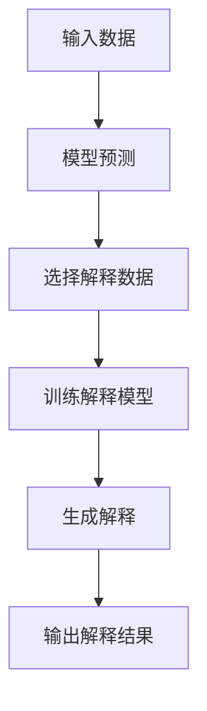
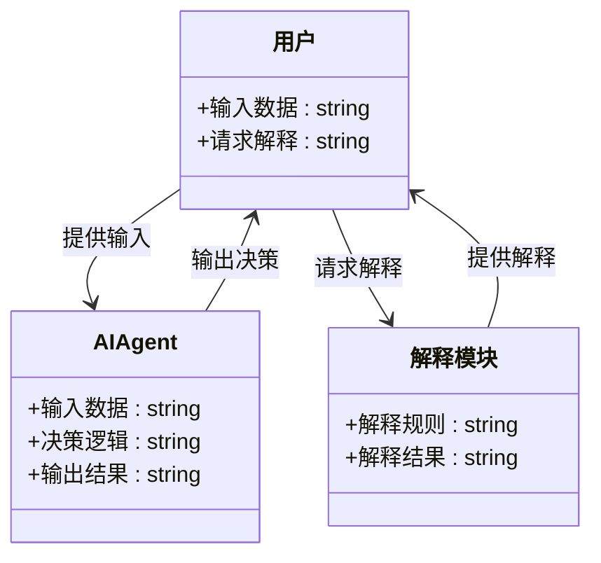
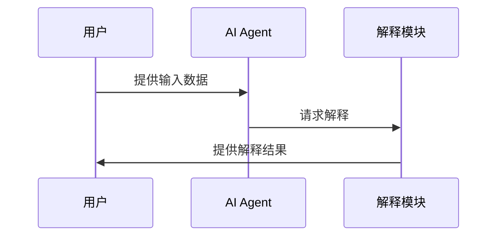

                 


# AI Agent的可解释性设计

> 关键词：AI Agent，可解释性，机器学习，系统架构，算法原理，项目实战

> 摘要：AI Agent的可解释性设计是当前人工智能领域的重要研究方向，旨在提高AI决策过程的透明度和可理解性，从而增强用户信任和系统可靠性。本文从AI Agent的基本概念出发，深入探讨可解释性设计的核心原理、算法实现、系统架构及项目实战，为读者提供全面的技术指导。

---

## 第一部分: AI Agent的可解释性设计基础

### 第1章: AI Agent与可解释性概述

#### 1.1 AI Agent的基本概念
- **1.1.1 什么是AI Agent**  
  AI Agent（人工智能代理）是指能够感知环境、自主决策并执行任务的智能实体。它具备自主性、反应性、目标导向和社会能力等核心特征。

- **1.1.2 AI Agent的核心特征**  
  - 自主性：无需外部干预，自主决策。  
  - 反应性：能够实时感知环境并做出响应。  
  - 目标导向：以实现特定目标为导向。  
  - 社会能力：能够与其他实体（人或AI）进行交互与协作。

- **1.1.3 可解释性在AI Agent中的重要性**  
  可解释性是指AI Agent的决策过程能够被人类理解和解释。在医疗、金融等高风险领域，可解释性是确保用户信任和系统合规性的关键。

---

#### 1.2 可解释性设计的背景与挑战
- **1.2.1 当前AI Agent应用的痛点**  
  - 黑箱问题：许多AI模型的决策过程难以解释。  
  - 用户信任：缺乏透明性导致用户不信任。  
  - 合规性：在金融、医疗等领域，可解释性是法律合规的基本要求。

- **1.2.2 可解释性设计的必要性**  
  可解释性设计不仅能够提高用户信任，还能帮助开发者发现模型中的潜在问题，从而提升系统的稳定性和可靠性。

- **1.2.3 可解释性设计的边界与外延**  
  - 边界：可解释性设计并非要求所有决策都完全透明，而是要在关键决策点提供合理的解释。  
  - 外延：可解释性设计不仅涉及算法本身，还涉及数据、模型和交互等多个方面。

---

#### 1.3 本章小结
本章通过介绍AI Agent的基本概念及其可解释性设计的重要性，为后续章节奠定了基础。接下来，我们将深入探讨可解释性设计的核心概念与原理。

---

## 第二部分: AI Agent可解释性设计的核心概念与联系

### 第2章: 可解释性设计的核心概念原理

#### 2.1 可解释性设计的属性特征对比
- **2.1.1 不同解释方法的特征对比（表格形式）**

| 特性       | 解释性特征       |
|------------|------------------|
| 透明度     | 高/中            |
| 可理解性   | 高/中            |
| 可操作性   | 高               |
| 计算效率   | 低/中            |

- **2.1.2 可解释性设计的核心要素**  
  - 透明度：用户能够理解AI的决策过程。  
  - 可理解性：解释能够被用户有效理解。  
  - 可操作性：解释能够指导用户行动或改进系统。

---

#### 2.2 可解释性设计的ER实体关系图
- **2.2.1 实体关系图（使用 Mermaid 流程图）**

```mermaid
erDiagram
    actor 用户 {
        +决策过程 : string
        +解释结果 : string
    }
    class AI Agent {
        +输入数据 : string
        +决策逻辑 : string
        +输出结果 : string
    }
    class 解释模块 {
        +解释规则 : string
        +解释结果 : string
    }
    用户 --> AI Agent : 提供输入
    AI Agent --> 用户 : 输出决策
    用户 --> 解释模块 : 请求解释
    解释模块 --> 用户 : 提供解释
```

---

#### 2.3 本章小结
本章通过对比不同解释方法的特征，明确了可解释性设计的核心要素，并通过ER实体关系图展示了系统的交互关系。接下来，我们将深入探讨可解释性设计的算法原理。

---

## 第三部分: AI Agent可解释性设计的算法原理

### 第3章: 基于LIME的可解释性算法

#### 3.1 LIME算法原理
- **3.1.1 LIME算法的数学模型**  
  LIME（Local Interpretable Model-agnostic Explanations）是一种用于解释机器学习模型的算法，其核心思想是通过局部线性近似来解释模型的预测结果。

- **3.1.2 LIME算法的实现步骤（使用 Mermaid 流程图）**



- **3.1.3 LIME算法的核心公式**  
  $$ \text{损失函数} = \sum_{i=1}^{n} w_i (y_i - f(x_i))^2 $$
  其中，\( w_i \) 是数据点 \( i \) 的权重，\( y_i \) 是预测值，\( f(x_i) \) 是解释模型的预测值。

---

#### 3.2 LIME算法的Python实现
- **3.2.1 环境安装与配置**  
  需要安装 `lime` 和 `scikit-learn` 库。

- **3.2.2 核心代码实现**

```python
from lime import lime_tabular
import numpy as np
from sklearn.linear_model import LogisticRegression

# 初始化解释器
explainer = lime_tabular.LimeTabularExplainer(
    train_data,
    feature_names=feature_names,
    class_names=class_names,
    discretize_continuous=True
)

# 生成解释
explanation = explainer.explain_instance(
    test_instance,
    model.predict,
    top_labels=1
)
```

- **3.2.3 代码解读与分析**  
  - `LimeTabularExplainer`：初始化LIME解释器，传入训练数据和特征名称。  
  - `explain_instance`：对测试实例生成解释，指定要解释的标签数量。

---

#### 3.3 实际案例分析
- **3.3.1 案例背景介绍**  
  以一个分类任务为例，假设我们要解释一个AI Agent对用户信用评分的预测结果。

- **3.3.2 数据集准备与模型训练**  
  使用 `scikit-learn` 训练一个逻辑回归模型。

- **3.3.3 LIME解释结果展示与分析**  
  解释结果会显示对预测结果影响最大的特征及其权重。

---

#### 3.4 本章小结
本章通过详细讲解LIME算法的原理和实现，展示了如何将可解释性设计应用于实际项目中。接下来，我们将探讨可解释性设计的系统架构。

---

## 第四部分: AI Agent可解释性设计的系统架构

### 第4章: 可解释性设计的系统架构方案

#### 4.1 系统功能设计
- **4.1.1 领域模型设计（使用 Mermaid 类图）**



---

#### 4.2 系统架构设计
- **4.2.1 系统架构图（使用 Mermaid 架构图）**


---

#### 4.3 系统接口设计
- **4.3.1 主要接口定义**  
  - 输入接口：接收用户输入和特征数据。  
  - 输出接口：输出AI Agent的决策结果和解释结果。

---

#### 4.4 系统交互流程
- **4.4.1 交互流程图（使用 Mermaid 序列图）**



---

#### 4.5 本章小结
本章通过系统架构设计展示了如何将可解释性设计集成到AI Agent的整体系统中。接下来，我们将通过项目实战进一步验证和优化这一设计。

---

## 第五部分: AI Agent可解释性设计的项目实战

### 第5章: 可解释性设计的项目实现

#### 5.1 项目环境安装与配置
- **5.1.1 开发环境搭建**  
  使用Python和相关机器学习库。

- **5.1.2 依赖库安装**  
  安装 `lime`, `scikit-learn`, 和 `mermaid`。

---

#### 5.2 项目核心实现
- **5.2.1 解释模型实现**  
  使用LIME算法实现对AI Agent决策过程的解释。

- **5.2.2 解释结果可视化**  
  将解释结果以图形化方式展示，便于用户理解。

---

#### 5.3 项目案例分析
- **5.3.1 案例背景介绍**  
  以医疗诊断中的AI Agent为例。

- **5.3.2 数据集准备与模型训练**  
  使用医疗数据训练分类模型。

- **5.3.3 解释结果展示与分析**  
  分析LIME解释结果，验证模型的可解释性。

---

#### 5.4 项目小结
本章通过实际项目展示了可解释性设计的应用，验证了理论的可行性。接下来，我们将总结可解释性设计的最佳实践。

---

## 第六部分: 最佳实践与总结

### 第6章: 可解释性设计的最佳实践

#### 6.1 可解释性设计的注意事项
- **6.1.1 设计阶段的注意事项**  
  - 优先选择可解释性模型，如线性回归和决策树。  
  - 在数据预处理阶段，尽量保留数据的可解释性特征。  
  - 在模型训练阶段，使用可解释性增强技术。

---

#### 6.2 小结与展望
- **小结**  
  本文章从AI Agent的基本概念出发，深入探讨了可解释性设计的核心原理、算法实现、系统架构及项目实战，为读者提供了全面的技术指导。

- **展望**  
  随着AI技术的不断发展，可解释性设计将成为AI Agent应用中的核心需求。未来的研究方向将聚焦于如何在保证性能的同时，进一步提高AI Agent的可解释性。

---

## 总结
本文通过系统化的结构和详细的分析，全面探讨了AI Agent的可解释性设计。从理论到实践，从算法到系统架构，本文为读者提供了一个完整的知识框架，帮助他们在实际项目中更好地应用可解释性设计。

